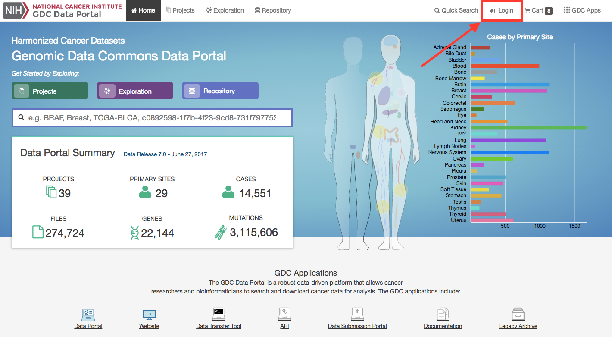
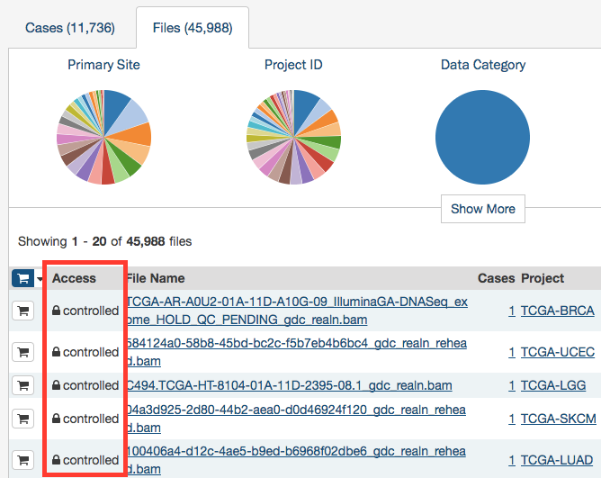
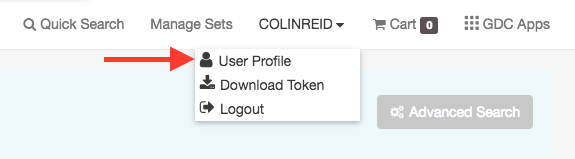
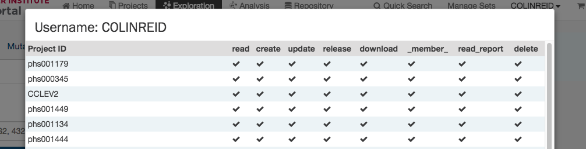

# Authentication

## Overview

The GDC Data Portal provides granular metadata for all datasets available in the GDC. Any user can see a listing of all available data files, including controlled-access files. The GDC Data Portal also allows users to download open-access files without logging in. However, downloading of controlled-access files is restricted to authorized users and requires authentication.

## Logging into the GDC

To login to the GDC, users must click on the `Login` button on the top right of the GDC website.

After clicking Login, users authenticate themselves using their eRA Commons login and password.  If authentication is successful, the eRA Commons username will be displayed in the upper right corner of the screen, in place of the "Login" button.

Upon successful authentication, GDC Data Portal users can:

- see which controlled-access files they have access to;
- download controlled-access files directly from the GDC Data Portal;
- download an authentication token for use with the GDC Data Transfer Tool or the GDC API.

Controlled-access files are identified using a "lock" icon:

The rest of this section describes controlled data access features of the GDC Data Portal available to authorized users. For more information about open and controlled-access data, and about obtaining access to controlled data, see [Data Access Processes and Tools](https://gdc.cancer.gov/access-data/data-access-processes-and-tools).

## User Profile

After logging into the GDC Portal, users can view which projects they have access to by clicking the `User Profile` section in the dropdown menu in the top corner of the screen.

Clicking this button shows the list of projects.

## GDC Authentication Tokens

The GDC Data Portal provides authentication tokens for use with the GDC Data Transfer Tool or the GDC API. To download a token:

1. Log into the GDC using your eRA Commons credentials
2. Click the username in the top right corner of the screen
3. Select the "Download token" option

A new token is generated each time the `Download Token` button is clicked.

For more information about authentication tokens, see [Data Security](../../Data/Data_Security/Data_Security.md#authentication-tokens).

**NOTE:** The authentication token should be kept in a secure location, as it allows access to all data accessible by the associated user account.

## Logging Out

To log out of the GDC, click the username in the top right corner of the screen, and select the Logout option.

