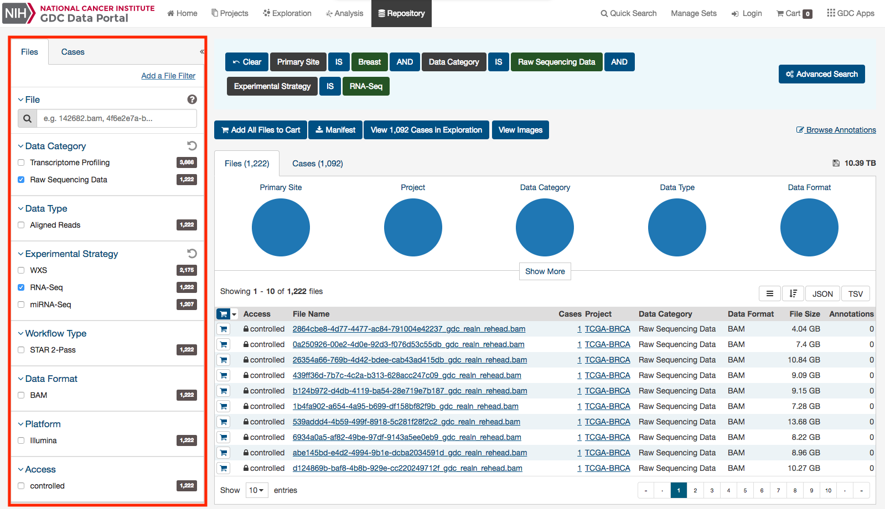
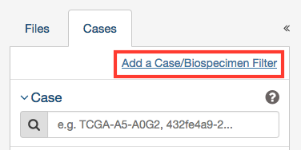
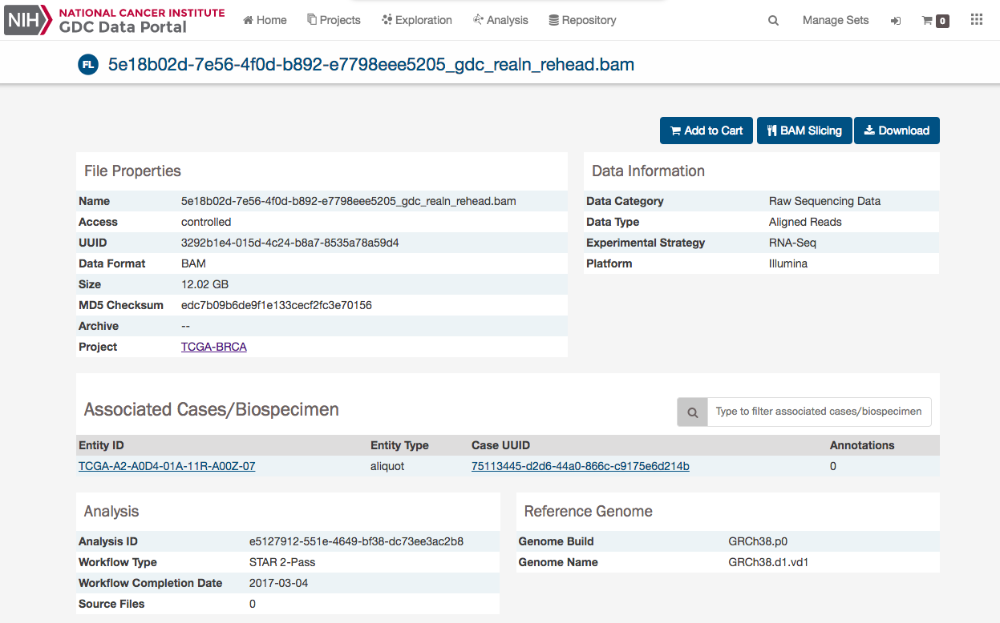
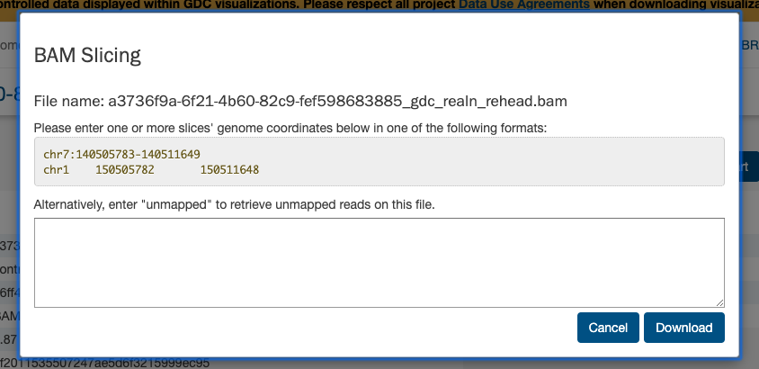
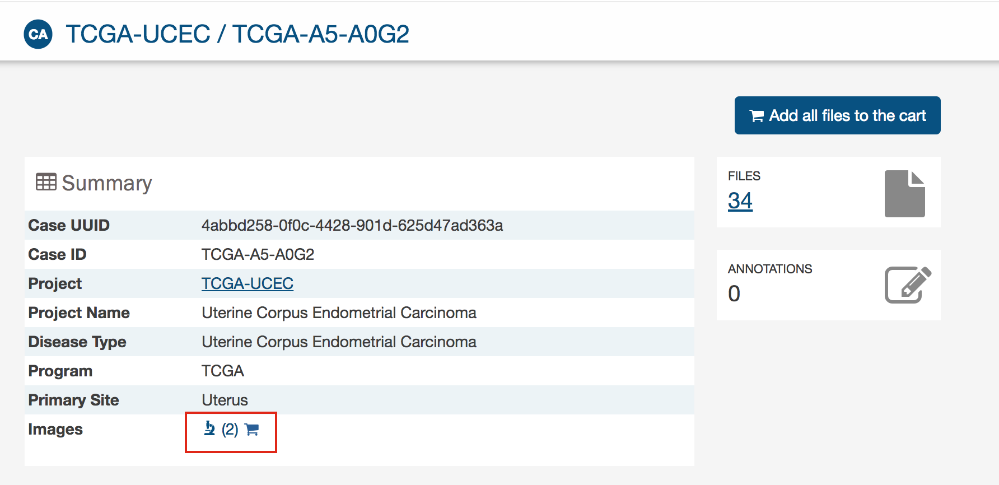
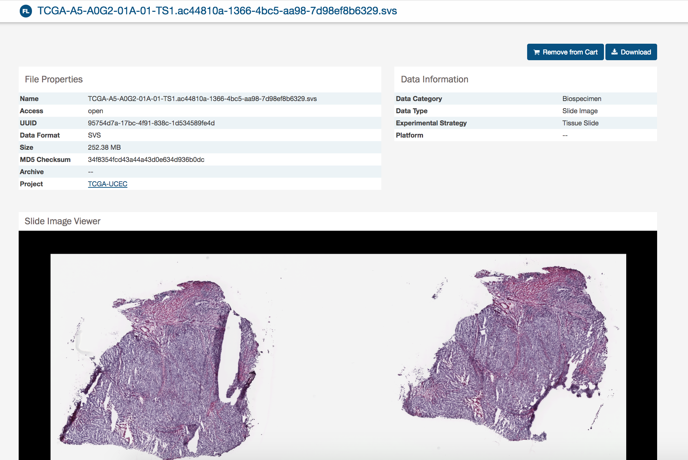

# Repository

The Repository Page is the primary method of accessing data in the GDC Data Portal. It provides an overview of all cases and files available in the GDC and offers users a variety of filters for identifying and browsing cases and files of interest. Users can access the [Repository Page](https://portal.gdc.cancer.gov/v1/repository) from the GDC Data Portal Home Page or from the Data Portal toolbar.

## Filters / Facets
On the left, a panel of data facets allows users to filter cases and files using a variety of criteria. If facet filters are applied, the tabs on the right will display information about matching cases and files. If no filters are applied, the tabs on the right will display information about all available data.

On the right, two tabs contain information about available data:

* `Files` tab provides a list of files, select information about each file, and links to [individual file detail pages](#file-summary-page).
* `Cases` tab provides a list of cases, select information about each case, and links to [individual case summary pages](Exploration.md#case-summary-page).

The banner above the tabs on the right displays any active facet filters and provides access to advanced search.

The top of the Repository Page, in the "Files" tab, contains a few summary pie charts for Primary Sites, Projects, Data Category, Data Type, and Data Format. These reflect all available data or, if facet filters are applied, only the data that matches the filters. Clicking on a specific slice in a pie chart, or on a number in a table, applies corresponding facet filters. The scope of these pie chart will change depending on whether you have the "Files" tab or the "Cases" tab selected.

### Facets Panel

Facets represent properties of the data that can be used for filtering. The facets panel on the left allows users to filter the cases and files presented in the tabs on the right.

The facets panel is divided into two tabs, with the `Files` tab containing facets pertaining to data files and experimental strategies, while the `Cases` tab containing facets pertaining to the cases and biospecimen information. Users can apply filters in both tabs simultaneously. The applied filters will be displayed in the banner above the tabs on the right, with the option to open the filter in [Advanced Search](Advanced_Search.md) to further refine the query.

The default set of facets is listed below.

*Files* facets tab:

* __File__: Specify individual files using filename or UUID.
* __Data Category__: A high-level data file category, such as "Raw Sequencing Data" or "Transcriptome Profiling".
* __Data Type__: Data file type, such as "Aligned Reads" or "Gene Expression Quantification". Data Type is more granular than Data Category.
* __Experimental Strategy__: Experimental strategies used for molecular characterization of the cancer.
* __Workflow Type__: Bioinformatics workflow used to generate or harmonize the data file.
* __Data Format__: Format of the data file.
* __Platform__: Technological platform on which experimental data was produced.
* __Access Level__: Indicator of whether access to the data file is open or controlled.

*Cases* facets tab:

* __Case__: Specify individual cases using submitter ID (barcode) or UUID.
* __Case ID__: Search for cases using a part (prefix) of the submitter ID (barcode).
* __Primary Site__: Anatomical site of the cancer under investigation or review.
* __Program__: A cancer research program, typically consisting of multiple focused projects.
* __Project__: A cancer research project, typically part of a larger cancer research program.
* __Disease Type__: Type of cancer studied.
* __Gender__: Gender of the patient.
* __Age at Diagnosis__: Patient age at the time of diagnosis.
* __Vital Status__: Indicator of whether the patient was living or deceased at the date of last contact.
* __Days to Death__: Number of days from date of diagnosis to death of the patient.
* __Race__: Race of the patient.
* __Ethnicity__: Ethnicity of the patient.

### Adding Custom Facets

The Repository Page provides access to additional data facets beyond the automatically listed group filters. Facets corresponding to additional properties listed in the [GDC Data Dictionary](../../Data_Dictionary/index.md) can be added using the "Add a Filter" link available at the top of the `Cases` and `Files` facet tabs:

The link opens a search window that allows the user to find an additional facet by name or description. Not all facets have values available for filtering; checking the "Only show fields with values" checkbox will limit the search results to only those that do. When selecting a facet from the list of search results below the search box will add it to the facets panel.

Newly added facets will show up at the top of the facets panel and can be removed individually by clicking on the "__x__" to the right of the facet name. The default set of facets can be restored by clicking "Reset".

## Annotations View

The Annotations View provides an overview of the available annotations and allows users to browse and filter the annotations based on a number of annotation properties (facets), such as the type of entity the annotation is attached to or the annotation category. This page can be found by clicking on the [Browse Annotations](https://portal.gdc.cancer.gov/v1/annotations) link, located at the top right of the repository page.

The view presents a list of annotations in tabular format on the right, and a facet panel on the left that allows users to filter the annotations displayed in the table. If facet filters are applied, the tabs on the right will display only the matching annotations. If no filters are applied, the tabs on the right will display information about all available annotations.

Clicking on an annotation ID in the annotations list will take the user to the Annotation Summary Page. The Annotation Summary Page provides more details about a specific annotation.

## Results

### Navigation

After utilizing the Repository Page to narrow down a specific set of cases, users can choose to continue to explore the mutations and genes affected by these cases by clicking the `View Cases in Exploration` button as shown in the image below.

Clicking this button will navigate the users to the [Exploration Page](Exploration.md), filtered by the cases within the cohort.

### Files List

The `Files` tab on the right provides a list of available files and select information about each file. If facet filters are applied, the list includes only matching files. Otherwise, the list includes all data files available in the GDC Data Portal.

The "*File Name*" column includes links to [File Summary Pages](#file-summary-page) where the user can learn more about each file.

Users can add individual file(s) to the [cart](Cart.md) using the cart button next to each file. Alternatively, all files that match the current facet filters can be added to the cart using the menu in the top left corner of the table:

## File Summary Page

The File Summary page provides information about a data file, including file properties like size, MD5 checksum, and data format; information on the type of data included; links to the associated cases and biospecimen; and information about how the data file was generated or processed.

The page also includes buttons to download the file, add it to the file [cart](Cart.md), or (for BAM files) utilize the BAM slicing function.

In the lower section of the screen, the following tables provide more details about the file and its characteristics:

* __Associated Cases / Biospecimen__: List of cases or biospecimen the file is directly attached to.
* __Analysis and Reference Genome__: Information on the workflow and reference genome used for file generation.
* __Read Groups__: Information on the read groups associated with the file.
* __Metadata Files__: Experiment metadata, run metadata and analysis metadata associated with the file.
* __Downstream Analysis Files__: List of downstream analysis files generated by the file.
* __File Versions__: List of all versions of the file.

### BAM Slicing

BAM file Summary Pages have a "BAM Slicing" button. This function allows the user to specify a region of a BAM file for download. Clicking on it will open the BAM Slicing window:

During preparation of the slice, the icon on the BAM Slicing button will be spinning, and the file will be offered for download to the user as soon as it is ready.

### Cases List

The `Cases` tab on the right provides a list of available cases and select information about each case. If facet filters are applied, the list includes only matching cases. Otherwise, the list includes all cases available in the GDC Data Portal.

From the left side, the list starts with a shopping cart icon, allowing the user to add all files associated with a case to the [file cart](Cart.md) for downloading at a later time. The following columns in the list includes links to [Case Summary Pages](Exploration.md#case-summary-page) in the *Case UUID* column, the Submitter ID (i.e. TCGA Barcode), and counts of the available file types for each case. Clicking on a count will apply facet filters to display the corresponding files. On the last column, there are image slide icons and a number that indicate whether there are slide images available and how many.

## Image Viewer

The Image Viewer allows users to visualize tissue and diagnostic slide images.

### How to Access the Image Viewer

* __Repository Page__: From the main search on the Repository Page by clicking on the "View images" button. It will display the tissue slide images of all the cases resulting from the query.

* __Case Table in Repository Page__: Click on the image viewer icon in the Case table. It will display in the image viewer all the tissue slide images attached to the Case.

* __Case Summary Page:__ Selecting a Case ID in the Repository Cases table will direct the user to the [Case Summary Page](Exploration.md#case-summary-page). For cases with images, the Image Viewer icon will appear in the Case Summary section or in the Biospecimen - Slides details section. Clicking on the Image Viewer icon will display the Image Viewer for the slide images attached to the case.

 
 

* __The Image File Page__: You can visualize the slide image directly in the File Summary Page by selecting an image file in the Repository's files table.

### Image Viewer Features
In the image viewer, a user can:

* Zoom in and zoom out by clicking on + and - icons.
* Reset to default display by clicking on the Home icon.
* Display the image in full screen mode by clicking on the Expand icon.
* View the slide detail by clicking on "Details" button.
* Selecting the area of interest with the thumbnail at the top-right corner.

