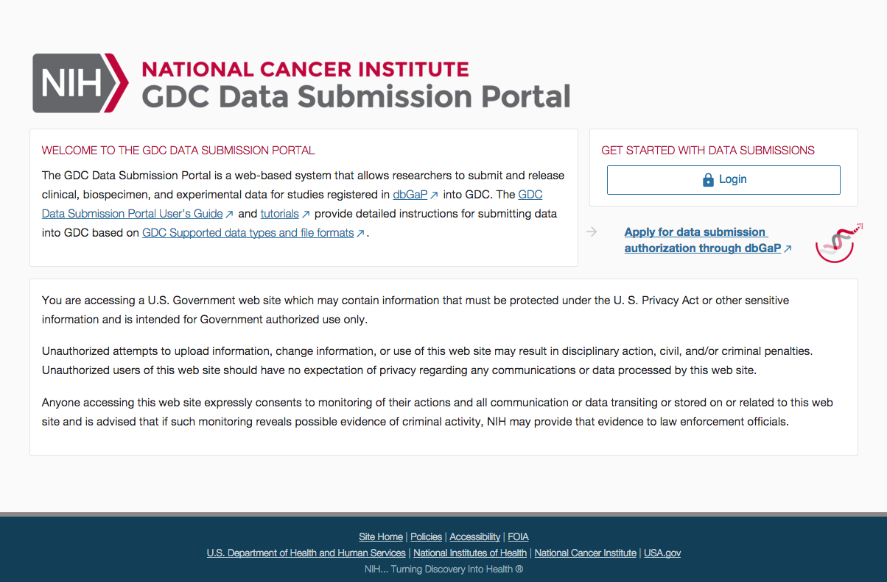

# Overview

More details about [Authentication and Authorization](../../Commons/Authentication.md) can be found in a [dedicated section of the documentation](../../Commons/Authentication.md).

Based on the number of projects granted to the user, the GDC Data Submission Portal will adjust its layout and provides different functionalities.

# GDC Data Submission Portal Authentication

When accessing the GDC Data Submission Portal for the first time, users will be presented with splash page providing more details about the system and a login button.

Links to GDC Website are also available to provide the user with more details about dbGaP as well as more details about the submission process and tools.

The login page will show up again if users logout or upon expiration of their authentication token after 30 minutes of inactivity.

## Failed authentication

If the user fails to authenticate through eRA Commons and close the authentication pop-up, a "401 - UNAUTHORIZED" message will show up on the splash screen.

## Obtaining a Token

After successful authentication, users can [download a GDC Token](../../Commons/Authentication.md#gdc-authentication-token) from GDC Data Submission Portal.
