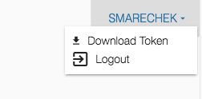

# Authentication

## Requirements

Accessing the GDC Data Submission Portal requires eRA Commons credentials with appropriate dbGaP authorization. To learn more about obtaining the required credentials and authorization, see [Obtaining Access to Submit Data]( https://gdc.nci.nih.gov/submit-data/obtaining-access-submit-data).

## Authentication via eRA Commons

Users can log into the GDC Data Submission Portal with eRA Commons credentials by clicking the "Login" button. If authentication is successful, the user will be redirected to the GDC Data Submission Portal front page, and the user's eRA Commons username will be displayed in the upper right corner of the screen.

## GDC Authentication Tokens

The GDC Data Submission Portal provides authentication tokens for use with the GDC Data Transfer Tool or GDC API. To download a token:

0. Log into the GDC using your eRA Commons credentials,
0. Click the username in the top right corner of the screen,
0. Select the "Download token" option.

For more information about authentication tokens, see [Data Security](../../Data/Data_Security/Data_Security.md#authentication-tokens).

**NOTE:** The authentication token should be kept in a secure location, as it allows access to all data accessible by the associated user account.

## Logging Out

To log out of the GDC, click the username in the top right corner of the screen, and select the Logout option. Users will be automatically logged out after 15 minutes of inactivity.
