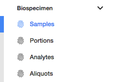
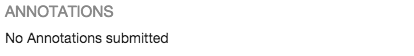

# Biospecimen

## Overview

The biospecimen section of the navigation panel provides access to Samples, Portions, Analytes and Aliquots.

Samples, Portions, Analytes and Aliquots on the navigation panel (left side of the screen) are actually filters applied to the list of biospecimens in the project. Screen layout will be identical in-between those four filters.

## Biospecimen List View

The biospecimen list view displays the following information:

|Column|Description|
| --- | --- |
| Submitter ID | Submitter ID of the biospecimen |
| Type | The type of biospecimen, can take the following values: Samples, Portions, Analytes, Aliquots.|
| Last Updated | Last time the case was updated. |

On the top left section of the screen, the user can download data about the selected biospecimen or all biospecimen corresponding to the selected filter.

Clicking on a biospecimen will open the details panel. Data in this panel is broken down in multiple sections.

## Details

Provides details about the biospeciment itself, such as its UUID, status, project and creation date.

### Hierarchy

List entities (clinical, biospecimen, annotations) attached to a case in a tree-like view. Clicking on an entity redirect to its corresponding details page, easing navigation between entities.

### Annotations

Lists annotations attached to an entity.

### Transactions

Lists all transactions associated to a case. Clicking on an transaction ID will redirect to the transaction details page.

