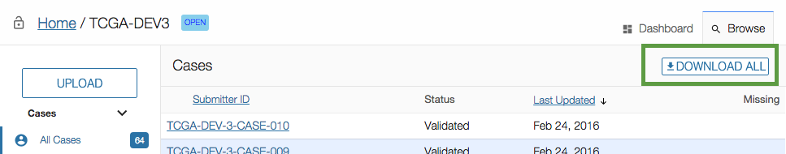
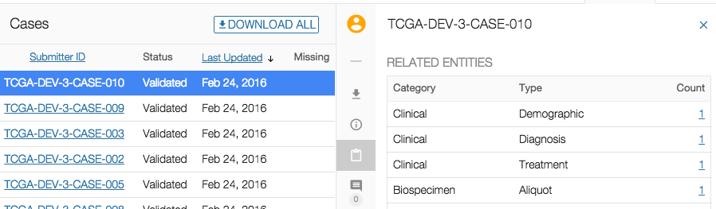
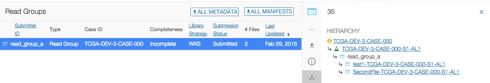

# Browse Data

## Overview

The _"Browse"_ menu provides access to all of a project's content. Most content is driven by the GDC Data Dictionary and the interface is dynamically generated to accomodate the content.

Please refer to the [GDC Data Dictionary Viewer](../../Dictionary/viewer.md) for more details about dictionary-generated fields, columns and filters.

All static components are detailed in this User Guide.

## Main interface elements

### Upload

An __Upload__ button is available at the top-left section of the left panel. Depending on the project state, this will allow data to be [uploaded](Upload_Data.md) to the GDC. 

__Note__: This button is disabled if the project is in "REVIEW" state.

### Filters

A wide set of filters are available for the user to select the type of entity to be displayed. These filters are dynamically created based on the [GDC Data Dictionary](../../Dictionary/index.md).

Current filters are:

|Filter|Description|
| --- | --- |
| All Cases | Display all cases associated with the project. |
| Cases Missing Clinical Data | Display only cases with no clinical data. |
| Cases Missing Samples Data | Display only cases with no biospecimen data associated with the case. |
| Clinical Entities | Display all clinical data uploaded to the project workspace. |
| Experiment Data | Display all experiment data uploaded to the project workspace. Currently it will show the read groups, slides and associated submitted files metadata. |
| Transactions | Display all transactions associated with the project. More details about transactions can be found in the [Transactions](Transactions.md) section of the documentation. |
| Annotations | List all annotations associated with the project. An annotation provides an explanatory comment that has been associated with data in the project. |

### List View

The list view is a paginated list of all entities corresponding to the selected filter. 

On the top-left section of the screen, the user can download data about all entities associated with the selected filter.

* For the case filter, it will download all clinical data.
* For the filter of the other entities, it will download the corresponding metadata (e.g. for the demographic filter, it will download all demographic data).

### Details Panel

Clicking on a case will open the details panel. Data in this panel is broken down into multiple sections depending on the entity type. The main sections are:

* Summary: IDs and system properties associated with the entity
* Detail: properties of the entity
* Hierarchy or Related Entities: list of associated entities
* Annotations: annotations on the entity
* Transactions: transactions that affected the entity

Navigation between those sections can be done either by scrolling down or by clicking on the section icon on the left side of the details panel.

#### Focus on Related Entities

Table listing all entities, grouped by type, related to the selected case.
This section is available only at the case level.

This table contains the following columns:

* Category: Category of the Entity (Clinical, Biospecimen, Experiment Data)
* Type: Type of entity (based on Data Dictionary)
* Count: Number of occurences of an entity of this type associated with the case. Clicking on the count will open a list page listing those entities.

#### Focus on Hierachy

The hierarchy section is available at any entity level (Clinical, Biospecimen, etc.), except for Case.

The hierarchy shows:

* The Case associated with the entity
* The __direct__ parents of the entity
* The __direct__ children of the entity

Using the hierarchy, the user can navigate through the entities by clicking on the links.

