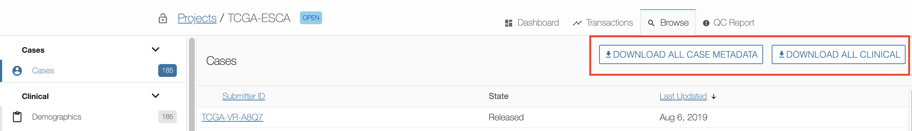

# Browse Data

## Overview

The _"Browse"_ menu provides access to all of a project's content. Most content is driven by the GDC Data Dictionary and the interface is dynamically generated to accommodate the content.

Please refer to the [GDC Data Dictionary Viewer](../../Data_Dictionary/viewer.md) for more details about dictionary-generated fields, columns, and filters.

## Main Interface Elements

### Filters

A wide set of filters are available for the user to select the type of entity to be displayed. These filters are dynamically created based on the [GDC Data Dictionary](../../Data_Dictionary/index.md).

Current filters are:

|Filter|Description|
| --- | --- |
| Cases | Display all cases associated with the project. |
| Clinical Entities | Display all clinical data uploaded to the project workspace. This is divided into subgroups including demographics, diagnoses, exposures, family histories, and treatments. |
| Biospecimen Data | Display all biospecimen data uploaded to the project workspace. This is divided into subgroups including samples, portions, analytes, aliquots, and read-groups. |
| Submittable Data Files | Displays all data files that have been registered with the project. This includes files that have and have not been uploaded. This category is divided into groups by file type. |
| Annotations | Lists all annotations associated with the project. An annotation provides an explanatory comment associated with data in the project. |

### List View

The list view is a paginated list of all entities corresponding to the selected filter.

On the top-right section of the screen, the user can download data about all entities associated with the selected filter.

* For the case filter, it will download all clinical data.
* For the filter of the other entities, it will download the corresponding metadata (e.g., for the demographic filter, it will download all demographic data).

### Details Panel

Clicking on a case will open the details panel. Data in this panel is broken down into multiple sections depending on the entity type. The main sections are:

* Actions: XXXXXXXXXX.
* Summary: IDs and system properties associated with the entity.
* Detail: properties of the entity.
* Hierarchy or Related Entities: list of associated entities.
* Annotations: annotations on the entity.
* Transactions: transactions that affected the entity.

Navigation between those sections can be done either by scrolling down or by clicking on the section icon on the left side of the details panel.

#### Related Entities

Table listing all entities, grouped by type, related to the selected case.
This section is available only at the case level.

This table contains the following columns:

* Category: Category of the Entity (Clinical, Biospecimen, Experiment Data).
* Type: Type of entity (based on Data Dictionary).
* Count: Number of occurrences of an entity associated with the case. Clicking on the count will open a list listing those entities within the Browse page.

#### Hierarchy

The hierarchy section is available for entities at any level (e.g., Clinical, Biospecimen, etc.), except for Case.

The hierarchy shows:

* The Case associated with the entity.
* The __direct__ parents of the entity.
* The __direct__ children of the entity.

Using the hierarchy, the user can navigate through entities by choosing the links.
