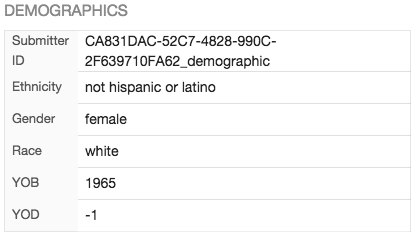
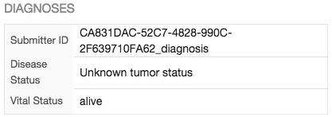
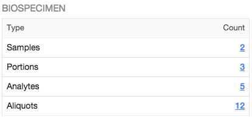
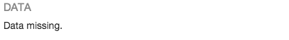

# Overview

The _"Case"_ section list all cases available in the project. Clicking on a particular case will open the details panel providing more details about the selected case.

# Cases List View

The cases list view display the following informations:

|Column|Description|
| --- | --- |
| Submitter ID | Submitter ID of the case |
| Status | Status of the submission, can take the following values: unreleased or released.|
| Last Updated | Last time the case was updated. |
| Warnings | Using icons, display if clinical or biospecimen elements are missing for the case. |

On the top left section of the screen, the user can download data about the selected case or all cases in the project.

# Case Details

Clicking on a case will open the details panel. Data in this panel is broken down in multiple sections.

Navigation between those sections can be done either by scrolling down or by clicking on the section icon on the left side of the details panel.

## Details

Provides details about the case itself, such as its UUID, status, project, creation date.

## Demographics

Provides details coming from the demographics dictionary.

## Diagnoses

Provides details coming from the diagnoses dictionary.

## Biospecimen

List Biospecimen data attached to the case, clicking on the count will redirect to the corresponding entities in the Biospeciment view.

## Data

## Hierarchy

List entities (clinical, biospecimen, annotations) attached to a case in a tree-like view. Clicking on an entity redirect to its corresponding details page, easing navigation between entities.

## Annotations

List annotations attached to the entity.

## Transactions

List all transactions associated to this case. Clicking on an transaction ID will redirect to the transaction details page.

# Case Filters

Multiple filters are available for the user to filter down and identify cases relevant for his activities.

The following filters are available in the navigation panel:

|Name|Description|
| --- | --- |
| Missing Clinical Data | Display all cases missing clinical data |
| Missing Samples Data | Display all cases missing samples data |
