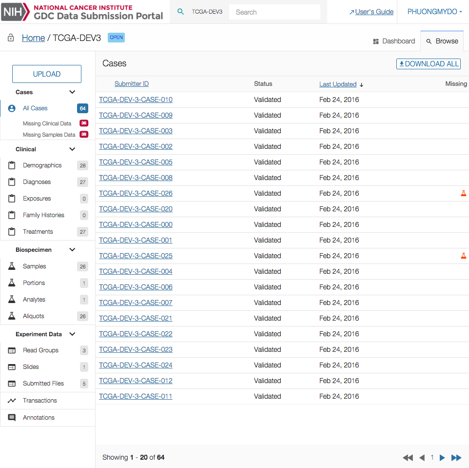
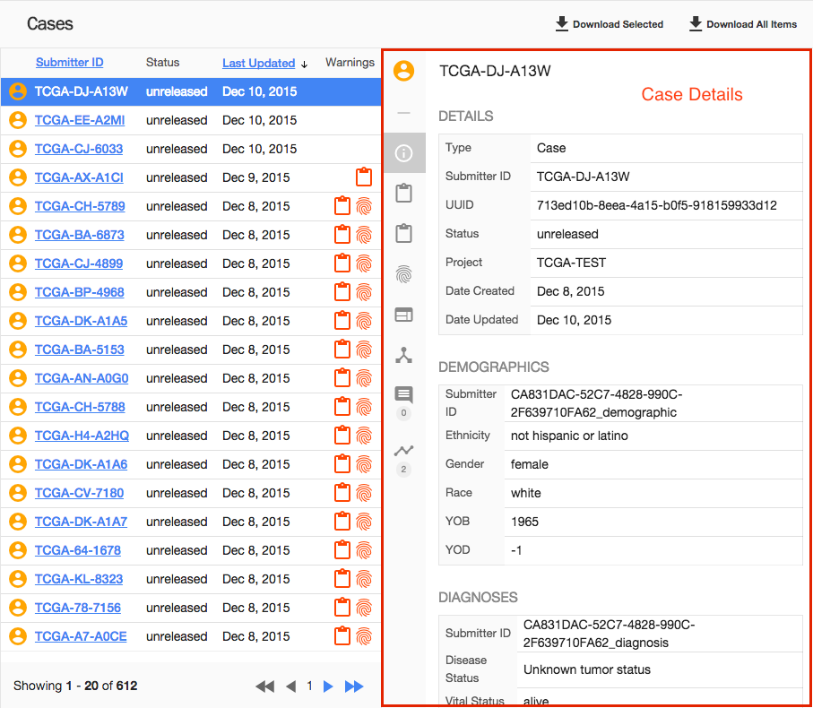

# Case

## Overview

The _"Case"_ section list all cases available in the project. Clicking on a particular case will open the details panel, providing more details about the selected case.

## Case Filters

Cases can be accessed from the menu through multiple filters.

|Filter|Description|
| --- | --- |
| All Cases | Display all cases associated with the project |
| Missing Clinical Data | Display only cases with missing Clinical Data |
| Missing Samples Data | Display only cases with missing Samples Data|

The number of cases corresponding to each filter is displayed on the right side of the filter name.

## Cases List View

The cases list view display the following informations:

|Column|Description|
| --- | --- |
| Submitter ID | Submitter ID of the case |
| Status | Status of the submission, can take the following values: unreleased or released.|
| Last Updated | Last time the case was updated. |
| Warnings | Using icons, displayed if clinical or biospecimen elements are missing for the case. |

On the top left section of the screen, the user can download data about all cases associated to the selected filter.

## Case Details

Clicking on a case will open the details panel. Data in this panel is broken down into multiple sections.

Navigation between those sections can be done either by scrolling down or by clicking on the section icon on the left side of the details panel.

### Details

Provides details about the case itself, such as its UUID, status, project and creation date.

|Value|Description|
| --- | --- |
| Type | Entity type (Case in this situation)  |
| UUID | Entity's [UUID](https://en.wikipedia.org/wiki/Universally_unique_identifier) |
| Project ID | Project ID associated with the Entity |
| Submitter ID | Submitter ID associated with the Entity |
| Created Datetime | Date and time the entity was created |
| Updated Datetime | Date and time the entity was last updated |

### Related Entities

Table listing all entities, grouped by type, related to the selected case.

This table contains the following columns.

|Column|Description|
| --- | --- |
| Category | Category of the Entity (Clinical, Biospecimen, Experiment Data)  |
| Type | Type of entity (based on Data Dictionary)  |
| Count | Number of occurences of an entity of this type |

Clicking on the count will open a list page listing those entities.

### Transactions

List the 10 most recent transactions associated with this entity ordered by date. Clicking on a transaction will open it in the list page.
