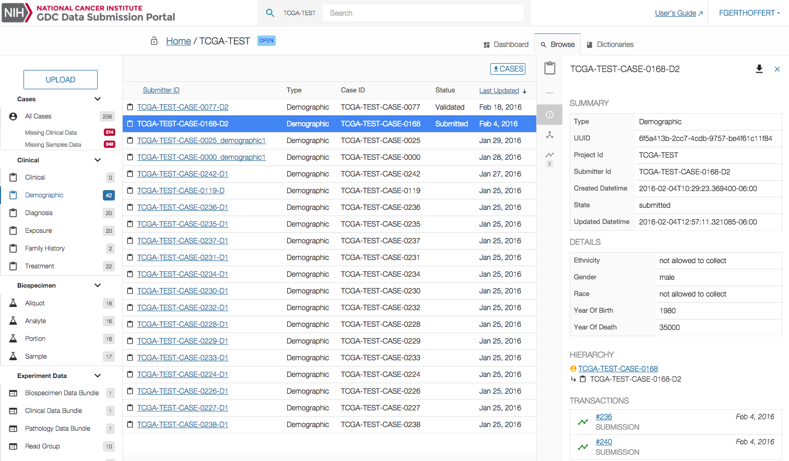

# Clinical Data

## Overview

The _"Clinical"_ section lists all the clinical data entities available in a project. Clicking on a particular clinical entity will open the details panel providing more details about the selected entity.

## Clinical Data Filters

Clinical data entities can be accessed from the menu through multiple filters automatically created based on the [GDC Data Dictionary](../../Dictionary/index.md).

The number of entities corresponding to those filters is displayed on the right side of the filter.

## Clinical List View

The clinical list view displays the following information:

|Column|Description|
| --- | --- |
| Submitter ID | Submitter ID of the case |
| Type | Type of Clinical Data (corresponds to the selected filter)|
| Case ID | Case ID this entity is attached to |
| Status | Status of the entity |
| Last Updated | Last time the entity was updated. |

On the top left section of the screen, the user can download a tar.gz file containing all entities on the project. The user has the choice between TSV or JSON format.

## Clinical Details

Clicking on a case will open the details panel. Data in this panel is broken down into multiple sections.

Navigation between these sections can be done either by scrolling down or by clicking on the section icon on the left side of the details panel.

### Summary

Provides details about the entity itself, such as its UUID, status, project and creation date.

|Value|Description|
| --- | --- |
| Type | Entity type (Case in this situation)  |
| UUID | Entity's [UUID](https://en.wikipedia.org/wiki/Universally_unique_identifier) |
| Project ID | Project ID associated with the Entity |
| Submitter ID | Submitter ID associated with the Entity |
| Created Datetime | Date and time the Entity was created |
| State | State of the Entity |
| Updated Datetime | Date and time the Entity was last updated |

### Details

Table providing details about the entity's content.

This table contains the following columns.

|Column|Description|
| --- | --- |
| Ethnicity | Category of the Entity (Clinical, Biospecimen, Experiment Data)  |
| Type | Type of Entity (based on Data Dictionary)  |
| Count | Number of occurences of an Entity of this type |

Clicking on the count will open a list page listing those entities.

### Transactions

Lists the 10 most recent transactions associated with this entity ordered by date. Clicking on a transaction will open it in the list page.
