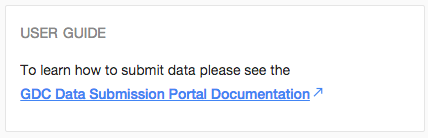
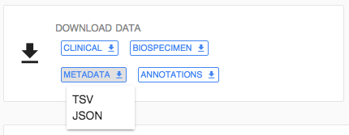
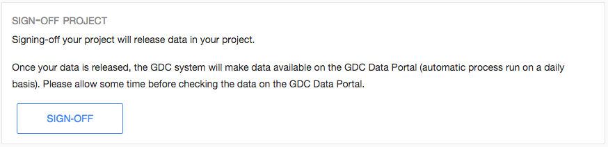

# Overview

GDC Data Submission Portal Dashboard aims at providing details about a specific project.

The Dashboard contains various visual elements to guide the user through all stages of submission, from dictionary viewer to releasing a project.

# Project status

The top section of the dashboard is broken down in three widgets:

* _Cases_: Details the number of cases registered in dbGaP and associated to this project.
* _Clinical_: Details the number of cases for which clinical data have been submitted
* _Biospecimen_: Details the number of cases for which biospecimen data have been submitted

Those widget are constantly updated to reflect the current state of the selected project.

# Submit Data

This widget provides access to the dictionary viewer [LINK TO Dictionary-Viewer.md], which can then be used to download TSV templates.

Those templates can then be filled by the user and submitted to GDC.

Clicking on "SUBMIT" will open GDC submission wizard [LINK TO Submit_data.md].

# User Guide

This widget provides a link to GDC Documentation (this document) hosted on GDC Documentation Website.

# Download data

This widget allows the user to export in TSV or JSON format Clinical, Biospecimen, Metadata and Annotations from GDC Data Submission Portal.

# Reports

This widget provides easy acces to Case Overview [LINK TO Reports.md#Case Overview] and Data Validation [LINK TO Reports.md#Data Validation] reports.

# Sign-Off

Finally, the last widget of the dashboard let you sign-off your project and publish data on GDC Data Portal. 

