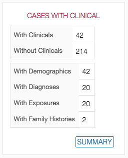

# Dashboard

## Overview

The GDC Data Submission Portal Dashboard aims to provide details about a specific project.

The Dashboard contains various visual elements to guide the user through all stages of submission, from dictionary viewer to releasing a project.

## Project status

The top section of the dashboard is broken down into four widgets:

* __Cases with Clinical__: Details the number of cases for which clinical data have been uploaded.
* __Cases with Biospecimen__: Details the number of cases for which biospecimen data have been uploaded.
* __Cases with Experimental Data__: Details the number of cases for which experimental data have been uploaded.
* __Files Uploaded__: Details the number of files uploaded using the manifest. 

These widgets are constantly updated to reflect the current state of the selected project.

Clicking on "Details" opens a table view with more details.

## Reports

This section provides access to system-wide reports (based on user permission). More details about those reports can be found in the [Reports section of the documentation](Reports.md)

## Latest Transactions

This table lists the 10 most recent [Transactions](Transactions.md) throughout all projects the user has access to.

## Action Tabs

Three actions tabs are available in the lower section of the dashboard.

* [Upload & Validate](Upload_Data.md) is used to upload files to GDC
* [Review & Submit](Submit_Release.md) is used to submit files to GDC
* [Release](Submit_Release.md) is used to release files and have them available through the [GDC Data Portal](../../Data_Portal/Users_Guide/Getting_Started.md)

Those actions and available features are detailed in their respective sections of the documentation.

