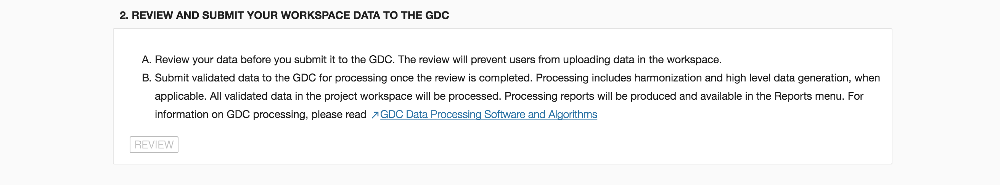

# Dashboard

## Overview

The GDC Data Submission Portal dashboard provides details about a specific project.

The dashboard contains various visual elements to guide the user through all stages of submission, from viewing the [Data Dictionary](https://docs.gdc.cancer.gov/Data_Dictionary/) in support of data upload to submitting a project for harmonization.

To better understand the information displayed on the dashboard and the available actions, please refer to the [Submission Workflow](Submission_Workflow.md).

## Project Overview
The Project Overview sections of the dashboard displays the project state (open / review / submitted / processing) and the GDC Release, which is the date in which the project was released to the GDC.

The search field at the top of the dashboard allows for submitted entities to be searched by partial or whole `submitter_id`.  When a search term is entered into the field, a list of entities matching the term is updated in real time.  Selecting one of these entities links to its details in the [Browse Tab](Browse_Data.md)

The remaining part of the top section of the dashboard is broken down into five status charts:

* __QC Errors__: The number of QC errors identified within the data that has been uploaded. Refer to [QC Reports](/Data_Submission_Portal/Users_Guide/Data_Submission_Process/#qc-reports) for more information.
* __Cases with Clinical__: The number of `cases` for which Clinical data has been uploaded.
* __Cases with Biospecimen__: The number of `cases` for which Biospecimen data has been uploaded.
* __Cases with Submittable Data Files__: The number of `cases` for which experimental data has been uploaded.
* __Submittable Data Files__: The number of files uploaded through the GDC Data Transfer Tool. For more information on this status chart, please refer to [File Status Lifecycle](Submission_Workflow/#file-status-lifecycle).
The _'DOWNLOAD MANIFEST'_ button below this status chart allows the user to download a manifest for registered files in this project that have not yet been uploaded.

\* Note that the QC Errors will not be immediately updated after submission of a new file.

Status charts are constantly updated to reflect the current state of the selected project.

## Action Panels

There are two action panels available below the Project Overview.

* [UPLOAD DATA TO YOUR WORKSPACE](Data_Upload_UG.md): Allows a submitter to upload project data to the GDC project workspace. The GDC will validate the uploaded data against the [GDC Data Dictionary](https://docs.gdc.cancer.gov/Data_Dictionary/). This panel also contains a table that displays details about the five latest transactions. Clicking the IDs in the first column will bring up a window with details about the transaction, which are documented in the [transactions](Transactions.md) page. This panel will also allow the user to commit file submissions to the project.
* [REVIEW AND SUBMIT YOUR WORKSPACE DATA TO THE GDC](Submit_Data.md#review-and-submit): Allows a submitter to review project data which will lock the project to ensure that additional data cannot be uploaded while in review. Once the review is complete, the data can be submitted to the GDC for processing through the [GDC Harmonization Process](https://gdc.cancer.gov/submit-data/gdc-data-harmonization).

These actions and associated features are further detailed in their respective sections of the documentation.
