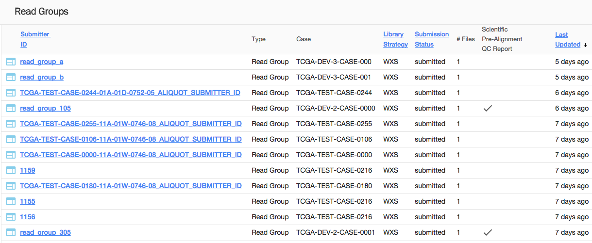
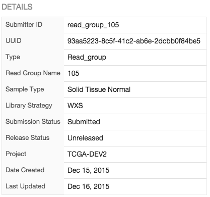
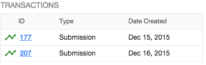

# Data

## Overview

The Data section of the GDC Data Submission Portal provides access to Experimental Data, it contains all molecular data (read groups), and will likely host images a pathology reports at a later stage.

## Read Groups List View

The read groups list view display the following informations:

|Column|Description|
| --- | --- |
| Submitter ID | Submitter ID of the read group |
| Type | TO BE COMPLETED |
| Case | Case associated to the read group |
| Library Strategy | TO BE COMPLETED |
| Submission Status | TO BE COMPLETED |
| ## Files | TO BE COMPLETED |
| Scientific Pre-Alignement QC Report | TO BE COMPLETED |
| Last Updated | TO BE COMPLETED |

On the top left section of the screen, the user can download data about the selected read group or all read groups in the project.

## Read Group Details

Clicking on a read group will open the details panel. Data in this panel is broken down in multiple sections.

Navigation between those sections can be done either by scrolling down or by clicking on the section icon on the left side of the details panel.

### Details

Provides details about the read group itself, such as its UUID, status, project, creation date.

### Hierarchy

List entities (cases, clinical, biospecimen, annotations) attached to a read-group in a tree-like view. Clicking on an entity redirect to its corresponding details page, easing navigation between entities.

### Files

List files submitted for the read group.

### Download

List files available for download. It could be Metadata, a Manifest to be used by GDC Data Transfer Tool or a QC Report.

### Transactions

List all transactions associated to this read group. Clicking on an transaction ID will redirect to the transaction details page.

