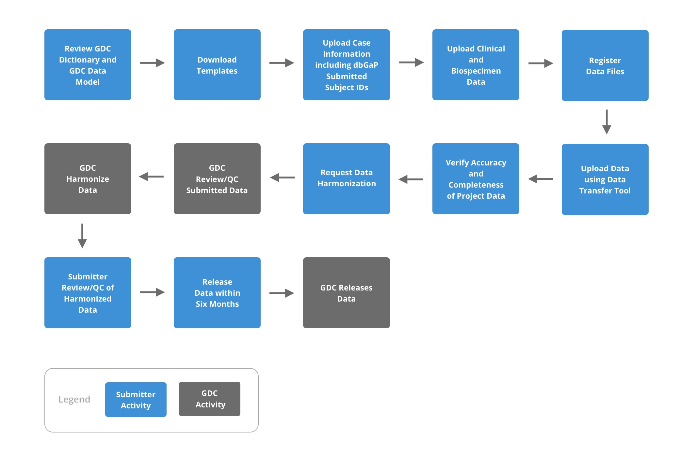
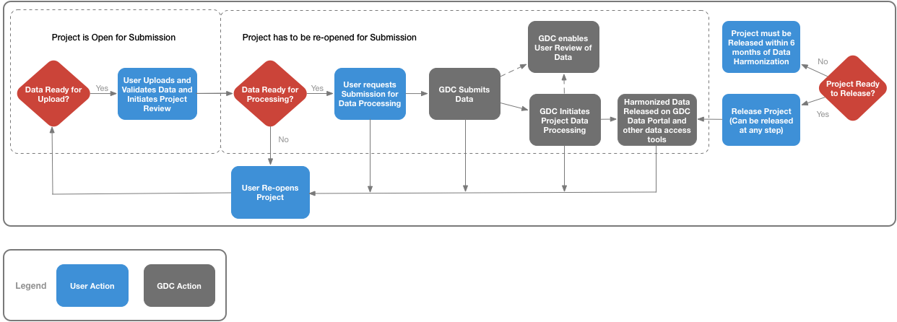
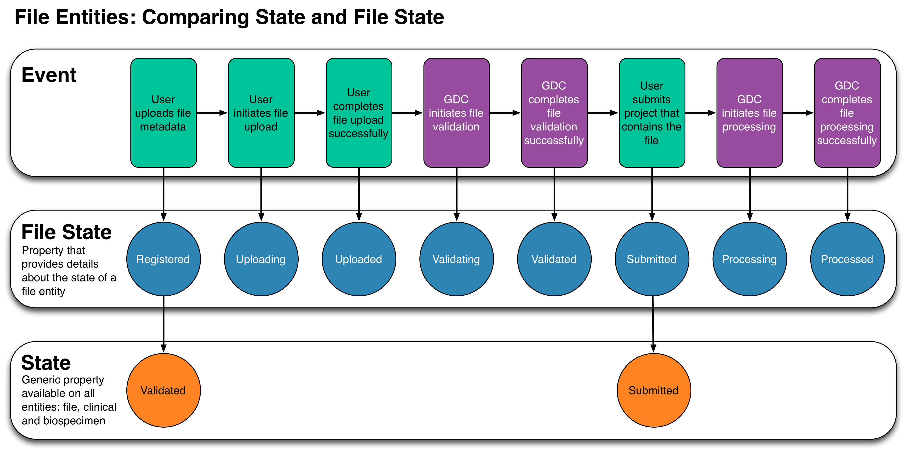

# Data Submission Overview

## Overview
This section will walk users through two parts of the submission process. The first portion will be the steps taken by the users to go through the submission process from start to finish. The second portion will describe the lifecycle of a project and a file throughout the data submission process.

## GDC Data Submission Workflow

The diagram below illustrates the process from uploading through releasing data in the GDC Data Submission Portal. To review the steps needed before beginning submission see [Before Submitting Data to the GDC Portal](https://docs.gdc.cancer.gov/Data_Submission_Portal/Users_Guide/Checklist/)

### Review GDC Dictionary and GDC Data Model - Submitter Activity

It is suggested that all submitters review the [GDC Dictionary](https://docs.gdc.cancer.gov/Data_Dictionary/viewer/) and [GDC Data Model](https://gdc.cancer.gov/developers/gdc-data-model/gdc-data-model-components). It is beneficial for submitters to know which nodes will need metadata submission, how these nodes relate to each other, and what information is required for each node in the model.

### Download Templates - Submitter Activity

After determining the required nodes for the submission, go to each node page in the [GDC Dictionary](https://docs.gdc.cancer.gov/Data_Dictionary/viewer/). There will be a "Download Template" drop down list. Select the file format, either TSV or JSON, and download the template for the node. If [numerous entries](Data_Submission_Walkthrough.md#submitting-numerous-cases) are being submitted all at one time, it is suggested that the user uses a TSV template. At this point, it is suggested to go through the template and remove fields that will not be populated by the metadata submission, but make sure to complete all fields that are required for the node. For more information about the Data Dictionary, please visit [here](../../../Data_Dictionary/).

[`See GDC Data Dictionary here.`](https://docs.gdc.cancer.gov/Data_Dictionary/viewer/)

### Upload Case Information Including dbGaP Submitted Subject IDs - Submitter Activity

After registering the study in [dbGaP](https://gdc.cancer.gov/submit-data/obtaining-access-submit-data), the first node to be created in the data model is the [`case` node](Data_Submission_Walkthrough.md#case-submission). The `case` node is important as it will contain a unique `submitter_id` that is registered in dbGaP under a particular project. This will connect the two databases, dbGaP and GDC, and allows for access to be granted to a controlled data set based on the study and its cases.

To [submit the `case`](Data_Submission_Walkthrough.md#uploading-the-case-submission-file) nodes, a user must be able to [login](Data_Submission_Process.md#authentication) and access the [GDC Submission Portal](https://portal.gdc.cancer.gov/submission/) for their respective project. Metadata for all nodes are uploaded via the [API](https://docs.gdc.cancer.gov/API/Users_Guide/Submission/#creating-and-updating-entities) or through the [Submission Portal](Data_Submission_Walkthrough.md#upload-using-the-gdc-data-submission-portal).

[`See case example here.`](Data_Submission_Walkthrough.md#case-submission)

[`See metadata upload example here.`](Data_Submission_Walkthrough.md#upload-using-the-gdc-data-submission-portal)

### Upload Clinical and Biospecimen Data - Submitter Activity

With the creation of `case` nodes, other nodes in the [data model](https://gdc.cancer.gov/developers/gdc-data-model/gdc-data-model-components) can be [uploaded](Data_Submission_Walkthrough.md#upload-using-the-gdc-data-submission-portal). This includes the [Clinical](Data_Submission_Walkthrough.md#clinical-data-submission) and [Biospecimen](Data_Submission_Walkthrough.md#biospecimen-submission) nodes, with examples for each that can be found in the [Data Upload Walkthrough](Data_Submission_Walkthrough.md).

[`See clinical example here.`](Data_Submission_Walkthrough.md#clinical-data-submission)

[`See biospecimen example here.`](Data_Submission_Walkthrough.md#biospecimen-submission)

[`See metadata upload example here.`](Data_Submission_Walkthrough.md#upload-using-the-gdc-data-submission-portal)

### Register Data Files - Submitter Activity

Registering data files is necessary before they can be uploaded. This allows the GDC to later validate the uploads against the user-supplied md5sum and file size. The [submission](Data_Submission_Walkthrough.md#experiment-data-submission) of these files can range from clinical and biospecimen supplements to `submitted_aligned_reads` and `submitted_unaligned_reads`.

[`See experiment data example here.`](Data_Submission_Walkthrough.md#experiment-data-submission)

### Upload Data Using Data Transfer Tool - Submitter Activity

Before uploading the submittable data files to the GDC, a user will need to determine if the correct nodes have been created and the information within them are correct. This is accomplished using the [Browse](Data_Submission_Process.md#browse) page in the [Data Submission Portal](https://portal.gdc.cancer.gov/submission). Here you can find the metadata and file_state, which must have progressed to `registered` for an associated file to be uploaded.  You can find more about the file life cycle [here](#file-lifecycle).

Once the submitter has verified that the submittable data files have been registered, the user can obtain the submission manifest file that is found on the [Project Overview](Data_Submission_Process.md#project-overview) page. From this point the submission process is described in the ["Uploading the Submittable Data File to the GDC"](Data_Submission_Walkthrough.md#uploading-the-submittable-data-file-to-the-gdc) section.

For strategies on data upload, further documentation for the GDC Data Submission process is detailed on the [Data Submission Processes and Tools](https://gdc.cancer.gov/submit-data/data-submission-processes-and-tools) section of the GDC Website.

[`See submittable data file upload example here.`](Data_Submission_Walkthrough.md#uploading-the-submittable-data-file-to-the-gdc)

### Verify Accuracy and Completeness of Project Data - Submitter Activity

The submitter is responsible for reviewing the data uploaded to the project workspace, see [Data Submission Walkthrough](Data_Submission_Walkthrough.md), and ensuring that it is ready for processing by the GDC [Harmonization Process](https://gdc.cancer.gov/submit-data/gdc-data-harmonization). A user should be able to go through the [Pre-Harmonization Checklist](Data_Submission_Process.md#pre-harmonization-checklist), and verify that their submission meets these criteria.

[`See pre-harmonization checklist here.`](Data_Submission_Process.md#pre-harmonization-checklist)

### Request Data Harmonization - Submitter Activity

When the project is complete and ready for processing, the submitter will [request harmonization](Data_Submission_Process.md#submit-your-workspace-data-to-the-gdc). If the project is not ready for processing, the project can be re-opened and the submitter will be able to upload more data to the project workspace.

[`See harmonization request example here.`](Data_Submission_Process.md#submit-your-workspace-data-to-the-gdc)

> __NOTE:__ The GDC requests that users submit their data to the GDC within six months from the first upload of data to the project workspace.

### GDC Review/QC Submitted Data - GDC Activity

The Bioinformatics Team at the GDC runs the Quality Control pipeline on the submitted data. This pipeline mirrors the [Pre-Harmonization Checklist](Data_Submission_Process.md#pre-harmonization-checklist) and will determine if the submission is complete and is ready for the Harmonization pipeline. If the submission does contain problems, the GDC will contact the user to "Re-Open" the project and fix the errors in their submission.

Once the review is complete, all validated nodes will be changed to state "submitted".  At this point users can submit more files to a project, but they will be considered as a different batch for harmonization.

### GDC Harmonize Data - GDC Activity

After the submission passes the GDC Quality Control pipeline, it will be queued for the [GDC Harmonization pipeline](https://gdc.cancer.gov/about-data/gdc-data-harmonization).

### Submitter Review/QC of Harmonized Data - Submitter Activity

After the data is processed in the Harmonization pipeline, the GDC asks submitters to [verify the quality](https://portal.gdc.cancer.gov/submission/login?next=%2Fsubmission%2F) of their harmonized data.  It is the user's responsibility to notify the GDC of any errors in their harmonized data sets. The GDC will then work with the user to correct the issue and rerun the Harmonization pipeline if needed.

### Release Data Within Six Months - Submitter Activity

Project release occurs after the data has been harmonized, and allows users to access this data with the [GDC Data Portal](https://portal.gdc.cancer.gov/) and other [GDC Data Access Tools](https://gdc.cancer.gov/access-data/data-access-processes-and-tools). The GDC will release data according to [GDC Data Sharing Policies](https://gdc.cancer.gov/submit-data/data-submission-policies). Data must be released within six months after GDC data processing has been completed, or the submitter may request earlier release.

[`See release example here.`](Data_Submission_Process.md#release)

>__Note__: Released cases and/or files can be redacted from the GDC. For more information, visit the [GDC Policies page (under GDC Data Sharing Policies)](https://gdc.cancer.gov/submit-data/data-submission-policies).

### GDC Releases Data - GDC Activity

GDC data releases are not continuous, but instead are released in discrete data updates. Once harmonized data is approved and release request is approved, data will be available in an upcoming GDC Data Release.

## Project and File Lifecycles

### Project Lifecycle
The diagram of the project lifecycle below demonstrates the transition of a project through the various states. Initially the project is open for data upload and validation. Any changes to the data must be made while the project status is open. When the data is uploaded and ready for review, the submitter changes the project state to review. During the review state, the project is locked and additional data cannot be uploaded. If data changes are needed during the review period, the project has to be re-opened.

The process of Harmonization does not occur immediately after submitted files are uploaded. After the submission is complete and all the necessary data and files have been uploaded, the user submits the data to the GDC for processing through the [GDC Data Harmonization Pipelines](https://gdc.cancer.gov/submit-data/gdc-data-harmonization) and the project state changes to submitted. When the data has been processed, the project state changes back to open for new data to be submitted to the project and the submitter can review the processed data. After review of the processed data, the submitter can then release the harmonized data to the [GDC Data Portal](https://portal.gdc.cancer.gov/) and other [GDC Data Access Tools](https://gdc.cancer.gov/access-data/data-access-processes-and-tools) according to [GDC Data Sharing Policies](https://gdc.cancer.gov/submit-data/data-submission-policies).  

### File Lifecycle

This section describes states pertaining to submittable data files throughout the data submission process. A submittable data file could contain data such as genomic sequences (such as a BAM or FASTQ) or pathology slide images. The file lifecycle starts when a submitter uploads metadata for a file to the [GDC Data Submission Portal](https://portal.gdc.cancer.gov/submission/). This metadata file registers a description of the file as an entity on the GDC, the status for this is known as "state" and is represented by __purple__ cirlces. The submitter can then use the [GDC Data Transfer Tool](https://gdc.cancer.gov/access-data/gdc-data-transfer-tool) to upload the actual file, which is represeneted by __red__ circles. Throughout the lifecycle, the file and its associated entity transition through various states from when they are initially registered through file submission and processing. The diagram below details these state transitions.   

