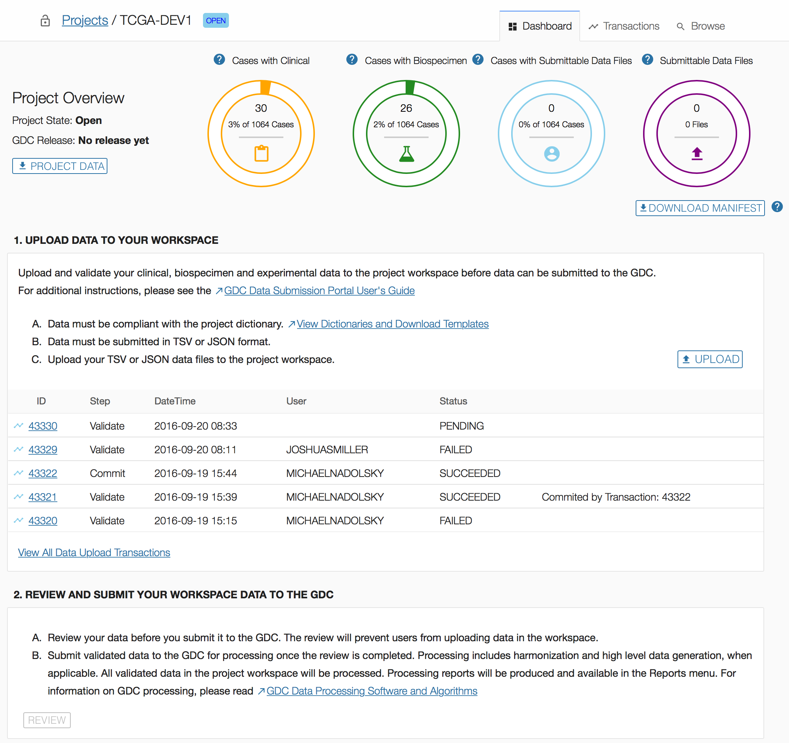
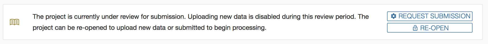
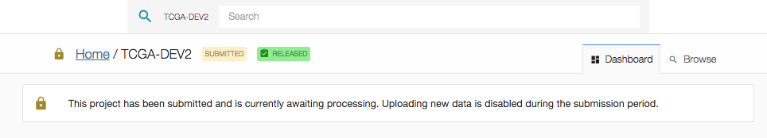
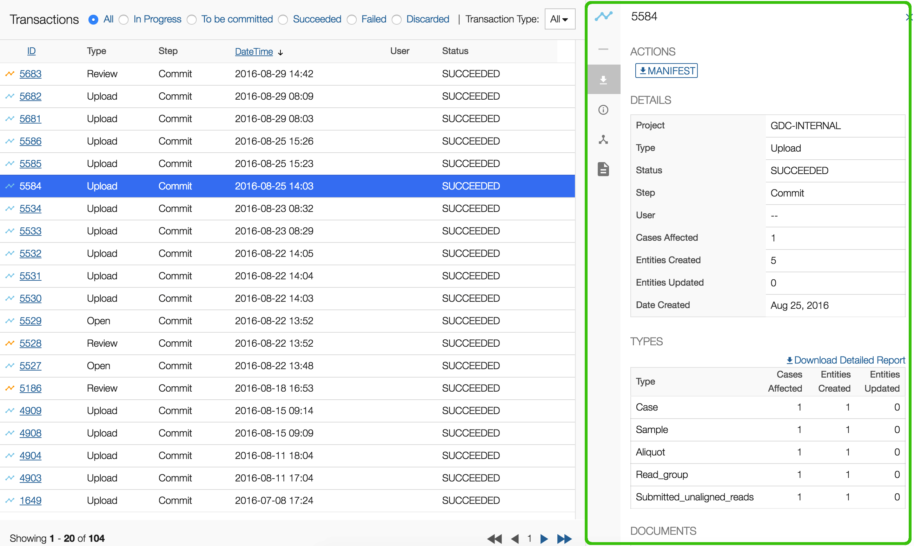

# Data Submission Process

# Overview

This section will walk users through the submission process using the [GDC Data Submission Portal](https://portal.gdc.cancer.gov/submission/).

# Authentication

## Requirements

Accessing the GDC Data Submission Portal requires eRA Commons credentials with appropriate dbGaP authorization.  To learn more about obtaining the required credentials and authorization, see [Obtaining Access to Submit Data]( https://gdc.cancer.gov/submit-data/obtaining-access-submit-data).

## Authentication via eRA Commons

Users can log into the GDC Data Submission Portal with eRA Commons credentials by clicking the "Login" button. If authentication is successful, the user will be redirected to the GDC Data Submission Portal front page and the user's eRA Commons username will be displayed in the upper right corner of the screen.

### GDC Authentication Tokens

The GDC Data Portal provides authentication tokens for use with the GDC Data Transfer Tool or the GDC API. To download a token:

1. Log into the GDC using your eRA Commons credentials.
2. Click the username in the top right corner of the screen.
3. Select the "Download token" option.

A new token is generated each time the `Download Token` button is clicked.

For more information about authentication tokens, see [Data Security](../../Data/Data_Security/Data_Security.md#authentication-tokens).

>**NOTE:** The authentication token should be kept in a secure location, as it allows access to all data accessible by the associated user account.

### Logging Out

To log out of the GDC, click the username in the top right corner of the screen, and select the Logout option. Users will automatically be logged out after 15 minutes of inactivity.

# Homepage

After authentication, users are redirected to a homepage. The homepage acts as the entry point for GDC data submission and provides submitters with access to a list of authorized projects, reports, and transactions. Content on the homepage varies based on the user profile (e.g. submitter, program office).

## Reports

Project summary reports can be downloaded at the Submission Portal homepage at three different levels: CASE OVERVIEW, ALIQUOT OVERVIEW, and DATA VALIDATION.  Each report is generated in tab-delimited format in which each row represents an active project.  

* __CASE OVERVIEW:__ This report describes the number of cases with associated biospecimen data, clinical data, or submittable data files (broken down by type) for each project.
* __ALIQUOT OVERVIEW:__ This report describes the number of aliquots in a project with associated data files. Aliquot numbers are broken down by tissue sample type.
* __DATA VALIDATION:__ This report categorizes all submittable data files associated with a project by their file status.

## Projects

The projects section in the homepage lists the projects that the user has access to along with basic information about each. For users with access to a large number of projects, this table can be filtered with the 'FILTER PROJECTS' field. Selecting a project ID will direct the user to the project's [Dashboard](#dashboard). The button used to release data for each project is also located on this screen, see [Data Release](#release) for details.

# Dashboard

The GDC Data Submission Portal dashboard provides details about a specific project.

The dashboard contains various visual elements to guide the user through all stages of submission, from viewing the [Data Dictionary](https://docs.gdc.cancer.gov/Data_Dictionary/), support of data upload, to submitting a project for harmonization.

To better understand the information displayed on the dashboard and the available actions, please refer to the [Data Submission Walkthrough](Data_Submission_Walkthrough.md).

## Project Overview
The Project Overview sections of the dashboard displays the most current project state (open / review / submitted / processing) and the GDC Release, which is the date in which the project was released to the GDC.

The search field at the top of the dashboard allows for submitted entities to be searched by partial or whole `submitter_id`.  When a search term is entered into the field, a list of entities matching the term is updated in real time.  Selecting one of these entities links to its details in the [Browse Tab](#browse-data)

The remaining part of the top section of the dashboard is broken down into four status charts:

* __Cases with Clinical__: The number of `cases` for which Clinical data has been uploaded.
* __Cases with Biospecimen__: The number of `cases` for which Biospecimen data has been uploaded.
* __Cases with Submittable Data Files__: The number of `cases` for which experimental data has been uploaded.
* __Submittable Data Files__: The number of files uploaded through the GDC Data Transfer Tool. For more information on this status chart, please refer to [File Status Lifecycle](Data_Submission_Overview.md#file-status-lifecycle).
The _'DOWNLOAD MANIFEST'_ button below this status chart allows the user to download a manifest for registered files in this project that have not yet been uploaded.

## Action Panels

There are two action panels available below the Project Overview.

* [UPLOAD DATA TO YOUR WORKSPACE](Data_Submission_Walkthrough.md): Allows a submitter to upload project data to the GDC project workspace. The GDC will validate the uploaded data against the [GDC Data Dictionary](https://docs.gdc.cancer.gov/Data_Dictionary/). This panel also contains a table that displays details about the five latest transactions. Clicking the IDs in the first column will bring up a window with details about the transaction, which are documented in the [transactions](#transactions) page. This panel will also allow the user to commit file submissions to the project.
* [REVIEW AND SUBMIT YOUR WORKSPACE DATA TO THE GDC](#submit-your-workspace-data-to-the-gdc): Allows a submitter to review project data which will lock the project to ensure that additional data cannot be uploaded while in review. Once the review is complete, the data can be submitted to the GDC for processing through the [GDC Harmonization Process](https://gdc.cancer.gov/submit-data/gdc-data-harmonization).

These actions and associated features are further detailed in their respective sections of the documentation.

# Submit Your Workspace Data to the GDC

The GDC Data Submission process is detailed on the [Data Submission Processes and Tools](https://gdc.cancer.gov/submit-data/data-submission-processes-and-tools) section of the GDC Website.

## Review

The submitter is responsible for reviewing the data uploaded to the project workspace (see [Data Submission Walkthrough](Data_Submission_Walkthrough.md)), and ensuring that it is ready for processing by the GDC [Harmonization Process](https://gdc.cancer.gov/submit-data/gdc-data-harmonization). 

The user will be able to view the section below on the dashboard. The "REVIEW" button is available only if the project is in "OPEN" state.

Setting the project to the 'REVIEW' state will lock the project and prevent users from uploading additional data. Only users with release privileges will be able to review and submit. During this period, the submitter can browse the data in the Submission Portal or download it.

Reviewing the project will prevent other users from uploading data to the project. Once the review is complete, the user can submit data to the GDC.

Once the user clicks on "REVIEW", the project state will change to "REVIEW":

## Submit to the GDC

When the project is ready for processing, the submitter will request to submit data to the GDC. If the project is not ready for processing, the project can be re-opened. Then the submitter will be able to upload more data to the project workspace.

The _'Request Submission'_ button is available only if the project is in "REVIEW" state. At this point, the user can decide whether to re-open the project to upload more data or to request submission of the data to the GDC. When the project is in "REVIEW" the following panel appears on the dashboard:

Once the user submits data to the GDC, they __cannot upload additional data until the harmonization process is complete__.

When the user clicks on the action _'Request Submission'_ on the dashboard, the following submission popup is displayed:

After the user clicks on "Submit Validated Data to the GDC", the project state becomes "Submission Requested":

The GDC requests that users submit their data to the GDC within six months from the first upload to the project workspace.

# Release
Project release occurs after the data has been harmonized, and allows users to access this data with the [GDC Data Portal](https://portal.gdc.cancer.gov/) and other [GDC Data Access Tools](https://gdc.cancer.gov/access-data/data-access-processes-and-tools). The GDC will release data according to [GDC Data Sharing Policies](https://gdc.cancer.gov/submit-data/data-submission-policies). Data may be released after six months from the date of upload, or the submitter may request earlier release using the "Request Release" function.  A project can only be released once. If additional data is added to the project after it is released, the data will be released automatically after harmonization.  

>**Note:** To release data to the GDC Data Portal, the user must have release privileges.

When the user clicks on the action _'Request Release'_, the following Release popup is displayed:

After the user clicks on "Release Submitted and Processed Data", the project release state becomes "Release Requested":

>__Note__: Released cases and/or files can be redacted from the GDC. For more information, visit the [GDC Policies page (under GDC Data Sharing Policies)](https://gdc.cancer.gov/about-gdc/gdc-policies).

# Transactions

The transactions page lists all of the project's transactions. The transactions page can be accessed by choosing the "Transactions" tab at the top of the dashboard or by choosing "View All Data Upload Transactions" in the first panel of the dashboard.

The types of transactions are the following:

* __Upload:__ The user uploads data to the project workspace. Note that submittable data files uploaded using the GDC Data Transfer tool do not appear as transactions. Uploaded submittable can be viewed in the Browse tab.
* __Review:__ The user reviews the project before submitting data to the GDC.
* __Open:__ The user re-opens the project if it was under review. This allows the upload of new data to the project workspace.
* __Submit:__ The user submits uploaded data to the GDC. This triggers the data harmonization process.
* __Release:__ The user releases harmonized data to be available through the GDC Data Portal and other GDC data access tools.

## Transactions List View

The transactions list view displays the following information:

|Column|Description|
| --- | --- |
| __ID__ | Identifier of the transaction |
| __Type__ | Type of the transaction (see the list of transaction types in the previous section)|
| __Step__ | The step of the submission process that each file is currently in. This can be Validate or Commit. "Validate" represents files that have not yet been committed but have been submitted using the submission portal or the API . |
| __DateTime__ | Date and Time that the transaction was initiated |
| __User__ | The username of the submitter that performed the transaction |
| __Status__ | 	Indicates the status of the transaction: `SUCCEEDED`, `PENDING`, or `FAILED` |
| __Commit/Discard__ | Two buttons that appear when data has been uploaded using the API or the submission portal.  This allows for validated data to be incorporated into the project or discarded. |

## Transaction Filters

Choosing the radio buttons at the top of the table allows the transactions to be filtered by those that are in progress, to be committed, succeeded, failed, or discarded. The drop-down menu also allows for the transactions to be filtered by type.  

## Transactions Details

Clicking on a transaction will open the details panel. Data in this panel is organized into multiple sections including actions, details, types, and documents as described below.

Navigation between the sections can be performed by either scrolling down or by clicking on the section icon displayed on the left side of the details panel.

### Actions

The Actions section allows a user to perform an action for transactions that provide actions. For example, if a user uploads read groups and file metadata, a corresponding manifest file will be available for download from the transaction. This manifest is used to upload the actual files through the [GDC Data Transfer Tool](https://gdc.cancer.gov/access-data/gdc-data-transfer-tool).

### Details

The Details section provides details about the transaction itself, such as its project, type, and number of affected cases.

### Types

The Types section lists the type of files submitted and the number of affected cases and entities.

### Documents

The Documents section lists the files submitted during the transaction.
The user can download the original files from the transaction, a report detailing the transaction, or the errors that originated from the transaction (if the transaction had failed).

# Browse Data

The _"Browse"_ menu provides access to all of a project's content. Most content is driven by the GDC Data Dictionary and the interface is dynamically generated to accommodate the content.

Please refer to the [GDC Data Dictionary Viewer](../../Data_Dictionary/viewer.md) for specific details about dictionary-generated fields, columns, and filters.

## Main Interface Elements

### Filters

A wide set of filters are available for the user to select the type of entity to be displayed. These filters are dynamically created based on the [GDC Data Dictionary](../../Data_Dictionary/index.md).

Current filters are:

|Filter|Description|
| --- | --- |
| __Cases__ | Display all `cases` associated with the project. |
| __Clinical Entities__ | Display all Clinical data uploaded to the project workspace. This is divided into subgroups including `demographics`, `diagnoses`, `exposures`, `family histories`, and `treatments`. |
| __Biospecimen Data__ | Display all Biospecimen data uploaded to the project workspace. This is divided into subgroups including `samples`, `portions`, `analytes`, `aliquots`, and `read groups`. |
| __Submittable Data Files__ | Displays all data files that have been registered with the project. This includes files that have been uploaded and those that have been registered but not uploaded yet. This category is divided into groups by file type. |
| __Annotations__ | Lists all annotations associated with the project. An annotation provides an explanatory comment associated with data in the project. |

### List View

The list view is a paginated list of all entities corresponding to the selected filter.

On the top-right section of the screen, the user can download data about all entities associated with the selected filter.

* For the case filter, it will download all Clinical data or all Metadata.
* For all other filters, it will download the corresponding metadata (e.g., for the `demographic` filter, it will download all `demographic` data).

### Details Panel

Clicking on an entity will open the details panel. Data in this panel is broken down into multiple sections depending on the entity type. The main sections are:

* __Actions__: Actions that can be performed relating the entity. This includes downloading the metadata (JSON or TSV) or submittable data file pertaining to the entity and deleting the entity. See the [Deleting Entities](Data_Submission_Walkthrough.md#deleting-submitted-entities) guide for more information.  
* __Summary__: A list of IDs and system properties associated with the entity.
* __Details__: Properties of the entity (not associated with cases).
* __Hierarchy__ or __Related Entities__: A list of associated entities.
* __Annotations__: A list of annotations associated with the entity.
* __Transactions__: A list of previous transactions that affect the entity.

The sections listed above can be navigated either by scrolling down or by clicking on the section icon on the left side of the details panel.

#### Related Entities

The Related Entities table lists all entities, grouped by type, related to the selected `case`. This section is only available at the `case` level.

This table contains the following columns:

* __Category__: category of the entity (Clinical, Biospecimen, submittable data file).
* __Type__: type of entity (based on Data Dictionary).
* __Count:__ number of occurrences of an entity associated with the `case`. Clicking on the count will open a window listing those entities within the Browse page.

#### Hierarchy

The hierarchy section is available for entities at any level (e.g., Clinical, Biospecimen, etc.), except for `case`. The user can use the hierarchy section to navigate through entities.

The hierarchy shows:

* The `case` associated with the entity.
* The __direct__ parents of the entity.
* The __direct__ children of the entity.

# Pre-Release Data Portal

The Genomic Data Commons (GDC)  Portal provides users with web-based access to pre-released data from cancer genomics studies that have been harmonized by the GDC, but not yet released in the main GDC Data Portal.

## Navigation

Pre-Release Data Portal features are a subset of what can be found in the GDC Data Portal.  For more information on any of these general features please review the [Data Portal User Guide](/Data_Portal/Users_Guide/Getting_Started/#navigation).

## Authentication

### Relationship between GDC Data Portal and Pre-Release Data Portal Tokens

The GDC Pre-Release Data Portal provides access to datasets prior to release to a group of users specified by the data submitter.  This area is only available to data submitters (or their designees) for reviewing pre-release data.  Users must be granted access as specified in the admin portal section and also have downloader access within dbGaP for the specified project. To learn more about obtaining the required credentials and authorization, see [Obtaining Access to Submit Data]( https://gdc.cancer.gov/submit-data/obtaining-access-submit-data).

The tokens used to download files from the GDC Data Portal and Pre-Release Data Portal are related but distinct. Specifically, the token generated in the Pre-Release data portal contains a longer version of the regular GDC Authentication Token downloaded from the GDC Data Portal. Because of this, the GDC Data Portal token will not function for downloading data from the Pre-release Data Portal environment using the Data Transfer Tool or API. However, the Pre-Release Data Portal token will function for downloading data from the GDC Data Portal using the API or Data Transfer Tool. Finally, if a new token is generated in the Pre-release Data Portal this will invalidate the token downloaded from the GDC Data Portal and vice versa.  

## Data Transfer Tool

As with the GDC Data Portal, downloads of large or numerous files is best performed using the GDC Data Transfer Tool.  Information on the GDC Data Transfer Tool is available in the [GDC Data Transfer Tool User's Guide](https://docs.gdc.cancer.gov/Data_Transfer_Tool/Users_Guide/Getting_Started/).  An important distinction for use with the Pre-Release Data Portal is that it must always be used with a token and with the option `-s https://api.awg.gdc.cancer.gov`.

## GDC Pre-Release Data Admin Portal

The GDC Pre-Release Data Admin Portal allows admins to create and maintain Pre-Release Data Groups and associated projects, as well as grant appropriate access to users within these groups. To gain access to the Pre-Release Data Admin Portal please contact the GDC Helpdesk (support@nci-gdc.datacommons.io).

The Pre-Release Data Admin Portal is broken into two views on the left-most panel:

* __Users__: Allows admin to create, view, edit Pre-Release Data Portal user profiles.
* __Groups__: Allows admin to manage groups projects / users.

#### Definitions

| Entity | Definition |
|---|---|
| __User__  | An individual with an eRA Commons account. |
| __Project__  | A  collection of files and observations that are contained in the GDC database and have been registered in dbGAP as a project. Only certain projects are designated as Pre-Release Data projects.|
| __Group__  | A collection of users and projects.  When a user is assigned to a group, they will have access to the projects in that group when they login to the Pre-Release Data portal as long as they have downloader access to the project in dbGaP.|

### Users

The __Users__ section of the GDC Pre-Release Data Admin portal allows admins to manage and create Pre-Release Data users.

#### Creating Users

To create a new user in the Pre-Release Data Admin Portal, click on the `Create` button on the far right panel.

Then the following information must be supplied, before clicking the `Save` button:

* __eRA Commons ID__: The eRA Commons ID of the user to be added.
* __Role__: Choose between `Admin` or `User` roles.
* __Group (Optional)__: Choose existing groups to add the user to.

After clicking `Save`, the user should appear in the list of users in the center panel.  Also clicking on the user in the list will display information about that user and gives the options to `Edit` the user profile, or `Delete` the user.

### Groups

The __Groups__ section of the GDC Pre-Release Data Admin portal allows admins to manage and create groups for which users and projects may be added.

#### Creating Groups

To create a new group in the Pre-Release Data Admin Portal, click on the `Create` button on the far right panel.

Then the following information must be supplied, before clicking the `Save` button:

* __Name__: The name of the group.
* __Description__: The description of the group.
* __Users (Optional)__: Choose existing users to add to the group.
* __Projects(Optional)__: Choose existing projects to add to the group.

After clicking `Save`, the group should appear in the list of groups in the center panel.  Also clicking on the group in the list will display information about that group and gives the options to `Edit` or `Delete` the group.

## API

API functionality is similar to what is available for the main GDC Data Portal.  You can read more about the GDC API in general in the [API User Guide](/API/Users_Guide/Getting_Started/).  Important differences for the AWG API include the following:

*  The base URL is different. Instead use https://api.awg.gdc.cancer.gov/
*  An authorization token must always be passed with every query rather than just for downloading controlled access data.
