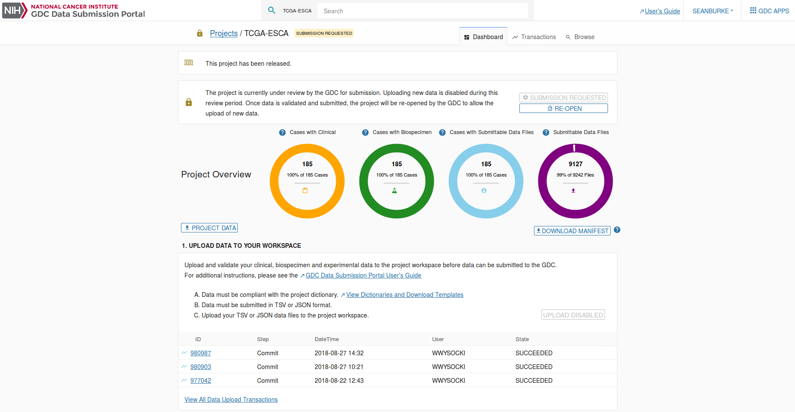
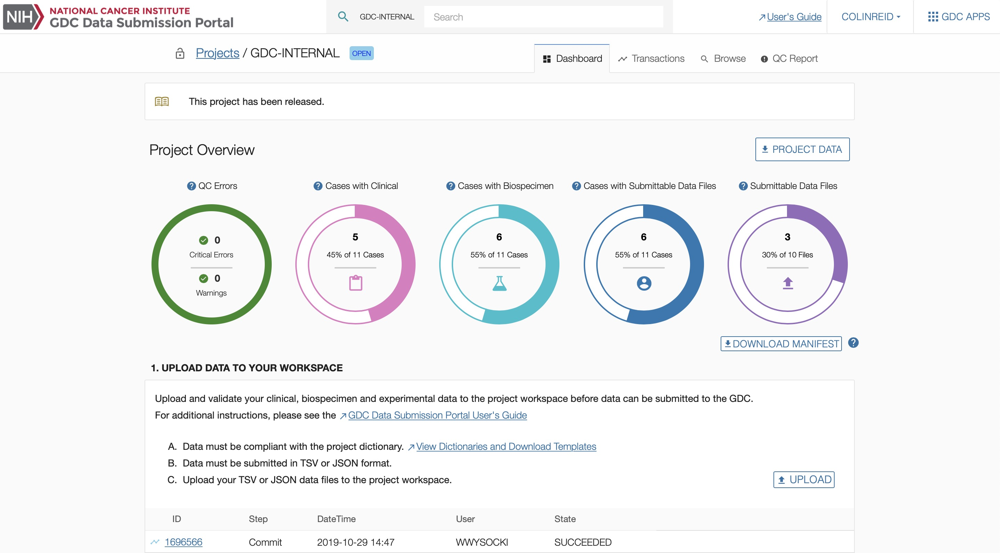

# Data Submission Portal

# Overview

This section will walk users through the submission process using the [GDC Data Submission Portal](https://portal.gdc.cancer.gov/submission/). The diagram below describes this process for uploading and validating data in the GDC Data Submission Portal.

The submitter uploads Clinical and Biospecimen data to the project workspace using GDC templates that are available in the [GDC Data Dictionary](https://docs.gdc.cancer.gov/Data_Dictionary/). The GDC validates the uploaded data against the GDC Data Dictionary. Then to upload submittable data files, such as sequence data in BAM or FASTQ format, the submitter must register file metadata with the GDC using a method similar to uploading Clinical and Biospecimen data. When the files are registered, the submitter downloads a manifest from the GDC Data Submission Portal and uses it with the [GDC Data Transfer Tool](https://gdc.cancer.gov/access-data/gdc-data-transfer-tool) to upload the data files. Finally, the submitter will request submission, and after harmonization, the submitter will review and eventually release their data.

# Review GDC Dictionary and GDC Data Model - Submitter Activity

It is suggested that all submitters review the [GDC Dictionary](https://docs.gdc.cancer.gov/Data_Dictionary/viewer/) and [GDC Data Model](https://gdc.cancer.gov/developers/gdc-data-model/gdc-data-model-components). It is beneficial for submitters to know which nodes will need metadata submission, how these nodes relate to each other, and what information is required for each node in the model.

# Download templates - Submitter Activity

After determining the required nodes for the submission, go to each node page in the [GDC Dictionary](https://docs.gdc.cancer.gov/Data_Dictionary/viewer/). There will be a "Download Template Format" drop down list. Select the file format, either TSV or JSON, and download the template for the node. If [numerous entries](Data_Submission_Walkthrough.md#submitting-numerous-cases) are being submitted all at one time, it is suggested that the user uses a TSV template. At this point, it is suggested to go through the template and remove fields that will not be populated by the metadata submission, but make sure to complete all fields that are required for the node. For more information about the Data Dictionary, please visit [here](https://docs.gdc.cancer.gov/Data_Dictionary/).

# Upload Case Information Including dbGaP Submitted Subject IDs - Submitter Activity

After registering the study in [dbGAP](https://gdc.cancer.gov/submit-data/obtaining-access-submit-data), the first node to be created in the data model is the [`case` node](Data_Submission_Walkthrough.md#case-and-clinical-data-submission). The `case` node is important as it will contain a unique `submitter_id` that is registered in the dbGaP database. This will connect the two databases, dbGaP and GDC, and allows for access to be granted to a controlled data set based on the study and its cases.

To [submit the `case`](Data_Submission_Walkthrough.md#uploading-the-case-submission-file) nodes, a user must be able to login and access the [GDC Submission Portal](https://portal.gdc.cancer.gov/submission/) for their respective project.

## Authentication

### Requirements

Accessing the GDC Data Submission Portal requires eRA Commons credentials with appropriate dbGaP authorization.  To learn more about obtaining the required credentials and authorization, see [Obtaining Access to Submit Data]( https://gdc.cancer.gov/submit-data/obtaining-access-submit-data).

### Authentication via eRA Commons

Users can log into the GDC Data Submission Portal with eRA Commons credentials by clicking the "Login" button. If authentication is successful, the user will be redirected to the GDC Data Submission Portal front page and the user's eRA Commons username will be displayed in the upper right corner of the screen.

#### GDC Authentication Tokens

The GDC Data Portal provides authentication tokens for use with the GDC Data Transfer Tool or the GDC API. To download a token:

1. Log into the GDC using your eRA Commons credentials.
2. Click the username in the top right corner of the screen.
3. Select the "Download token" option.

A new token is generated each time the `Download Token` button is clicked.

For more information about authentication tokens, see [Data Security](../../Data/Data_Security/Data_Security.md#authentication-tokens).

>**NOTE:** The authentication token should be kept in a secure location, as it allows access to all data accessible by the associated user account.

#### Logging Out

To log out of the GDC, click the username in the top right corner of the screen, and select the Logout option. Users will automatically be logged out after 15 minutes of inactivity.

## Homepage

After authentication, users are redirected to a homepage. The homepage acts as the entry point for GDC data submission and provides submitters with access to a list of authorized projects, repo

### Reports

Project summary reports can be downloaded at the Submission Portal homepage at three different levels: CASE OVERVIEW, ALIQUOT OVERVIEW, and DATA VALIDATION.  Each report is generated in tab-delimited format in which each row represents an active project.  

…
These actions and associated features are further detailed in their respective sections of the documentation.rts, and transactions. Content on the homepage varies based on the user profile (e.g. submitte

### Reports

Project summary reports can be downloaded at the Submission Portal homepage at three different levels: CASE OVERVIEW, ALIQUOT OVERVIEW, and DATA VALIDATION.  Each report is generated in tab-delimited format in which each row represents an active project.  

…
These actions and associated features are further detailed in their respective sections of the documentation.r, program office).

### Reports

Project summary reports can be downloaded at the Submission Portal homepage at three different levels: CASE OVERVIEW, ALIQUOT OVERVIEW, and DATA VALIDATION.  Each report is generated in tab-delimited format in which each row represents an active project.  

* __CASE OVERVIEW:__ This report describes the number of cases with associated biospecimen data, clinical data, or submittable data files (broken down by data type) for each project.
* __ALIQUOT OVERVIEW:__ This report describes the number of aliquots in a project with associated data files. Aliquot numbers are broken down by tissue sample type.
* __DATA VALIDATION:__ This report categorizes all submittable data files associated with a project by their file status.

### Projects

The projects section in the homepage lists the projects that the user has access to along with basic information about each project. For users with access to a large number of projects, this table can be filtered using the 'FILTER PROJECTS' field. Selecting a project ID will direct the user to the project's [Dashboard](#dashboard). The button used to release data for each project is also located on this screen, see [Release](#release) for details.

## Dashboard

The GDC Data Submission Portal dashboard provides details about a specific project.

The dashboard contains various visual elements to guide the user through all stages of submission, from viewing the [Data Dictionary](https://docs.gdc.cancer.gov/Data_Dictionary/), support of data upload, to submitting a project for harmonization.

To better understand the information displayed on the dashboard and the available actions, please refer to the [Data Submission Walkthrough](Data_Submission_Walkthrough.md).

### Project Overview
The Project Overview sections of the dashboard displays the most current project state (open / review / submitted / processing) and the GDC Release, which is the date in which the project was released to the GDC.

The search field at the top of the dashboard allows for submitted entities to be searched by partial or whole `submitter_id`.  When a search term is entered into the field, a list of entities matching the term is updated in real time.  Selecting one of these entities links to its details in the [Browse Tab](#browse-data)

The remaining part of the top section of the dashboard is broken down into four status charts:

* __Cases with Clinical__: The number of `cases` for which Clinical data has been uploaded.
* __Cases with Biospecimen__: The number of `cases` for which Biospecimen data has been uploaded.
* __Cases with Submittable Data Files__: The number of `cases` for which experimental data has been uploaded.
* __Submittable Data Files__: The number of files uploaded through the GDC Data Transfer Tool. For more information on this status chart, please refer to [File Status Lifecycle](Data_Submission_Overview.md#file-status-lifecycle).
The `DOWNLOAD MANIFEST` button below this status chart allows the user to download a manifest for registered files in this project that have not yet been uploaded.

### Action Panels

There are two action panels available below the Project Overview.

* [UPLOAD DATA TO YOUR WORKSPACE](Data_Submission_Walkthrough.md): Allows a submitter to upload project data to the GDC project workspace. The GDC will validate the uploaded data against the [GDC Data Dictionary](https://docs.gdc.cancer.gov/Data_Dictionary/). This panel also contains a table that displays details about the five latest transactions. Clicking the IDs in the first column will bring up a window with details about the transaction, which are documented in the [transactions](#transactions) page. This panel will also allow the user to commit file uploads to the project.
* [REVIEW AND SUBMIT YOUR WORKSPACE DATA TO THE GDC](#submit-your-workspace-data-to-the-gdc): Allows a submitter to review project data which will lock the project to ensure that additional data cannot be uploaded while in review. Once the review is complete, the data can be submitted to the GDC for processing through the [GDC Harmonization Process](https://gdc.cancer.gov/submit-data/gdc-data-harmonization).

These actions and associated features are further detailed in their respective sections of the documentation.

# Upload Clinical and Biospecimen Data - Submitter Activity

With the creation of `case` nodes, other nodes in the [data model](https://gdc.cancer.gov/developers/gdc-data-model/gdc-data-model-components) can be [uploaded](Data_Submission_Walkthrough.md#uploading-the-case-submission-file). This includes the [Clincal](Data_Submission_Walkthrough.md#clinical-submission) and [Biospecimen](Data_Submission_Walkthrough.md#biospecimen-submission) nodes, with examples for each that can be found in the [Data Upload Walkthrough](Data_Submission_Walkthrough.md).

# Register Data Files - Submitter Activity

The registering of data files will create the placement for the data file, but not actually upload the file at that time. These files can range from clinical and biospecimen supplements to `submitted_aligned_reads` and `submitted_unaligned_reads`. These nodes are created by [uploading the information](Data_Submission_Walkthrough.md#uploading-the-case-submission-file) the same way it was done for `case`, clinical and biospecimen data.

# Upload Data Using Data Transfer Tool - Submitter Activity

Before uploading the submittable data files to the GDC, a user will need to determine if the correct nodes have been created. This is accomplished using the Transactions and Browse pages in the [Data Submission Portal](https://portal.gdc.cancer.gov/submission). Transactions will show if the uploaded changes have been successfully committed, or if they did not pass the verification step and failed to upload. Browse will display the metadata based on the information uploaded into the model. Browse will be important for uploading the files, as it will display the connection between the UUID and the file name of the submittable data file.

## Transactions

The transactions page lists all of the project's transactions. The transactions page can be accessed by choosing the Transactions tab at the top of the dashboard or by choosing "View All Data Upload Transactions" in the first panel of the dashboard.

The types of transactions are the following:

* __Upload:__ The user uploads data to the project workspace. Note that submittable data files uploaded using the GDC Data Transfer tool do not appear as transactions. Uploaded submittable data can be viewed in the Browse tab.
* __Review:__ The user reviews the project before submitting data to the GDC.
* __Open:__ The user re-opens the project if it was under review. This allows the upload of new data to the project workspace.
* __Submit:__ The user submits uploaded data to the GDC. This triggers the data harmonization process.
* __Release:__ The user releases harmonized data to be available through the GDC Data Portal and other GDC data access tools.

### Transactions List View

The transactions list view displays the following information:

|Column|Description|
| --- | --- |
| __ID__ | Identifier of the transaction |
| __Type__ | Type of the transaction (see the list of transaction types in the previous section)|
| __Step__ | The step of the submission process that each file is currently in. This can be Validate or Commit. "Validate" represents files that have not yet been committed but have been submitted using the submission portal or the API. |
| __DateTime__ | Date and Time that the transaction was initiated |
| __User__ | The username of the submitter that performed the transaction |
| __Status__ | 	Indicates the status of the transaction: `SUCCEEDED`, `PENDING`, or `FAILED` |
| __Commit/Discard__ | Two buttons that appear when data has been uploaded using the API or the submission portal.  This allows for validated data to be incorporated into the project or discarded. |

### Transaction Filters

Choosing from the drop-down menu at the top of the table allows the transactions to be filtered by those that are in progress, to be committed, succeeded, failed, or discarded. The drop-down menu also allows for the transactions to be filtered by type.  

### Transactions Details

Clicking on a transaction will open the details panel. Data in this panel is organized into multiple sections including actions, details, types, and documents as described below.

Navigation between the sections can be performed by either scrolling down or by clicking on the section icon displayed on the left side of the details panel.

#### Actions

The Actions section allows a user to perform an action for transactions that provide actions. For example, if a user uploads read groups and file metadata, a corresponding manifest file will be available for download from the transaction. This manifest is used to upload the actual files through the [GDC Data Transfer Tool](https://gdc.cancer.gov/access-data/gdc-data-transfer-tool).

#### Details

The Details section provides details about the transaction itself, such as its project, type, and number of affected cases.

#### Types

The Types section lists the type of files submitted and the number of affected cases and entities.

#### Documents

The Documents section lists the files submitted during the transaction.
The user can download the original files from the transaction, a report detailing the transaction, or the errors that originated from the transaction (if the transaction had failed).

## Browse Data

The `Browse` menu provides access to all of a project's content. Most content is driven by the GDC Data Dictionary and the interface is dynamically generated to accommodate the content.

Please refer to the [GDC Data Dictionary Viewer](../../Data_Dictionary/viewer.md) for specific details about dictionary-generated fields, columns, and filters.

### Main Interface Elements

#### Filters

A wide set of filters are available for the user to select the type of entity to be displayed. These filters are dynamically created based on the [GDC Data Dictionary](../../Data_Dictionary/index.md).

Current filters are:

|Filter|Description|
| --- | --- |
| __Cases__ | Display all `Cases` associated with the project. |
| __Clinical Entities__ | Display all Clinical data uploaded to the project workspace. This is divided into subgroups including `Demographics`, `Diagnoses`, `Exposures`, `Family Histories`, `Follow_up`, `Molecular_tests`, and `Treatments`. |
| __Biospecimen Data__ | Display all Biospecimen data uploaded to the project workspace. This is divided into subgroups including `Samples`, `Portions`, `Analytes`, `Aliquots`, and `Read Groups`. |
| __Submittable Data Files__ | Displays all data files that have been registered with the project. This includes files that have been uploaded and those that have been registered but not uploaded yet. This category is divided into groups by file type. |
| __Annotations__ | Lists all annotations associated with the project. An annotation provides an explanatory comment associated with data in the project. |
| __Harmonized Data Files__ | Lists all data files that have been harmonized by the GDC. This category is divided into groups by generated data. |

#### List View

The list view is a paginated list of all entities corresponding to the selected filter.

On the top-right section of the screen, the user can download data about all entities associated with the selected filter.

* For the case filter, it will download all Clinical data or all Metadata.
* For all other filters, it will download the corresponding metadata (e.g., for the `demographic` filter, it will download all `demographic` data).

#### Details Panel

Clicking on an entity will open the details panel. Data in this panel is broken down into multiple sections depending on the entity type. The main sections are:

* __Actions__: Actions that can be performed relating the entity. This includes downloading the metadata (JSON or TSV) or submittable data file pertaining to the entity and deleting the entity. See the [Deleting Entities](Data_Submission_Walkthrough.md#deleting-submitted-entities) guide for more information.  
* __Summary__: A list of IDs and system properties associated with the entity.
* __Details__: Properties of the entity (not associated with cases).
* __Hierarchy__ or __Related Entities__: A list of associated entities.
* __Annotations__: A list of annotations associated with the entity.
* __Transactions__: A list of previous transactions that affect the entity.

The sections listed above can be navigated either by scrolling down or by clicking on the section icon on the left side of the details panel.

#### Related Entities

The Related Entities table lists all entities, grouped by type, related to the selected `case`. This section is only available at the `case` level.

This table contains the following columns:

* __Category__: category of the entity (Clinical, Biospecimen, submittable data file).
* __Type__: type of entity (based on Data Dictionary).
* __Count:__ number of occurrences of an entity associated with the `case`. Clicking on the count will open a window listing those entities within the Browse page.

#### Hierarchy

The hierarchy section is available for entities at any level (e.g., Clinical, Biospecimen, etc.), except for `case`. The user can use the hierarchy section to navigate through entities.

The hierarchy shows:

* The `case` associated with the entity.
* The __direct__ parents of the entity.
* The __direct__ children of the entity.

## Submitting Data Files to the GDC

Once the submittable data files have been determined to be registered via the Transactions and Browse page, the user can obtain the submission manifest file that is found on the [Project Overview](#project-overview) page.  From this point the submission process is described in the ["Uploading the Submittable Data File to the GDC"](Data_Submission_Walkthrough.md#uploading-the-submittable-data-file-to-the-gdc) section.

For strategies on data upload, further documentation for the GDC Data Submission process is detailed on the [Data Submission Processes and Tools](https://gdc.cancer.gov/submit-data/data-submission-processes-and-tools) section of the GDC Website. For further assistance in uploading data, please contact the GDC Help Desk: <support@nci-gdc.datacommons.io>.

# Verify Accuracy and Completeness of Project Data - Submitter Activity

## Review

The submitter is responsible for reviewing the data uploaded to the project workspace (see [Data Submission Walkthrough](Data_Submission_Walkthrough.md)), and ensuring that it is ready for processing by the GDC [Harmonization Process](https://gdc.cancer.gov/submit-data/gdc-data-harmonization).

The user will be able to view the section below on the dashboard. The `REVIEW` button is available only if the project is in "OPEN" state.

Setting the project to the "REVIEW" state will lock the project and prevent users from uploading additional data. Only users with release privileges will be able to review and submit. During this period, the submitter can browse the data in the Data Submission Portal or download it. Once the review is complete, the user can request to submit more data to the GDC.

Clicking on the `REVIEW` button will change the project state to "REVIEW":

## Pre-Harmonization Checklist

The Harmonization step is __NOT__ an automatic process that occurs when data is uploaded to the GDC. The GDC performs batch processing of submitted data for Harmonization only after verifying that the submission is complete.

The following tasks are required before the data can be considered complete:

1. All files are registered and have been uploaded and validated.

2. There are no invalid characters in the `submitter_id` of any node.
The acceptable characters are alphanumeric characters [a-z, A-Z, 0-9] and `_`, `.`, `-`. Any other characters will interfer with the Harmonization workflow.

3. There are no data files with duplicate md5sums.

4. Clinical data nodes such as `demographic`, `diagnosis` and `clinical_supplement`, are linked to `case`.

5. The `read_group` node is linked to a valid node:
    * `submitted_unaligned_reads`
    * `submitted_aligned_reads`
    * `genomic_profiles`

6. The `sample`-`analyte`-`aliquot` relationships are valid. Common problems can sometimes be:
    * `aliquot` attached to `sample` nodes of more than one type.
    * `aliquot` attached to more than one `sample` node, potentially valid but unusual.
    * `aliquot` attached to both `sample` and `analyte` nodes.

7. Each `aliquot` node is only associated with one `submitted_aligned_reads` file of the same `experimental_strategy`.

8. The information for the `platform` is in the `read_group` node. While the subsequent information about the platform is not required, it is beneficial to also have information on:
    * `multiplex_barcode`
    * `flow_cell_barcode`
    * `lane_number`

9.  In `read_group`, the `library_strategy` should match the `library_selection`:
    * Targeted Sequencing must be with either PCR or Hybrid Selection.
    * WXS must be with Hybrid Selection.
    * WGS must be with Random.

10.  The `target_capture_kit` property is one of the enumerations when the selected `library_strategy` is `WXS`. Errors will occur if `Not Applicable` or `Unknown` is selected.

11. Check the nodes that are related to FASTQ files. For the `submitted_unalinged_reads` node, determine that the size is correct, the files are not compressed (`.tar` or `.tar.gz`), and there is a link to `read_group`. For the `read_group` node, make sure that the `is_paired_end` is set to `true` for paired end sequencing and `false` for single end sequencing.

Once complete, clicking the `REQUEST SUBMISSION` button will indicate to internal teams and automation system to begin data processing.

# Request Data Submission - Submitter Activity

## Submit to the GDC

When the project is complete and ready for processing, the submitter will request to submit data to the GDC. If the project is not ready for processing, the project can be re-opened. Then the submitter will be able to upload more data to the project workspace.

The `REQUEST SUBMISSION` button is available only if the project is in "REVIEW" state. At this point, the user can decide whether to re-open the project to upload more data or to request submission of the data to the GDC. When the project is in "REVIEW" the following panel appears on the dashboard:

The Harmonization process is not automatic, so the user will need to press the `REQUEST SUBMISSION` button to indicate to internal teams and the automation system to begin data processing.  Once the user submits data to the GDC, they cannot modify the submitted nodes and files while harmonization is underway.  Additional project data can be added during this period and will be considered a separate batch.  To process an additional batch the user must again review the data and select `REQUEST SUBMISSION`.

When the user clicks on the action `REQUEST SUBMISSION` on the dashboard, the following submission popup is displayed:

After the user clicks on `SUBMIT VALIDATED DATA TO THE GDC`, the project state becomes "Submission Requested":

During this time, users can continue to submit more files to the project, but these will be considered a different batch in the project.

The GDC requests that users submit their data to the GDC within six months from the first upload of data to the project workspace.

# GDC Review/QC Submitted Data - GDC Activity

The Bioinformatics Team at the GDC runs the Quality Control pipeline on the submitted data. This pipeline mirrors the [Pre-Harmonization Checklist](#pre-harmonization-checklist) and will determine if the submission is complete and is ready for the pipeline analysis. If the submission does contain problems, the GDC will contact the user to "Re-Open" the project and fix the errors in their submission.

# GDC Harmonize Data - GDC Activity

After the submission passes the GDC Quality Control pipeline, it will be queued for the [GDC Harmonization pipleine](https://gdc.cancer.gov/about-data/gdc-data-harmonization).

# Submitter Review/QC of Harmonized Data - Submitter Activity

After the data is processed in the Harmonization pipeline, the GDC asks submitters to verify the quality of the data. This is done by going to the [GDC Pre-Release Data Portal](https://portal.awg.gdc.cancer.gov/). For more information about the Pre-Release Data Portal please visit the documentation [page](Pre_Release_QC.md). It is the user's responsibilty to notify the GDC of any errors in their harmonized data sets. The GDC will then work with the user to correct the issue and rerun the Harmonization pipeline if needed.

# Release Data Within Six Months - Submitter Activity

Project release occurs after the data has been harmonized, and allows users to access this data with the [GDC Data Portal](https://portal.gdc.cancer.gov/) and other [GDC Data Access Tools](https://gdc.cancer.gov/access-data/data-access-processes-and-tools). The GDC will release data according to [GDC Data Sharing Policies](https://gdc.cancer.gov/submit-data/data-submission-policies). Data must be released within six months after GDC data processing has been completed, or the submitter may request earlier release using the "Request Release" function.  A project can only be released once.

When the user clicks on the action `REQUEST RELEASE`, the following Release popup is displayed:

After the user clicks on `RELEASE SUBMITTED AND PROCESSED DATA`, the project release state becomes "Release Requested":

>__Note__: Released cases and/or files can be redacted from the GDC. For more information, visit the [GDC Policies page (under GDC Data Sharing Policies)](https://gdc.cancer.gov/about-gdc/gdc-policies).

# GDC Releases Data - GDC Activity

GDC data releases are not continuous, but instead are released in descrete data updates. Once harmonized data is approved and release request is approved, data will be available in the next GDC Portal update.
