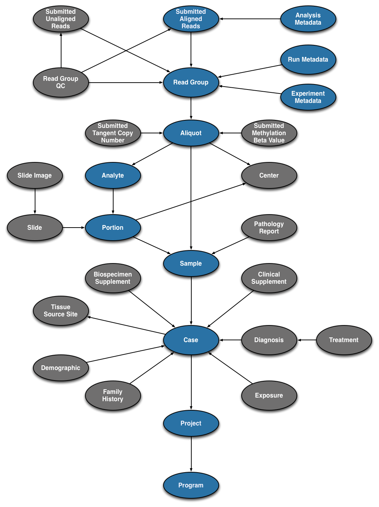

# Upload Data

This guide details step-by-step procedures for different aspects of the GDC Data Submission process and how they relate to the GDC Data Model and structure. The first sections of this guide break down the submission process and associate each step with the Data Model. Additional sections are detailed below for strategies on expediting data submission and using features of the Submission Portal.

## GDC Data Model Basics

Pictured below is the submittable subset of the GDC Data Model: a roadmap for GDC data submission. The entities that make up the completed (submitted) portion of the submission process will be highlighted in __blue__.

[](images/GDC-Data-Model-None.png "Click to see the full image.")

Each entity type is represented with an oval in the above graphic. All submitted entities require a connection to another entity type, based on the GDC Data Model, and a `submitter_id` as an identifier.

### The Case Entity and Clinical Data

The `case` is the center of the GDC Data Model and usually describes a specific patient. Each `case` is connected to a `project`.  Different types of clinical data, such as `diagnoses` and `exposures`, are connected to the `case` to describe the case's attributes and medical information.   

### Biospecimen Data

One of the main features of the GDC is the genomic data harmonization workflow. Genomic data is connected the the case through biospecimen entities.  The `sample` entity describes a biological piece of matter that originated from a `case`.  Subsets of the `sample` such as `portions` and `analytes` can optionally be described.  The `aliquot` originates from a `sample` or `analyte` and describes the nucleic acid extract that was sequenced. The `read_group` entity describes the resulting set of reads from one sequencing lane.

### Experiment Data

Several types of experiment data can be uploaded to the GDC.  The `submitted_aligned_reads` and `submitted_unaligned_reads` files are associated with the `read_group` entity. While the array-based files such as the `submitted_tangent_copy_number` are associated with the `aliquot` entity.  Each of these file types are described in their respective entity submission and are uploaded separately using the API or the GDC Data Transfer Tool.  

## Program and Project Registration

Before submission can begin, the Program and Project must be approved and set by the GDC.

### Program and Project Approval

Each new project must [request submission access](https://gdc.cancer.gov/submit-data/requesting-data-submission) from the GDC.  Before submission can commence the project must be registered at dbGaP along with the eRA commons IDs for all those users who will be uploading data. All cases (i.e. patients) must also be registered in dbGaP for that particular project.  Once these steps are complete the GDC will grant submission access and create program and project names in consultation with the user based on the rules outlined below.  

### Program and Project Naming Conventions

The program is assigned a `program.name`, which uniquely identifies that program. Each program may have multiple projects and will be assigned a `project.code`, which uniquely identifies each project. The `project_id` is the main identifier for the project in the GDC system and comprises the `program.name` with the `project.code` appended to it with a dash.  For example:

```Example
program.name = TCGA
project.code = BRCA
project.project_id = TCGA-BRCA
```  

## Case Submission

[](images/GDC-Data-Model-Case.png "Click to see the full image.")

The main entity of the GDC Data Model is the `case`, each of which must be registered beforehand with dbGaP under a unique `submitter_id`. The first step to submitting a `case` is to consult the [Data Dictionary](https://gdc-docs.nci.nih.gov/Data_Dictionary/viewer/#data-dictionary-viewer), which details the fields that are associated with a `case`, the fields that are required to submit a `case`, and the values that can populate each field. Dictionary entries are available for all entities in the GDC Data Model.

[](images/Dictionary_Case.png "Click to see the full image.")

Submitting a [__Case__](https://gdc-docs.nci.nih.gov/Data_Dictionary/viewer/#?view=table-definition-view&id=case) entity requires:

* __`submitter_id`:__ A unique key to identify the `case`
* __`projects.code`:__ A link to the `project`

The submitter ID is different from the universally unique identifier (UUID), which is based on the [UUID Version 4 Naming Convention](https://en.wikipedia.org/wiki/Universally_unique_identifier#Version_4_.28random.29). The UUID can be accessed under the `<entity_type>_id` field for each entity. For example, the `case` UUID can be accessed under the `case_id` field. The UUID is either assigned to each entity automatically or can be submitted by the user.  See the [Data Model Users Guide](https://gdc-docs.nci.nih.gov/Data/Data_Model/GDC_Data_Model/#gdc-identifiers) for more details about GDC identifiers.

The `projects.code` field connects the `case` entity to the `project` entity.  The rest of the entity connections use the `submitter_id` field instead.  

The `case` entity can be added in JSON or TSV format. A template for any entity in either of these formats can be found in the Data Dictionary at the top of each page. Templates populated with `case` metadata in both formats are displayed below.  

```JSON
{
    "type": "case",
    "submitter_id": "PROJECT-INTERNAL-000055",
    "projects": {
        "code": "INTERNAL"
    }
}
```
```TSV
type  submitter_id  projects.code
case  PROJECT-INTERNAL-000055 INTERNAL   
```

__Note:__ JSON and TSV formats handle links between entities (`case` and `project`) differently.  JSON includes the `code` field nested within `projects` while TSV appends `code` to `projects` with a period.  


## Uploading the Case Submission File

The file detailed above can be uploaded using the Data Submission Portal and the API as described below:

### Upload - Data Submission Portal

#### 1. Upload Files

An example of a `case` upload is detailed below. The GDC Data Submission Portal is equipped with a wizard window to facilitate the upload and validation of entities. The Upload Data Wizard comprises two stages:

* __Upload Entities__: Upload an entity into the user's browser, at this point nothing is submitted to the project workspace.
* __Validate Entities__: Send an entity to the GDC backend to validate its content (see below)

The __Validate Entities__ stage acts as a safeguard against submitting incorrectly formatted data to the GDC Data Submission Portal. During the validation stage, the GDC API will validate the content of uploaded entities against the Data Dictionary to detect potential errors. Invalid entities will not be processed and must be corrected by the user and re-uploaded before being accepted. A validation error report provided by the system can be used to isolate and correct errors.

Choosing _'UPLOAD'_ from the project dashboard will open the Upload Data Wizard.

[](images/GDC_Submission_Wizard_Upload_2.png "Click to see the full image.")

Files containing one or more entities can be added either by clicking on _'CHOOSE FILE(S)'_ or using drag and drop. Files can be removed from the Upload Data Wizard by clicking on the garbage can icon next to the file.

#### 2. Validate Entities

When the first file is added, the wizard will move to the _'VALIDATE'_ section and the user can continue to add files.

[](images/GDC_Submission_Portal_Validate.png "Click to see the full image.")

When all files have been added, choosing _'VALIDATE'_ will run a test to check if the entities are valid for submission.

#### 3. Commit or Discard Files
If the upload contains valid entities, a new transaction will appear in the latest transactions panel with the option to _'COMMIT'_ or _'DISCARD'_ the data. Entities contained in these files can be committed (applied) to the project or discarded using these two buttons.

If the upload contains invalid files, a transaction will appear with a FAILED status. Invalid files will need to be either corrected and re-uploaded or removed from the submission. If more than one file is uploaded and at least one is not valid, the validation step will fail for all files.  

[](images/GDC_Submission_CommitDiscard.png "Click to see the full image.")


### Upload - API

The API has a much broader range of functionality than the Data Wizard. Entities can be created, updated, and deleted through the API. See the [API Submission User Guide](API/Users_Guide/Submission/#creating-and-updating-entities) for a more detailed explanation and for the rest of the functionalities of the API. Generally, uploading an entity through the API can be performed using a command similar to the following:

```Shell
curl --header "X-Auth-Token: $token" --request POST --data @CASE.json https://gdc-api.nci.nih.gov/v0/submission/GDC/INTERNAL/_dry_run?async=true
```
CASE.json is detailed below.
```json
{
    "type": "case",
    "submitter_id": "PROJECT-INTERNAL-000055",
    "projects": {
        "code": "INTERNAL"
    }
}
```

__Note:__ Submission of TSV files is also supported by the GDC API.

Next, the file can either be committed (applied to the project) through the Data Submission Portal as before, or another API query can be performed that will commit the file to the project. The transaction number in the URL (467) is printed to the console during the first step of API submission and can also be retrieved from the 'Transactions' tab in the Data Submission Portal.

```Shell
curl --header "X-Auth-Token: $token" --request POST https://gdc-api.nci.nih.gov/v0/submission/GDC/INTERNAL/transactions/467/commit?async=true
```

## Clinical Submission

[](images/GDC-Data-Model-Clinical.png "Click to see the full image.")

Typically a submission project will include additional information about a `case` such as `demographic`, `diagnosis`, or `exposure` data.

### Submitting a Demographic Entity to a Case

The `demographic` entity contains information that characterizes the `case` entity.  

Submitting a [__Demographic__](https://gdc-docs.nci.nih.gov/Data_Dictionary/viewer/#?view=table-definition-view&id=demographic) entity requires:

* __`submitter_id`:__ A unique key to identify the `demographic` entity
* __`cases.submitter_id`:__ The unique key that was used for the `case` that links the `demographic` entity to the `case`
* __`ethnicity`:__ An individual's self-described social and cultural grouping, specifically whether an individual describes themselves as Hispanic or Latino. The provided values are based on the categories defined by the U.S. Office of Management and Business and used by the U.S. Census Bureau
* __`gender`:__ Text designations that identify gender. Gender is described as the assemblage of properties that distinguish people on the basis of their societal roles
* __`race`:__ An arbitrary classification of a taxonomic group that is a division of a species. It usually arises as a consequence of geographical isolation within a species and is characterized by shared heredity, physical attributes and behavior, and in the case of humans, by common history, nationality, or geographic distribution. The provided values are based on the categories defined by the U.S. Office of Management and Business and used by the U.S. Census Bureau
* __`year_of_birth`:__ Numeric value to represent the calendar year in which an individual was born

```JSON
{
    "type": "demographic",
    "submitter_id": "PROJECT-INTERNAL-000055-DEMOGRAPHIC-1",
    "cases": {
        "submitter_id": "PROJECT-INTERNAL-000055"
    },
    "ethnicity": "not hispanic or latino",
    "gender": "male",
    "race": "asian",
    "year_of_birth": "1946"
}
```
```TSV
type	cases.submitter_id	ethnicity	gender	race	year_of_birth
demographic	PROJECT-INTERNAL-000055	not hispanic or latino	male	asian	1946
```

### Submitting a Diagnosis Entity to a Case

Submitting a [__Diagnosis__](https://gdc-docs.nci.nih.gov/Data_Dictionary/viewer/#?view=table-definition-view&id=diagnosis) entity requires:

* __`submitter_id`:__ A unique key to identify the `diagnosis` entity
* __`cases.submitter_id`:__ The unique key that was used for the `case` that links the `diagnosis` entity to the `case`
* __`age_at_diagnosis`:__ Age at the time of diagnosis expressed in number of days since birth
* __`classification_of_tumor`:__ Text that describes the kind of disease present in the tumor specimen as related to a specific timepoint
* __`days_to_last_follow_up`:__  Time interval from the date of last follow up to the date of initial pathologic diagnosis, represented as a calculated number of days
* __`days_to_last_known_disease_status`:__ Time interval from the date of last follow up to the date of initial pathologic diagnosis, represented as a calculated number of days
* __`days_to_recurrence`:__ Time interval from the date of new tumor event including progression, recurrence and new primary malignancies to the date of initial pathologic diagnosis, represented as a calculated number of days
* __`last_known_disease_status`:__  The state or condition of an individual's neoplasm at a particular point in time
* __`morphology`:__  The third edition of the International Classification of Diseases for Oncology, published in 2000 used principally in tumor and cancer registries for coding the site (topography) and the histology (morphology) of neoplasms. The study of the structure of the cells and their arrangement to constitute tissues and, finally, the association among these to form organs. In pathology, the microscopic process of identifying normal and abnormal morphologic characteristics in tissues, by employing various cytochemical and immunocytochemical stains. A system of numbered categories for representation of data
* __`primary_diagnosis`:__  Text term for the structural pattern of cancer cells used to define a microscopic diagnosis
* __`progression_or_recurrence`:__ Yes/No/Unknown indicator to identify whether a patient has had a new tumor event after initial treatment
* __`site_of_resection_or_biopsy`:__ The third edition of the International Classification of Diseases for Oncology, published in 2000, used principally in tumor and cancer registries for coding the site (topography) and the histology (morphology) of neoplasms. The description of an anatomical region or of a body part. Named locations of, or within, the body. A system of numbered categories for representation of data
* __`tissue_or_organ_of_origin`:__ Text term that describes the anatomic site of the tumor or disease
* __`tumor_grade`:__ Numeric value to express the degree of abnormality of cancer cells, a measure of differentiation and aggressiveness
* __`tumor_stage`:__ The extent of a cancer in the body. Staging is usually based on the size of the tumor, whether lymph nodes contain cancer, and whether the cancer has spread from the original site to other parts of the body. The accepted values for tumor_stage depend on the tumor site, type, and accepted staging system. These items should accompany the tumor_stage value as associated metadata
* __`vital_status`:__ The survival state of the person registered on the protocol

```JSON
{
    "type": "diagnosis",
    "submitter_id": "PROJECT-INTERNAL-000055-DIAGNOSIS-1",
    "cases": {
        "submitter_id": "PROJECT-INTERNAL-000055"
    },
    "age_at_diagnosis": 10256,
    "classification_of_tumor": "not reported",
    "days_to_last_follow_up": 34,
    "days_to_last_known_disease_status": 34,
    "days_to_recurrence": "45",
    "last_known_disease_status": "Tumor free",
    "morphology": "8260/3",
    "primary_diagnosis": "c64.9",
    "progression_or_recurrence": "no",
    "site_of_resection_or_biopsy": "lung",
    "tissue_or_organ_of_origin": "lung",
    "tumor_grade": "not reported",
    "tumor_stage": "stage i",                        
    "vital_status": "alive"
}
```
```TSV
type	submitter_id	cases.submitter_id	age_at_diagnosis	classification_of_tumor	days_to_last_follow_up	days_to_last_known_disease_status	days_to_recurrence	last_known_disease_status	morphology	primary_diagnosis	progression_or_recurrence	site_of_resection_or_biopsy	tissue_or_organ_of_origin	tumor_grade	tumor_stage	vital_status
diagnosis	PROJECT-INTERNAL-000055-DIAGNOSIS-1	PROJECT-INTERNAL-000055	10256	not reported	34	34	45	Tumor free	8260/3	c64.9	no	lung	lung	not reported	stage i	alive
```

### Submitting an Exposure Entity to a Case

Submitting an [__Exposure__](https://gdc-docs.nci.nih.gov/Data_Dictionary/viewer/#?view=table-definition-view&id=exposure) entity does not require any information besides a link to the `case` and a `submitter_id`.  The following fields are optionally included:  

* __`alcohol_history`:__ A response to a question that asks whether the participant has consumed at least 12 drinks of any kind of alcoholic beverage in their lifetime
* __`alcohol_intensity`:__ Category to describe the patient's current level of alcohol use as self-reported by the patient
* __`bmi`:__ The body mass divided by the square of the body height expressed in units of kg/m^2
* __`cigarettes_per_day`:__ The average number of cigarettes smoked per day (number)
* __`height`:__ The height of the individual in cm (number)
* __`weight`:__ The weight of the individual in kg (number)
* __`years_smoked`:__ Numeric value (or unknown) to represent the number of years a person has been smoking

```JSON
{
    "type": "exposure",
    "submitter_id": "PROJECT-INTERNAL-000055-EXPOSURE-1",
    "cases": {
        "submitter_id": "PROJECT-INTERNAL-000055"
    },
    "alcohol_history": "yes",
    "bmi": 27.5,
    "cigarettes_per_day": 20,
    "height": 190,
    "weight": 100,
    "years_smoked": 5
}
```
```TSV
type	submitter_id	cases.submitter_id	alcohol_history	bmi	cigarettes_per_day	height	weight	years_smoked
exposure	PROJECT-INTERNAL-000055-EXPOSURE-1	PROJECT-INTERNAL-000055	yes	27.5	20	190	100	5
```

__Note:__ Submitting a clinical entity uses the same conventions as submitting a `case` entity (detailed above).

### Case Age and GDC Privacy Policy

Time-based records that were reported in clinical data, such as `age_at_diagnosis` and `days_to_death` do not increase after 32,872 days (~90 years) after birth. This protects the identity of patients who fall into this age bracket who could potentially be identified by their age. An example of how the actual and submitted values would differ is demonstrated below:

```Actual
{
"age_at_diagnosis": 32900
"days_to_last_follow_up": 100
"days_to_death": 200
}
```
```Submitted
{
"age_at_diagnosis": 32872
"days_to_last_follow_up": 0
"days_to_death": 0
}
```

## Biospecimen Submission

### Sample Submission

[](images/GDC-Data-Model-Sample.png "Click to see the full image.")

A `sample` submission has the same general structure as a `case` submission as it will require a unique key and a link to the `case`.  However, `sample` entities require one additional value:  `sample_type`. This peripheral data is required because it is necessary for the data to be interpreted. For example, an investigator using this data would need to know whether the `sample` came from tumor or normal tissue.  


[](images/Dictionary_Sample.png "Click to see the full image.")

Submitting a [__Sample__](https://gdc-docs.nci.nih.gov/Data_Dictionary/viewer/#?view=table-definition-view&id=sample) entity requires:

* __`submitter_id`:__ A unique key to identify the `sample`
* __`cases.submitter_id`:__ The unique key that was used for the `case` that links the `sample` to the `case`
* __`sample_type`:__ Type of the `sample`. Named for its cellular source, molecular composition, and/or therapeutic treatment

__Note:__ The `case` must be "committed" to the project before a `sample` can be linked to it.  This also applies to all other links between entities.

```JSON
{
    "type": "sample",
    "cases": {
        "submitter_id": "PROJECT-INTERNAL-000055"
    },
    "sample_type": "Blood Derived Normal",
    "submitter_id": "Blood-00001SAMPLE_55"
}
```
```TSV
type	cases.submitter_id	submitter_id	sample_type
sample	PROJECT-INTERNAL-000055	Blood-00001SAMPLE_55	Blood Derived Normal  
```


### Aliquot, Portion, and Analyte Submission

[](images/GDC-Data-Model-Aliquot.png "Click to see the full image.")


Submitting an [__Aliquot__](https://gdc-docs.nci.nih.gov/Data_Dictionary/viewer/#?view=table-definition-view&id=aliquot) entity requires:

* __`submitter_id`:__ A unique key to identify the `aliquot`
* __`analytes.submitter_id`:__ The unique key that was used for the `analyte` that links the `aliquot` to the `analyte`

```JSON
{
    "type": "aliquot",
    "submitter_id": "Blood-00021-aliquot55",
    "samples": {
        "submitter_id": "Blood-00001SAMPLE_55"
    }
}

```
```TSV
type	submitter_id	analytes.submitter_id
aliquot	Blood-00021-aliquot55	Blood-00001SAMPLE_55
```

__Note:__ `aliquot` entities can be directly linked to `sample` entities. The `portion` and `analyte` entities described below are not required for submission.

Submitting a [__Portion__](https://gdc-docs.nci.nih.gov/Data_Dictionary/viewer/#?view=table-definition-view&id=portion) entity requires:

* __`submitter_id`:__ A unique key to identify the `portion`
* __`samples.submitter_id`:__ The unique key that was used for the `sample` that links the `portion` to the `sample`

```JSON
{
    "type": "portion",
    "submitter_id": "Blood-portion-000055",
    "samples": {
        "submitter_id": "Blood-00001SAMPLE_55"
    }
}

```
```TSV
type	submitter_id	samples.submitter_id
portion	Blood-portion-000055	Blood-00001SAMPLE_55
```

Submitting an [__Analyte__](https://gdc-docs.nci.nih.gov/Data_Dictionary/viewer/#?view=table-definition-view&id=analyte) entity requires:

* __`submitter_id`:__ A unique key to identify the `analyte`
* __`portions.submitter_id`:__ The unique key that was used for the `portion` that links the `analyte` to the `portion`
* __`analyte_type`:__ Protocol-specific molecular type of the specimen

```JSON
{
    "type": "analyte",
    "portions": {
        "submitter_id": "Blood-portion-000055"
    },
    "analyte_type": "DNA",
    "submitter_id": "Blood-analyte-000055"
}

```
```TSV
type	portions.submitter_id	analyte_type	submitter_id
analyte	Blood-portion-000055	DNA	Blood-analyte-000055
```

### Read Group Submission

[](images/GDC-Data-Model-RG.png "Click to see the full image.")

Because information about sequencing reads is necessary for downstream analysis, the `read_group` entity requires more fields than the other Biospecimen entities (`sample`, `portion`, `analyte`, `aliquot`).

Submitting a [__Read Group__](https://gdc-docs.nci.nih.gov/Data_Dictionary/viewer/#?view=table-definition-view&id=read_group) entity requires:

* __`submitter_id`:__ A unique key to identify the `read_group`
* __`aliquot.submitter_id`:__ The unique key that was used for the `aliquot` that links the `read_group` to the `aliquot`
* __`experiment_name`:__ Submitter-defined name for the experiment
* __`is_paired_end`:__ Are the reads paired end? (Boolean value: `true` or `false`)
* __`library_name`:__ Name of the library  
* __`library_strategy`:__ Library strategy
* __`platform`:__ Name of the platform used to obtain data
* __`read_group_name`:__ The name of the `read_group`
* __`read_length`:__ The length of the reads (integer)
* __`sequencing_center`:__ Name of the center that provided the sequence files  

```JSON
{
    "type": "read_group",
    "submitter_id": "Blood-00001-aliquot_lane1_barcodeACGTAC_55",
    "experiment_name": "Resequencing",
    "is_paired_end": true,
    "library_name": "Solexa-34688",
    "library_strategy": "WXS",
    "platform": "Illumina",
    "read_group_name": "205DD.3-2",
    "read_length": 75,
    "sequencing_center": "BI",
    "aliquots":
        {
            "submitter_id": "Blood-00021-aliquot55"
        }    
}

```
```TSV
type	submitter_id	experiment_name	is_paired_end	library_name	library_strategy	platform	read_group_name	read_length	sequencing_center	aliquots.submitter_id
read_group	Blood-00001-aliquot_lane1_barcodeACGTAC_55	Resequencing	true	Solexa-34688	WXS	Illumina	205DD.3-2	75	BI	Blood-00021-aliquot55
```

__Note:__ Submitting a biospecimen entity uses the same conventions as submitting a `case` entity (detailed above).

## Experiment Data Submission

[](images/GDC-Data-Model-Reads.png "Click to see the full image.")

Before the experiment data file can be submitted, the GDC requires that the user provides information about the file as a `submittable_data_file` entity. This includes file-specific data needed to validate the file and assess which analyses should be performed. Sequencing data files can be submitted as `submitted_aligned_reads` or `submitted_unaligned_reads`.

Submitting a [__Submitted Aligned-Reads__](https://gdc-docs.nci.nih.gov/Data_Dictionary/viewer/#?view=table-definition-view&id=submitted_aligned_reads) entity requires:

* __`submitter_id`:__ A unique key to identify the `submitted_aligned_reads`
* __`read_groups.submitter_id`:__ The unique key that was used for the `read_group` that links the `submitted_aligned_reads` to the `read_group`
* __`data_category`:__ Broad categorization of the contents of the data file
* __`data_format`:__ Format of the data files
* __`data_type`:__ Specific content type of the data file. (must be "Aligned Reads")
* __`experimental_strategy`:__ The sequencing strategy used to generate the data file
* __`file_name`:__ The name (or part of a name) of a file (of any type)
* __`file_size`:__ The size of the data file (object) in bytes
* __`md5sum`:__ The 128-bit hash value expressed as a 32 digit hexadecimal number used as a file's digital fingerprint


```JSON
{
    "type": "submitted_aligned_reads",
    "submitter_id": "Blood-00001-aliquot_lane1_barcodeACGTAC_55.bam",
    "data_category": "Raw Sequencing Data",
    "data_format": "BAM",
    "data_type": "Aligned Reads",
    "experimental_strategy": "WGS",
    "file_name": "test.bam",
    "file_size": 38,
    "md5sum": "aa6e82d11ccd8452f813a15a6d84faf1",
    "read_groups": [
        {
            "submitter_id": "Blood-00001-aliquot_lane1_barcodeACGTAC_55"
        }
    ]
}
```
```TSV
type	submitter_id	data_category	data_format	data_type	experimental_strategy	file_name	file_size	md5sum	read_groups.submitter_id#1
submitted_aligned_reads	Blood-00001-aliquot_lane1_barcodeACGTAC_55.bam	Raw Sequencing Data	BAM	Aligned Reads	WGS	test.bam	38	aa6e82d11ccd8452f813a15a6d84faf1	Blood-00001-aliquot_lane1_barcodeACGTAC_55
```

Submitting a [__Submitted Unaligned-Reads__](https://gdc-docs.nci.nih.gov/Data_Dictionary/viewer/#?view=table-definition-view&id=submitted_unaligned_reads) entity requires:

* __`submitter_id`:__ A unique key to identify the `submitted_unaligned_reads`
* __`read_groups.submitter_id`:__ The unique key that was used for the `read_group` that links the `submitted_unaligned_reads` to the `read_group`
* __`data_category`:__ Broad categorization of the contents of the data file
* __`data_format`:__ Format of the data files
* __`data_type`:__ Specific content type of the data file. (must be "Unaligned Reads")
* __`experimental_strategy`:__ The sequencing strategy used to generate the data file
* __`file_name`:__ The name (or part of a name) of a file (of any type)
* __`file_size`:__ The size of the data file (object) in bytes
* __`md5sum`:__ The 128-bit hash value expressed as a 32 digit hexadecimal number used as a file's digital fingerprint


```JSON
{
    "type": "submitted_unaligned_reads",
    "submitter_id": "Blood-00001-aliquot_lane2_barcodeACGTAC_55.fastq",
    "data_category": "Raw Sequencing Data",
    "data_format": "FASTQ",
    "data_type": "Unaligned Reads",
    "experimental_strategy": "WGS",
    "file_name": "test.fastq",
    "file_size": 38,
    "md5sum": "901d48b862ea5c2bcdf376da82f2d22f",
    "read_groups": [
        {
            "submitter_id": "Blood-00001-aliquot_lane2_barcodeACGTAC_55"
        }
    ]
}
```
```TSV
type	submitter_id	data_category	data_format	data_type	experimental_strategy	file_name	file_size	md5sum	read_groups.submitter_id
submitted_unaligned_reads	Blood-00001-aliquot_lane2_barcodeACGTAC_55.fastq	Raw Sequencing Data	FASTQ	Unaligned Reads	WGS	test.fastq	38	901d48b862ea5c2bcdf376da82f2d22f	Blood-00001-aliquot_lane2_barcodeACGTAC_55
```

__Note:__ Submitting an experiment data entity uses the same conventions as submitting a `case` entity (detailed above).

#### Submitting TSV Files with Many-To-One relationships

Because there can be many `read_groups` included in one `submitted_aligned_reads` file, the '\#1' is appended to the `read_groups.submitter_id` field in the TSV. An additional associated `read_group` would use a column named `read_groups.submitter_id#2`. The same conventions are used for other many-to-one or many-to-many relationships, such as the `clinical_test` entity, which may be associated with multiple `diagnosis` entities. This relationship can be expressed with a JSON-formatted list object (comma-separated in square brackets).   

### Uploading the Submittable Data File to the GDC

The submittable data file can be uploaded when it is registered with the GDC. An submittable data file is registered when its corresponding entity (e.g. `submitted_unaligned_reads`) is uploaded and committed. Uploading the file can be performed with either the GDC Data Transfer Tool or the API. Other types of data files such as clinical supplements, biospecimen supplements, and pathology reports are uploaded to the GDC in the same way. Supported data file formats are listed at the GDC [Submitted Data Types and File Formats](https://gdc.cancer.gov/about-data/data-types-and-file-formats/submitted-data-types-and-file-formats) website.

__GDC Data Transfer Tool:__ A file can be uploaded using its UUID (which can be retrieved from the portal or API) once it is registered. The following command can be used to upload the file:

```Shell
gdc-client upload --project-id PROJECT-INTERNAL --identifier a053fad1-adc9-4f2d-8632-923579128985 -t $token -f $path_to_file
```   

Additionally a manifest can be downloaded from the Submission Portal and passed to the Data Transfer Tool, this will allow for the upload of more than one `submittable_data_file`:

```Shell
gdc-client upload -m manifest.yml -t $token
```
__API Upload:__  A `submittable_data_file` can be uploaded through the API by using the `/submission/program/project/files` endpoint.  The following command would be typically used to upload a file:  

```Shell
curl --request PUT --header "X-Auth-Token: $token" https://gdc-api.nci.nih.gov/v0/submission/PROJECT/INTERNAL/files/6d45f2a0-8161-42e3-97e6-e058ac18f3f3 -d@$path_to_file

```

For more details on how to upload a `submittable_data_file` to a project see the [API Users Guide](API/Users_Guide/Submission/) and the [Data Transfer Tool Users Guide](Data_Transfer_Tool/Users_Guide/Data_Download_and_Upload/).  


## Metadata File Submission

[](images/GDC-Data-Model-Metadata.png "Click to see the full image.")


The `experiment_metadata` entity contains information about the experiment that was performed to produce each `read_group`. Unlike the previous two entities outlined, only information about the `experiment_metadata` file itself (SRA XML) is applied to the entity (indexed) and the `experiment_metadata` file is submitted in the same way that a BAM file would be submitted.

Submitting an [__Experiment Metadata__](https://gdc-docs.nci.nih.gov/Data_Dictionary/viewer/#?view=table-definition-view&id=experiment_metadata) entity requires:

* __`submitter_id`:__ A unique key to identify the `experiment_metadata` entity
* __`read_groups.submitter_id`:__ The unique key that was used for the `read_group` that links the `experiment_metadata` entity to the `read_group`
* __`data_category`:__ Broad categorization of the contents of the data file
* __`data_format`:__ Format of the data files. (must be "SRA XML")
* __`data_type`:__ Specific contents of the data file. (must be "Experiment Metadata")
* __`file_name`:__ The name (or part of a name) of a file (of any type)
* __`file_size`:__ The size of the data file (object) in bytes
* __`md5sum`:__ The 128-bit hash value expressed as a 32 digit hexadecimal number used as a file's digital fingerprint

```JSON
{
    "type": "experiment_metadata",
    "submitter_id": "Blood-00001-aliquot_lane1_barcodeACGTAC_55-EXPERIMENT-1",
    "cases": {
        "submitter_id": "Blood-00001-aliquot_lane1_barcodeACGTAC_55"
    },
    "data_category": "Sequencing Data",
    "data_format": "SRA XML",
    "data_type": "Experiment Metadata",
    "file_name": "Experimental-data.xml",
    "file_size": 65498,
    "md5sum": "d79997e4de03b5a0311f0f2fe608c11d",
}
```

```TSV
type	submitter_id	cases.submitter_id	data_category	data_format	data_type	file_name	file_size	md5sum
experiment_metadata	Blood-00001-aliquot_lane1_barcodeACGTAC_55-EXPERIMENT-1	Blood-00001-aliquot_lane1_barcodeACGTAC_55	Sequencing Data	SRA XML	Experiment Metadata	Experimental-data.xml	65498	d79997e4de03b5a0311f0f2fe608c11d
```
## Deleting Submitted Entities

The GDC Data Submission Portal allows users to delete submitted entities from the project when the project is in an "OPEN" state. This section applies to entities that have been committed to the project. Entities that have not been committed can be removed from the project by choosing the `DISCARD` button.  Entities can also be deleted using the API. See the [API Submission Documentation](../../API/Users_Guide/Submission/#deleting-entities) for specific instructions.

### Simple Deletion

If an entity was uploaded and has no related entities, it can be deleted from the [Browse](Browse_Data.md) tab. Once the entity to be deleted is selected, choose the `DELETE` button in the right panel under "ACTIONS".

---

[](images/GDC-Delete-Case-Unassociated.png "Click to see the full image.")

---

A message will then appear asking if you are sure about deleting the entity.  Choosing the `YES, DELETE` button will remove the entity from the project, whereas choosing the `NO, CANCEL` button will return the user to the previous screen.  

---

[](images/GDC-Delete-Sure.png "Click to see the full image.")

---

### Deletion with Dependents

If an entity has related entities, such as a `case` with multiple `samples` and `aliquots`, deletion takes one extra step.  

---

[](images/GDC-Delete-Case-Associated.png "Click to see the full image.")

---

Follow the 'Simple Deletion' method until the end. This action will appear in the [Transactions](Transactions.md) tab as "Delete" with a "FAILED" state.  

---

[](images/GDC-Failed-Transaction.png "Click to see the full image.")

---

Choose the failed transaction and the right panel will show the list of entities related to the entity that was going to be deleted.  

---

[](images/GDC-Error-Related.png "Click to see the full image.")

---

Selecting the `DELETE ALL` button at the bottom of the list will delete all of the related entities, their descendants, and the original entity.


### Submitted Data File Deletion

The `submittable_data_file` that were uploaded erroneously are deleted separately from their associated entity using the GDC Data Transfer Tool. See the section on [Deleting Data Files](https://docs.gdc.cancer.gov/Data_Transfer_Tool/Users_Guide/Data_Download_and_Upload/#deleting-previously-uploaded-data) in the Data Transfer Tool users guide for specific instructions.  

## Strategies for Submitting in Bulk

Each submission in the previous sections was broken down by component to demonstrate the GDC Data Model structure. However, the submission of multiple entities at once is supported and encouraged. Here two strategies for submitting data in an efficient manner are discussed.   

### Registering a BAM File: One Step

Registering a BAM file (or any other type) can be performed in one step by including all of the entities, from `case` to `submitted_aligned_reads`, in one file.  See the example below:

```JSON
[{
    "type": "case",
    "submitter_id": "PROJECT-INTERNAL-000055",
    "projects": {
        "code": "INTERNAL"
    }
},
{
    "type": "sample",
    "cases": {
        "submitter_id": "PROJECT-INTERNAL-000055"
    },
    "sample_type": "Blood Derived Normal",
    "submitter_id": "Blood-00001_55"
},
{
    "type": "portion",
    "submitter_id": "Blood-portion-000055",
    "samples": {
        "submitter_id": "Blood-00001_55"
    }
},
{
    "type": "analyte",
    "portions": {
        "submitter_id": "Blood-portion-000055"
    },
    "analyte_type": "DNA",
    "submitter_id": "Blood-analyte-000055"
},
{
    "type": "aliquot",
    "submitter_id": "Blood-00021-aliquot55",
    "analytes": {
        "submitter_id": "Blood-analyte-000055"
    }
},
{
    "type": "read_group",
    "submitter_id": "Blood-00001-aliquot_lane1_barcodeACGTAC_55",
    "experiment_name": "Resequencing",
    "is_paired_end": true,
    "library_name": "Solexa-34688",
    "library_strategy": "WXS",
    "platform": "Illumina",
    "read_group_name": "205DD.3-2",
    "read_length": 75,
    "sequencing_center": "BI",
    "aliquots":
        {
            "submitter_id": "Blood-00021-aliquot55"
        }    
},
{
    "type": "submitted_aligned_reads",
    "submitter_id": "Blood-00001-aliquot_lane1_barcodeACGTAC_55.bam",
    "data_category": "Raw Sequencing Data",
    "data_format": "BAM",
    "data_type": "Aligned Reads",
    "experimental_strategy": "WGS",
    "file_name": "test.bam",
    "file_size": 38,
    "md5sum": "aa6e82d11ccd8452f813a15a6d84faf1",
    "read_groups": [
        {
            "submitter_id": "Blood-00001-aliquot_lane1_barcodeACGTAC_55"
        }
    ]
}]
```

All of the entities are placed into a JSON list object:

`[{"type": "case","submitter_id": "PROJECT-INTERNAL-000055","projects": {"code": "INTERNAL"}}}, entity-2, entity-3]`

The entities need not be in any particular order as they are validated together.

__Note:__ Tab-delimited format is not recommended for 'one-step' submissions due to an inability of the format to accommodate multiple 'types' in one row.  

### Submitting Numerous Cases

The GDC understands that submitters will have projects that comprise more entities than would be reasonable to individually parse into JSON formatted files. Additionally, many investigators store large amounts of data in a tab-delimited format (TSV).  For instances like this, we recommend parsing all entities of the same type into separate TSVs and submitting them on a type-basis.  

For example, a user may want to submit 100 Cases associated with 100 `samples`, 100 `portions`, 100 `analytes`, 100 `aliquots`, and 100 `read_groups`. Constructing and submitting 100 JSON files would be tedious and difficult to organize. Submitting one `case` TSV containing 100 `cases`, one `sample` TSV containing 100 `samples`, and the rest would require six TSVs and can be formatted in programs such as Microsoft Excel or Google Spreadsheets.  

See the following example TSV files:

* [Cases.tsv](Cases.tsv)
* [Samples.tsv](Samples.tsv)
* [Portions.tsv](Portions.tsv)
* [Analytes.tsv](Analytes.tsv)
* [Aliquots.tsv](Aliquots.tsv)
* [Read-Groups.tsv](Readgroups.tsv)

## Download Previously Uploaded Files

The [transaction](Transactions.md) page lists all previous transactions in the project. The user can download files uploaded to the GDC workspace in the details section of the screen by selecting one transaction and scrolling to the "DOCUMENTS" section.

__Note:__ When submittable data files are uploaded through the Data Transfer Tool they are not displayed as transactions.  

[](images/GDC_Submission_Transactions_Original_Files_2.png "Click to see the full image.")
