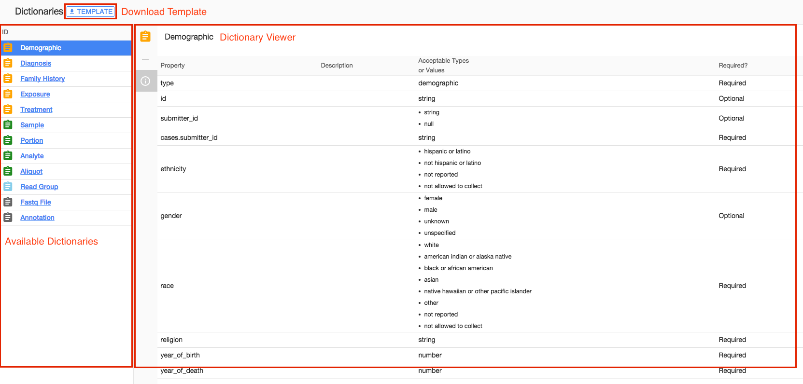

# Dictionary Viewer

## Overview

The Data Dictionary viewer provides access to GDC-wide dictionaries as well as specific dictionaries that could be applied to a specific project.

More details about dictionaries can be found in a dedicated section of the documentation [=>LINK TO GDC DICTIONARY DOCUMENTATION].

The Data Dictionary viewer is automatically updated from the GDC Data Dictionary and can considered an up-to-date view of the Data Dictionary.

## Available Dictionaries

The exact list of available dictionaries will vary from one project to another

## Data Dictionary View

After selecting a Data Dictionary in the left side of the screen, the user can view the content of this Data Dictionary. The following columns are available:

* _Property_: Name of the field to be used during submission.
* _Description_: Description of the field.
* _Acceptable Types or Values_: Details what is expected by the system and rules for data validation. This field can take different values such as string, number, enum (list of values).
* _Required?_: Indicates whether this field is required for the submission to be valid.

## Download Template

After selecting a Data Dictionary, its template can be downloaded from the system in TSV format.
