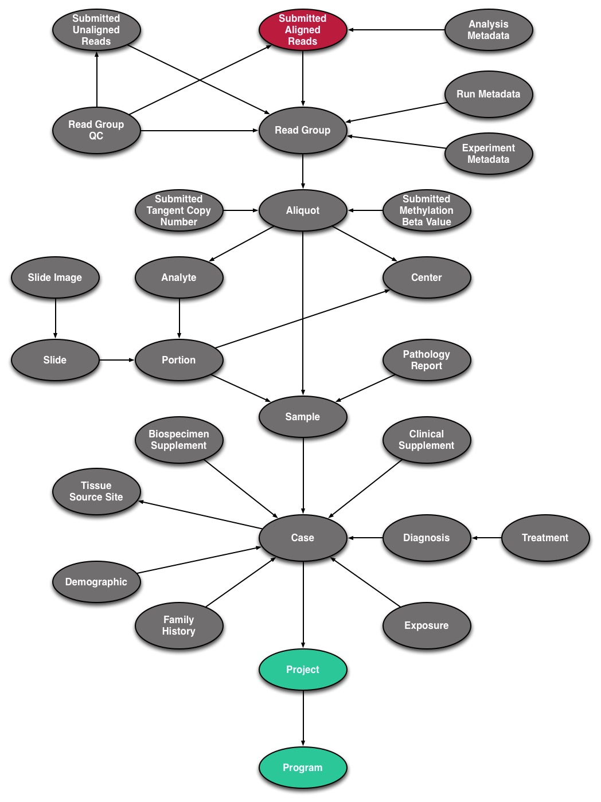
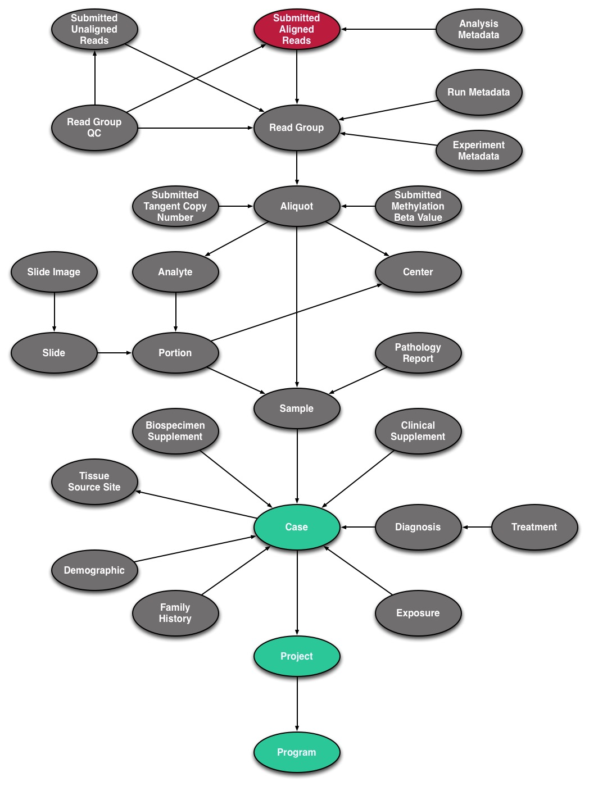
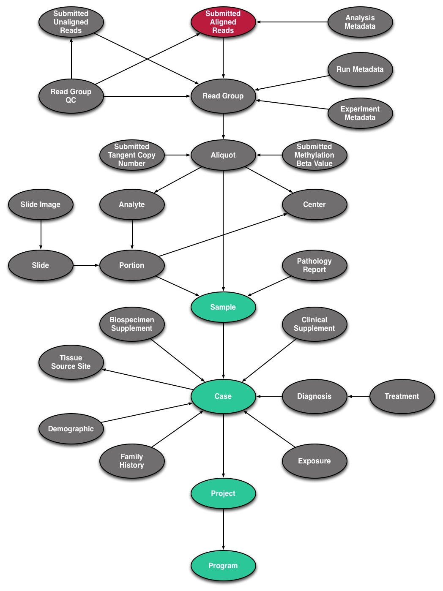
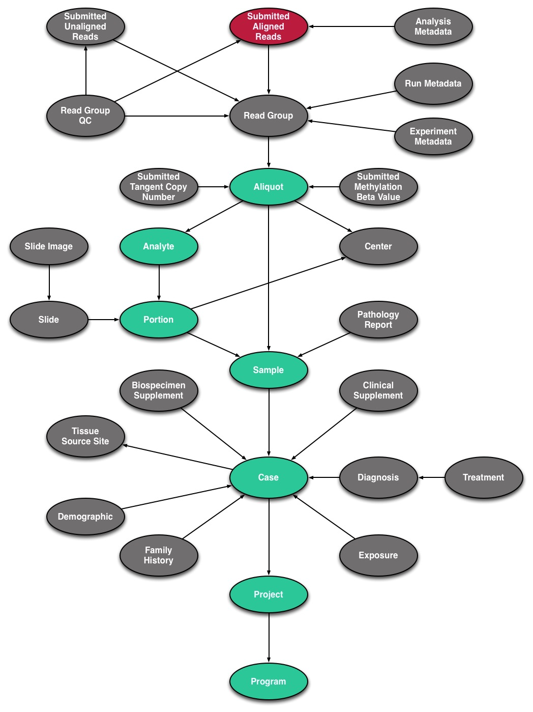
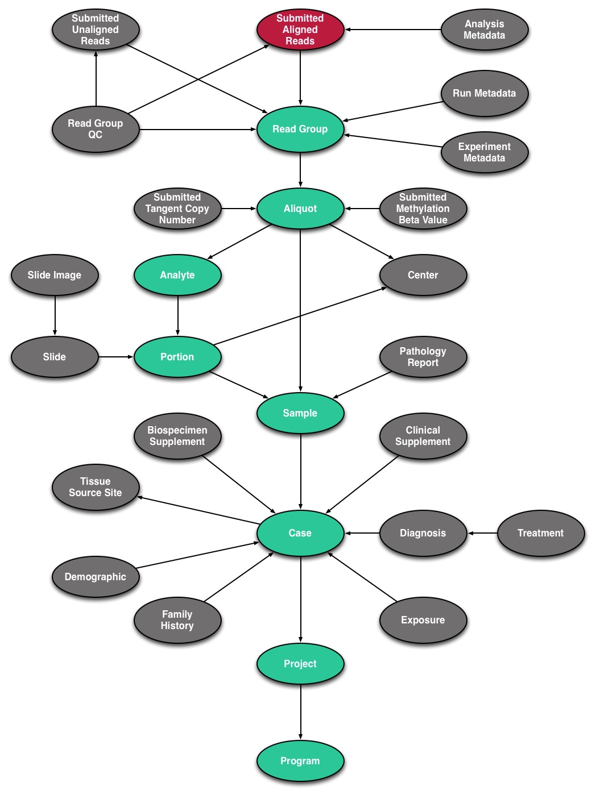

# Examples
This guide will detail the procedures for data submission and how it relates to the GDC data model and structure.    

## Submitting a BAM Alignment: Data Model Basics

Pictured below is the submittable subset of the GDC Data Model.  This will work as a roadmap the user can follow for submission. The nodes that make up the completed portion of the submission process are highlighted in __green__ and the current target node for submission is highlighted in __red__. Because BAM files are aligned, they fall into the "Submitted Aligned Reads" category of the GDC.  Before submission can begin, the Program and Project must be approved and set by the GDC, which is why they are highlighted from the start.

[](images/DataModel-1.jpg "Click to see the full image.")

### Case Submission

The next step in the Data Model is the Case, which must be registered beforehand with the GDC. The first step to submitting a Case is to consult the [Data Dictionary](LINK), which details the fields that are associated with a Case, the fields that are required to submit a case, and the values that can populate each field.

XXXX SCREENSHOT OF DICTIONARY GOES HERE XXXX

Submitting a __Case__ entity requires:

* __submitter_id:__ A unique key to identify the Case
* __projects.code:__ A link to the Project

__Note:__ The submitter ID is different from the UUID, which is assigned to each entity automatically.

The Case entity can be added in JSON or TSV format. A template for any entity in either of these formats can be found in the Data Dictionary at the top of each page.  

```JSON
{
    "type": "case",
    "submitter_id": "GDC-INTERNAL-000055",
    "projects": {
        "code": "INTERNAL"
    }
}
```
```TSV
type  submitter_id  projects.code
case  GDC-INTERNAL-000055 INTERNAL   
```

__Note:__ JSON and TSV formats handle links between entities (Case and Project) differently.  JSON includes the 'code' field nested within 'projects' while TSV appends 'code' with a period.  


[](images/DataModel-2.jpg "Click to see the full image.")

### Sample Submission

Sample Submission has the same general structure as Case Submission as it will require a unique key and a link to the Case.  However, Sample entities require one additional value:  __sample_type__. This peripheral data is required because it is necessary for any data to be interpreted. For example, we would need to know whether the sample came from tumor or normal tissue.  


XXX DICTIONARY SCREENSHOT GOES HERE XXX

Submitting a __Sample__ entity requires:

* __submitter_id:__ A unique key to identify the Sample
* __cases.submitter_id:__ The unique key that was used for the Case, links the Sample to the Case
* __sample_type:__ The source or cellular type of the Sample

```JSON
{
    "type": "sample",
    "cases": {
        "submitter_id": "GDC-INTERNAL-000055"
    },
    "sample_type": "Blood Derived Normal",
    "submitter_id": "Blood-00001_api55"
}
```
```TSV
type	cases.submitter_id	submitter_id	sample_type
sample	GDC-INTERNAL-000055	Blood-00001_api55	Blood Derived Normal  
```

[](images/DataModel-3.jpg "Click to see the full image.")

### Portion, Analyte, and Aliquot Submission

Submitting a __Portion__ entity requires:

* __submitter_id:__ A unique key to identify the Portion
* __samples.submitter_id:__ The unique key that was used for the Sample, links the Portion to the Sample

```JSON
{
    "type": "portion",
    "submitter_id": "Blood-portion-000055",
    "samples": {
        "submitter_id": "Blood-00001_api55"
    }
}

```
```TSV
type	submitter_id	samples.submitter_id
portion	Blood-portion-000055	Blood-00001_api55
```

Submitting an __Analyte__ entity requires:

* __submitter_id:__ A unique key to identify the Analyte
* __portions.submitter_id:__ The unique key that was used for the Portion, links the Analyte to the Portion
* __analyte_type:__ The protocol-specific molecular type of the Analyte

```JSON
{
    "type": "analyte",
    "portions": {
        "submitter_id": "Blood-portion-000055"
    },
    "analyte_type": "DNA",
    "submitter_id": "Blood-analyte-000055"
}

```
```TSV
type	portions.submitter_id	analyte_type	submitter_id
analyte	Blood-portion-000055	DNA	Blood-analyte-000055
```

Submitting an __Aliquot__ entity requires:

* __submitter_id:__ A unique key to identify the Aliquot
* __analytes.submitter_id:__ The unique key that was used for the Analyte, links the Aliquot to the Analyte

```JSON
{
    "type": "aliquot",
    "submitter_id": "Blood-00021-aliquot55",
    "analytes": {
        "submitter_id": "Blood-analyte-000055"
    }
}

```
```TSV
type	submitter_id	analytes.submitter_id
aliquot	Blood-00021-aliquot55	Blood-analyte-000055
```

__Note:__ Aliquot entities can be directly linked to Sample entities.

[](images/DataModel-4.jpg "Click to see the full image.")

### Read Group Submission
Because information about genomic reads is necessary for downstream analysis, the Read Group entity requires many more fields than the other Biospecimen entities (Sample, Portion, Analyte, Aliquot).

Submitting a __Read Group__ entity requires:

* __submitter_id:__ A unique key to identify the Read Group
* __aliquot.submitter_id:__ The unique key that was used for the Aliquot, links the Read Group to the Aliquot
* __experiment_name:__ The name of the experiment
* __is_paired_end:__ If the reads are paired-end (Boolean value: true/false)
* __library_name:__ The name of the library  
* __library_strategy:__ The experimental strategy of the library
* __platform:__ Name of the platform used to sequence the data
* __read_group_name:__ The name of the read group
* __read_length:__ The length of the reads (integer)
* __sequencing_center:__ The name of the center in which the sequencing was performed  

```JSON
{
    "type": "read_group",
    "submitter_id": "Blood-00001-aliquot_lane1_barcodeACGTAC_55",
    "experiment_name": "Resequencing",
    "is_paired_end": true,
    "library_name": "Solexa-34688",
    "library_strategy": "WXS",
    "platform": "Illumina",
    "read_group_name": "205DD.3-2",
    "read_length": 75,
    "sequencing_center": "BI",
    "aliquots":
        {
            "submitter_id": "Blood-00021-aliquot55"
        }    
}

```
```TSV
type	submitter_id	experiment_name	is_paired_end	library_name	library_strategy	platform	read_group_name	read_length	sequencing_center	aliquots.submitter_id
read_group	Blood-00001-aliquot_lane1_barcodeACGTAC_55	Resequencing	true	Solexa-34688	WXS	Illumina	205DD.3-2	75	BI	Blood-00021-aliquot55
```

[](images/DataModel-5.jpg "Click to see the full image.")

### Submitted Aligned-Reads Submission

Before the BAM file can be submitted, the GDC requires information about the submittable data file.  This includes file-specific data needed to validate the file and assess which analyses should be performed.  

Submitting a __Submitted Aligned-Reads__ entity requires:

* __submitter_id:__ A unique key to identify the Submitted Aligned-Reads
* __read_groups.submitter_id:__ The unique key that was used for the Read Group, links the Submitted Aligned-Reads to the Read Group
* __data_category:__ A broad categorization of the data file contents
* __data_format:__ The data file format
* __data_type:__ The specific contents of the data file (must be "Aligned Reads")
* __experimental_strategy:__ The sequencing strategy used to generate the file  
* __file_name:__ The name of the file
* __file_size:__ The size of the file in bytes
* __md5sum:__ The 128-bit hash value expressed as a 32 digit hexadecimal number

```JSON
{
    "type": "submitted_aligned_reads",
    "submitter_id": "Blood-00001-aliquot_lane1_barcodeACGTAC_55.bam",
    "data_category": "Raw Sequencing Data",
    "data_format": "BAM",
    "data_type": "Aligned Reads",
    "experimental_strategy": "WGS",
    "file_name": "test.bam",
    "file_size": 38,
    "md5sum": "aa6e82d11ccd8452f813a15a6d84faf1",
    "read_groups": [
        {
            "submitter_id": "Blood-00001-aliquot_lane1_barcodeACGTAC_55"
        }
    ]
}
```
```TSV
type	submitter_id	data_category	data_format	data_type	experimental_strategy	file_name	file_size	md5sum	read_groups.submitter_id#1
submitted_aligned_reads	Blood-00001-aliquot_lane1_barcodeACGTAC_55.bam	Raw Sequencing Data	BAM	Aligned Reads	WGS	test.bam	38	aa6e82d11ccd8452f813a15a6d84faf1	Blood-00001-aliquot_lane1_barcodeACGTAC_55
```

__Note:__ Because there can be many read_groups included in one submitted_aligned_reads file, the '\#1' is appended to the read_groups.submitter_id value in the TSV.  This relationship can be expressed with a list object (square brackets) in a JSON formatted file.   

## Adding Metadata to the BAM Alignment

## Submitting in Bulk
