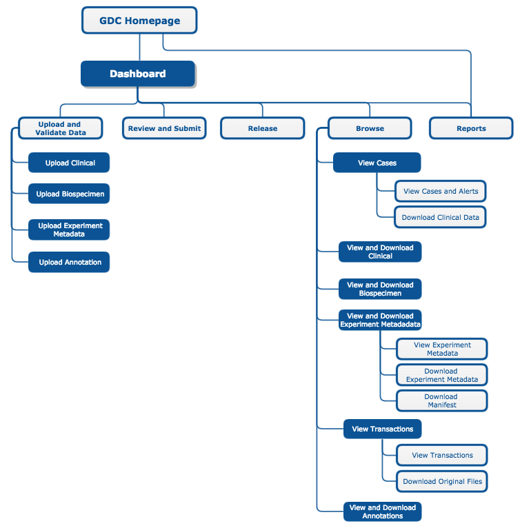
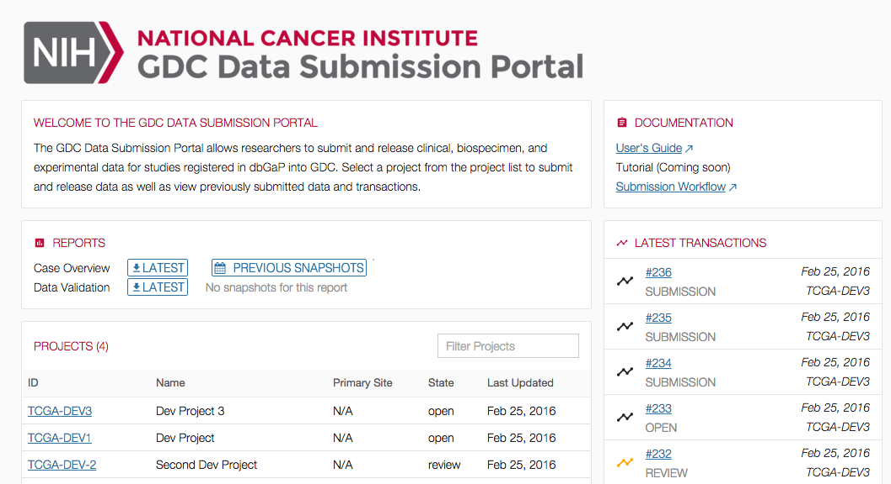
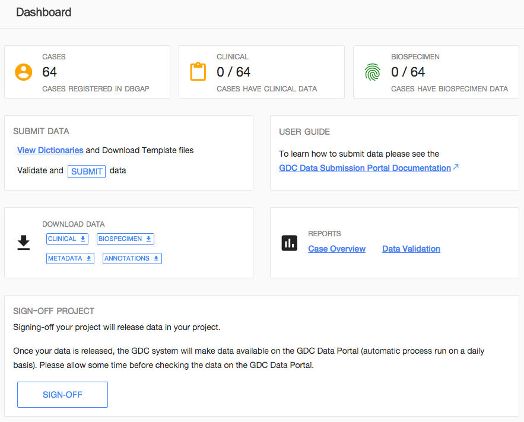
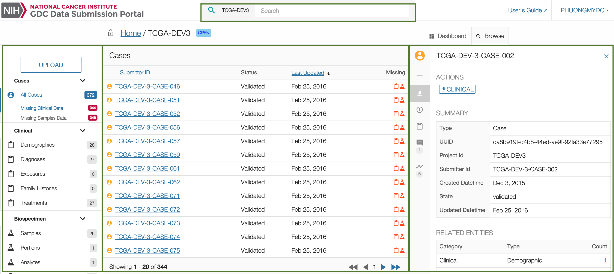
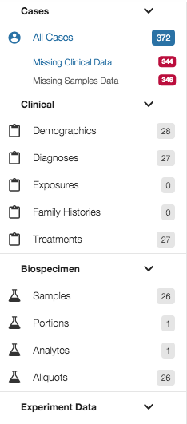
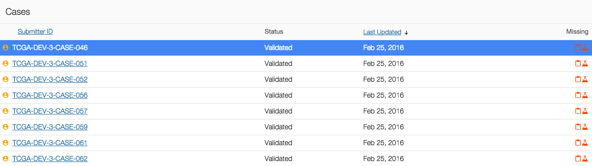
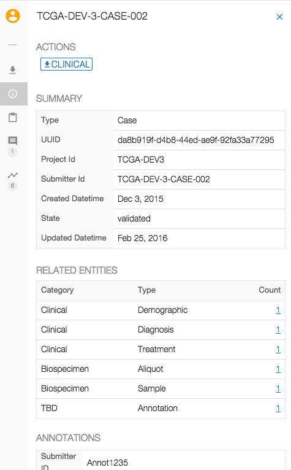

# Features

## Sitemap

The above image shows the GDC Data Submission Portal sitemap.

## Homepage

The submitter should choose from the homepage in which project he would like to work.

The report section in the homepage will provide reports on all the projects the user has access to.

## Dashboard

The dashboard provides a quick access to all the actions a submitter or project owner can do:

* __Charts__: Provides information on the content of project data (e.g. 42 regitered cases in this project have clinical data).
* __Reports__: Provides report on the project (e.g. Case Overview Report).
* __Actions__: Provides the list of actions the user can perform as part of the submission process. This list varies depending on the user's privileges.
* __Latest Transactions__: Displays the latest transactions on the project.
* __Browse__: Link to Browse menu (see next section).

## Browse

### Layout

The GDC Data Submission Portal Browse menu, has been divided into three separate panels:

* __Navigation panel__: A panel composed of links to different filtered items.
* __Summary panel__: A table listing items corresponding to the current selection.
* __Details panel__: Details and previous activities related to a particular entity selected in the results panel.

### Navigation Panel

The navigation panel provides access to the following elements:

* __Upload__: Access to the upload wizard. 
* __List of Entities uploaded to the project workspace__: Cases, Clinical, Biospecimen and Experiment Data.
* __Transactions__: List all actions happening on a project.
* __Annotations__: list of annotations 

### Summary Panel

The summary panel lists items in a table based on the element selected in the navigation panel or in the results of a search.

Columns in the table vary depending of the selected element in the navigation panel.

The table view supports pagination and columns sorting and, if applicable, alerts are displayed to notify that additional attention is required, such as in the situations shown above.

### Detail Panel

The third panel, on the right-hand side of the page, provides more details about a selected entity.

The exact content of those sub-sections depends on the type of entity (e.g. case, sample, transaction) of the selection in the navigation panel.

The Transactions section shows all past transactions associated with an entity, clicking on a transaction will redirect the user to this particular transaction.

## Filtering and Searching

The quick search menu available at the top of the screen will provide the ability to find your entity in the Browse menu. Type the entity ID, the GDC will provide an autocomplete feature.

