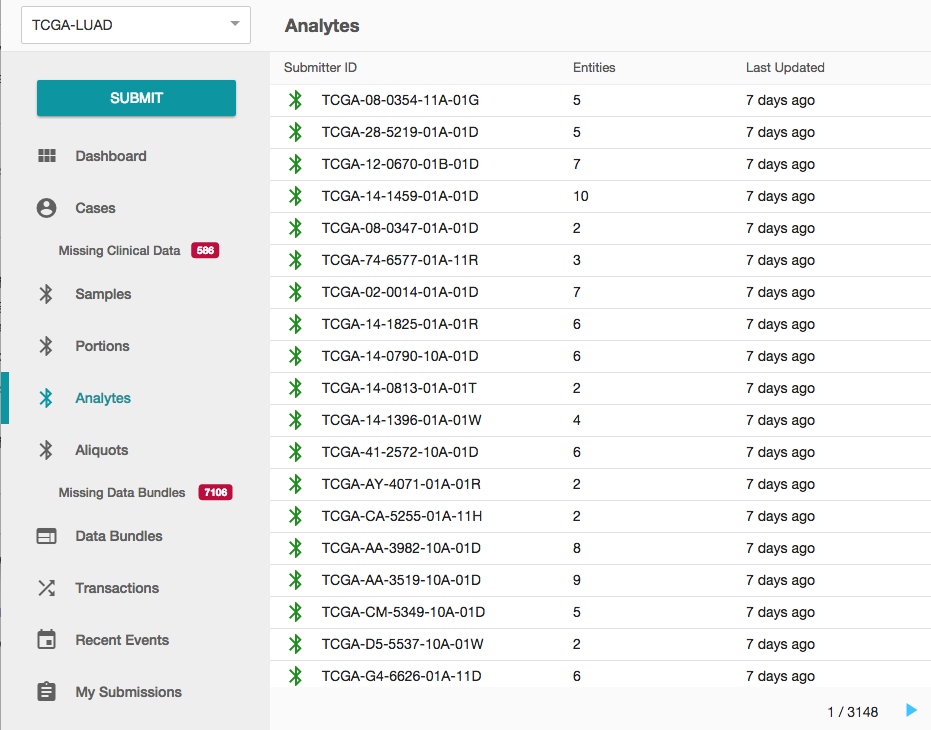

# Features

## Sitemap

The above image shows the GDC Data Submission Portal sitemap.

## Homepage

## Dashboard

The Portal comprises different sections available through a toolbar on the upper level of the page and a navigation panel on the left-hand side of the page.

The top toolbar provides access to the following elements:

* __GDC Identifying Image__: Clicking on GDC identifying image will redirect to the submission dashboard.
* __Search__: A context-sensitive search provides a mechanism to search through different pages.
* __Profile__: The user profile icon provides access to the token and to a logout feature.

## Layout

The GDC Data Submission Portal main window, visible when navigating through the GDC Data Submission Portal, has been divided into three separate panels:

* __Navigation panel__: A panel composed of links to different sections of the application.
* __List panel__: A table listing items corresponding to the current selection.
* __Details panel__: Details and previous activities related to a particular entity selected in the results panel.

## Browse

###Navigation Panel

The navigation panel provides access to the following elements:

* __Upload__: Access to the upload wizard. 
* __List of Entities uploaded to the project workspace__: Cases, Clinical, Biospecimen and Experiment Data.
* __Transactions__: List all actions happening on a project.
* __Annotations__: list of annotations 

### Summary Panel

The summary panel lists items in a table based on the element selected in the navigation panel or in the results of a search.

Columns in the table vary depending of the selected element in the navigation panel.

The table view supports pagination and columns sorting and, if applicable, alerts are displayed to notify that additional attention is required, such as in the situations shown above.

### Detail Panel

The third panel, on the right-hand side of the page, provides more details about a selected entity.

The exact content of those sub-sections depends on the type of entity (e.g. case, sample, transaction) of the selection in the navigation panel.

The Transactions section shows all past transactions associated with an entity, clicking on a transaction will redirect the user to this particular transaction.

## Filtering and Searching

The quick search menu available at the top of the screen will provide the ability to find your entity in the Browse menu. Type the entity ID, the GDC will provide an autocomplete feature.

