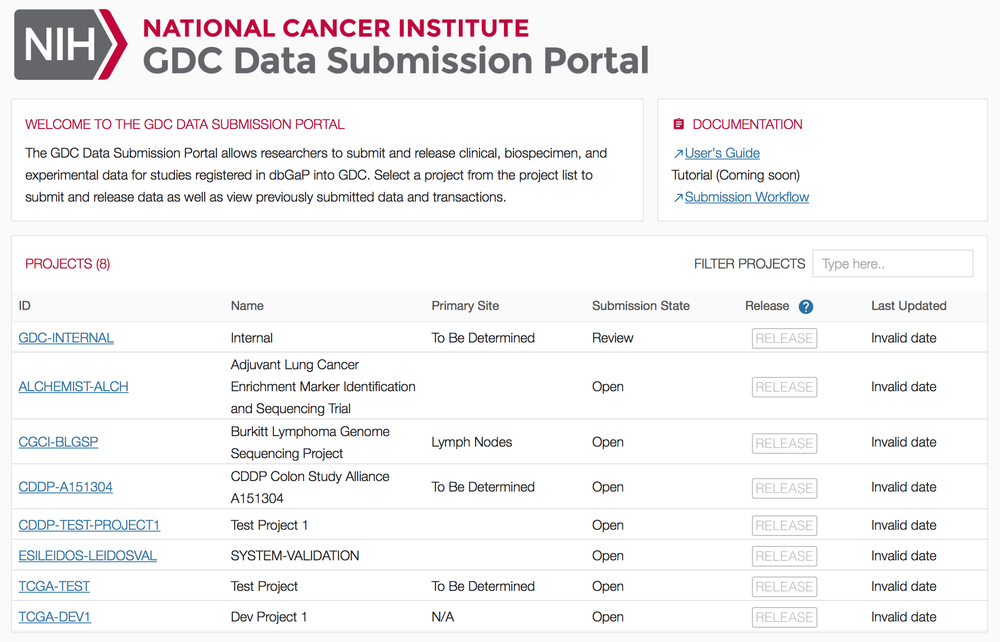
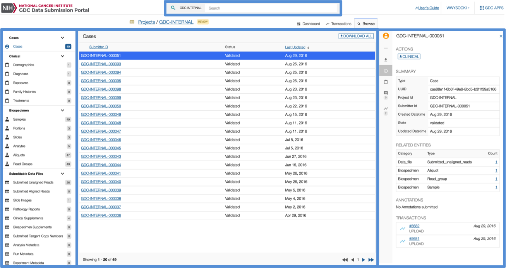
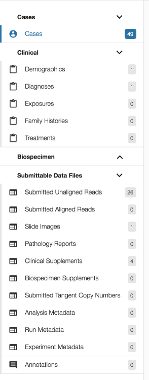
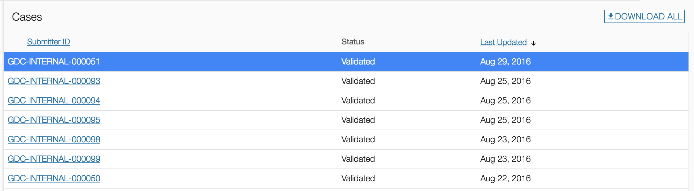
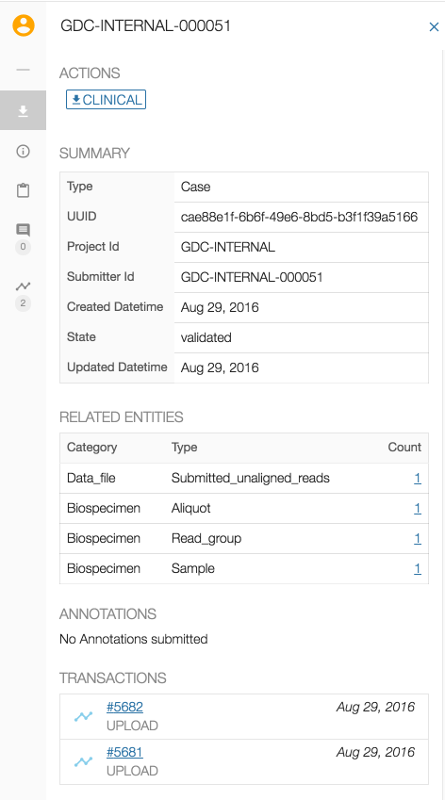

# Features

## Homepage

The homepage is displayed when the submitter logs into the GDC Data Submission Portal. The homepage provides access to project reports on previously submitted data and a list of projects that the submitter is authorized to submit data into. Documentation links are also provided.

To submit data for a project, select the project from the list. This displays the project dashboard.

## Dashboard

The dashboard provides quick access to all the actions a submitter or project owner can perform:

* __Charts__: Provide information on the content of project data (e.g. 28 registered cases in this project have clinical data).
* __Actions__: Provides the list of actions that the user can perform as part of the submission process such as uploading, validating, reviewing, and submitting data. This list varies depending on the user's privileges.
* __Transactions Tab__: Displays all data submission transactions that have occurred on the project.
* __Browse Tab__: Provides a link to browse submitted data as described in the Browse section below.

## Browse

### Layout

The GDC Data Submission Portal browse menu consists of three separate panels:

* __Navigation Panel__: A panel composed of links to different items to filter by case, clinical, biospecimen, or submittable data file entities.
* __Summary Panel__: A table listing search results corresponding to the current selection in the navigation panel filter.
* __Details Panel__: A panel displaying details and previous activities related to a particular entity selected in the summary panel.

### Navigation Panel

The navigation panel provides access to the following elements:

* __Entity List__: Includes filters for the cases, clinical, biospecimen, and submittable data files uploaded to the project workspace.
* __Annotations__: Provides access to a List of annotations submitted on an entity such as a case or aliquot.

### Summary Panel

The summary panel lists items in a table based on the filter selected in the navigation panel or on the results of a search. Columns in the table vary depending on the selected filter in the navigation panel. The table view supports pagination and column sorting.

### Details Panel

The third panel, on the right-hand side of the page, provides more details about a selected entity. The exact content in this panel depends on the type of entity (e.g., case, sample, transaction) selected in the navigation panel.

The transactions section in the panel lists all past transactions associated with an entity, clicking on a transaction will redirect the user to that particular entry in the Transactions tab.

## Quick Search

The quick search feature available at the top of the dashboard and browse menu will provide the ability to search for an entity and display the results in the browse menu. To search for an entity, the submitter can begin entering the entity ID in the search box and the autocomplete feature will provide a list of suggested entities for selection.

