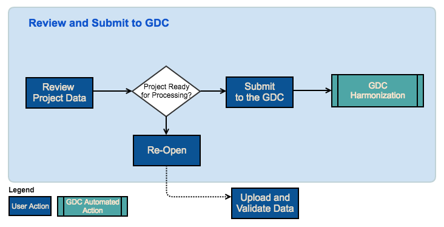

# Getting Started

## The Genomic Data Commons (GDC) Data Submission Portal: An Overview

The National Cancer Institute (NCI) Genomic Data Commons (GDC) Data Submission Portal User's Guide is the companion documentation for the [GDC Data Submission Portal](https://gdc.nci.nih.gov/submit-data/gdc-data-submission-portal) and provides detailed information and instructions for its use.

The GDC Data Submission Portal is a platform allowing researchers to submit and release their data into GDC. The key features of the GDC Data Submission Portal are:

* __Data Submission__: Submission of project data, metadata and associated files to GDC.
* __Release__: Process to release files to the research community.
* __Data Access and Download__: Downloading submitted files to update them for resubmission before their release to the GDC Data Portal.
* __Status and Alerts__: Visual mechanisms to easily identify incomplete submissions.
* __Dictionary Viewer__: Mechanism to view the dictionary attached to a project, allowing a submitter to create valid data for submission.  
* __Annotations__: Addition and retrieval of annotations.
* __Reports__: Access and download submission-related reports to get better insight into the status of submitted data.

# Submission Workflow

The workflow diagram available below details the main features available within GDC Submission Portal and how those could be used in the context of a submission.

## Focus on "Upload and Validate Data"

The Submitter will upload data to the project workspace and validate data against the GDC dictionary. At this point, data is not submitted to GDC yet.

## Focus on "Submit to GDC"

When data in the project workspace is ready for processing, the Submitter or Project Owner will submit data to GDC. It will trigger the GDC Data Harmonization Pipeline.

## Focus on "Release"

When GDC harmonized data is ready and project data is complete, the Project Owner will release the project. It will release harmonized data to the GDC Data Portal.

# Data Submission

The GDC Data Submission Portal supports four types of files for submission:

* __Biospecimen__: Metadata describing a tissue specimen collected from a case and other material derived from samples for analysis.
* __Clinical__: A case’s clinical data.
* __Data Bundle__: GDC's unit of submission (see below).
* __Annotations__: Observations associated with any entity, which can be useful for interpreting the data.

More details about the submission process, data files and file formats can be found on the GDC website at [Data Submission Processes and Tools] (https://gdc.nci.nih.gov/submit-data/data-submission-processes-and-tools) and [Data Types and File Formats] (https://gdc.nci.nih.gov/submit-data/gdc-data-types-and-file-formats).

## Data Bundle

GDC has developed a submission unit called a “data bundle” (a set of files with associated metadata).

Data bundle types are defined by what files are expected and what introspection is done for validation or linking to other GDC entities. Each data bundle will be validated via a bundle type and project specific schema, including a JavaScript Object Notation (JSON) data dictionary, relationship check and molecular data quality check. A biospecimen data bundle, or data bundle that contains biospecimen data, is often the first data that is submitted to GDC. One of the most important data bundle validations is that a biospecimen entity (case, sample, aliquot) referred to by the data bundle must be defined in the data bundle or must have been already been registered in the GDC data model by a previous biospecimen data bundle submission.

The following types of data bundle exists:

| Category | Type | Description |
| --- | --- | --- |
| Clinical|Clinical|XML file containing clinical information|
| Clinical|Pathology diagnosis|Data files containing pathology diagnosis information|
| Biospecimen|Biospecimen|XML file containing biospecimen information|
| Biospecimen|Image Slide|Image file for pathology slide|
| Molecular|Unaligned Reads|Sequencing reads from NGS platforms|
| Molecular|Submitter Aligned Reads|Sequencing reads aligned by submitters|
| Molecular|GDC Aligned Reads|Sequencing reads aligned by GDC workflows|
| Molecular|Variant Calling Results|Genomics variants called by GDC workflows|

Following submission of a data bundle, a manifest can be obtained from the application and used to submit molecular data via the GDC Data Transfer Tool.

## Submission Process

Data submission is the main feature of the GDC Data Submission Portal. Using a submission wizard, submitters are guided through a three-stage submission process:

* __File Upload__: Upload a file into the user's browser, at this point nothing is submitted to GDC.
* __File Validation__: Send the file to GDC backend to validate its content (see below).
* __File Submission__: Submit validated file to GDC and produce a submission report.

The _'File Validation'_ stage acts as a safeguard against submitting incorrect files to the GDC Data Submission Portal. During the validation stage, the GDC API will validate content of submitted files against the project's dictionary to detect potential errors. Invalid files will be flagged and submission to GDC will be denied until corrections are made by the user. A validation error report provided by the system can be used to isolate and correct errors for resubmission.

The GDC Data Submission Portal supports the following file formats for submission:

* JSON
* TSV
* XML

During the submission process, files are converted by the GDC API into entities and inserted into the database, maintaining a file-agnostic backend.

The GDC Data Submission Portal offers the ability to download files in different formats. To do so the system converts database entities back to the requested file format.

# Key Features

## Data Release

To ensure GDC always releases high-quality data, submitted files are not automatically released.

Once cases meet a minimum set of requirements, a submitter can sign-off on those cases via the submission portal. The sign-off will initiate data indexing and harmonization in preparation for a release of the data to the [GDC Data Portal] (https://gdc-dev.nci.nih.gov/access-data/gdc-data-portal).

Minimum requirements for releasing a case vary from one project to another, but must include data from the following three categories:

* Clinical Data: elements such as gender, age, diagnosis, etc. as defined in the GDC dictionary.
* Biospecimen Data: entities such as sample, aliquot etc as defined in the GDC dictionary.
* Molecular Data: at least one type of molecular data, such as, lane level DNA Sequences, as defined in the GDC dictionary.

By using the dictionary viewer, the user can identify minimum fields requirements for each of the three categories listed above.

In general, submitters are requested to release their files within six months from first submission. This guideline is in place in support of GDC's aim to make data available to the community according to the Genomic Data Sharing policies outlined by NCI.

Released cases and/or files can be redacted from GDC. Redaction is performed by GDC administrators, at case level through synchronization with dbGaP, and at file level through submitter's request usually after a data quality issue is identified. The GDC Data Submission Portal itself currently does not support redaction by researchers through the web user interface.

## Data Access and Download

In addition to submitting and releasing files, the GDC Data Submission Portal can also display submitted files and entities through multiple pages and tables.

Along with listing entities, the GDC Data Submission Portal also offers users the ability to download files submitted initially or the latest version of a specific entity (such as case).

## Status and Alerts

Via its Dashboard and navigation panel, the GDC Data Submission Portal displays the number of missing elements to be attached to an entity, such as cases missing clinical data or aliquots missing data bundles.

Displaying all of this on the same page provides a snapshot of the overall submission status of one or more projects.

## Dictionary Viewer

Although all projects are attached to the same data model, custom and project-specific dictionaries are added to extend the data model to the specific vocabulary and data elements of a given project.

To provide users with a better understanding of dictionaries attached to projects, an online dictionary viewer is available within each project. This allows users to adapt their submission files to the project they are submitting to.

## Annotations

The GDC Data Submission Portal supports annotations that can be viewed or submitted through the system.

## Transactions

The user can access a list of all previous submissions by clicking on transactions in the left panel. This will display a list of all past transactions for the selected project. By clicking on a transaction users can access details of this transaction as well as download the submitted files.

Transactions are also displayed on the dashboard via a widget displaying the most recent transactions.

## Reports

The GDC Data Submission Portal provides a broad range of submission oriented reports. Those reports are detailed in the [Data Submission Reports](Reports.md) section of the documentation.

# Access

The GDC Data Submission Portal is accessible using a web browser such as Chrome, Internet Explorer or Firefox at the following URL: [https://gdc-portal.nci.nih.gov/submission/](https://gdc-portal.nci.nih.gov/submission/).
Upon loading the site, the GDC Data Submission Portal login page or Dashboard is displayed.

# Release Notes

The GDC Data Portal is regularly being updated with new features. The [Release Notes](../Release_Notes/index.md) sections of the documentation contains details about new features, bug fixes and known issues.
