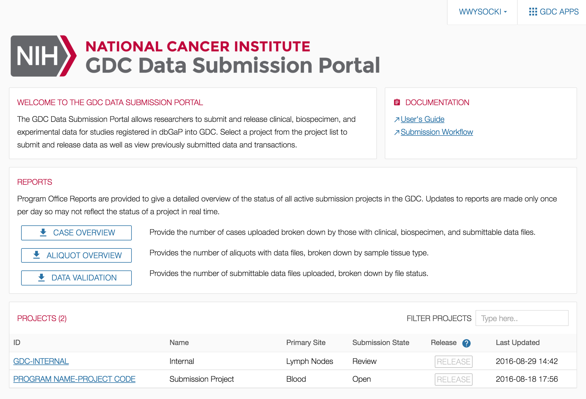

# Homepage

## Overview

After [authentication](Authentication.md), users are redirected to a homepage. The homepage acts as the entry point for GDC data submission and provides submitters with access to a list of authorized projects, reports, and transactions.

Content on the homepage varies based on the user profile (e.g. submitter, program office).

## Reports

Project Summary Reports can be downloaded at the Submission Portal Homepage at three different levels: CASE OVERVIEW, ALIQUOT OVERVIEW, and DATA VALIDATION.  Each report is generated in tab-delimited format in which each row represents an active project.  

* __CASE OVERVIEW:__ This report describes the number of cases with associated biospecimen data, clinical data, or submittable data files (broken down by type) for each project.
* __ALIQUOT OVERVIEW:__ This report describes the number of aliquots in a project with associated data files. Aliquot numbers are broken down by tissue sample type.
* __DATA VALIDATION:__ This report categorizes all submittable data files associated with a project by their file status.

## Projects

The projects section in the homepage lists the projects that the user has access to along with basic information about each. The button used to [release](Submit_Data.md) each project is located on this screen. For users with access to a large number of projects, this table can be filtered with the 'FILTER PROJECTS' field.  

Selecting a project ID will direct the user to the project's [Dashboard](Dashboard.md).
