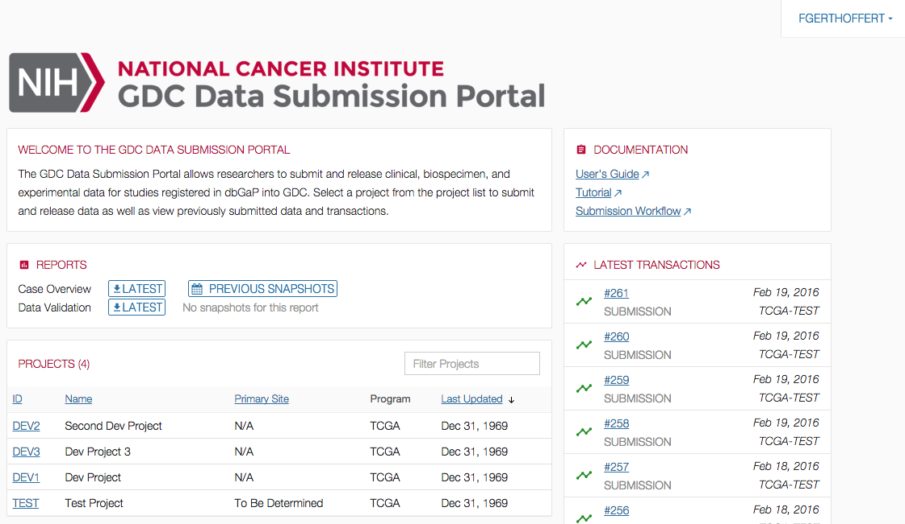

# Homepage

## Overview

After [authentication](Authentication.md), users are redirected to a homepage if the user has access to multiple projects. The homepage acts as the entry point for GDC data submission and provides submitters with access to a list of authorized projects, reports, and transactions.

Content on the homepage varies based on the user profile (e.g. submitter, program office).

If the submitter has access to only one project, then the dashboard for the project will automatically be displayed instead of the homepage.

## Projects

The projects section in the homepage lists the projects that the user has access to along with basic information about each. The button used to [release](Submit_Release.md) each project is located on this screen. For users with access to a large number of projects, this table can be filtered using the 'FILTER PROJECTS' field.  

Selecting a project ID will redirect the user to the [Project's dashboard](Dashboard.md).
