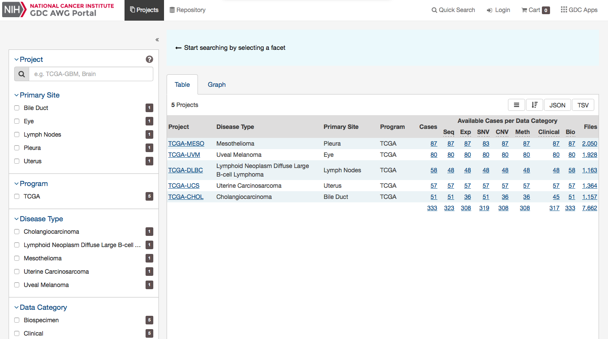
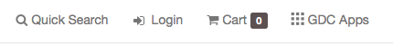
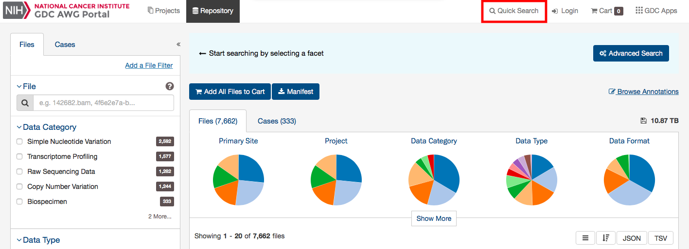
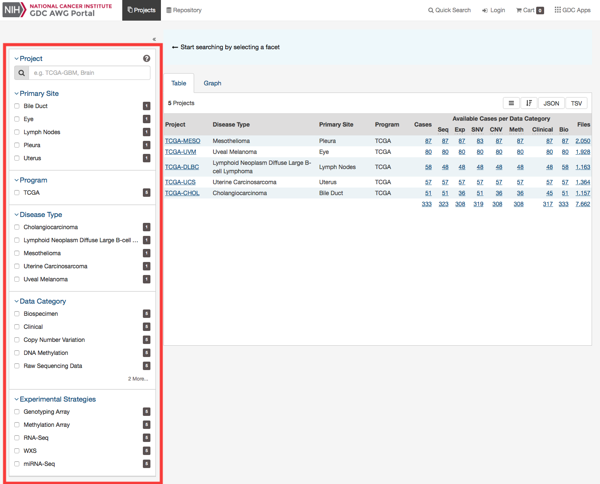
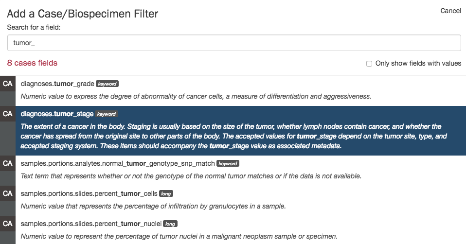
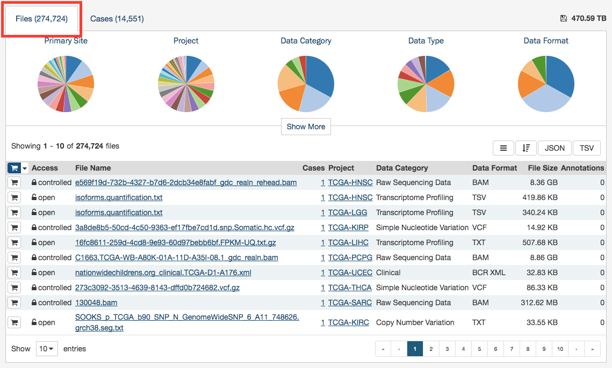
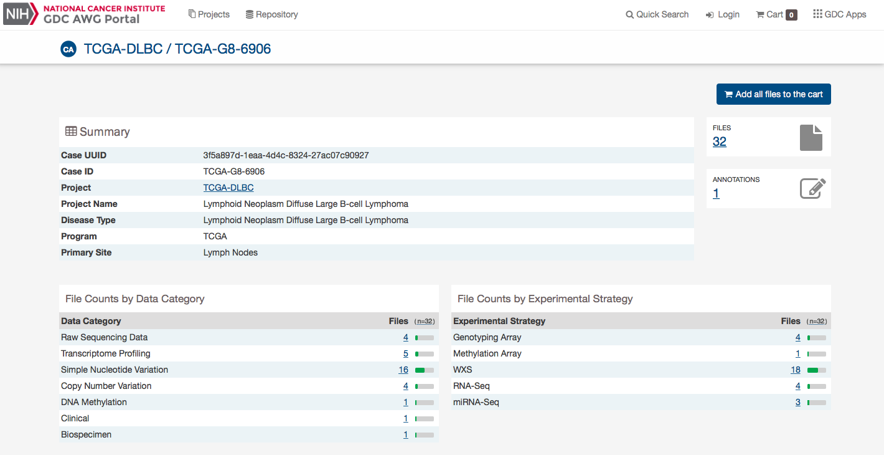
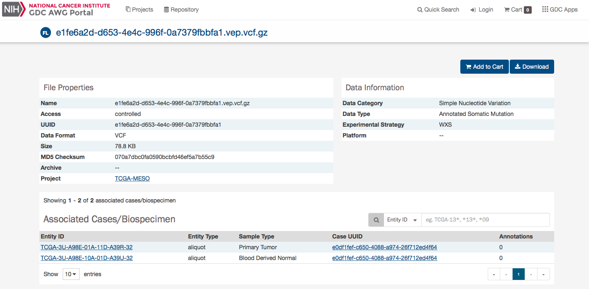
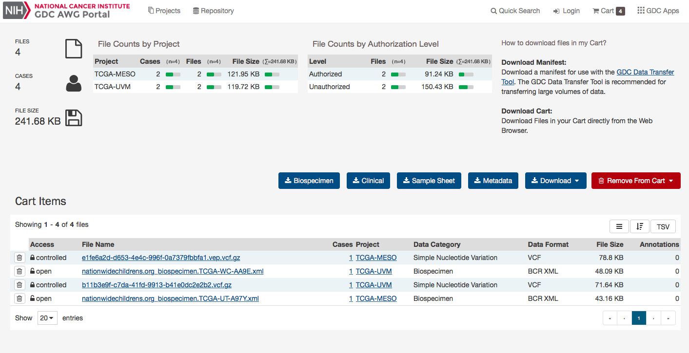

# Pre-Release Data Review


## Getting Started


### The GDC Pre-Release Data Portal: An Overview

The Genomic Data Commons (GDC)  Portal provides users with web-based access to pre-released data from cancer genomics studies that have been harmonized by the GDC, but not yet released in the main GDC Data Portal. Key GDC Pre-Release Data Portal features include:

*   Repository page for browsing data by project / file / case
*   File / case faceted searches to filter data
*   Cart for collecting data files of interest
*   Authentication using eRA Commons credentials for access to controlled data files
*   Secure data download directly from the cart or using the [GDC Data Transfer Tool](https://gdc.cancer.gov/access-data/gdc-data-transfer-tool)
*   Use of API for query and download


## Navigation

### Portal Features

#### Views

The GDC Pre-Release Data Portal provides two main navigation options (*Views*) for browsing available pre-release harmonized datasets:

* __Repository__: The [Repository Page](Pre_Release_QC/#repository) displays data files available for download and provides file/case filters to narrow down a user's search.

[](images/WG_Portal.png "Click to see the full image.")

* __Projects__: The [Projects Page](Pre_Release_QC/#projects) gives an overall summary of project-level information, including the available data for each project.

[](images/WG_Portal.png "Click to see the full image.")

Each view provides a distinct representation of the same underlying set of GDC data and metadata.

#### Toolbar

The toolbar available at the top of all pages in the GDC Pre-Release Data Portal provides convenient navigation links to various pages.

The left portion of this toolbar provides access to the __Projects Page__ and __Repository Page__:

[](images/AWG_Left_Toolbar.png "Click to see the full image.")

The right portion of this toolbar provides access to [quick search](#quick-search), [authentication functions](Pre_Release_QC/#authentication), the [cart](Pre_Release_QC/#cart-and-file-download), and the GDC Apps menu:

[](images/AWG_Right_Toolbar.png "Click to see the full image.")

The GDC Apps menu provides links to all resources provided by the GDC.

[](images/gdc-data-portal-gdc-apps.png "Click to see the full image.")

#### Tables

Tabular listings are the primary method of representing available data in the GDC Pre-Release Data Portal. Tables are available in all views and in the file cart. Users can customize each table by specifying columns, size, and sorting.

##### Table Sort

The *sort table* button is available in the top right corner of each table. To sort by a column, place a checkmark next to it and select the preferred sort direction. If multiple columns columns are selected for sorting, data is sorted column-by-column in the order that columns appear in the sort menu: the topmost selected column becomes the primary sorting parameter; the selected column below it is used for secondary sort, etc.

[](images/gdc-data-portal-table-sort.png "Click to see the full image.")

##### Table Arrangement

The *arrange columns* button allows users to adjust the order of columns in the table and select which columns are displayed.


##### Table Size

Table size can be adjusted using the menu in the bottom left corner of the table. The menu sets the maximum number of rows to display. If the number of entries to be displayed exceeds the maximum number of rows, then the table will be paginated, and navigation buttons will be provided in the bottom right corner of the table to navigate between pages.


##### Table Export

In the Repository, Projects, and Annotations views, tables can be exported in either a JSON or TSV format. The `JSON` button will export the entire table's contents into a JSON file.  The `TSV` button will export the current view of the table into a TSV file.

[](images/gdc-data-portal-table-export.png "Click to see the full image.")


#### Filtering and Searching

The GDC Pre-Release Data Portal offers two different means of searching and filtering the available data: facet filters and quick search.

##### Facet Filters

Facets on the left of each view (Projects and Repository) represent properties of the data that can be used for filtering. Some of the available facets are project name, disease type, patient gender and age at diagnosis, and various data formats and categories. Each facet displays the name of the data property, the available values, and numbers of matching entities for each value (files, cases, annotations, or projects, depending on the context).

Below are two file facets available in the Repository view. A _Data Type_ facet filter is applied, filtering for "Aligned Reads" files.


Multiple selections within a facet are treated as an "OR" query: e.g. "Aligned Reads" OR "Annotated Somatic Mutation". Selections in different facets are treated as "AND" queries: e.g. Data Type: "Aligned Reads" AND Experimental Strategy: "RNA-Seq".

The information displayed in each facet reflects this: in the example above, marking the "Aligned Reads" checkbox does not change the numbers or the available values in the _Data Type_ facet where the checkbox is found, but it does change the values available in the _Experimental Strategy_ facet. The _Experimental Strategy_ facet now displays only values from files of _Data Type_ "Aligned Reads".

Custom facet filters can be added in [Repository View](Pre_Release_QC/#repository) to expand the GDC Pre-Release Data Portal's filtering capabilities.

##### Quick Search

The quick search feature allows users to find cases or files using a search query (i.e. UUID, filename, project name, id, disease type or primary site). Quick search is available by clicking on the magnifier in the right section of the toolbar (which appears on every page) or by using the search bar on the Home Page.

[](images/AWG_Quick_Search.png "Click to see the full image.")

Search results are displayed as the user is typing, with labels indicating the type of each search result in the list (project, case, or file). Users users will see a brief description of the search results, which may include the UUID, submitter ID, or file name. Clicking on a selected result or pressing enter will open a detail page with additional information.


### Projects

#### Summary
At a high level, data in the Genomic Data Commons is organized by project. Typically, a project is a specific effort to look at particular type(s) of cancer undertaken as part of a larger cancer research program. The GDC Pre-Release Data Portal allows users to access aggregate project-level information via the Projects Page and Project Summary pages.

#### Projects Page

The Projects Page provides an overview of all harmonized data available in the Genomic Data Commons, organized by project. It also provides filtering, navigation, and advanced visualization features that allow users to identify and browse projects of interest. Users can access Projects from the Data Portal toolbar, or directly at [https://portal.Pre-Release Data.gdc.cancer.gov/projects](https://portal.Pre-Release Data.gdc.cancer.gov/projects).

On the left, a panel of facets allow users to apply filters to find projects of interest. When facet filters are applied, the table and visualizations on the right are updated to display only the matching projects. When no filters are applied, all projects are displayed.

The right side of this page displays a table that contains a list of projects and select details about each project, such as the number of cases and data files. The Graph tab provides a visual representation of this information.

[](images/AWG_Projects.png "Click to see the full image.")

##### Projects Table

The `Table` tab lists projects by Project ID and provides additional information about each project. If no facet filters have been applied, the table will display all available projects; otherwise it will display only those projects that match the selected criteria.

[](images/AWG_Projects_Table.png "Click to see the full image.")

The table provides links to Project Summary pages in the Project ID column. Columns with file and case counts include links to open the corresponding files or cases in [Repository Page](Pre_Release_QC/#repository).

##### Projects Graph

The `Graph` tab contains an interactive view of information in the Table tab. The numerical values in Case Count, File Count, and File Size columns are represented by bars of varying length according to size. These columns are sorted independently in descending order. Mousing over an element of the graph connects it to associated elements in other columns, including Project ID and Primary Site

[](images/gdc-table-graph-mouse-over.png "Click to see the full image.")

Most elements in the graph are clickable, allowing the user to open the associated cases or files in [Repository Page](Pre_Release_QC/#repository).

Like the projects table, the graph will reflect any applied facet filters.

##### Facets Panel

Facets represent properties of the data that can be used for filtering. The facets panel on the left allows users to filter the projects presented in the Table and Graph tabs as well as visualizations.

[](images/AWG_Projects_Facets.png "Click to see the full image.")

Users can filter by the following facets:

*   __Project__: Individual project ID
*   __Primary Site__: Anatomical site of the cancer under investigation or review
*   __Program__: Research program that the project is part of
*   __Disease Type__: Type of cancer studied
*   __Data Category__: Type of data available in the project
*   __Experimental Strategy__: Experimental strategies used for molecular characterization of the cancer

Filters can be applied by selecting values of interest in the available facets, for example "WXS" and "RNA-Seq" in the "Experimental Strategy" facet and "Brain" in the "Primary Site" facet. When facet filters are applied, the Table and Graph tabs are updated to display matching projects, and the banner above the tabs  summarizes the applied filters. The banner allows the user to click on filter elements to remove the associated filters, and includes a link to view the matching cases and files.

[](images/panel-with-applied-filters.png "Click to see the full image.")

For information on how to use facet filters, see [Getting Started](Pre_Release_QC/#facet-filters).

#### Project Summary Page

Each project has a summary page that provides an overview of all available cases, files, and annotations available. Clicking on the numbers in the summary table will display the corresponding data.

[](images/gdc-project-entity-page_v2.png "Click to see the full image.")

Three download buttons in the top right corner of the screen allow the user to download the entire project dataset, along with the associated project metadata:

* __Download Biospecimen__: Downloads biospecimen metadata associated with all cases in the project in either TSV or JSON format.
* __Download Clinical__: Downloads clinical metadata about all cases in the project in either TSV or JSON format.
* __Download Manifest__: Downloads a manifest for all data files available in the project. The manifest can be used with the GDC Data Transfer Tool to download the files.

### Repository

#### Summary

The Repository Page is the primary method of accessing data in the GDC Pre-Release Data Portal. It provides an overview of all cases and files and offers users a variety of filters for identifying and browsing cases and files of interest. Users can access the Repository Page from the Data Portal toolbar or directly at [https://portal.Pre-Release Data.gdc.cancer.gov/repository](https://portal.Pre-Release Data.gdc.cancer.gov/repository).

#### Filters / Facets
On the left, a panel of data facets allows users to filter cases and files using a variety of criteria. If facet filters are applied, the tabs on the right will display information about matching cases and files. If no filters are applied, the tabs on the right will display information about all available data.

On the right, two tabs contain information about available data:

* *`Files` tab* provides a list of files, select information about each file, and links to individual file detail pages.
* *`Cases` tab* provides a list of cases, select information about each case, and links to individual case summary pages

The banner above the tabs on the right displays any active facet filters and provides access to advanced search.

The top of the Repository Page contains a few summary pie charts for Primary Sites, Projects, Disease Type, Gender, and Vital Status.  These reflect all available data or, if facet filters are applied, only the data that matches the filters. Clicking on a specific slice in a pie chart, or on a number in a table, applies corresponding facet filters.

[](images/AWG_Portal.png "Click to see the full image.")

##### Facets Panel

Facets represent properties of the data that can be used for filtering. The facets panel on the left allows users to filter the cases and files presented in the tabs on the right.

The facets panel is divided into two tabs, with the Files tab containing facets pertaining to data files and experimental strategies, while the Cases tab containing facets pertaining to the cases and biospecimen information. Users can apply filters in both tabs simultaneously. The applied filters will be displayed in the banner above the tabs on the right.

The [Getting Started](Pre_Release_QC/#facet-filters) section provides instructions on using facet filters. In the following example, a filter from the Cases tab ("primary site") and filters from the Files tab ("data category", "experimental strategy") are both applied:

[](images/data-view-with-facet-filters-applied.png "Click to see the full image.")

The default set of facets is listed below.

*Files* facets tab:

* __File__: Specify individual files using filename or UUID.
* __Data Category__: A high-level data file category, such as "Raw Sequencing Data" or "Transcriptome Profiling".
* __Data Type__: Data file type, such as "Aligned Reads" or "Gene Expression Quantification". Data Type is more granular than Data Category.
* __Experimental Strategy__: Experimental strategies used for molecular characterization of the cancer.
* __Workflow Type__: Bioinformatics workflow used to generate or harmonize the data file.
* __Data Format__: Format of the data file.
* __Platform__: Technological platform on which experimental data was produced.
* __Access Level__: Indicator of whether access to the data file is open or controlled.

*Cases* facets tab:

* __Case__: Specify individual cases using submitter ID (barcode) or UUID.
* __Case Submitter ID Prefix__: Search for cases using a part (prefix) of the submitter ID (barcode).
* __Primary Site__: Anatomical site of the cancer under investigation or review.
* __Cancer Program__: A cancer research program, typically consisting of multiple focused projects.
* __Project__: A cancer research project, typically part of a larger cancer research program.
* __Disease Type__: Type of cancer studied.
* __Gender__: Gender of the patient.
* __Age at Diagnosis__: Patient age at the time of diagnosis.
* __Vital Status__: Indicator of whether the patient was living or deceased at the date of last contact.
* __Days to Death__: Number of days from date of diagnosis to death of the patient.
* __Race__: Race of the patient.
* __Ethnicity__: Ethnicity of the patient.

##### Adding Custom Facets

The Repository Page provides access to additional data facets beyond those listed above. Facets corresponding to additional properties listed in the [GDC Data Dictionary](../../Data_Dictionary/index.md) can be added using the "add a filter" links available at the top of the Cases and Files facet tabs:

[](images/gdc-data-portal-data-add-facet.png "Click to see the full image.")

The links open a search window that allows the user to find an additional facet by name or description. Not all facets have values available for filtering; checking the "Only show fields with values" checkbox will limit the search results to only those that do. Selecting a facet from the list of search results below the search box will add it to the facets panel.

[](images/gdc-data-portal-data-facet-search.png "Click to see the full image.")

Newly added facets will show up at the top of the facets panel and can be removed individually by clicking on the red cross to the right of the facet name. The default set of facets can be restored by clicking "Reset".

[](images/gdc-data-portal-data-facet-tumor_stage.png "Click to see the full image.")
#### Results

##### Files List

The Files tab on the right provides a list of available files and select information about each file. If facet filters are applied, the list includes only matching files. Otherwise, the list includes all data files available in the GDC Pre-Release Data Portal.

[](images/gdc-data-portal-data-files.png "Click to see the full image.")

The *File Name* column includes links to [file detail pages](#file-detail-page) where the user can learn more about each file.

Users can add individual file(s) to the file cart using the cart button next to each file. Alternatively, all files that match the current facet filters can be added to the cart using the menu in the top left corner of the table:

[](images/gdc-data-portal-data-files-add-cart.png "Click to see the full image.")

##### Cases List

The Cases tab on the right provides a list of available cases and select information about each case. If facet filters are applied, the list includes only matching cases. Otherwise, the list includes all cases available in the GDC Pre-Release Data Portal.

[](images/gdc-data-portal-data-cases_v2.png "Click to see the full image.")

The list includes links to [case summary pages](#case-summary-page) in the *Case UUID* column, the Submitter ID (i.e. TCGA Barcode), and counts of the available file types for each case. Clicking on a count will apply facet filters to display the corresponding files.

The list also includes a shopping cart button, allowing the user to add all files associated with a case to the file cart for downloading at a later time:

[](images/gdc-data-portal-data-case-add-cart.png "Click to see the full image.")

#### Case Summary Page

The Case Summary page displays case details including the project and disease information, data files that are available for that case, and the experimental strategies employed. A button in the top-right corner of the page allows the user to add all files associated with the case to the file cart.

[](images/AWG_Case_Summary.png "Click to see the full image.")

##### Clinical and Biospecimen Information

The page also provides clinical and biospecimen information about that case. Links to export clinical and biospecimen information in JSON format are provided.

[](images/gdc-case-clinical-biospecimen_v3.png "Click to see the full image.")

For clinical records that support multiple records of the same type (Diagnoses, Family Histories, or Exposures), a UUID of the record is provided on the left hand side of the corresponding tab, allowing the user to select the entry of interest.

##### Biospecimen Search

A search filter just below the biospecimen section can be used to find and filter biospecimen data. The wildcard search will highlight entities in the tree that match the characters typed. This will search both the case submitter ID, as well as the additional metadata for each entity. For example, searching 'Primary Tumor' will highlight samples that match that type.

[](images/gdc-case-biospecimen-search_v2.png "Click to see the full image.")

#### File Summary Page

The File Summary page provides information a data file, including file properties like size, md5 checksum, and data format; information on the type of data included; links to the associated case and biospecimen; and information about how the data file was generated or processed.

The page also includes buttons to download the file, add it to the file cart, or (for BAM files) utilize the BAM slicing function.

[](images/AWG_File_Summary.png "Click to see the full image.")

In the lower section of the screen, the following tables provide more details about the file and its characteristics:

* __Associated Cases / Biospecimen__: List of Cases or biospecimen the file is directly attached to.
* __Analysis and Reference Genome__: Information on the workflow and reference genome used for file generation.
* __Read Groups__: Information on the read groups associated with the file.
* __Metadata Files__: Experiment metadata, run metadata and analysis metadata associated with the file
* __Downstream Analysis Files__: List of downstream analysis files generated by the file

[](images/AWG_File_Details.png "Click to see the full image.")

##### BAM Slicing

BAM file detail pages have a "BAM Slicing" button. This function allows the user to specify a region of a BAM file for download. Clicking on it will open the BAM slicing window:

[](images/gdc-data-portal-bam-slicing.png "Click to see the full image.")

During preparation of the slice, the icon on the BAM Slicing button will be spinning, and the file will be offered for download to the user as soon as ready.

### Cart and File Download

#### Overview

While browsing the GDC Pre-Release Data Portal, files can either be downloaded individually from [file detail pages](Pre_Release_QC/#file-summary-page) or collected in the file cart to be downloaded as a bundle.  Clicking on the shopping cart icon that is next to any item in the GDC will add the item to your cart.

#### GDC Cart

[](images/AWG_Cart.png "Click to see the full image.")

##### Cart Summary

The cart page shows a summary of all files currently in the cart:

* Number of files
* Number of cases associated with the files
* Total file size

The Cart page also displays two tables:

* __File count by project__: Breaks down the files and cases by each project
* __File count by authorization level__: Breaks down the files in the cart by authorization level.  A user must be logged into the GDC in order to download 'Controlled-Access files'

The cart also directs users how to download files in the cart.  For large data files, it is recommended that the GDC Data Transfer Tool be used.

##### Cart Items

[](images/gdc-cart-items_v2.png "Click to see the full image.")

The Cart Items table shows the list of all the files that were added to the Cart.  The table gives the folowing information for each file in the cart:

* __Access__: Displays whether the file is open or controlled access.  Users must login to the GDC Portal and have the appropriate credentials to access these files.
* __File Name__: Name of the file.  Clicking the link will bring the user to the file summary page.
* __Cases__: How many cases does the file contain.  Clicking the link will bring the user to the case summary page.
* __Project__: The Project that the file belongs to.  Clicking the link will bring the user to the Project summary page.
* __Category__: Type of data
* __Format__: The file format
* __Size__: The size of the file
* __Annotations__: Whether there are any annotations

#### Download Options

[](images/gdc-download-options_v2.png "Click to see the full image.")

There are a few buttons on the Cart page that allow users to download files.  The following download options are available:

* __Biospecimen__: Downloads bioscpecimen data related to files in the cart in either TSV or JSON format.
* __Clinical__: Downloads clinical data related to files in the cart in either TSV or JSON format.
* __Sample Sheet__: Downloads a tab-separated file which contains the associated case/sample IDs and sample type for each file in the cart.
* __Metadata__: GDC harmonized clinical, biospecimen, and file metadata associated with the files in the cart.
* __Download Manifest__: Download a manifest file for use with the GDC Data Transfer Tool to download files.  A manifest file contains a list of the UUIDs that correspond to the files in the cart.
* __Download Cart__: Download the files in the Cart directly through the browser. Users have to be cautious of the amount of data in the cart since this option will not optimize bandwidth and will not provide resume capabilities.
* __SRA XML, MAGE-TAB__: This option is available in the GDC Legacy Archive only. It is used to download metadata files associated with the files in the cart.

The cart allows users to download up to 5 GB of data directly through the web browser. This is not recommended for downloading large volumes of data, in particular due to the absence of a retry/resume mechanism. For downloads over 5 GB we recommend using the GDC Data Transfer Tool.

__Note__: when downloading multiple files from the cart, they are automatically bundled into one single Gzipped (.tar.gz) file.

##### GDC Data Transfer Tool

The `Download Manifest` button will download a manifest file that can be imported into the GDC Data Transfer Tool.   Below is an example of the contents of a manifest file used for download:

```manifest
id	filename	md5	size	state
4ea9c657-8f85-44d0-9a77-ad59cced8973	mdanderson.org_ESCA.MDA_RPPA_Core.mage-tab.1.1.0.tar.gz		2516051	live
b8342cd5-330e-440b-b53a-1112341d87db	mdanderson.org_SARC.MDA_RPPA_Core.mage-tab.1.1.0.tar.gz		4523632	live
c57673ac-998a-4a50-a12b-4cac5dc3b72e	mdanderson.org_KIRP.MDA_RPPA_Core.mage-tab.1.2.0.tar.gz		4195746	live
3f22dd8d-59c8-43a4-89cf-3b595f2e5a06	14-3-3_beta-R-V_GBL1112940.tif	56df0e4b4fc092fc3643bd2e316ac05b	6257840	live
7ce05059-9197-4d38-830f-04356f5f851a	14-3-3_beta-R-V_GBL11066140.tif	6abfee483974bc2e61a37b5499ae9a07	6261580	live
8e00d22a-ca6f-4da8-a1c3-f23144cb21b7	14-3-3_beta-R-V_GBL1112940.tif	56df0e4b4fc092fc3643bd2e316ac05b	6257840	live
96487cd7-8fa8-4bee-9863-17004a70b2e9	14-3-3_beta-R-V_GBL1112940.tif	56df0e4b4fc092fc3643bd2e316ac05b	6257840	live
```

The Manifest contains a list of the file UUIDs in the cart and can be used together with the GDC Data Transfer Tool to download all files.

Information on the GDC Data Transfer Tool is available in the [GDC Data Transfer Tool User's Guide](/node/8196/).

##### Individual Files Download

Similar to the files page, each row contains a download button to download a particular file individually.

#### Controlled Files

If a user tries to download a cart containing controlled files and without being authenticated, a pop-up will be displayed to offer the user either to download only open access files or to login into the GDC Pre-Release Data Portal through eRA Commons. See [Authentication](Authentication.md) for details.

[](images/gdc-data-portal-download-cart.png "Click to see the full image.")

### Annotations

Annotations are notes added to individual cases, samples or files.

#### Annotations View

The Annotations View provides an overview of the available annotations and allows users to browse and filter the annotations based on a number of annotation properties (facets), such as the type of entity the annotation is attached to or the annotation category.

The view presents a list of annotations in tabular format on the right, and a facet panel on the left that allows users to filter the annotations displayed in the table. If facet filters are applied, the tabs on the right will display only the matching annotations. If no filters are applied, the tabs on the right will display information about all available data.

Clicking on an annotation ID in the annotations list will take the user to the [Annotation Detail Page](#annotation-detail-page).

[](images/gdc-data-portal-annotations.png "Click to see the full image.")

##### Facets Panel

The following facets are available to search for annotations:

* __Annotation ID__: Seach using annotation ID
* __Entity ID__: Seach using entity ID
* __Case UUID__: Seach using case UUID
* __Primary Site__: Anatomical site of the cancer
* __Project__: A cancer research project, typically part of a larger cancer research program
* __Entity Type__: The type of entity the annotation is associated with: Patient, Sample, Portion, Slide, Analyte, Aliquot
* __Annotation Category__: Search by annotation category.
* __Annotation Created__: Search for annotations by date of creation.
* __Annotation Classification__: Search by annotation classification.

###### Annotation Categories and Classification

For more details about categories and classifications please refer to the [TCGA Annotations page on NCI Wiki](https://wiki.nci.nih.gov/display/TCGA/Introduction+to+Annotations).

#### Annotation Detail Page

The annotation entity page provides more details about a specific annotation. It is available by clicking on an annotation ID in Annotations View.

[](images/annotations-entity-page.png "Click to see the full image.")

## Authentication

### Overview

The GDC Pre-Release Data Portal provides access to datasets prior to release to a group of users specified by the submitter.  This area is only available to data submitters for reviewing pre-release data. User must be granted access as specified in the admin section and also have downloader access within dbGaP for the specified project.

### GDC Authentication Tokens

The GDC Pre-Release Data Portal provides authentication tokens for use with the GDC Data Transfer Tool or the GDC API. To download a token:

1. Log into the GDC using your eRA Commons credentials
2. Click the username in the top right corner of the screen
3. Select the "Download token" option


A new token is generated each time the `Download Token` button is clicked.

For more information about authentication tokens, see [Data Security](../../Data/Data_Security/Data_Security.md#authentication-tokens).

**NOTE:** The authentication token should be kept in a secure location, as it allows access to all data accessible by the associated user account.

### Logging Out

To log out of the GDC, click the username in the top right corner of the screen, and select the Logout option.


## GDC Pre-Release Data Admin Portal

### Overview

The GDC Pre-Release Data Admin Portal allows Pre-Release Data Portal admins to create and maintain Pre-Release Data Groups and associated projects, as well as grant appropriate access to users within these groups.

[](images/AWG_Admin.png "Click to see the full image.")

The Pre-Release Data Admin Portal is broken into two views on the left-most panel:

* __Users__: Allows admin to create, view, edit Pre-Release Data Portal user profiles
* __Groups__: Allows admin to manage groups projects / users

#### Definitions

| Entity | Definition |
|---|---|
| __User__  | An individual with an eRA Commons account. |
| __Project__  | A  collection of files and observations that are contained in the GDC database and have been registered in dbGAP as a project. Only certain projects are designated as Pre-Release Data projects.|
| __Group__  | A collection of users and projects.  When a user is assigned to a group, they will have access to the projects in that group when they login to the Pre-Release Data portal as long as they have downloader access to the project in dbGaP.|

### Users

The __Users__ section of the GDC Pre-Release Data Admin portal allows admins to manage and create Pre-Release Data users.

[](images/AWG_Admin.png "Click to see the full image.")

#### Creating Users

To create a new user in the Pre-Release Data Admin Portal, click on the `Create` button on the far right panel.

[](images/AWG_Admin_Create_User.png "Click to see the full image.")

Then the following information must be supplied, before clicking the `Save` button:

* __eRA Commons ID__: The eRA Commons ID of the user to be added
* __Role__: Choose between `Admin` or `User` roles
* __Group (Optional)__: Choose existing groups to add the user to

After clicking `Save`, the user should appear in the list of users in the center panel.  Also clicking on the user in the list will display information about that user and gives the options to `Edit` the user profile, or `Delete` the user.

[](images/AWG_Admin_New_User.png "Click to see the full image.")

### Groups

The __Groups__ section of the GDC Pre-Release Data Admin portal allows admins to manage and create groups for which users and projects may be added.

[](images/AWG_Admin_Group.png "Click to see the full image.")

#### Creating Groups

To create a new group in the Pre-Release Data Admin Portal, click on the `Create` button on the far right panel.

[](images/AWG_Admin_Groups_Add.png "Click to see the full image.")

Then the following information must be supplied, before clicking the `Save` button:

* __Name__: The name of the group
* __Description__: The description of the group
* __Users (Optional)__: Choose existing users to add to the group
* __Projects(Optional)__: Choose existing projects to add to the group

After clicking `Save`, the group should appear in the list of groups in the center panel.  Also clicking on the group in the list will display information about that group and gives the options to `Edit` or `Delete` the group.

[](images/AWG_Admin_New_Group.png "Click to see the full image.")

## API

API functionality is similar to what is available for the main GDC Data Portal.  You can read more about this in the [API section](API/Users_Guide/Getting_Started/).  Important differences include the following:

*  The base URL is different. Always user https://api-awg.cancer.gov
*  A authorization token must always be passed with every query
