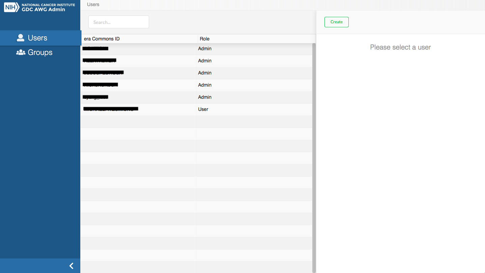
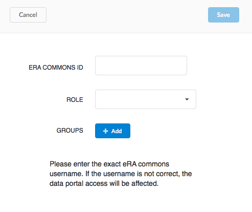
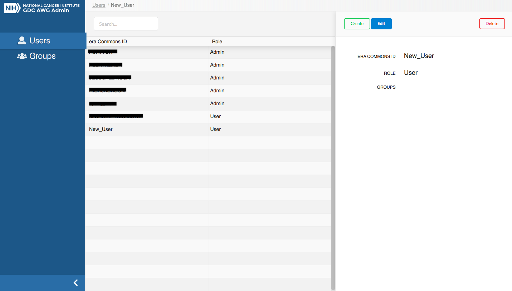
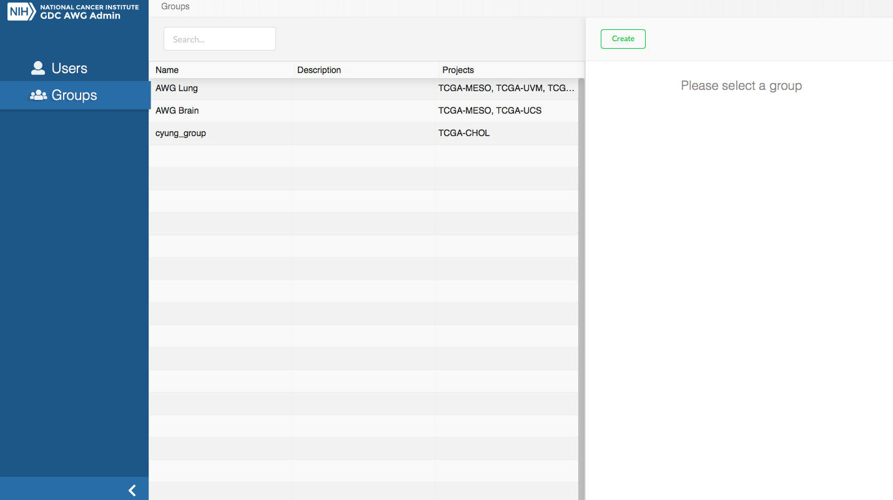
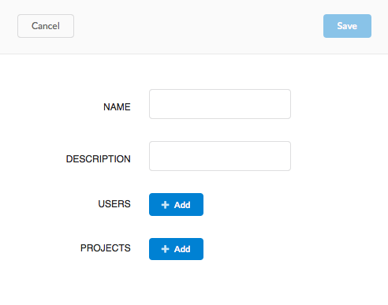
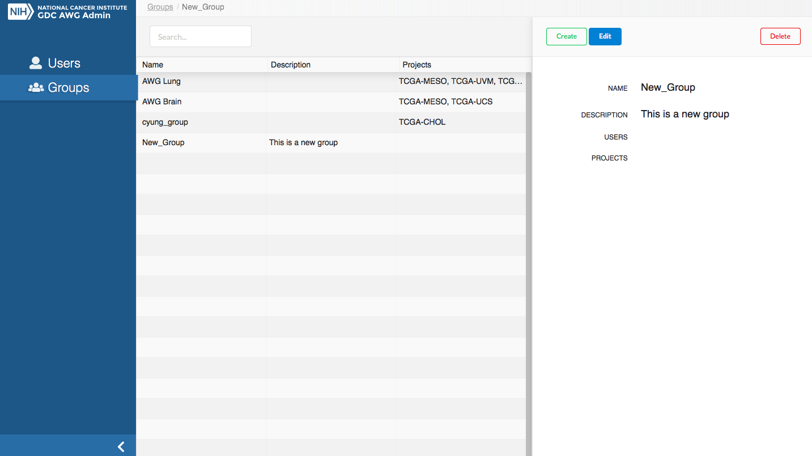

# Pre-Release Data Portal

The GDC Pre-Release Data Portal provides users with web-based access to pre-released data from cancer genomics studies that have been harmonized by the GDC, but not yet released in the main GDC Data Portal.

## Navigation

Pre-Release Data Portal will appear similar to the GDC Active Portal, but the Pre-Release Data Portal features are a subset of what can be found in the GDC Data Portal.

For more information on any of these general features please review the [GDC Data Portal User Guide](/Data_Portal/Users_Guide/Getting_Started/#navigation).

## Authentication

### Relationship between GDC Data Portal and Pre-Release Data Portal Tokens

The GDC Pre-Release Data Portal provides access to datasets prior to release to a group of users specified by the data submitter.  This area is only available to data submitters (or their designees) for reviewing pre-release data.  Users must be granted access as specified in the GDC Pre-Release Data Admin Portal section and have downloader access within dbGaP for the specified project. To learn more about obtaining the required credentials and authorization, see [Obtaining Access to Submit Data]( https://gdc.cancer.gov/submit-data/obtaining-access-submit-data).

The tokens used to download files from the GDC Data Portal and Pre-Release Data Portal are related but distinct. Specifically, the token generated in the Pre-Release Data Portal contains a longer version of the regular GDC Authentication Token downloaded from the GDC Data Portal. Because of this, the GDC Data Portal token will not function for downloading data from the Pre-release Data Portal environment using the Data Transfer Tool or API. However, the Pre-Release Data Portal token will function for downloading data from the GDC Data Portal using the API or Data Transfer Tool. Finally, if a new token is generated in the Pre-release Data Portal this will invalidate the token downloaded from the GDC Data Portal and vice versa.  

## Data Transfer Tool

As with the GDC Data Portal, downloads of large or numerous files is best performed using the GDC Data Transfer Tool.  Information on the GDC Data Transfer Tool is available in the [GDC Data Transfer Tool User's Guide](https://docs.gdc.cancer.gov/Data_Transfer_Tool/Users_Guide/Getting_Started/).  An important distinction for use with the Pre-Release Data Portal is that it must always be used with a token and with the option `-s https://api.awg.gdc.cancer.gov`.

## GDC Pre-Release Data Admin Portal

The GDC Pre-Release Data Admin Portal allows admins to create and maintain Pre-Release Data Groups and associated projects, as well as grant appropriate access to users within these groups. To gain access to the Pre-Release Data Admin Portal please contact the GDC Helpdesk (support@nci-gdc.datacommons.io).

The Pre-Release Data Admin Portal is broken into two views on the left-most panel:

* __Users__: Allows admin to create, view, edit Pre-Release Data Portal user profiles.
* __Groups__: Allows admin to manage groups projects / users.

#### Definitions

| Entity | Definition |
|---|---|
| __User__  | An individual with an eRA Commons account. |
| __Project__  | A collection of files and observations that are contained in the GDC database and have been registered in dbGaP as a project. Only certain projects are designated as Pre-Release Data projects.|
| __Group__  | A collection of users and projects.  When a user is assigned to a group, they will have access to the projects in that group when they login to the Pre-Release Data portal as long as they have downloader access to the project in dbGaP.|

### Users

The __Users__ section of the GDC Pre-Release Data Admin portal allows admins to manage and create Pre-Release Data users.

#### Creating Users

To create a new user in the Pre-Release Data Admin Portal, click on the `Create` button on the far-right panel.

Then the following information must be supplied, before clicking the `Save` button:

* __eRA Commons ID__: The eRA Commons ID of the user to be added.
* __Role__: Choose between `Admin` or `User` roles.
* __Group (Optional)__: Choose existing groups to add the user to.

After clicking `Save`, the user should appear in the list of users in the center panel.  Also clicking on the user in the list will display information about that user and gives the options to `Edit` the user profile, or `Delete` the user.

### Groups

The __Groups__ section of the GDC Pre-Release Data Admin portal allows admins to manage and create groups for which users and projects may be added.

#### Creating Groups

To create a new group in the Pre-Release Data Admin Portal, click on the `Create` button on the far-right panel.

Then the following information must be supplied, before clicking the `Save` button:

* __Name__: The name of the group.
* __Description__: The description of the group.
* __Users (Optional)__: Choose existing users to add to the group.
* __Projects(Optional)__: Choose existing projects to add to the group.

After clicking `Save`, the group should appear in the list of groups in the center panel.  Also clicking on the group in the list will display information about that group and gives the options to `Edit` or `Delete` the group.

## AWG API

API functionality is similar to what is available for the main GDC Data Portal.  You can read more about the GDC API in general in the [API User Guide](/API/Users_Guide/Getting_Started/).  Important differences for the Analysis Working Group (AWG) API include the following:

*  The base URL is different. Instead use https://api.awg.gdc.cancer.gov/
*  An authorization token must always be passed with every query rather than just for downloading controlled access data.
