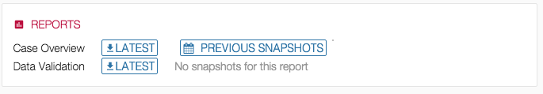

## Overview

GDC Data Submission Portal provides access to different reports listed below. Access to those reports is granted to users based on their project permissions.

[](images/GDC_Submission_Reports.png "Click to see the full image.")

## Case Overview Report

Generated daily, this report provides an overview of all cases in one or more projects.

[](images/GDC_Submission_Reports_Case_Overview.png "Click to see the full image.")

It can be downloaded in TSV format and previous version of the report are available to the user for comparison purposes.

```tsv
Program	Project	dbGaP Study ID	## Cases Released	## Cases Unreleased	## Cases Expected	Date Expected for Release	Initial Upload Date	Project Last Update Date	## Cases Registered in dbGaP	## Cases with Clinical	## Cases with Sample	## Cases with Aliquot	## Cases with Portion	## Cases with Analyte	## Cases with WGS Data	## Cases with WXS Data	## Cases with RNA-Seq Data	## Cases with ChIP-Seq Data	## Cases with MiRNA-Seq Data	## Cases with Bisulfite-Seq Data	## Cases with Validation Data	## Cases with Amplicon Data	## Cases with Other Data
TCGA	TEST	TEST	256	0	Not Available	Not Available	2015-11-10 10:40:15.689597-06:00	2015-11-10 10:40:15.689597-06:00	256	0	11	10	10	10	0	4	0	0	0	0	0	0	0
TCGA	DEV1	phs000178	1	15	Not Available	Not Available	2015-11-18 09:27:36.990449-06:00	2015-11-18 09:27:36.990449-06:00	16	0	16	16	16	16	0	0	0	0	0	0	0	0	0
TCGA	DEV2	phs000178	1	7	Not Available	Not Available	2015-11-17 20:14:02.194718-06:00	2015-11-17 20:14:02.194718-06:00	8	0	8	8	0	0	0	0	0	0	0	0	0	0	0
TCGA	DEV3	phs000178	64	0	Not Available	Not Available	2015-12-11 15:41:29.760763-06:00	2015-12-11 15:41:29.760763-06:00	64	0	25	25	0	0	0	2	0	0	0	0	0	0	0
```

## Data Validation Report

The Data Validation Report provides a live view of quality metrics coming from data validation executed on the back-end.

The report can be downloaded in TSV format.

[](images/GDC_Submission_Reports_Data_Validation.png "Click to see the full image.")

```tsv
program	project	dbgap_accession_number	fileFormatFail	fileSizeFail	filesValidated	md5sumFail
TCGA	DEV1		0	0	0	0
TCGA	DEV2		0	0	2	0
TCGA	DEV3		0	0	1	0
TCGA	TEST	TEST	0	2	0	0
```

## Scientific Pre-alignment QC Report

This report shows the files in the data bundle on which GDC will perform harmonization as well as QC information on the submitted unaligned BAM/FASTQ files. Each unaligned BAM/FASTQ will link to the QC report.

This report can be downloaded in TSV or JSON from the Read Groups section of the navigation panel.

[](images/GDC_Submission_Reports_Scientific_Pre-Alignment_QC_Report.png "Click to see the full image.")


[[nid:8583]]

_Image 12.4-1 - Accessing Scientific Pre-alignment QC Report_

### Legend

| Module | Warning Criteria | Failure Criteria | Documentation Link |
| --- | --- | --- | --- |
| Basic Statistics | Basic Statistics never raises a warning. | Basic Statistics never raises an error. | [Link](http://www.bioinformatics.babraham.ac.uk/projects/fastqc/Help/3%20Analysis%20Modules/1%20Basic%20Statistics.html) |
| Per Base Sequence Quality | A warning will be issued if the lower quartile for any base is less than 10, or if the median for any base is less than 25. | This module will raise a failure if the lower quartile for any base is less than 5 or if the median for any base is less than 20. | [Link](http://www.bioinformatics.babraham.ac.uk/projects/fastqc/Help/3%20Analysis%20Modules/2%20Per%20Base%20Sequence%20Quality.html) |
| Per Tile Sequence Quality | This module will issue a warning if any tile shows a mean Phred score more than 2 less than the mean for that base across all tiles. | This module will issue a warning if any tile shows a mean Phred score more than 5 less than the mean for that base across all tiles. | [Link](http://www.bioinformatics.babraham.ac.uk/projects/fastqc/Help/3%20Analysis%20Modules/12%20Per%20Tile%20Sequence%20Quality.html) |
| Per Sequence Quality Score | A warning is raised if the most frequently observed mean quality is below 27 - this equates to a 0.2% error rate. | An error is raised if the most frequently observed mean quality is below 20 - this equates to a 1% error rate. | [Link](http://www.bioinformatics.babraham.ac.uk/projects/fastqc/Help/3%20Analysis%20Modules/3%20Per%20Sequence%20Quality%20Scores.html) |
| Per Base Sequence Content | This module issues a warning if the difference between A and T, or G and C is greater than 10% in any position. | This module will fail if the difference between A and T, or G and C is greater than 20% in any position. | [Link](http://www.bioinformatics.babraham.ac.uk/projects/fastqc/Help/3%20Analysis%20Modules/4%20Per%20Base%20Sequence%20Content.html) |
| Per Sequence GC Content | A warning is raised if the sum of the deviations from the normal distribution represents more than 15% of the reads. | This module will indicate a failure if the sum of the deviations from the normal distribution represents more than 30% of the reads. | [Link](http://www.bioinformatics.babraham.ac.uk/projects/fastqc/Help/3%20Analysis%20Modules/5%20Per%20Sequence%20GC%20Content.html) |
| Per Base N Content | This module raises a warning if any position shows an N content of >5%. | This module will raise an error if any position shows an N content of >20%. | [Link](http://www.bioinformatics.babraham.ac.uk/projects/fastqc/Help/3%20Analysis%20Modules/6%20Per%20Base%20N%20Content.html) |
| Sequence Length Distribution | This module will raise a warning if all sequences are not the same length. | This module will raise an error if any of the sequences have zero length. | [Link](http://www.bioinformatics.babraham.ac.uk/projects/fastqc/Help/3%20Analysis%20Modules/7%20Sequence%20Length%20Distribution.html) |
| Sequence Duplication Levels | This module will issue a warning if non-unique sequences make up more than 20% of the total. | This module will issue a error if non-unique sequences make up more than 50% of the total. | [Link](http://www.bioinformatics.babraham.ac.uk/projects/fastqc/Help/3%20Analysis%20Modules/8%20Duplicate%20Sequences.html) |
| Overrepresented Sequences | This module will issue a warning if any sequence is found to represent more than 0.1% of the total. | This module will issue an error if any sequence is found to represent more than 1% of the total. | [Link](http://www.bioinformatics.babraham.ac.uk/projects/fastqc/Help/3%20Analysis%20Modules/9%20Overrepresented%20Sequences.html) |
| Adapter Content | This module will issue a warning if any sequence is present in more than 5% of all reads. | This module will issue a warning if any sequence is present in more than 10% of all reads. | [Link](http://www.bioinformatics.babraham.ac.uk/projects/fastqc/Help/3%20Analysis%20Modules/10%20Adapter%20Content.html) |
| Kmer Content | This module will issue a warning if any k-mer is imbalanced with a binomial p-value <0.01. | This module will issue a warning if any k-mer is imbalanced with a binomial p-value < 10^-5. | [Link](http://www.bioinformatics.babraham.ac.uk/projects/fastqc/Help/3%20Analysis%20Modules/11%20Kmer%20Content.html) |

By clicking on "Download Metadata", user can access all details about the report in a json format.

```json
{
  "dataBundle": {
    "adapter_content": "PASS",
    "basic_statistics": "PASS",
    "created_datetime": "2015-11-17T14:13:16.931431-06:00",
    "encoding": "Sanger / Illumina 1.9",
    "id": "9d4572b2-2a49-5e4f-aca8-dccd4db74f4e",
    "kmer_content": "FAIL",
    "lane_level_qc_files": [
      {
        "id": "960b2089-7947-5c2f-8b59-328c1c82fb92"
      }
    ],
    "number_of_reads": null,
    "overrepresented_sequences": "PASS",
    "per_base_n_content": "PASS",
    "per_base_sequence_content": "WARN",
    "per_base_sequence_quality": "PASS",
    "per_sequence_gc_content": "WARN",
    "per_sequence_quality_score": null,
    "per_tile_sequence_quality": "PASS",
    "percent_gc_content": 39,
    "project_id": "TCGA-DEV-1",
    "release_state": null,
    "sequence_duplication_levels": "PASS",
    "sequence_length_distribution": "PASS",
    "state": null,
    "total_sequences": 172387783,
    "type": "lane_level_seq_qc_metric",
    "updated_datetime": "2015-11-17T14:13:16.931431-06:00",
    "program": "TCGA",
    "project": "DEV"
  },
  "relatedFile": {
    "file_format": null,
    "file_name": "4140ef27-e23a-4e5b-8cc0-02d97d44b74a_harmonize.db",
    "file_size": null,
    "id": "960b2089-7947-5c2f-8b59-328c1c82fb92",
    "project_id": "TCGA-DEV-1",
    "release_state": null,
    "state": null,
    "type": "lane_level_qc_file"
  }
}
```
