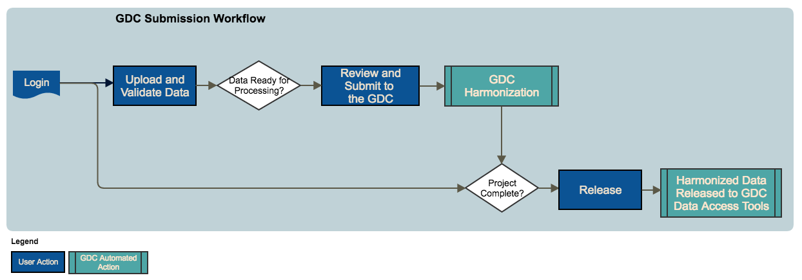
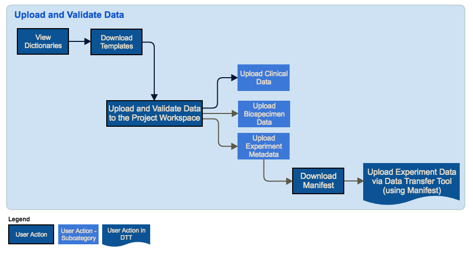
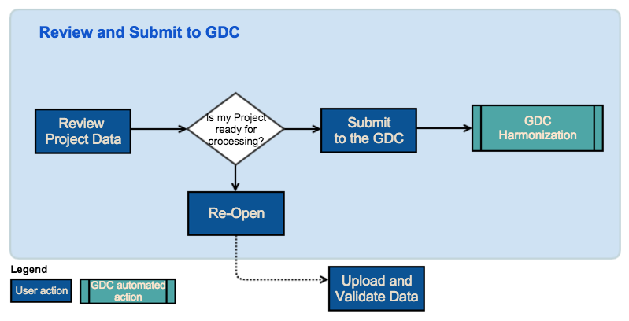
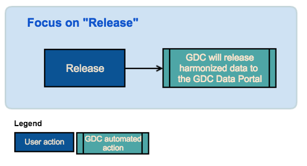
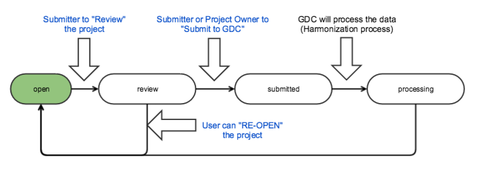
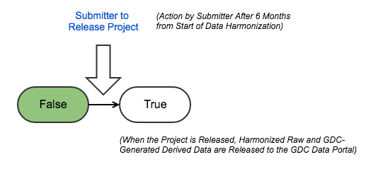
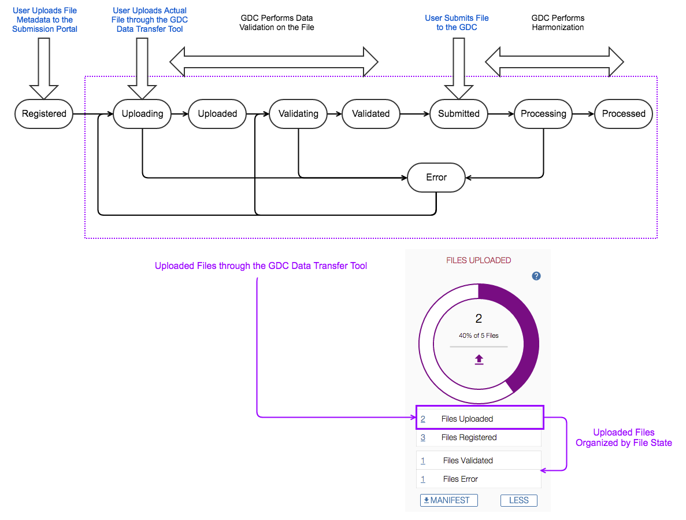

# Submission Workflow

## Overview

The workflow diagram below represents the data submission process that is implemented by the GDC Data Submission Portal. In this process, the submitter logs into the GDC Data Submission Portal, uploads data into the project workspace, and validates the data. Once the data is ready for processing, the submitter reviews the data and submits the data to the GDC. The GDC processes the data through the [GDC Harmonization Process](https://gdc.nci.nih.gov/submit-data/gdc-data-harmonization). Once harmonization has been completed, the submitter reviews the harmonized data and releases the data to the GDC for access through the [GDC Data Portal](https://gdc-portal.nci.nih.gov/) and other [GDC Data Access Tools](https://gdc.nci.nih.gov/access-data/data-access-processes-and-tools). 

### Upload and Validate Data
The submitter will upload clinical and biospecimen data to the project workspace using GDC templates that are available and described in the [GDC Data Dictionary](https://gdc-docs.nci.nih.gov/Data_Dictionary/). The GDC will validate the uploaded data against the GDC Data Dictionary. The submitter will upload experiment metadata to the workspace which will register experiment data for submission through the [Data Transfer Tool](https://gdc.nci.nih.gov/access-data/gdc-data-transfer-tool), a high performance client-based tool for uploading data. Once the submitter uploads the experiment metadata, the GDC Data Submission Portal will generate a manifest file that identifies the experiment data that will be uploaded. The submitter will use the manifest file to upload the experiment data through the Data Transfer Tool.

At this point, the data is not yet submitted to the GDC.

### Review and Submit Data
When data in the project workspace is ready for processing, the submitter or project owner must submit the data to the GDC in order for processing to occur through the [GDC Data Harmonization Pipeline](https://gdc.nci.nih.gov/submit-data/gdc-data-harmonization). Submitting data to the GDC will initiate the GDC Data Harmonization Pipeline. 

During this process, there are two primary actions that should be performed:

* Review the Project: When a submitter reviews the project, the project is locked to prevent other users who are authorized to submit data to the project from uploading new data. During this process, the submitter should verify that the data is ready for processing. If during the review process, the submitter thinks the data is not ready for processing, the submitter can re-open the project. This would allow the submitter or authorized user to upload additional data to the project workspace.
* Submit the Data: After reviewing the project data, the user can submit the project to the GDC. This will trigger the harmonization process.

### Release Data
When the GDC harmonized data is ready and the project data is complete, the submitter or project owner will release the project. This will release harmonized data to the GDC for access through the [GDC Data Portal](https://gdc-portal.nci.nih.gov/) and other [GDC Data Access Tools](https://gdc.nci.nih.gov/access-data/data-access-processes-and-tools). 

## Project Life Cyle

The life cycle of a project in the GDC describes the workflow of a project throughout the data submission process. The project life cycle starts with the upload and validation of data into the project and ends with the release of the harmonized data to the GDC Data Portal and other GDC data access tools. Throughout the life cycle, the project transitions through various states in which the project is open for uploading data, in review, and released. This life cycle is continuous as new project data becomes available. 

To summarize the project life cycle and transition to the various states of the project, the following operations can be performed by the submitter:

* The submitter can upload and validate data if the project __is not in__ REVIEW.
* The submitter can review the project if it __is__ OPEN. The GDC will prevent users from uploading any new data during the review period.
* The submitter can submit data to the GDC for processing if the project __is in__ REVIEW.
* The submitter can release the project once the data has been submitted and processed. The GDC will release the harmonized data to the GDC Data Portal and other GDC Data Access Tools.

Note: "Submit to the GDC" and "Release" actions can be performed only if the user has release privileges.

### Project State
The diagram below demonstrates the transition of a project through the various states. In the initial state, the project is OPEN for data upload and validation. Once the data is ready for review, the project state transitions to REVIEW. During the REVIEW state, the project is locked so that additional data cannot be uploaded. Once review has been completed and the submitter submits the data for GDC processing, the project state transitions to SUBMITTED. If during the review period, additional data changes are needed, the project can be re-opened and the state transitions back to OPEN. Once the data has been processed, the submitter can release the data and the project state transitions to RELEASE. Once the data is released to the GDC for access through GDC data access tools, the project state transitions back to OPEN to allow for new data to be submitted to the project.

### Project Release State
Once a submitter selects to release the data, the project state transitions to RELEASE. If the submitter does not select to release the data within six months of data harmonization, the data is automatically released per the [NCI Genomic Data Sharing Policy](http://www.cancer.gov/grants-training/grants-management/nci-policies/genomic-data).

## File Status Life Cycle

The life cycle of a file in the GDC describes the workflow of an actual file throughout the data submission process. The life cycle starts when a submitter uploads file metadata to the Submission Portal. The act of uploading the file metadata, registers the file in the GDC. The submitter can then use the [GDC Data Transfer Tool](https://gdc.nci.nih.gov/access-data/gdc-data-transfer-tool), a high performance client-based tool, to upload the actual file. Throughout the life cycle, the file status transitions through various states from when the file is initialy registered through file processing.

To summarize the file status life cycle and transition to the various states of the file, the following operations can be performed by the submitter:

* The submitter uploads the file metadata to the Submission Portal which sets the file status to REGISTERED.
* The submitter then uploads the actual file through the GDC Data Transfer Tool which sets the file status to UPLOADING and UPLOADED when the file upload has completed. The Submission Portal displays "__# Files Uploaded__" in the last chart on the dashboard which represents the number of files that the user uploaded through the GDC Data Transfer Tool. 
* The GDC validates the uploaded data which sets the file status to VALIDATING and VALIDATED once complete.
* The submitter submits the validated file to the GDC which sets the file status to SUBMITTED.
* The GDC processes the file which sets the file status to PROCESSING and PROCESSED once complete.
* An error occurs during file validation or processing. The GDC sets the file status to ERROR.

