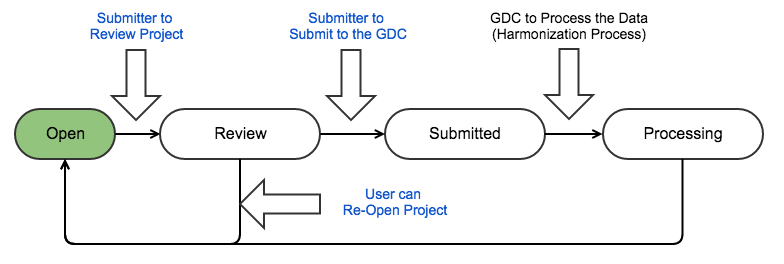

# Submission Workflow

## Overview

The workflow diagram below represents the data submission process that is implemented by the GDC Data Submission Portal. In this process, the submitter logs into the GDC Data Submission Portal, uploads data into the project workspace, and validates the data. Once the data is ready for processing, the submitter reviews the data and submits the data to the GDC. The GDC processes the data through the [GDC Harmonization Process](https://gdc.nci.nih.gov/submit-data/gdc-data-harmonization). Once harmonization has been completed, the submitter reviews the harmonized data and releases the data to the GDC for access through the [GDC Data Portal](https://gdc-portal.nci.nih.gov/) and other [GDC Data Access Tools](https://gdc.nci.nih.gov/access-data/data-access-processes-and-tools). 

## Project Life Cyle

The life cycle of a project in the GDC describes the workflow of a project throughout the data submission process. The project life cycle starts with the upload and validation of data into the project and ends with the release of the harmonized data to the GDC Data Portal and other GDC data access tools. Throughout the life cycle, the project transitions through various states in which the project is open for uploading data, in review, and released. This life cycle is continuous as new project data becomes available. 

To summarize the project life cycle and transition to the various states of the project, the following operations can be performed by the submitter:

* The submitter can upload and validate data if the project __is not in__ REVIEW.
* The submitter can review the project if it __is__ OPEN. The GDC will prevent users from uploading any new data during the review period.
* The submitter can submit data to the GDC for processing if the project __is in__ REVIEW.
* The submitter can release the project once the data has been submitted and processed. The GDC will release the harmonized data to the GDC Data Portal and other GDC Data Access Tools.

Note: "Submit to the GDC" and "Release" actions can be performed only if the user has release privileges.

### Project State
The diagram below demonstrates the transition of a project through the various states. In the initial state, the project is OPEN for data upload and validation. Once the data is ready for review, the project state transitions to REVIEW. During the REVIEW state, the project is locked so that additional data cannot be uploaded. Once review has been completed and the submitter submits the data for GDC processing, the project state transitions to SUBMITTED. If during the review period, additional data changes are needed, the project can be re-opened and the state transitions back to OPEN. Once the data has been processed, the submitter can release the data and the project state transitions to RELEASE. Once the data is released to the GDC for access through GDC data access tools, the project state transitions back to OPEN to allow for new data to be submitted to the project.

### Project Release State
Once a submitter selects to release the data, the project state transitions to RELEASE. If the submitter does not select to release the data within six months of data harmonization, the data is automatically released per the [NCI Genomic Data Sharing Policy](http://www.cancer.gov/grants-training/grants-management/nci-policies/genomic-data).

## File Status Life Cycle

The life cycle of a file in the GDC describes the workflow of an actual file throughout the data submission process. The life cycle starts when a submitter uploads file metadata to the Submission Portal. The act of uploading the file metadata, registers the file in the GDC. The submitter can then use the [GDC Data Transfer Tool](https://gdc.nci.nih.gov/access-data/gdc-data-transfer-tool), a high performance client-based tool, to upload the actual file. Throughout the life cycle, the file status transitions through various states from when the file is initialy registered through file processing.

To summarize the file status life cycle and transition to the various states of the file, the following operations can be performed by the submitter:

* The submitter uploads the file metadata to the Submission Portal which sets the file status to __Registered__.
* The submitter then uploads the actual file through the GDC Data Transfer Tool which sets the file status to __Uploading__ and __Uploaded__ when the file upload has completed. The Submission Portal displays "__# Files Uploaded__" in the last chart on the dashboard which represents the number of files that the user uploaded through the GDC Data Transfer Tool. 
* The GDC validates the uploaded data which sets the file status to __Validating__ and __Validated__ once complete.
* The submitter submits the validated file to the GDC which sets the file status to __Submitted__.
* The GDC processes the file which sets the file status to __Processing__ and __Processed__ once complete.
* An error occurs during file validation or processing. The GDC sets the file status to __Error__.

## Upload, Submit and Release

### Upload and Validate Data
The submitter will upload data to the project workspace and validate the data with the GDC Data Dictionary. At this point, data is not yet submitted to GDC.

### Review and Submit
When data in the project workspace is ready for processing, the submitter or project owner has to submit the data to the GDC. It will trigger the [GDC Data Harmonization Pipeline](https://gdc.nci.nih.gov/submit-data/gdc-data-processing-software-and-algorithms/2-data-harmonization).

Two main actions should be performed:

* REVIEW the project: this will prevent other users from uploading new data to the project. The user should verify that data is ready for processing.
* SUBMIT data to the GDC: After reviewing the project data, the user can submit it to the GDC. This will trigger the harmonization process.

However, during the REVIEW process, if the user thinks the data is not ready for processing then they can RE-OPEN the project. The user would then be able to upload more data to the project workspace.

### Release
When the GDC harmonized data is ready and project data is complete, the project owner will release the project. This will release harmonized data to the GDC Data Portal.

