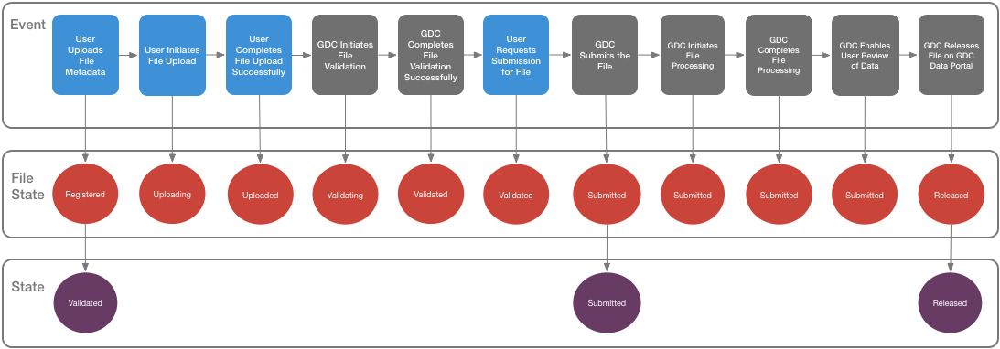

# Submission Workflow

## Overview

The workflow diagram below represents the data submission process implemented by the GDC Data Submission Portal. The submitter logs into the GDC Data Submission Portal, uploads data into the project workspace, and validates the data. When the data is ready for processing, the submitter reviews the data and submits it to the GDC. The GDC harmonizes the data through the [GDC Harmonization Process](https://gdc.cancer.gov/submit-data/gdc-data-harmonization). The submitter can then release the harmonized data to the [GDC Data Portal](https://gdc-portal.nci.nih.gov/) and other [GDC Data Access Tools](https://gdc.cancer.gov/access-data/data-access-processes-and-tools) according to [GDC Data Sharing Policies](https://gdc.cancer.gov/submit-data/data-submission-policies).

### Upload and Validate Data

The submitter uploads Clinical and Biospecimen data to the project workspace using GDC templates that are available in the [GDC Data Dictionary](https://gdc-docs.nci.nih.gov/Data_Dictionary/). The GDC will validate the uploaded data against the GDC Data Dictionary.

To upload submittable data files, such as sequence data in BAM or FASTQ format, the submitter must register file metadata with the GDC using a method similar to uploading Clinical and Biospecimen data. When files are registered, the submitter downloads a manifest from the GDC Data Submission Portal and uses it with the [GDC Data Transfer Tool](https://gdc.cancer.gov/access-data/gdc-data-transfer-tool) to upload the files.

### Review and Submit Data

When all necessary data and files have been uploaded, the submitter reviews the dataset and submits it to the GDC for processing through the [GDC Data Harmonization Pipeline](https://gdc.cancer.gov/submit-data/gdc-data-harmonization).

### Release Data

The GDC will release data according to [GDC data sharing policies](https://gdc.cancer.gov/submit-data/data-submission-policies). A project may be released after six months from the date of upload or the submitter may request earlier release using the "Release Project" function.  

Harmonized data will be released to GDC users through the [GDC Data Portal](https://gdc-portal.nci.nih.gov/) and other [GDC Data Access Tools](https://gdc.cancer.gov/access-data/data-access-processes-and-tools). Once a project is released, all additional submitted data will automatically be released after harmonization.

## Project Lifecycle

The lifecycle of a project in the GDC describes the workflow throughout the data submission process. The project lifecycle starts with the upload and validation of data into the project and ends with the release of the harmonized data to the GDC Data Portal and other GDC data access tools. Throughout the lifecycle, the project transitions through various states in which the project is open for uploading data, in review, and processing. This lifecycle is continuous as new project data becomes available.

### Project State
The diagram below demonstrates the transition of a project through the various states. Initially the project is OPEN for data upload and validation. Any changes to the data must be made while the project status is OPEN. When the data is uploaded and ready for review, the submitter changes the project state to REVIEW by clicking the _'REVIEW'_ button on the dashboard. During the REVIEW state, the project is locked so that additional data cannot be uploaded. If data changes are needed during the review period, the project can be re-opened and the state changes back to OPEN. When review has been completed and the submitter submits the data for GDC processing, the project state changes to SUBMITTED. When the data has been processed, the project state changes back to OPEN for new data to be submitted to the project.

## File Status Lifecycle

This section describes states pertaining to submittable data files throughout the data submission process. A submittable data file could contain data such as genomic sequences (such as a BAM or FASTQ) or pathology slide images. The file lifecycle starts when a submitter uploads metadata for a file to the GDC Data Submission Portal. Upload of file metadata, as a GDC Data Model entity, registers a description of the file in the GDC. The submitter can then use the [GDC Data Transfer Tool](https://gdc.cancer.gov/access-data/gdc-data-transfer-tool) to upload the actual file. Throughout the lifecycle, the file status transitions through various states from when the file is initially registered through file submission and processing. The diagram below details these status transitions.   

