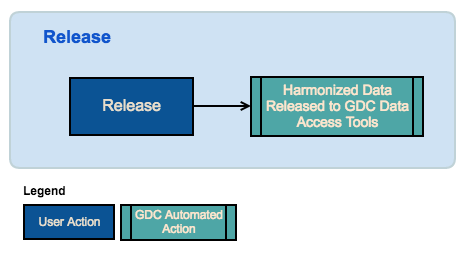

## Submission Workflow

### General Submisison Workflow
The workflow diagram available below presents the main features available within GDC Submission Portal in order to submit data and release it to the research community on the GDC Data Portal.

### Upload and Validate Data
The Submitter will upload data to the project workspace and validate data with the GDC dictionary. At this point, data is not submitted to GDC yet.

### Review and Submit
When data in the project workspace is ready for processing, the Submitter or Project Owner will submit it to GDC. It will trigger the [GDC Data Harmonization Pipeline](https://gdc.nci.nih.gov/submit-data/gdc-data-processing-software-and-algorithms/2-data-harmonization).

### Release
When GDC harmonized data is ready and project data is complete, the Project Owner will release the project. It will release harmonized data to the GDC Data Portal.

