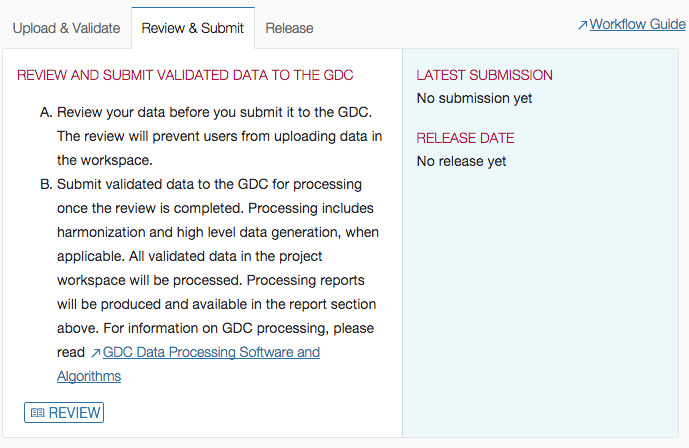
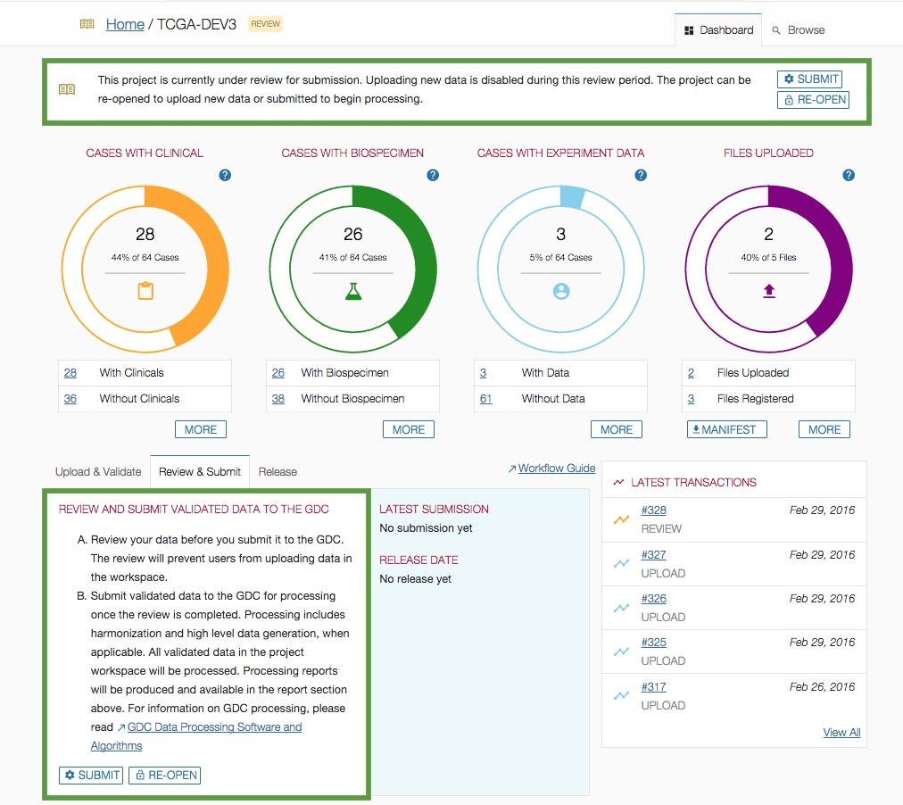
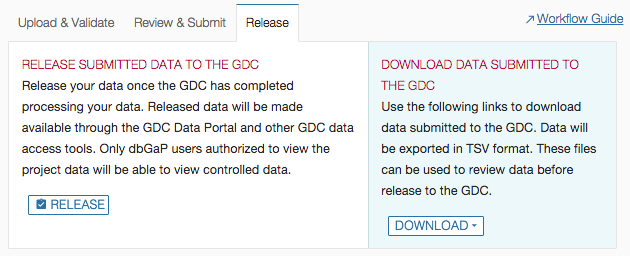

# Submit and Release

## Overview

The GDC Data Submission process is detailed on the [GDC Website]( https://gdc.nci.nih.gov/submit-data/data-submission-processes-and-tools).

## Review and Submit

Once data is uploaded to the project workspace (see previous section: [Upload Data](Upload_Data.md) , the submitter or project owner should review it to ensure that data is ready for processing by the GDC ([Harmonization process](https://gdc.nci.nih.gov/submit-data/gdc-data-processing-software-and-algorithms/2-data-harmonization)).

The review will lock the project and ensure no user can upload more data. During that period, the submitter or project owner can browse the data in the Submission Portal or download it. 

If the project is ready for processing, the submitter or project owner will submit data to the GDC.

If the project is not ready for processing, the submitter or project owner can re-open it. Then the submitter will be able to upload more data to the project workspace.

In general, submitters are requested to submit their data to the GDC within six months from the first upload to the project workspace.

### Review

The "Review" button is available only if the project is in "OPEN" state.

Reviewing the project will prevent other users from uploading data to the project. Once the review is complete, the user can submit data to the GDC.

### Submit to the GDC

The "Submit" button is available only if the project is in "REVIEW" state. At this point, the user can decide whether to re-open the project to upload more data or to submit data to the GDC.

Once the user submits data to the GDC, he __cannot upload additional data until the harmonization process is complete__.

When the user clicks on the action "Submit", the following Submit popup is displayed:

After User clicks on "Submit Validated Data to the GDC", the project state becomes "Submitted":

## Release
The project owner should release data when harmonization process is complete and the harmonized data is ready to release.
Releasing the data will make the data available to the GDC Data Portal.

As soon as the project owner releases the project, any harmonized (updated or added to the project) will be released to the [GDC Data Portal](https://gdc-portal.nci.nih.gov/projects/t).

When the user clicks on the action "Release", the following Release popup is displayed:

After User clicks on "Release Submitted and Processed Data", the project release state becomes "Released":

__Note__: Released cases and/or files can be redacted from the GDC. Redaction is performed by GDC administrators, at case level through synchronization with dbGaP, and at file level through submitter's request usually after a data quality issue is identified. The GDC Data Submission Portal itself currently does not support redaction through the web user interface.