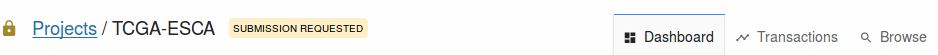

# Submit and Release

## Overview

The GDC Data Submission process is detailed on the [GDC Website]( https://gdc.nci.nih.gov/submit-data/data-submission-processes-and-tools).

This chapter will focus on the following features:

* The review and submission of data to the GDC
* The release of data to the GDC Data Portal

## Review and Submit

When data is uploaded to the project workspace (see previous section: [Upload Data](Upload_Data.md), the submitter should review the data to ensure that it is ready for processing by the GDC [Harmonization Process](https://gdc.nci.nih.gov/submit-data/gdc-data-harmonization). The review will lock the project and prevent users from uploading more data. During this period, the submitter or project owner can browse the data in the Submission Portal or download it.

If the project is ready for processing, the submitter or project owner will submit data to the GDC. If the project is not ready for processing, the submitter or project owner can re-open it. Then the submitter will be able to upload more data to the project workspace.

Submitters are requested to submit their data to the GDC within six months from the first upload to the project workspace.

### Review

To review and submit data to the GDC, the user must have release privileges. The user will be able to view the section below on the dashboard.

The "Review" button is available only if the project is in "OPEN" state.

Reviewing the project will prevent other users from uploading data to the project. Once the review is complete, the user can submit data to the GDC.

Once the user clicks on "Review", the project state will change to "REVIEW":

### Submit to the GDC

The "Submit" button is available only if the project is in "REVIEW" state. At this point, the user can decide whether to re-open the project to upload more data or to submit the data to the GDC. When the project is in "REVIEW" the following panel appears on the dashboard:

Once the user submits data to the GDC, they __cannot upload additional data until the harmonization process is complete__.

When the user clicks on the action "SUBMIT TO GDC" in panel 2 of the dashboard, the following submission popup is displayed:

After the user clicks on "Submit Validated Data to the GDC", the project state becomes "Submitted":

## Release
The GDC will release data according to [GDC data sharing policies](https://gdc.cancer.gov/submit-data/data-submission-policies). Data may be released after six months from the date of upload, or the submitter may request earlier release using the "Release Project" function.

Upon release, harmonized data will be available to GDC users through the [GDC Data Portal](https://gdc-portal.nci.nih.gov/) and other [GDC Data Access Tools](https://gdc.nci.nih.gov/access-data/data-access-processes-and-tools).

**Note:** To release data to the GDC Data Portal, the user must have release privileges.

When the user clicks on the action "Release", the following Release popup is displayed:

After the user clicks on "Release Submitted and Processed Data", the project release state becomes "Released":

__Note__: Released cases and/or files can be redacted from the GDC. Redaction is performed by GDC administrators, at case level through synchronization with dbGaP, and at file level at the submitter's request usually after a data quality issue is identified. The GDC Data Submission Portal itself currently does not support redaction through the web user interface.
