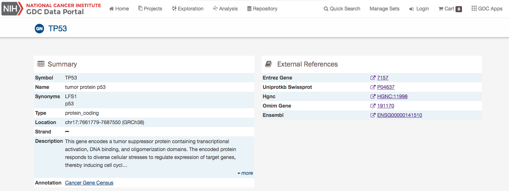
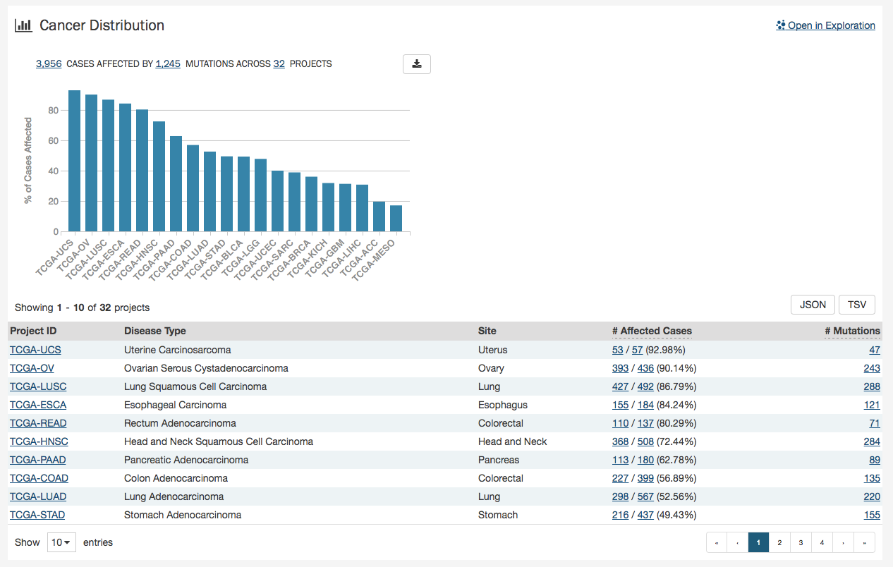
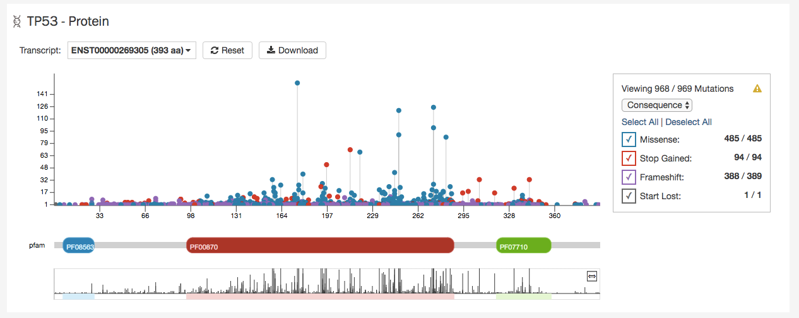
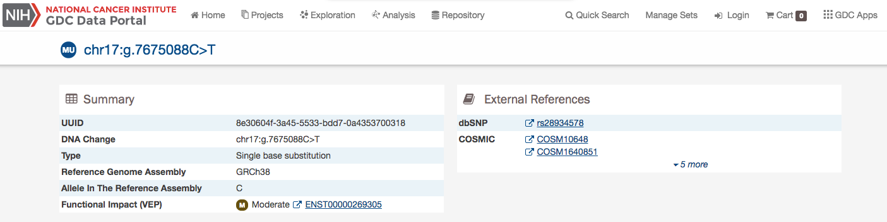
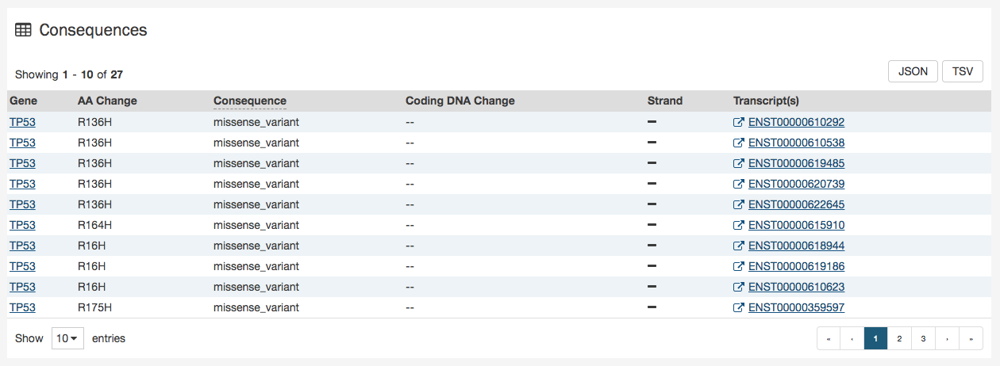
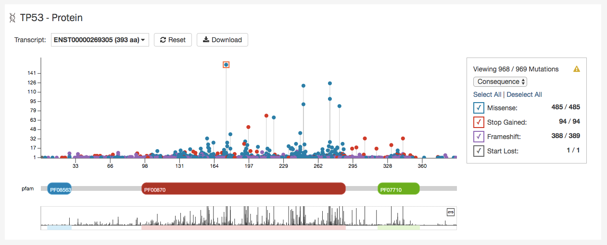

# Supplemental Information Pages

## Project Summary Page

Each project has a summary page that provides an overview of all available cases, files, and annotations available. Clicking on the numbers in the summary table will display the corresponding data.

Three download buttons in the top right corner of the screen allow the user to download the entire project dataset, along with the associated project metadata:

* __Explore Project Data__: Opens Exploration page with summary project information.
* __Download Biospecimen__: Downloads biospecimen metadata associated with all cases in the project in either TSV or JSON format.
* __Download Clinical__: Downloads clinical metadata about all cases in the project in either TSV or JSON format.
* __Download Manifest__: Downloads a manifest for all data files available in the project. The manifest can be used with the GDC Data Transfer Tool to download the files.

## Case Summary Page

The Case Summary page displays case details including the project and disease information, data files that are available for that case, and the experimental strategies employed. A button in the top-right corner of the page allows the user to add all files associated with the case to the file cart.

### Clinical and Biospecimen Information

The page also provides clinical and biospecimen information about that case. Links to export clinical and biospecimen information in JSON format are provided.

For clinical records that support multiple records of the same type (Diagnoses, Family Histories, or Exposures), a UUID of the record is provided on the left hand side of the corresponding tab, allowing the user to select the entry of interest.

### Biospecimen Search

A search filter just below the biospecimen section can be used to find and filter biospecimen data. The wildcard search will highlight entities in the tree that match the characters typed. This will search both the case submitter ID, as well as the additional metadata for each entity. For example, searching 'Primary Tumor' will highlight samples that match that type.

### Most Frequent Somatic Mutations for a Case

The case entity page also lists the mutations found in that particular case.

For more information, please go to the [Most Frequent Somatic Mutation](#most-frequent-somatic-mutations) section.

## File Summary Page

The File Summary page provides information a data file, including file properties like size, md5 checksum, and data format; information on the type of data included; links to the associated case and biospecimen; and information about how the data file was generated or processed.

The page also includes buttons to download the file, add it to the file cart, or (for BAM files) utilize the BAM slicing function.

In the lower section of the screen, the following tables provide more details about the file and its characteristics:

* __Associated Cases / Biospecimen__: List of Cases or biospecimen the file is directly attached to.
* __Analysis and Reference Genome__: Information on the workflow and reference genome used for file generation.
* __Read Groups__: Information on the read groups associated with the file.
* __Metadata Files__: Experiment metadata, run metadata and analysis metadata associated with the file.
* __Downstream Analysis Files__: List of downstream analysis files generated by the file.
* __File Versions__: List of all versions of the file.

>**Note**: *The Legacy Archive* will not display "Workflow, Reference Genome and Read Groups" sections (these sections are applicable to the GDC harmonization pipeline only). However it may provide information on Archives and metadata files like MAGE-TABs and SRA XMLs. For more information, please refer to the section [Legacy Archive](Legacy_Archive.md).

### BAM Slicing

BAM file detail pages have a "BAM Slicing" button. This function allows the user to specify a region of a BAM file for download. Clicking on it will open the BAM slicing window:

During preparation of the slice, the icon on the BAM Slicing button will be spinning, and the file will be offered for download to the user as soon as ready.

## Gene and Mutation Summary Pages

Many parts of the GDC website contain links to Gene and Mutation summary pages. These pages display information about specific genes and mutations, along with visualizations and data showcasing the relationship between themselves, the projects, and cases within the GDC. The gene and mutation data that is visualized on these pages are produced from the Open-Access MAF files available for download on the GDC Portal.

### Gene Summary Page

Gene Summary Pages describe each gene with mutation data and provides results related to the analyses that are performed on these genes.  

The summary section of the gene page contains the following information:

* __Symbol:__ The gene symbol.
* __Name:__ Full name of the gene.
* __Synonyms:__ Synonyms of the gene name or symbol, if available.
* __Type:__ A broad classification of the gene.
* __Location:__ The chromosome on which the gene is located and its coordinates.
* __Strand:__ If the gene is located on the forward (+) or reverse (-) strand.
* __Description:__ A description of gene function and downstream consequences of gene alteration.
- __Annotation:__ A notation/link that states whether the gene is part of [The Cancer Gene Census](http://cancer.sanger.ac.uk/census/).

### External References

A list with links that lead to external databases with additional information about each gene is displayed here. These external databases include:

*  [Entrez](https://www.ncbi.nlm.nih.gov/gquery/)
*  [Uniprot](http://www.uniprot.org/)
*  [Hugo Gene Nomenclature Committee](http://www.genenames.org/)
*  [Online Mendelian Inheritance in Man](https://www.omim.org/)
*  [Ensembl](http://may2015.archive.ensembl.org/index.html)

### Cancer Distribution

A table and bar graph show how many cases are affected by mutations within the gene as a ratio and percentage. Each row/bar represents the number of cases for each project.  The final column in the table lists the number of unique mutations observed on the gene for each project.

### Protein Viewer

Mutations and their frequency across cases are mapped to a graphical visualization of protein-coding regions with a lollipop plot. Pfam domains are highlighted along the x-axis to assign functionality to specific protein-coding regions. The bottom track represents a view of the full gene length. Different transcripts can be selected by using the drop-down menu above the plot.  

The panel to the right of the plot allows the plot to be filtered by mutation consequences or impact. The plot will dynamically change as filters are applied.  Mutation consequence and impact is denoted in the plot by color.

>__Note__: The impact filter on this panel will not display the annotations for alternate transcripts.

The plot can be viewed at different zoom levels by clicking and dragging across the x-axis, clicking and dragging across the bottom track, or double clicking the pfam domain IDs. The `Reset` button can be used to bring the zoom level back to its original position. The plot can also be exported as a PNG image, SVG image or as JSON formatted text by choosing the `Download` button above the plot.

### Most Frequent Somatic Mutations

The 20 most frequent mutations in the gene are displayed as a bar graph that indicates the number of cases that share each mutation.  

A table is displayed below that lists information about each mutation including:

* __DNA Change:__ The chromosome and starting coordinates of the mutation are displayed along with the nucleotide differences between the reference and tumor allele.
* __Type:__ A general classification of the mutation.
* __Consequences:__ The effects the mutation has on the gene coding for a protein (i.e. synonymous, missense, non-coding transcript).
* __# Affected Cases in Gene:__ The number of affected cases, expressed as number across all mutations within the selected Gene.
* __# Affected Cases Across GDC:__ The number of affected cases, expressed as number across all projects. Choosing the arrow next to the percentage will expand the selection with a breakdown of each affected project.
* __Impact:__ A subjective classification of the severity of the variant consequence. These scores are determined using the three following tools:
    * __[Ensembl VEP](http://useast.ensembl.org/info/genome/variation/prediction/index.html):__
        * __HIGH (H):__ The variant is assumed to have high (disruptive) impact in the protein, probably causing protein truncation, loss of function or triggering nonsense mediated decay.
        * __MODERATE (M):__ A non-disruptive variant that might change protein effectiveness.
        * __LOW (L):__ Assumed to be mostly harmless or unlikely to change protein behavior.
        * __MODIFIER (MO):__ Usually non-coding variants or variants affecting non-coding genes, where predictions are difficult or there is no evidence of impact.
    * __[PolyPhen](http://genetics.bwh.harvard.edu/pph/):__
        * __probably damaging (PR):__ It is with high confidence supposed to affect protein function or structure.
        * __possibly damaging (PO):__ It is supposed to affect protein function or structure.
        * __benign (BE):__ Most likely lacking any phenotypic effect.
        * __unknown (UN):__ When in some rare cases, the lack of data does not allow PolyPhen to make a prediction.
    * __[SIFT](http://sift.jcvi.org/):__
        * __tolerated:__ Not likely to have a phenotypic effect.
        * __tolerated_low_confidence:__ More likely to have a phenotypic effect than 'tolerated'.
        * __deleterious:__ Likely to have a phenotypic effect.
        * __deleterious_low_confidence:__ Less likely to have a phenotypic effect than 'deleterious'.

>__Note__: The Mutation UUID can be displayed in this table by selecting it from the drop-down represented by three parallel lines.

Clicking the `Open in Exploration` button will navigate the user to the Exploration page, showing the same results in the table (mutations filtered by the gene).

### Mutation Summary Page

  The Mutation Summary Page contains information about one somatic mutation and how it affects the associated gene. Each mutation is identified by its chromosomal position and nucleotide-level change.

  

  - __ID:__ A unique identifier (UUID) for this mutation.
  - __DNA Change:__ Denotes the chromosome number, position, and nucleotide change of the mutation.
  - __Type:__ A broad categorization of the mutation.
  - __Reference Genome Assembly:__ The reference genome in which the chromosomal position refers to.
  - __Allele in the Reference Assembly:__ The nucleotide(s) that compose the site in the reference assembly.
  - __Functional Impact:__ A subjective classification of the severity of the variant consequence.

#### External References

  A separate panel contains links to databases that contain information about the specific mutation. These include [dbSNP](https://www.ncbi.nlm.nih.gov/projects/SNP/) and [COSMIC](http://cancer.sanger.ac.uk/cosmic).

### Consequences

The consequences of the mutation are displayed in a table.  The set of consequence terms, defined by the [Sequence Ontology](http://www.sequenceontology.org).

  

The fields that describe each consequence are listed below:

  * __Gene:__ The symbol for the affected gene.
  * __AA Change:__ Details on the amino acid change, including compounds and position, if applicable.
  * __Consequence:__ The biological consequence of each mutation.
  * __Coding DNA Change:__ The specific nucleotide change and position of the mutation within the gene.
  * __Strand:__ If the gene is located on the forward (+) or reverse (-) strand.
  * __Transcript(s):__ The transcript(s) affected by the mutation. Each contains a link to the [Ensembl](https://www.ensembl.org) entry for the transcript.

### Cancer Distribution

A table and bar graph shows how many cases are affected by the particular mutation. Each row/bar represents the number of cases for each project.

  

The table contains the following fields:

  * __Project ID__: The ID for a specific project.
  * __Disease Type__: The disease associated with the project.
  * __Site__: The anatomical site affected by the disease.
  * __# Affected Cases__: The number of affected cases and total number of cases displayed as a fraction and percentage.

### Protein Viewer

  

  The protein viewer displays a plot representing the position of mutations along the polypeptide chain. The y-axis represents the number of cases that exhibit each mutation, whereas the x-axis represents the polypeptide chain sequence. [Pfam domains](http://pfam.xfam.org/) that were identified along the polypeptide chain are identified with colored rectangles labeled with pfam IDs. See the Gene Summary Page for additional details about the protein viewer.

  The panel to the right of the plot allows the plot to be filtered by mutation consequences or impact.  The plot will dynamically change as filters are applied.  Mutation consequence and impact is denoted in the plot by color.

 > __Note:__ The impact filter on this panel will not display the annotations for alternate transcripts.

  The plot can be viewed at different zoom levels by clicking and dragging across the x-axis, clicking and dragging across the bottom track, or double clicking the pfam domain IDs. The `Reset` button can be used to bring the zoom level back to its original position. The plot can also be exported as a PNG image, SVG image or as JSON formatted text by choosing the `Download` button above the plot.

## Image Viewer

The Image viewer allows users to visualize tissue slide images.

### How to access the image viewer

The image viewer is available from:

* __Case entity page__: Click on the image viewer icon in the Case summary section or in the Biospecimen section - Slides detail. It will display in the image viewer the tissue slide images attached to the Case.

 
 

* __Case table in Exploration and Repository pages__: Click on the image viewer icon in the Case table. It will display in the image viewer all the tissue slide images attached to the Case.

 

* __Repository page - main search__: After selecting your query, click on "View images" in Repository. It will display the tissue slide images of all the cases resulting from the query.

* __Directly in the File entity page__: You can visualize the tissue slide image directly in the file entity page.

### Image viewer features
In the image viewer, you can:

* Zoom in and zoom out by clicking on + and - icons.
* Reset to default display by clicking on the Home icon.
* Display the image in full screen mode by clicking on the Expand icon.
* View the slide detail by clicking on "Details" button.
* Selecting the area of interest with the thumbnail at the top-right corner.

### Example of navigation to the image viewer

1. Go to Repository - Case facet and click on Add a Case/Biospecimen filter
2. In the search box of the filter pop-up, look to percent_tumor_cells and add this filter to the Repository
3. Enter a percentage between 60% and 80% then click on Go!
4. Click on "View Images" button

__Result__: The images displayed on the image viewer are filtered based on your query.

