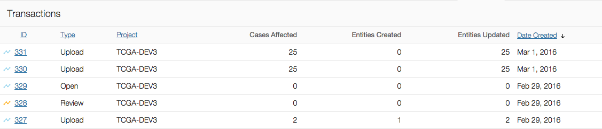
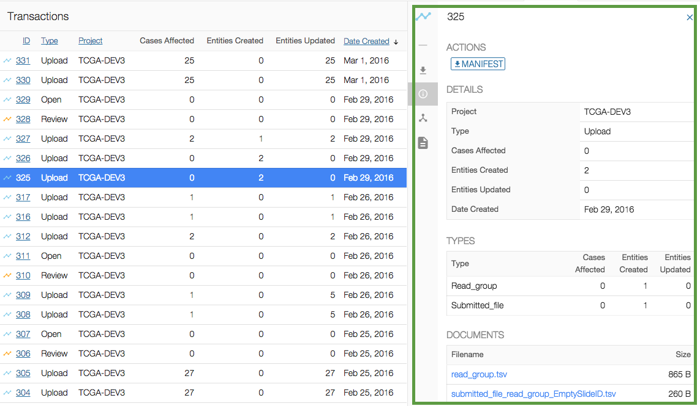
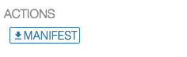
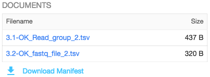

# Transactions

## Overview

The transactions view lists all transactions which have happened on the project since its creation.

The types of transactions are the following:

* __Upload__: the user uploads data to the project workspace.
* __Review__: the user reviews the project before submitting data to the GDC.
* __Open__: the user re-opens the project if it was under review. This will allow to upload new data to the project workspace.
* __Submit__: the user submits data to the GDC. This trigger the harmonization process.
* __Release__: the user releases data to the GDC Data Portal.

## Transactions List View

The transactions list view displays the following information:

|Column|Description|
| --- | --- |
| ID | ID of the transaction |
| Type | Type of the transaction (see list transaction types in the previous section)|
| Cases Affected | Number of cases affected by the transaction. Note: during data upload, any entity created or updated is associated with a case. |
| Entities Created | Entities created during the transaction |
| Entities Updated | Entities updated during the transaction |
| Date Created | Date of the transaction |

## Transactions Details

Clicking on a transaction will open the details panel. Data in this panel is broken down into multiple sections.

Navigation between those sections can be done either by scrolling down or by clicking on the section icon on the left side of the details panel.

### Actions

Some transactions provide actions, for example if the user uploads read groups and files metadata then they will be able to download the corresponding manifest from the transaction. This manifest is used to upload the actual files through the GDC Data Transfer Tool.

### Details

Provides details about the transaction itself, such as its project, type and number of affected cases.

### Types

Lists the type of files submitted and the number of affected cases and entities.

### Documents

Lists files submitted during the transactions.
The user can __download the original files from the transaction__.

