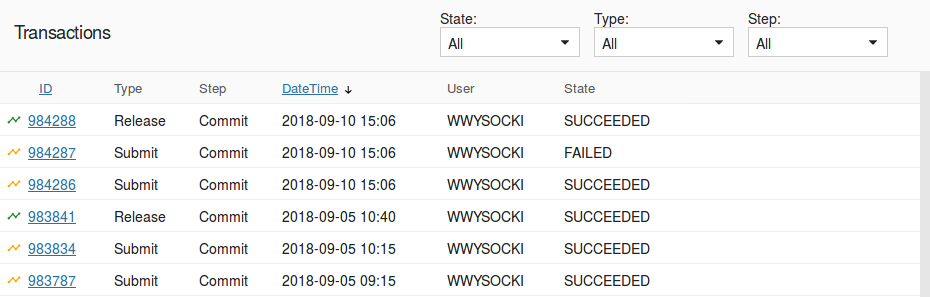
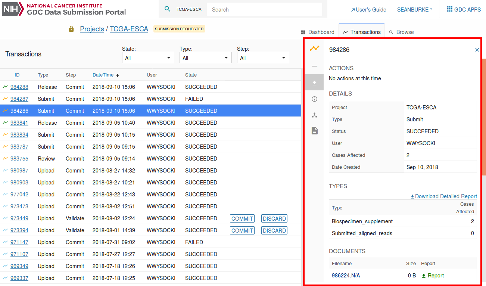

# Transactions

## Overview

The transactions page lists all of the project's transactions. The transactions page can be accessed by choosing the "Transactions" tab at the top of the dashboard or by choosing "View All Data Upload Transactions" in the first panel of the dashboard.

The types of transactions are the following:

* __Upload__: The user uploads data to the project workspace. Note that data files uploaded using the GDC Data Transfer tool do not appear as transactions. These can be viewed in the [Browse](Browse_Data.md) tab.
* __Review__: The user reviews the project before submitting data to the GDC.
* __Open__: The user re-opens the project if it was under review. This allows the upload of new data to the project workspace.
* __Submit__: The user submits uploaded data to the GDC. This triggers the data harmonization process.
* __Release__: The user releases harmonized data to the GDC Data Portal and other GDC data access tools.

__Note:__ When submittable data files are uploaded through the Data Transfer Tool they are not displayed as transactions.  

## Transactions List View

The transactions list view displays the following information:

|Column|Description|
| --- | --- |
| __ID__ | Identifier of the transaction |
| __Type__ | Type of the transaction (see the list of transaction types in the previous section)|
| __Step__ | The step of the submission process that each file is currently in. This can be Validate or Commit. "Validate" represents files that have not yet been committed but have been submitted using the submission portal or the API . |
| __DateTime__ | Date and Time that the transaction was initiated |
| __User__ | The username of the submitter that performed the transaction |
| __Status__ | 	Indicates the status of the transaction: SUCCEEDED, PENDING, or FAILED |
| __Commit/Discard__ | Two buttons that appear when data has been uploaded using the API or the submission portal.  This allows for validated data to be incorporated into the project or discarded. |

## Transaction Filters

Choosing the radio buttons at the top of the table allows the transactions to be filtered by those that are in progress, to be committed, succeeded, failed, or discarded. The drop-down menu also allows for the transactions to be filtered by type.  

## Transactions Details

Clicking on a transaction will open the details panel. Data in this panel is organized into multiple sections including actions, details, types, and documents as described below.

Navigation between the sections can be performed by either scrolling down or by clicking on the section icon displayed on the left side of the details panel.

### Actions

The Actions section allows a user to perform an action for transactions that provide actions. For example, if a user uploads read groups and file metadata, a corresponding manifest file will be available for download from the transaction. This manifest is used to upload the actual files through the [GDC Data Transfer Tool](https://gdc.cancer.gov/access-data/gdc-data-transfer-tool).

### Details

The Details section provides details about the transaction itself, such as its project, type, and number of affected cases.

### Types

The Types section lists the type of files submitted and the number of affected cases and entities.

### Documents

The Documents section lists the files submitted during the transaction.
The user can __download the original files from the transaction__, a report detailing the transaction, or the errors that originated from the transaction (if the transaction had failed).

