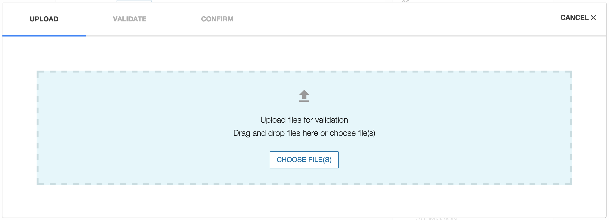
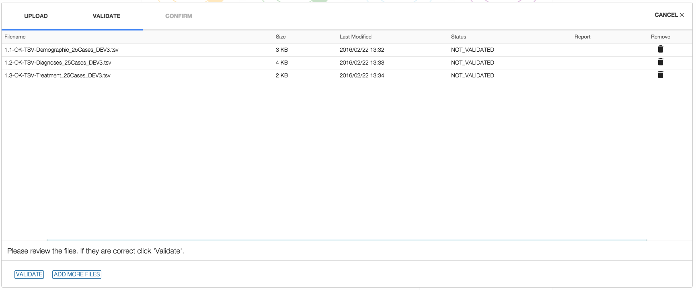
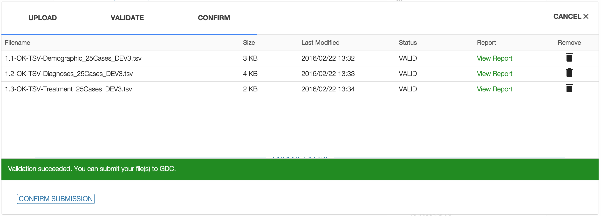
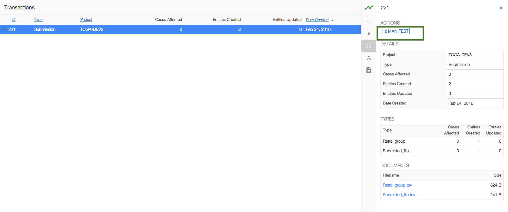
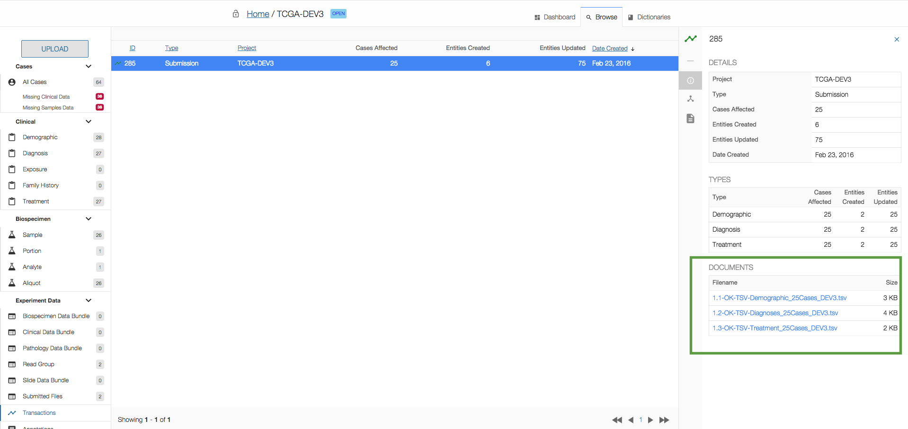

# Upload and Validate Data

## Overview

The GDC Data Submission process is detailed on the [GDC Website]( https://gdc.nci.nih.gov/submit-data/data-submission-processes-and-tools).

This chapter will focus on the upload and validation of data to the project workspace.

[](images/GDC_Submission_Portal_Workflow_Upload.png "Click to see the full image.")


## Introduction to the Files

### File Format

The GDC Data Submission Portal supports the following file formats for submission:

* JSON
* TSV

During the upload and validation process, files are converted by the GDC API into entities and inserted into the database, maintaining a file-agnostic back-end.

The GDC Data Submission Portal offers the ability to download files in different formats. To do so the system converts database entities back to the requested file format.

### File Type
The GDC Data Submission Portal supports the following types of files for upload to the GDC:

* __Clinical__: A case’s clinical data.
* __Biospecimen__: Metadata describing a tissue specimen collected from a case and other material derived from samples for analysis.
* __Experiment Data__: GDC's unit of submission (see below).
* __Annotations__: Observations associated with any entity, which can be useful for interpreting the data.

More details about the submission process, data files and file formats can be found on the GDC website at [Data Submission Processes and Tools](https://gdc.nci.nih.gov/submit-data/data-submission-processes-and-tools) and [Data Types and File Formats](https://gdc.nci.nih.gov/submit-data/gdc-data-types-and-file-formats).

#### Focus on Experiment Data

The GDC has developed a submission unit called a “data bundle”, which is a set of files with associated metadata.

Data bundle types are defined by what files are expected and what introspection is done for validation or linking to other GDC entities. Each data bundle will be validated via a bundle type and project specific schema, including a JSON data dictionary, relationship check and molecular data quality check.

The experiment data supported by the GDC is described in the [GDC Dictionary](../../Dictionary/viewer.md).

The table below is an example of files used to upload a read group to the GDC. The next section will describe how to perform these actions.

|# | File name | Description | GDC Tool |
| --- | --- | --- | --- |
|1a | read_group.tsv |Read Group Metadata|Upload this file to the Submission Portal. It describes the experiment metadata.|
|1b | submitted_file.tsv|Submitted File Metadata|Upload this file to the Submission Portal. It describes the file metadata.|
|2 | manifest.yml|Manifest|Download this file from the Submission Portal. This manifest is used by the GDC Data Transfer Tool for the actual file upload.|
|3 | ExperimentFile.fastq|FAST File|Upload this file to the GDC Data Transfer Tool along with the manifest.|


## Step1. Prepare Files

The [GDC Dictionary](../../Dictionary/viewer.md) describes the types of entities that can be uploaded to the GDC.

The user can go to the GDC Dictionary to __download the template files__ to be used for the upload. The templates can be populated with data by the user and should result in a valid file (if validation rules detailed in the dictionary are met).

A template file describes an entity with the following information:

* __Type__: identification of the entity.
* __Unique Keys__: Project ID and Submitter ID of the entity.
* __Links__: Submitter ID of the links to other entities.
* __Properties__: user properties of the entity.

### Focus on Links

In order to identify the relationship between 2 entities, the user should include in the file of the child entity a reference to the parent submitter ID (called link).

For example, a Demographic entity describes a Case entity. The user should define __cases.submitter_id__ in the Demographic file.


### Examples of files

#### Demographic


Example below of a __demographic file__ that can be uploaded in TSV format.

The structure of the file is the following:

* Type = demographic
* Unique Keys = project\_id, submitter_id 
* Links = cases.submitter_id 
* Properties = ethnicity, gender, etc.

```tsv
type	project_id	submitter_id	cases.submitter_id	ethnicity	gender	race	year_of_birth	year_of_death
demographic	TCGA-DEV3	TCGA-DEV-3-CASE-000-D1	TCGA-DEV-3-CASE-000	hispanic or latino	male	white	1950	0
demographic	TCGA-DEV3	TCGA-DEV-3-CASE-001-D1	TCGA-DEV-3-CASE-001	not reported	female	white	1956	0
```


#### Read Group and Submitted File

Example of a __Read Group__ upload, which needs 2 TSV files to describe metadata.

File 1: read_group.tsv

```tsv
type	project_id	submitter_id	aliquots.submitter_id	experiment_name	is_paired_end	library_name	library_strategy	platform	read_group_name	read_length	sequencing_center	RIN	adapter_name	adapter_sequence	base_caller_name	base_caller_version	fastq_name	flow_cell_barcode	includes_spike_ins	instrument_model	library_preparation_kit_catalog_number	library_preparation_kit_name	library_preparation_kit_vendor	library_preparation_kit_version	library_selection	library_strand	sequencing_date	size_selection_range	spike_ins_concentration	spike_ins_fasta	target_capture_kit_catalog_number	target_capture_kit_name	target_capture_kit_target_region	target_capture_kit_vendor	target_capture_kit_version	to_trim_adapter_sequence
read_group	TCGA-DEV3	read_group_ID1	TCGA-DEV-3-CASE-000-S1-AL1	Text for Experiment	TRUE	lib_1	WXS	Illumina	35	101	test								FALSE																	FALSE
```

File 2: submitted_file.tsv

```tsv
type	project_id	submitter_id	read_groups.submitter_id#1	slides.submitter_id	file_name	file_size	md5sum	file_format	state_comment
submitted_file	TCGA-DEV3	fileID1_CASE-000-AL1	read_group_ID1		fileID88_CASE-000.fastq	61004	311253B0CA93B396A41C0A88F01557AE	fastq	
```


Once the user has prepared their files (in TSV or JSON format), they can move on to the next step, uploading their data through the Upload Data Wizard.

**Note:** Before you can upload clinical, biospecimen or experiment data, the cases must be registered in GDC. If the cases are not displayed in your project dashboard, please download the Case template from the [GDC Dictionary](../../Dictionary/viewer.md), complete it with the Cases Submitter IDs and upload the Cases through the Upload Data Wizard.

## Step 2. Upload Data Wizard


The GDC Data Submission Portal is equipped with a wizard window to guide you through the upload and validation of data. There are three stages:

* __Upload Files__: Upload a file into the user's browser, at this point nothing is submitted to the project workspace.
* __Validate Files__: Send a file to the GDC backend to validate its content (see below).
* __Confirm Upload__: Submit a validated file to the project workspace and produce a report.

The _'File Validation'_ stage acts as a safeguard against submitting incorrect files to the GDC Data Submission Portal. During the validation stage, the GDC API will validate the content of submitted files against the project's dictionary to detect potential errors. Invalid files will be flagged and the upload to the GDC will be denied until corrections are made by the user. A validation error report provided by the system can be used to isolate and correct errors for resubmission.

### Upload Files

From the project dashboard, clicking on _'UPLOAD'_ will open the submission wizard.

[](images/GDC_Submission_Wizard_Upload.png "Click to see the full image.")

Files can be added either by clicking on _'CHOOSE FILE(S)'_ or by using drag and drop.

### Validate Files

As soon as the first file is added, the wizard will move to the _'VALIDATE'_ section and the user can continue to add files.

[](images/GDC_Submission_Wizard_Validate.png "Click to see the full image.")

Once all files have been added, clicking on _'VALIDATE'_ will check if the files are valid for submission.

[](images/GDC_Submission_Wizard_Confirm.png "Click to see the full image.")

If the upload contains invalid files, the user will not be able to submit the data and those files will need to be either corrected and re-uploaded or removed from the submission.

[](images/GDC_Submission_Wizard_Invalid_Files.png "Click to see the full image.")

Files can be removed from the submission by clicking on the _'garbage'_ icon related to the file.

Click on _'View Report'_ to see the error report which provides details about why files failed validation. This report is detailed in the [Data Submission Reports](Reports.md) section of the documentation.


### Confirm Upload

Once all files are valid for upload, clicking on _'Confirm Upload'_ will upload your files to the GDC project workspace.

**Note:** Uploaded files are not released immediately. The user must submit the data to the GDC and release the project to make data available on the GDC Data Portal.

[](images/GDC_Submission_wizard_successful_submission.png "Click to see the full image.")

You can then click on _'CLICK HERE TO VIEW THE TRANSACTION'_ to be redirected to the transaction list page.

## Step 3. GDC Data Transfer Tool


**Step 3 is applicable to Experiment Data only.**

The GDC Data Transfer Tool is used to upload the actual file.

Once the user has uploaded the metadata through the Upload Data Wizard (e.g. read_group and submitted file metadata), they will be able to download the manifest from the transaction report.

**Note:** You can also download the manifest from the Browse menu.

[](images/GDC_Submission_Transactions_Get_Manifest.png "Click to see the full image.")

Use this manifest to upload your actual files to the GDC Data Transfer Tool. Please refer to the [GDC Data Transfer Tool's User Guide] (../Data_Transfer_Tool/Users_Guide/Getting_Started.md) for more information.

## Download previously submitted files

The transaction page, accessible through the Browse menu, lists all previous transactions in the project. The user can download submitted files in the details section of the screen by selecting a particular transaction.

[](images/GDC_Submission_Transactions_Original_Files.png "Click to see the full image.")
