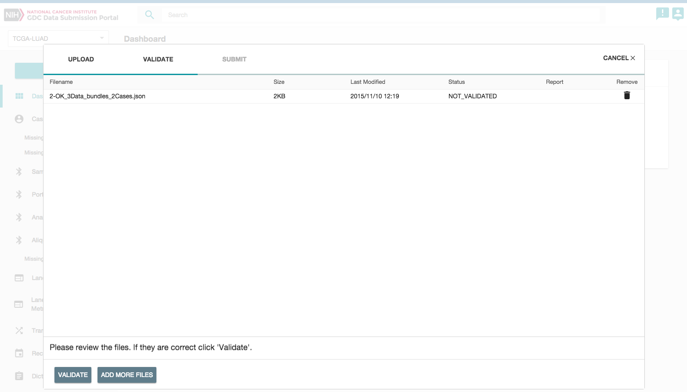
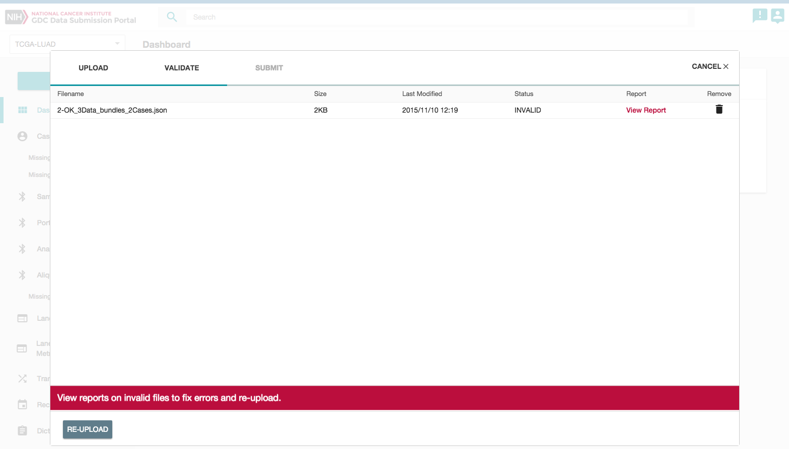

# Overview

GDC Data Submission process is detailed on the [GDC Website]( https://gdc.nci.nih.gov/submit-data/data-submission-processes-and-tools).

# Submission Wizard

The GDC Data Submission Portal is equipped with a submission wizard window to guide you through the submission of the users files. When entering the submission process, this wizard window will provide an intuitive environment throughout the three stages of the submission:

* Upload Files.
* Validate Files.
* Submit Files.

## Upload Files

When in a project, clicking on _'SUBMIT'_ will open the submission wizard.

Files can be added either by clicking on _'CHOOSE FILE(S)'_ or by using drag and drop.

## Validate Files

As soon as the first file is added, the wizard will move to the _'VALIDATE'_ section and the user can continue to add files.

Once all files have been added, clicking on _'VALIDATE'_ will check if files are valid for submission.

If the upload contains invalid files, the user will not be able to submit the data and those files will need to be either corrected and re-uploaded or removed from the submission.

Files can be removed from the submission by clicking on the _'garbage'_ icon related to the file.

An error report is also available to provide details about why files failed validation. This report is detailed in the [Data Submission Reports](https://gdc.nci.nih.gov/node/8449/) section of the documentation.

The dictionary viewer can be used to generate a template file to be used for submission. The template can be populated with data by the user and should result in a valid file (if validation rules detailed in the dictionary are met).

## Submit Files

Once all files are valid for submission, clicking on _'SUBMIT FILES'_ will submit the files to GDC.

**Note:** Submitted files are not released immediately. The user must select to release the files and GDC must validate and harmonize the submitted data for files to be released.

You can then click on _'CLICK HERE TO VIEW THE TRANSACTION'_ to be redirected to the transaction list page.

# Download previously submitted files

The transaction page, accessible through the left panel menu, list all previous transactions for a specified project. The user can download submitted files in the details section of the screen by selected a particular transaction.
