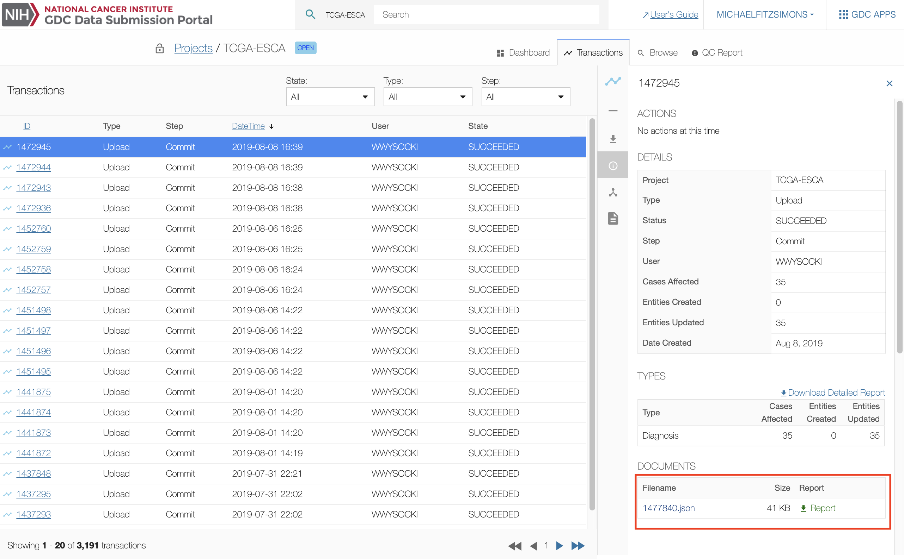

# Upload and Validate Data

## Overview

The GDC Data Submission process is detailed on the [GDC Website]( https://gdc.nci.nih.gov/submit-data/data-submission-processes-and-tools).

This chapter will focus on the upload and validation of data to the project workspace.

[](images/gdc-submission-portal-data-upload-workflow.png "Click to see the full image.")


## Introduction to Files

### File Format

The GDC Data Submission Portal supports upload for the following file formats:

* JSON
* TSV

During the upload and validation process, files are converted by the GDC API into entities and inserted into the database, maintaining a file-agnostic back end. The GDC Data Submission Portal offers the ability to download files in different formats. The system converts database entities back to the requested file format.

### File Type
The GDC Data Submission Portal supports the following types of files for upload to the GDC:

* __Clinical__: A case's clinical data.
* __Biospecimen__: Metadata describing a tissue specimen collected from a case and other materials derived from samples for analysis.
* __Annotations__: Observations associated with any entity, which can be useful for interpreting the data.

More details about the submission process, data files and file formats can be found on the GDC website at [Data Submission Processes and Tools](https://gdc.nci.nih.gov/submit-data/data-submission-processes-and-tools) and [Data Types and File Formats](https://gdc.nci.nih.gov/submit-data/gdc-data-types-and-file-formats). Details about data types supported by the GDC are described in the [GDC Data Dictionary](../../Data_Dictionary/viewer.md).

The table below is an example of files used to upload a read group to the GDC. The next section will describe how to perform these actions.

|# | File name | Description | GDC Tool |
| --- | --- | --- | --- |
|1a | read_group.tsv |Read Group Metadata|This file is uploaded to the Submission Portal by the submitter. It describes the experimental metadata.|
|1b | submitted\_unaligned_reads.tsv|Submitted File Metadata| This file is uploaded to the Submission Portal by the submitter. It describes the file metadata.|
|2 | manifest.yml|Manifest| This file can be downloaded from the Submission Portal. The manifest is used by the GDC Data Transfer Tool for the submittable data file upload.|
|3 | ExperimentFile.fastq|FASTQ File| This is the submittable data file.  It is uploaded with the GDC Data Transfer Tool using the manifest.|


## Step 1: Prepare Files

The [GDC Data Dictionary](../../Data_Dictionary/viewer.md) describes the types of entities that can be uploaded to the GDC.

The user can go to the GDC Data Dictionary to __download the template files__ for a file. The templates can be populated with data by the user and should result in a valid upload if validation rules detailed in the Data Dictionary are met. See each individual Data Dictionary entry for required fields and acceptable values for each field.


### Data Relationships

In order to identify the relationship between two entities, the user should include a reference to the parent submitter ID in the child entity file (referred to as a link). For example, a Demographic entity describes a Case entity. The user is required to identify the __cases.submitter_id__ for the related Case in the Demographic file.


### Examples

#### Demographic


An example of a __demographic file__ that can be uploaded in TSV format is detailed below.

The structure of the file is as follows:

* Type = demographic
* Unique Keys = project\_id, submitter_id
* Links = cases.submitter_id
* Properties = ethnicity, gender, etc.

```tsv
type	project_id	submitter_id	cases.submitter_id	ethnicity	gender	race	year_of_birth	year_of_death
demographic	TCGA-DEV3	TCGA-DEV-3-CASE-000-D1	TCGA-DEV-3-CASE-000	hispanic or latino	male	white	1950	0
demographic	TCGA-DEV3	TCGA-DEV-3-CASE-001-D1	TCGA-DEV-3-CASE-001	not reported	female	white	1956	0
```

```json
[  
   {  
      "type":"demographic",
      "project_id":"TCGA-DEV3",
      "submitter_id":"TCGA-DEV-3-CASE-000-D1",
      "cases":[
        {
      "submitter_id":"TCGA-DEV-3-CASE-000"
        }
      ],
      "ethnicity":"hispanic or latino",
      "gender":"male",
      "race":"white",
      "year_of_birth":1950,
      "year_of_death":0
   },
   {  
      "type":"demographic",
      "project_id":"TCGA-DEV3",
      "submitter_id":"TCGA-DEV-3-CASE-001-D1",
      "cases":[
        {
      "submitter_id":"TCGA-DEV-3-CASE-001"
        }
      ],
      "ethnicity":"not reported",
      "gender":"female",
      "race":"white",
      "year_of_birth":1956,
      "year_of_death":0
   }
]
```

#### Read Group Upload Example

An example of a __Read Group__ upload is detailed below. Uploading a read group requires two distinct types of metadata, which are divided into two files in this example.

The first file describes the read_group, which associates the submittable read file with information about the sequencing and library preparation.

File 1: read_group.tsv/json

```tsv
submitter_id	type	experiment_name	sequencing_center	sequencing_date	platform	instrument_model	library_strategy	flow_cell_barcode	library_selection	library_name	is_paired_end	read_length	read_group_name	aliquots.submitter_id
Blood-00001-aliquot_lane1_barcode	read_group	Resequencing	BI	2010-08-04	Illumina	Illumina HiSeq 2000	WXS	205DDABXX	Hybrid_Selection	Solexa-34688	true	75	205DD.3-2	Blood-00021-aliquot64

```


```json
{
    "submitter_id": "Blood-00001-aliquot_lane1_barcode",
    "type": "read_group",
    "experiment_name": "Resequencing",
    "sequencing_center": "BI",
    "sequencing_date": "2010-08-04",
    "platform": "Illumina",
    "instrument_model": "Illumina HiSeq 2000",
    "library_strategy": "WXS",
    "flow_cell_barcode": "205DDABXX",
    "library_selection": "Hybrid_Selection",
    "library_name": "Solexa-34688",
    "is_paired_end": true,
    "read_length": 75,
    "read_group_name": "205DD.3-2",
    "aliquots": [
        {
            "submitter_id": "Blood-00021-aliquot64"
        }
    ]   
}
```


The second describes the submitted_unaligned_reads.  This contains information about the file itself such as the file name, md5, and the data format.   

File 2: submitted\_unaligned_reads.tsv/json

```tsv
type	submitter_id	file_name	data_format	data_category	data_type	experimental_strategy	file_size	md5sum	read_groups.submitter_id
submitted_unaligned_reads	Blood-00001-aliquot_lane1_barcode.fastq	TestFile.fastq	FASTQ	Raw Sequencing Data	Unaligned Reads	WGS	61004	aa6e82d11ccd8452f813a15a6d84faf1	Blood-00001-aliquot_lane1_barcode
```


```json
{
    "type": "submitted_unaligned_reads",
    "submitter_id": "Blood-00001-aliquot_lane1_barcode.fastq",
    "file_name": "TestFile.fastq",
    "data_format": "FASTQ",
    "data_category": "Raw Sequencing Data",
    "data_type": "Unaligned Reads",
    "experimental_strategy": "WGS",
    "file_size": 61004,
    "md5sum": "aa6e82d11ccd8452f813a15a6d84faf1",
    "read_groups": [
	{
            "submitter_id": "Blood-00001-aliquot_lane1_barcode"
	}
    ]
}
```


When the files have been prepared (in TSV or JSON format), they can be uploaded with the Upload Data Wizard.

**Note:** Before clinical, biospecimen or submittable data files can be uploaded, associated cases must be registered in the GDC. If the cases are not displayed in your project dashboard, download the case template from the [GDC Data Dictionary](../../Data_Dictionary/viewer.md). Then complete it with the Case Submitter IDs and upload it with the Upload Data Wizard.

## Step 2: Upload Data Wizard

The GDC Data Submission Portal is equipped with a wizard window to guide you through the upload and validation of data. There are three stages:

* __Upload Files__: Upload a file into the user's browser, at this point nothing is submitted to the project workspace.
* __Validate Files__: Send a file to the GDC backend to validate its content (see below).
* __Commit Upload__: Submit a validated file to the project workspace.

The _'File Validation'_ stage acts as a safeguard against submitting incorrect files to the GDC Data Submission Portal. During the validation stage, the GDC API will validate the content of submitted files against the Data Dictionary to detect potential errors. Invalid files will be flagged and denied upload to the GDC until corrections are made by the user. A validation error report provided by the system can be used to isolate and correct errors for resubmission.

### Upload Files

Choosing _'UPLOAD'_ from the project dashboard (panel 1) will open the submission wizard.

[](images/GDC_Submission_Wizard_Upload_2.png "Click to see the full image.")

Files can be added either by clicking on _'CHOOSE FILE(S)'_ or by using drag and drop.

### Validate Files

When the first file is added, the wizard will move to the _'VALIDATE'_ section and the user can continue to add files.

[](images/GDC_Submission_Portal_Validate.png "Click to see the full image.")

When all files have been added, clicking on _'VALIDATE'_ will check if the files are valid for submission.

If the upload contains valid files, a message will pop up when it is finished validating.  The upload then appears in the latest transactions panel with the option to "COMMIT" or "DISCARD" the data.  

If the upload contains invalid files, a message will pop up and the user will not be able to submit the data. Invalid files will need to be either corrected and re-uploaded or removed from the submission.

Files can be removed from the submission by clicking on the _'garbage can'_ icon next to the file.

### Asynchronous Transactions

Biospecimen or clinical metadata files that were uploaded through the Submission Portal are initialized and validated without making changes to the project. See the entry in the [API Submission Guide](../../API/Users_Guide/Submission/#asynchronous-transactions) for more details. Files that not been committed yet can be seen in the [Transactions](Transactions.md) tab. These files, which have not yet been submitted to the project, can be committed or discarded using the two buttons on the right side of each transaction.

[](images/GDC_Submission_CommitDiscard.png "Click to see the full image.")

## Step 3: GDC Data Transfer Tool

The GDC Data Transfer Tool is used to upload submittable data files.

After the user uploads metadata through the Upload Data Wizard (e.g., read_group and submitted file metadata), the manifest will be available for download from the transaction report.

**Note:** You can also download the manifest from the "Submittable Data Files" section of the Browse menu.

[](images/GDC_Submission_Transactions_Get_Manifest_2.png "Click to see the full image.")

Users can use this manifest to upload their actual files with the GDC Data Transfer Tool. Please refer to the [GDC Data Transfer Tool's User Guide](../../Data_Transfer_Tool/Users_Guide/Getting_Started.md) for more information.

## Download Previously Uploaded Files

The [transaction](Transactions.md) page lists all previous transactions in the project. The user can download files uploaded to the GDC workspace in the details section of the screen by selecting one transaction and scrolling to the "DOCUMENTS" section.

[](images/GDC_Submission_Transactions_Original_Files_2.png "Click to see the full image.")
