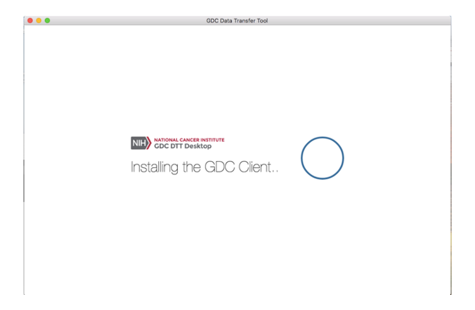
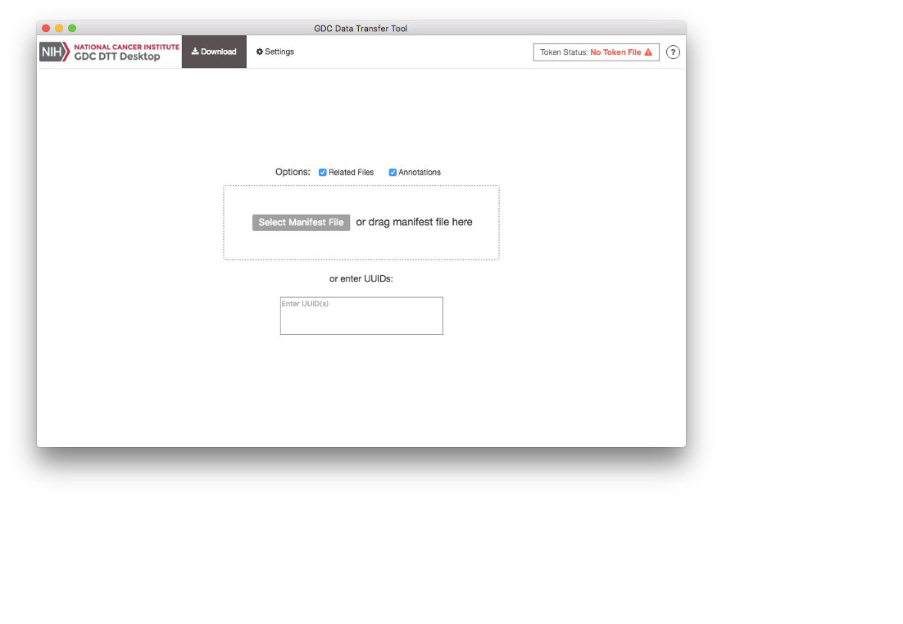
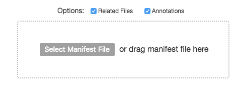
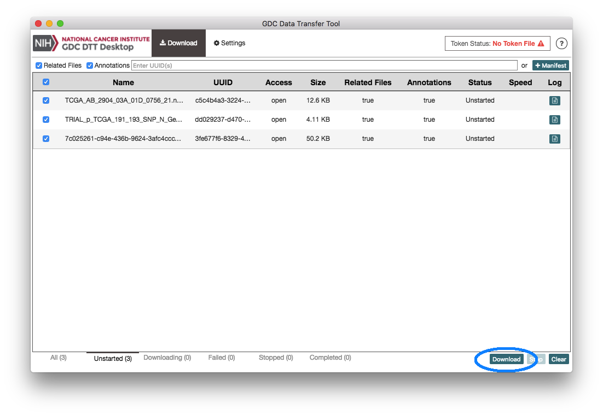
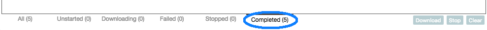
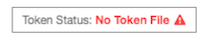
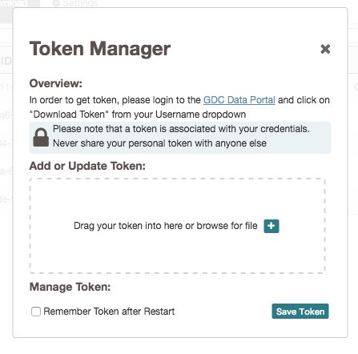
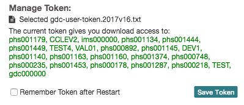
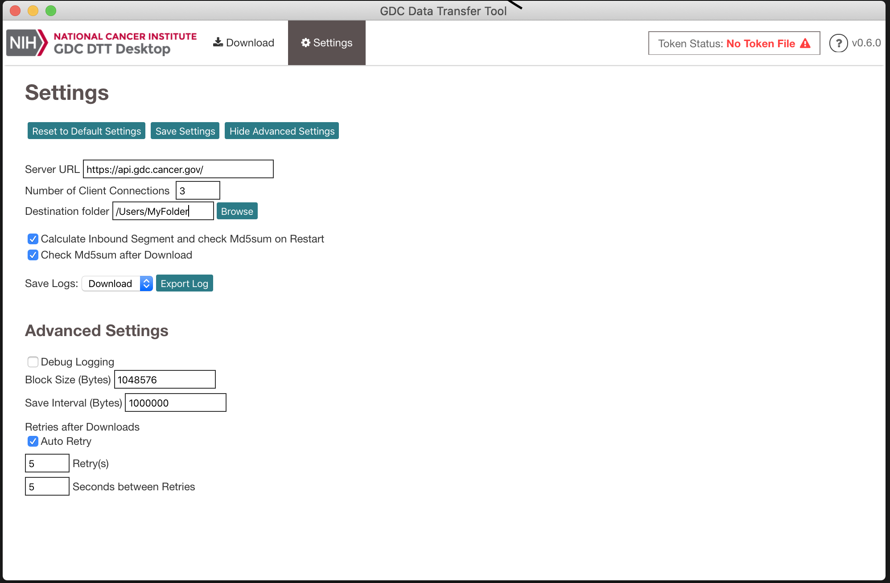

#Data Downloads with the Data Transfer Tool UI

##Data Transfer Tool UI: Overview
The UI version of the Data Transfer Tool was created for users who prefer a graphical interface over the command line or have limited command line experience.  For users with more command line experience, require large data transfers of GDC data, or need to download a large numbers of data files the command line version is recommended.

###System Recommendations

The system recommendations for using the GDC Data Transfer Tool are as follows:

* OS: Linux (Ubuntu 14.x or later), OS X (10.9 Mavericks or later), or Windows (7 or later)
* CPU: At least four 64-bit cores, Intel or AMD
* RAM: At least 2 GiB
* Storage: Enterprise-class storage system capable of at least 1 Gb/s (gigabit per second) write throughput and sufficient free space for BAM files.

###Binary Distributions

Binary distributions are available on the GDC Transfer Tool page. To install the GDC Data Transfer UI Software download the respective binary distribution and unzip the distribution's archive to a location on the target system that is easily accessible.

###Binary Installation
Once the binary has been positioned in an appropriate location on the client's file system the application will need to run though a one time installation process.  On first execution the binary install splash screen will appear showing the progress of the installation.  A hidden directory is created within the user's home directory labeled dtt that holds configuration and executable files.

###Preparing for Data Download

The GDC Data Transfer Tool UI is a stand-alone client application intended to work with data file information stored on the GDC Data Portals.  Data download information must first be gathered from either the GDC Data Portal or Legacy Archive.  From there a manifest file can be [generated](https://docs.gdc.cancer.gov/Data_Transfer_Tool/Users_Guide/Preparing_for_Data_Download_and_Upload/#obtaining-a-manifest-file-for-data-download) to supply the client.  Alternatively, individual file UUIDs can be provided to the UUID entry window located on the Download tab in the client.

##Downloads with UUIDs
The Data Transfer Tool UI can download files by individual UUID.  UUIDs can be entered into the client while on the download tab.  The single entry field labeled "Enter UUID(s)" allows the user to enter UUIDs individually.     

To obtain a data file's UUID from the GDC Data Portal, click on the file name to display the file's summary page which includes vital information such as its GDC UUID.  

##Downloads with Manifest
A portal-generated manifest file can be used with the Data Transfer Tool UI.  From the Download tab home page click on the Select Manifest File button.  A file system search window will popup allowing navigation to the manifest file.  

     

##Download Progress Page  
The Data Transfer Tool Monitors downloads - The Download Progress Page is the command console for the Data Transfer Tool UI. Progress of all downloads including the ability to start, stop, and restart a download are performed on the Download Progress Page.  Once file UUIDs or a manifest has been added to the queue the download can be started by clicking on the download button located at the lower right hand side of the page.  

Once a download has completed information about the downloads can be viewed from the Completed tab located at the bottom of the page.  Any Stopped or failed downloads can also be viewed from their respective labels located at the bottom of the Status page.  

##Controlled Access File Downloads

Some files in the GDC are labeled as controlled.  This means that prior authorization is needed to access them.  If you require access to these files and are unfamiliar with the steps needed to gain access please review the process outlined in the documentation [Obtaining Access to Controlled Data](https://gdc.cancer.gov/access-data/obtaining-access-controlled-data).    After correction authorization has been granted an access token is needed to allow the Data Transfer Tool UI application access to the requested data files.  Documentation explaining the process of generating a token is located in the [Obtaining an Authentication Token for Data Downloads](https://docs.gdc.cancer.gov/Data_Transfer_Tool/Users_Guide/Preparing_for_Data_Download_and_Upload/#obtaining-an-authentication-token-for-data-downloads).  Once a token has been download to a secure location on the client local filesystem the Data Transfer Tool UI can now access it.  

  

The current status of client authorization is viewable in the upper right corner of the application.  If the image and wording on the token manager access button is in red no valid client token file has been upload.  To upload a valid token file click on the token status button.  The token manager window should appear allowing either a drag and drop token file upload or a file navigation window can be opened to navigate to the files location.

The token manager will verify access and display the projects the token has been granted access.  To activate the access privileges of the token once it has been upload click on the save button within the Token Manager window.

##Settings and Advanced Settings

The Data Transfer Tool UI application has advanced features like concurrent download streams and a client selectable download navigation function.  

   

| Features | Details
|----------|---------|
| Number of Client Connections: | Default (3) |
Destination Folder: Default (Users Home Directory)  
Calculate Inbound Segment and check Md5sum on Restart: Default (on)
Calculates check sums on previous downloaded files on  
Save Logs: - Download Navigation windows for client downloads

The list of features on the Settings page is as follows:
