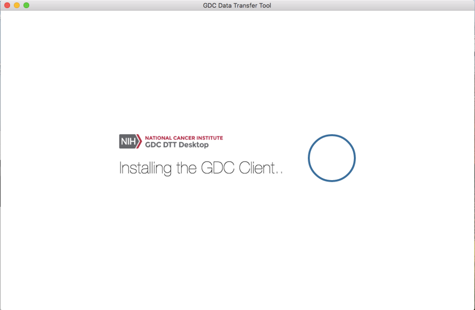

#Data Downloads from the UI

##Data Transfer Tool UI: Overview
The UI version of the Data Transfer Tool was created for users who prefer a graphical interface over the command line or have no command line experience.  For more with more command line experience who require large data transfers of GDC data or need to download a large numbers of data files the command line version is recommend.

###System Recommendations

The system recommendations for using the GDC Data Transfer Tool are as follows:

* OS: Linux (Ubuntu 14.x or later), OS X (10.9 Mavericks or later), or Windows (7 or later)
* CPU: At least four 64-bit cores, Intel or AMD
* RAM: At least 2 GiB
* Storage: Enterprise-class storage system capable of at least 1 Gb/s (gigabit per second) write throughput and sufficient free space for BAM files.

Binary Distributions

Binary distributions are available on the GDC Transfer Tool page. To install the GDC Data Transfer UI Software download the respective binary distribution and unzip the distribution's archive to a location on the target system that is easily accessible.

###Binary Installation

Once the binary has been positioned in an appropriate location on the client's file system the application will need to run thought a one time installation process.  On first execution the binary a install splash screen will appear showing the progress of the installation.  A hidden direction is created within the user home directory labled dtt that holds configuration and executable files.

###Preparing for Data Download

The GDC Data Transfer Tool UI is a stand alone client application intended to work with data file information stored on the GDC Data Portals.  Data download information must first be gathered from either the Harmonized or legacy portals.  From their a manifest file can be generated to be supplied to the client or individual file UUIDs can be looked up and added to the UUIDs entry window located on the Download tab in the client.  

Downloads with UUIDs

The Data Transfer Tool UI can download files by individual UUID.  UUIDs can be entered into the client while on the download tab.  The single entry field labeled "Enter UUID(s)"

To obtain a data file's UUID from the GDC Data Portal, click the file name to find its detail page including its GDC UUID.

The GDC Data Transfer Tool is intended to be used in conjunction with the   GDC Data Portal and the   GDC Data Submission Portal to transfer data to or from the GDC. First, the GDC Data Portal's interface is used to generate a manifest file or obtain UUID(s) and (for Controlled-Access Data) an authentication token. The GDC Data Transfer Tool is then used to transfer the data files listed in the manifest file or identified by UUID(s)
