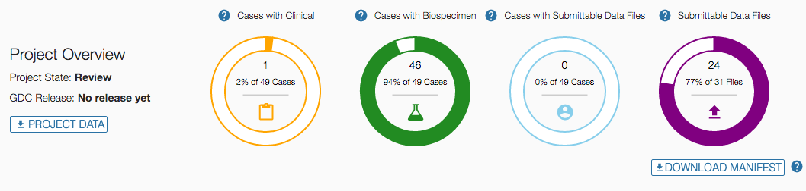

#Preparing for Data Downloads and Uploads

## Overview

The GDC Data Transfer Tool is intended to be used in conjunction with the [GDC Data Portal](https://gdc-portal.nci.nih.gov) and the [GDC Data Submission Portal](https://gdc-portal.nci.nih.gov/submission/) to transfer data to or from the GDC. First, the GDC Data Portal&#39;s interface is used to generate a manifest file or obtain UUID(s) and (for controlled data) an authentication token. The GDC Data Transfer Tool is then used to transfer the data files listed in the manifest file or identified by UUID(s).

#Downloads
## Obtaining a Manifest File for Data Download

The GDC Data Transfer Tool supports downloading multiple files listed in a GDC manifest file. Manifest files can be generated and downloaded directly from the GDC Data Portal:

First, select the data files of interest. Click the *Cart* button in the row corresponding to the file desired. The button will turn green to indicate that the file has been selected.

Once all files of interest have been selected, click on the *Cart* button in the upper right-hand corner. This will bring up the cart page, which provides an overview of all currently selected files. This list of files can be downloaded as a manifest file by clicking on the green *Download* button and selecting *Manifest* from the drop down.

## Obtaining UUIDs for Data Download

A manifest file is not required to download files from GDC. The GDC Data Transfer Tool will accept file UUID(s) instead of a manifest file for downloading individual data files. To obtain a data file's UUID from the GDC Data Portal, click the file name to find its detail page including its GDC UUID.

## Obtaining an Authentication Token

The GDC Data Transfer Tool requires an authentication token to upload data to GDC and to download controlled data. Tokens can be generated and downloaded directly from the GDC Data Portal and the GDC Submission Portal.

To generate a token, first log in to the GDC Data Portal or the GDC Submission Portal by clicking the *Login* button in the top right corner of the page. This will redirect to the eRA Commons login page. After successful authentication, the GDC Data Portal will display the username in place of the *Login* button. Here, the user Ian Miller is logged in to the GDC Data Portal, indicated by the username IANMILLER:

<!---**GDC Data Portal Home Screen after Login**--->

Clicking the username will open a drop-down menu. Select *Download Token* from the menu to generate an authentication token.

<!---**GDC Data Portal User Dropdown Menu**--->

**NOTE:** The authentication token should be kept in a secure location, as it allows access to all data accessible by the associated user.

#Uploads
## Obtaining a Manifest File for Data Uploads
Multiple data file uploads are supported by the GDC Data Transfer Tool via a manifest file. Manifest files can be generated and downloaded directly from the GDC Submission Portal.  A project's full manifest can be downloaded from the projects's dashboard home page.  

<!---**GDC Submission Portal Manifest Download**--->

**NOTE:** To download the full manifest click on the Download Manifest button on the home page of the project located just below the four status charts.

A manifest for individual files can also be downloaded from the transaction tab page of the submission project. More detailed information on the process can be found on the Submission portal's documentation section entitled [Step 4: GDC Data Transfer Tool] (https://gdc-docs.nci.nih.gov/Data_Submission_Portal/Users_Guide/Upload_Data/#step-4-gdc-data-transfer-tool).   

<!---**GDC Submission Portal Transaction Manifest Download**--->
