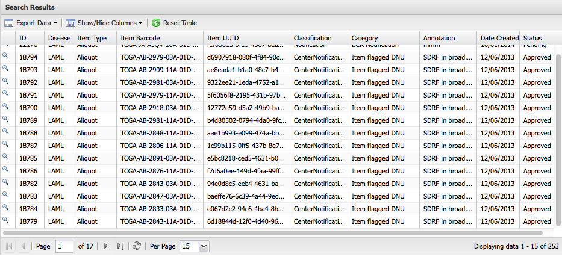

Introduction to Annotations
===========================
This document is retained for reference purposes for TCGA and should not be considered the current GDC standard.  For information on the existing GDC use of annotations please see the [Annotations Encyclopedia entry](/Encyclopedia/pages/Annotations/).

This document was adapted from https://wiki.nci.nih.gov/pages/viewpage.action?spaceKey=TCGA&title=Introduction+to+Annotations

This section includes the following topics.

**Contents of this page**

-   Annotations Overview
-   Annotation Classification and Categories

Annotations Overview
--------------------

The Annotations application allows authorized TCGA team members to add
annotations about TCGA patients and samples down to the aliquot level. These
annotations are searchable by the general public, and contain important
information about TCGA patients and samples needed for complete and accurate
analysis and interpretation of TCGA data. The current general annotation types
are: redaction, notification, CenterNotification, and observation. Redactions
and notifications are made under BCR authority. Each annotation is categorized
using controlled vocabulary. Free-form text notes may also be added. Any TCGA
user may search and download annotations against a number of metadata fields.

An annotation has multiple components, described in the following table.

| **Component**             | **Description**                                                                                                 |
|---------------------------|-----------------------------------------------------------------------------------------------------------------|
| Item type                 | Patient, Sample, Portion, Slide, Analyte, Aliquot                                                               |
| Disease                   | Tumor type, by [abbreviation](https://gdc.cancer.gov/resources-tcga-users/tcga-code-tables/sample-type-codes) |
| Item Barcode              | [barcode](TCGA_Barcode.md) of TCGA item                                                              |
| Item UUID                 | [UUID](UUID.md) of TCGA item                                                |
| Annotation Classification | controlled vocabulary, see the table below                          |
| Annotation Category       | controlled vocabulary, see the table below                          |
| Notes                     | collection of free text notes, can be added to annotations after creation                                       |
| Other metadata            | timestamp, creator                                                                                              |

The following image shows annotation components in the search results.

Annotation Classification and Categories
----------------------------------------

Categories and types of annotations have been explicitly defined, as shown in
the following table.

Annotation authority

If an annotation appears, it appears under the authority of a certain component
of TCGA. The authorizing group can be determined from the annotation
classification. For example, Redactions and Notifications possess Program Office
level authority; they are 'official', while Observations are notes from the user
base and are 'unofficial'".

| **Annotation Classification** | **Annotation Category** | **Authority**   | **Admissible for Items** | **Usage notes** |
|-------------------------------|-----------------------------------------------------------------------------|-----------------|------------------------------------------|----------------------------------------------------------------------------------------------------------------------------------------------------------------------|
| Redaction                     | Tumor tissue origin incorrect                                               | BCR             | Patient, Sample                          | Use Annotation Note to indicate details, e.g. "Case was of non-ovarian origin"                                                                                       |
| Redaction                     | Tumor type incorrect                                                        | BCR             | Patient, Sample                          | Applies to mislabeling of a disease study, organ or tissue                                                                                                           |
| Redaction                     | Genotype mismatch                                                           | BCR             | (Patient+Analyte), (Sample+Analyte)      | Incorporates conditions such as "Failed SSTR"                                                                                                                        |
| Redaction                     | Subject withdrew consent                                                    | BCR             | Patient                                  |                                                                                                                                                                      |
| Redaction                     | Subject identity unknown                                                    | BCR             | Patient                                  | Applies to patients categorized under the wrong TSS-to-BCR mapping                                                                                                   |
| Redaction                     | Duplicate case                                                              | BCR             | Patient                                  | Applies to the second (and higher) instance(s) of the same patient being accessioned through TCGA. E.g. "duplicated subject 0981"                                    |
| Redaction                     | Administrative Compliance                                                   | BCR             | Patient                                  | Use Annotation Note to indicate details e.g. "Case not meeting regulatory requirements for TCGA"                                                                     |
| Notification                  | Prior malignancy                                                            | BCR             | Patient                                  |                                                                                                                                                                      |
| Notification                  | Neoadjuvant therapy                                                         | BCR             | Patient                                  |                                                                                                                                                                      |
| Notification                  | Qualification metrics changed                                               | BCR             | Any                                      |                                                                                                                                                                      |
| Notification                  | Pathology outside specification                                             | BCR             | Sample, Portion, Slide                   |                                                                                                                                                                      |
| Notification                  | Molecular analysis outside specification                                    | BCR             | Sample, Portion, Analyte, Aliquot        |                                                                                                                                                                      |
| Notification                  | Clinical data insufficient                                                  | BCR             | Patient                                  |                                                                                                                                                                      |
| Notification                  | Item does not meet study protocol                                           | BCR             | Any                                      | This can be used for infrequently encountered situations (e.g, not Prior malignancy or Neoadjuvant therapy); details should be supplied in an Annotation Note.       |
| Notification                  | Item in special subset                                                      | BCR             | Patient, Sample                          | Use to indicate that an item is involved in a "side study". Use free text 'Annotation Note' to indicate study (e.g. "Necrosis study", "Indivumed Prior Malignancy"). |
| Notification                  | Qualified in error                                                          | BCR             | Patient                                  |                                                                                                                                                                      |
| Notification                  | Item is noncanonical                                                        | BCR             | Any                                      |                                                                                                                                                                      |
| Notification                  | New notification type                                                       | BCR             | Any                                      |                                                                                                                                                                      |
| Notification                  | History of unacceptable prior treatment related to a prior/other malignancy | BCR             | Patient                                  |                                                                                                                                                                      |
| Notification                  | History of acceptable prior treatment related to a prior/other malignancy   | BCR             | Patient                                  |                                                                                                                                                                      |
| Notification                  | Case submitted is found to be a recurrence after submission                 | BCR             | Patient                                  |                                                                                                                                                                      |
| Notification                  | Synchronous malignancy                                                      | BCR             | Patient                                  |                                                                                                                                                                      |
| CenterNotification            | Center QC failed                                                            | GSC or GCC      | Patient, Sample, Analyte, Aliquot        | QC failures at GCC/GSC/GDAC level, note describes the issue                                                                                                          |
| CenterNotification            | Item flagged DNU                                                            | GSC or GCC      | Patient, Sample, Analyte, Aliquot        | "Do not use" flag, applied by GCC/GSC/GDAC                                                                                                                           |
| Observation                   | Tumor class but appears normal                                              | Authorized User | Sample, Portion, Slide, Analyte, Aliquot |                                                                                                                                                                      |
| Observation                   | Normal class but appears diseased                                           | Authorized User | Sample, Portion, Slide, Analyte, Aliquot |                                                                                                                                                                      |
| Observation                   | Item may not meet study protocol                                            | Authorized User | Any                                      |                                                                                                                                                                      |
| Observation                   | General                                                                     | Authorized User | Any                                      |                                                                                                                                                                      |
| Observation                   | New observation type                                                        | Authorized User | Any                                      | user-suggested observation type                                                                                                                                      |
