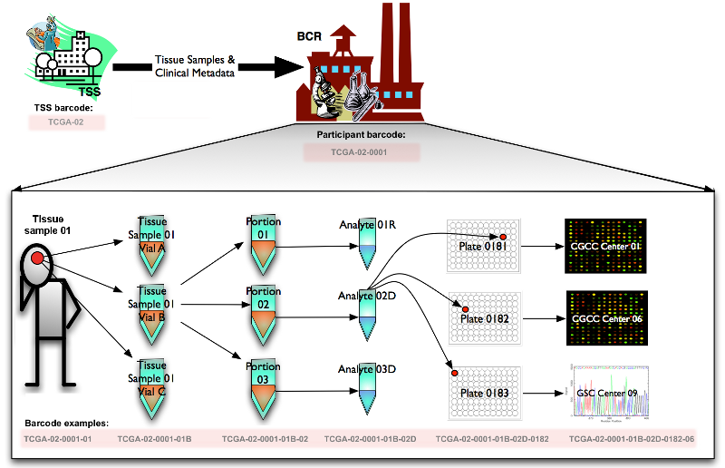

# TCGA Barcode #
## Description ##
The TCGA barcode is the primary identifier of biospecimen data within the TCGA project.  A copy of the content formerly found at https://wiki.nci.nih.gov/display/TCGA/TCGA+barcode can be found below.

## Overview ##
Historically, the BCR received participant samples and their associated metadata from TSSs. The BCR then assigned human-readable IDs, referred to as TCGA barcodes, representing the metadata of the participants and their samples. TCGA barcodes were used to tie together data that spans the TCGA network, since the IDs uniquely identify a set of results for a particular sample produced by a particular data-generating center (i.e. GCC, GSC or GDAC). The constitutive parts of this barcode provided metadata values for a sample.

Currently the BCR is assigning both a TCGA barcode and a UUID to samples. The UUID is the primary identifier.
For more information on the ID transition, see UUIDs.

### Creating Barcodes ###
All TCGA barcodes are created by the BCR. The following figure illustrates how a sample is processed and assigned a TCGA barcode at each step. Starting from the Tissue Source Site (TSS) and the participant (who donated a tissue sample to the TSS), the barcodes TCGA-02 and TCGA-02-0001 are assigned respectively. The sample itself is also assigned a barcode: TCGA-02-0001-01. The sample is split into vials (e.g. TCGA-02-0001-01B) which are divided into portions (e.g. TCGA-02-0001-01B-02). Analytes (e.g. TCGA-02-0001-01B-02D) are extracted from each portion and distributed across one or more plates (e.g. TCGA-02-0001-01B-02D-0182), where each well is identified as an aliquot (e.g. TCGA-02-0001-01B-02D-0182-06). These plates are sent to GCCs or GSCs for characterization and sequencing.
FIX this below

### Reading Barcodes ###

A TCGA barcode is composed of a collection of identifiers. Each specifically identifies a TCGA data element. Refer to the following figure for an illustration of how metadata identifiers comprise a barcode. An aliquot barcode, an example of which shows in the illustration, contains the highest number of identifiers.

| Label | Identifier for | Value | Value Description | Possible Values |
|---|---|---|---|---|
| Analyte | Molecular type of analyte for analysis | D | The analyte is a DNA sample | See Code Tables Report|
| Plate | Order of plate in a sequence of 96-well plates | 182 | The 182nd plate | 4-digit alphanumeric value |
| Portion | Order of portion in a sequence of 100 - 120 mg sample portions | 1 | The first portion of the sample | 01-99 |
| Vial | Order of sample in a sequence of samples | C | The third vial | A to Z |
| Project | Project name | TCGA | TCGA project | TCGA |
| Sample | Sample type | 1 | A solid tumor | Tumor types range from 01 - 09, normal types from 10 - 19 and control samples from 20 - 29. See Code Tables Report for a complete list of sample codes |
| Center | Sequencing or characterization center that will receive the aliquot for analysis | 1 | The Broad Institute GCC | See Code Tables Report |
| Participant | Study participant | 1 | The first participant from MD Anderson for GBM study | Any alpha-numeric value |
| TSS | Tissue source site | 2 | GBM (brain tumor) sample from MD Anderson | See Code Tables Report |

### Barcode Types ###

Barcodes can also be visualized hierarchically, with TSS barcodes at the top of the tree and aliquot barcodes at the bottom. A parent barcode prefixes any of its descendent barcodes, reflecting the derivation of one biospecimen type from another. For example, samples are collected from a participant and so the corresponding sample barcodes contain the participant barcode from which they were derived.

Using the aliquot barcode example from the figure in Reading Barcodes, the following table displays a possible set of related barcodes at each level of the hierarchy:

| Level | Bacode  | Comment |
| Aliquot | TCGA-02-0001-01C-01D-0182-01 | -- |
| Analyte | TCGA-02-0001-01C-01D | Analytes of W and X both refer to analytes derived from whole genome amplification |
| Drug | TCGA-02-0001-C1 | Drug ID is 'C','D','H','I' or 'T' followed by a number |
| Examination | TCGA-02-0001-E3124 | Examination ID is 'E' followed by a number |
| Participant | TCGA-02-0001 | -- |
| Portion | TCGA-02-0001-01C-01 | -- |
| Radiation | TCGA-02-0001-R2 | Radiation ID is 'R' followed by a number |
| Sample | TCGA-02-0001-01 | -- |
| Shipped Portion | TCGA-CM-5341-01A-21-1933-20 | Used in the platform of MDA_RPPA_CORE only |
| Slide | TCGA-02-0001-01C-01-TS1 | Tissue slide ID can be 'TS' ('Top Slide'), 'BS' ('Bottom Slide') or 'MS' ('Middle slide'), followed by a number or letter to indicate slide order |
| Surgery | TCGA-02-0001-S145 | Surgery ID is 'S' followed by a number |
| TSS | TCGA-02 | -- |

## References ##
1. [PDF from original TCGA wiki page](images/TCGA-TCGAbarcode-080518-1750-4378.pdf)

Categories: General
