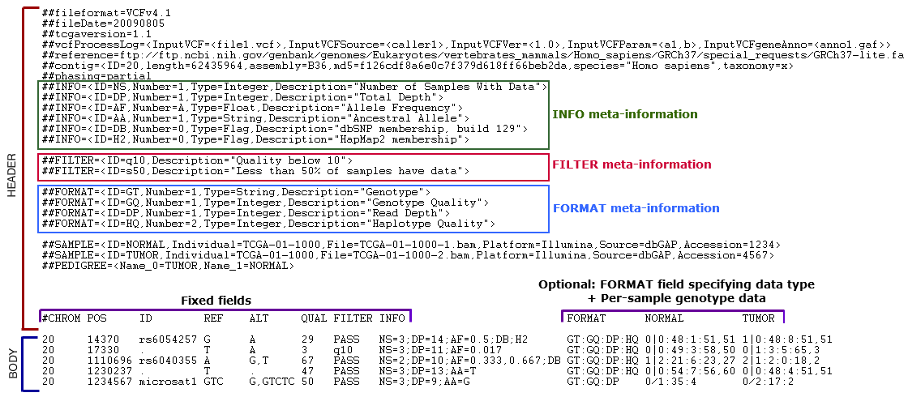
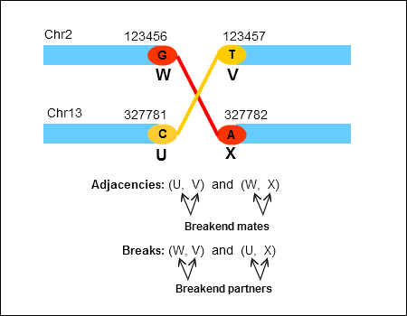

TCGA Variant Call Format (VCF) 1.1 Specification
================================================

**Document Information**
This document is retained here for reference purposes and should not be considered the current standard.  

**Specification for TCGA Variant Call Format (VCF)**  
Version 1.1

Please note that VCF files are treated as **protected** data and must be
submitted to the DCC only in **Level 2** archives.

About TCGA VCF specification
============================

Variant Call Format (VCF) is a format for storing and reporting genomic sequence
variations. VCF files are modular where the annotations and genotype information
for a variant are separated from the call itself. As of May 2011, VCF version
4.1 (described
[here](http://www.1000genomes.org/wiki/Analysis/Variant%20Call%20Format/vcf-variant-call-format-version-41))
is the most recent release. GSCs will generate sequence variation data using
high-throughput sequencing technologies and resulting variations will be
submitted to DCC as VCF files. TCGA has adopted VCF 4.1 with certain
modifications to support supplemental information specific to the project.
Subsequent sections describe the format TCGA VCF files should follow and
validation steps that would have to be implemented at the DCC.

Summary of current version changes
==================================

Following is a summary of additions/modifications for this version and the corresponding validation rule
number is included in parentheses.

**UUID compliance**: All TCGA data is currently in the process of being
converted to be UUID-compliant. Until the conversion is complete and all centers
are prepared to start submitting UUID-compliant data, some of the VCF files may
adhere to UUID-based specification whereas some may still have barcodes.
Non-UUID files will follow the specification described here but for
UUID-compliance, VCF files should satisfy the following criteria.

1.  **SampleUUID** and **SampleTCGABarcode** are required tags in each
    ##SAMPLE declaration. Please note that **SampleName** will not be a
    required tag once submitting center has fully converted to UUIDs.

    1.  Metadata represented by SampleTCGABarcode at the DCC should correspond
        to the UUID assigned to SampleUUID.

2.  **Individual** is not a required tag in ##SAMPLE declaration.

3.  If ##**INDIVIDUAL** is declared in the header, all SampleUUIDs in the
    header must correspond to the same participant, and the corresponding TCGA
    barcode for that participant should be assigned to ##INDIVIDUAL.

1.  SampleName is a required tag in ##SAMPLE declaration. The value assigned
    to SampleName should be a valid [aliquot
    barcode](https://docs.gdc.cancer.gov/Encyclopedia/pages/TCGA_Barcode/) / [UUID](https://docs.gdc.cancer.gov/Encyclopedia/pages/UUID/)
    in the database. (#15b, #15h)

2.  Header declarations for INFO and FORMAT fields should match the values
    defined in Tables 4 and 5 respectively. (#7a)

3.  Following FORMAT fields are required for all variant records in a VCF file:
    (#10c)

    -   Genotype (**GT**)

    -   Read depth (**DP**)

    -   Reads supporting ALT (**AD** or **DP4**)

    -   Average base quality for reads supporting alleles (**BQ**)

    -   Somatic status of the variant (**SS**). SS can be 0, 1, 2, 3, 4 or 5
        depending on whether relative to normal the variant is wildtype,
        germline, somatic, LOH, post-transcriptional modification, or unknown
        respectively. (#23)

4.  Values for INFO field **VLS** (validation status relative to non-adjacent
    Normal) will be checked for validity. It can be 0, 1, 2, 3, 4, or 5 based on
    whether the mutation is wildtype, germline, somatic, LOH, post
    transcriptional modification, or unknown respectively. (#9c)

5.  Validation of tags in PEDIGREE declaration has changed as follows: (#16)

    -   Name_0, Name_1, etc. do not have to be these literal strings but instead
        represent arbitrary strings.

    -   The keys and values used in the <Name_N=Value_N> should be unique
        across assignments in any given PEDIGREE declaration.

    -   Value assigned in <Name_N=Value_N> does not have to be defined as a
        SAMPLE in a genotype column or in the header.

TCGA-specific customizations
============================

The VCF 4.1 specification has been customized to support TCGA-specific variant
information. While majority of the steps pertaining to the basic structure of
the file remain the same, checks for supplemental information fields have been
introduced. For example, TCGA VCF specification allows for additional fields to
represent data associated with complex rearrangements, RNA-Seq variants, and
sample-specific metadata.

All TCGA-specific additions and modifications in [validation
steps](#validation-rules) are prefixed with a
<TCGA-VCF> tag for convenient comparison with 1000Genomes VCF 4.1. The
following table summarizes TCGA-specific customizations that have been added to
the VCF 4.1 specification. The first column, "Customization type", indicates
whether a new validation step has been introduced or if an existing step has
been modified

**Table 1: TCGA-specific validation steps**

| **Customization type** | **Description**                                                                                                                                                              | **Validation step # in TCGA-VCF 1.1 spec** | **Corresponding validation step # in VCF 4.1 spec** |
|------------------------|------------------------------------------------------------------------------------------------------------------------------------------------------------------------------|---------------------------------------------|------------------------------------------------------|
| New                    | Validate that file contains ##tcgaversion HEADER line. Its presence indicates that the file is TCGA VCF and the value assigned to the field contains format version number | \---                                        | \---                                                 |
| New                    | Additional mandatory header lines (Please refer to [Table 2](#TCGAVariantCallFormat(VCF)1.1Specificat))                                                                      | \#1                                         | \#1                                                  |
| New                    | Validation of SAMPLE meta-information lines                                                                                                                                  | \#15                                        | \---                                                 |
| New                    | Validation of PEDIGREE meta-information lines                                                                                                                                | \#16                                        | \---                                                 |
| Modification           | Acceptable value set for CHROM has been modified                                                                                                                             | \#18a,b                                     | \#16a                                                |
| Modification           | Acceptable value set for ALT has been modified                                                                                                                               | \#19                                        | \#17                                                 |
| New                    | Validation for INFO sub-field "VT" has been added                                                                                                                            | \#22                                        | \---                                                 |
| New                    | Validation for FORMAT sub-field "SS" has been added                                                                                                                          | \#23                                        | \---                                                 |
| New                    | Validation for INFO/FORMAT sub-field "DP" has been added                                                                                                                     | \#24                                        | \---                                                 |
| New                    | Validation for complex rearrangement records has been added                                                                                                                  | \#25                                        | \---                                                 |
| New                    | Validation for RNA-Seq annotation fields has been added                                                                                                                      | \#26                                        | \---                                                 |
| New                    | Mandatory FORMAT fields have been added                                                                                                                                      | \#10c                                       | \---                                                 |
| New                    | Check for consistent definitions for INFO and FORMAT fields                                                                                                                  | \#7a                                        | \---                                                 |

File format
===========

The following example (based on [VCF version
4.1)](http://www.1000genomes.org/wiki/Analysis/Variant%20Call%20Format/vcf-variant-call-format-version-41)
shows different components of a TCGA VCF file. Any VCF file contains two main
sections. The HEADER section contains meta-information for variant records that
are reported as individual rows in the BODY of the VCF file. Both sections are
described below.

**Case-sensitivity**: Please note that all fields and their associated
validation rules are case-sensitive (as given in the specification) unless noted
otherwise.

**Figure 1: Components of a sample TCGA VCF file**

|  |
|------------------------------------------|

HEADER
------

The HEADER contains meta-information lines that provide supplemental information
about variants contained in BODY of the file. HEADER lines could be formatted in
the following two ways:

    ##key=value

    Example:

    ##fileformat=VCFv4.1

    ##fileDate=20090805

or

    ##FIELDTYPE=<key1=value1,key2=value2,...>

    Example:

    ##INFO=<ID=AA,Number=1,Type=String,Description="Ancestral Allele">

Meta-information could be applicable either to all variant records in the file
(e.g., date of creation of file) or to individual variants (e.g., flag to
indicate whether a given variant exists in dbSNP).

### Generic meta-information

**Format**: *##key=value* OR *##FIELDTYPE=<key1=value1,key2=value2,...>*

The following table lists some of the reserved field names. Files can be
customized to contain additional meta-information fields as long as they are not
in conflict with reserved field names. The first field in Table 2 (fileformat)
is mandatory and lists the VCF version number of the file.

**Table 2: Examples of generic meta-information fields**

| **Field**     | **Case-Sensitive**    | **Description** |  **Sample values** | Required (fields in red are TCGA-specific requirements)
| ------------- | --------------------- | --------------- | ------------------ | ----------------------------------------------------- |
| Fileformat    | No                 | Lists the VCF version number the file is based on; must be the first line in the file                                                                                                                                                                                                                                                                                                                                                                                                                                                                                                                                                                                                                                                                                                                                                                                                                                         | ##fileformat=VCFv4.1                                                                                                                                                                                                                                                                                                                                                                                                                                                                                    | Yes                                                                                                   |
| fileDate      | No                 | Date file was created; should be in yyyymmdd format                                                                                                                                                                                                                                                                                                                                                                                                                                                                                                                                                                                                                                                                                                                                                                                                                                                                           | ##fileDate=20090805                                                                                                                                                                                                                                                                                                                                                                                                                                                                                     | Yes                                                                                                   |
| Tcgaversion   | No                 | Indicates that the file follows TCGA-VCF specification. Format version number is assigned to the field.                                                                                                                                                                                                                                                                                                                                                                                                                                                                                                                                                                                                                                                                                                                                                                                                                       | ##tcgaversion=1.1                                                                                                                                                                                                                                                                                                                                                                                                                                                                                       | Yes                                                                                                   |
| Reference     | No                 | Reference build used for variant calling and against which variant coordinates are shown                                                                                                                                                                                                                                                                                                                                                                                                                                                                                                                                                                                                                                                                                                                                                                                                                                      | ##reference=1000GenomesPilot-NCBI36                                                                                                                                                                                                                                                                                                                                                                                                                                                                     | Yes                                                                                                   |
|               |                    |                                                                                                                                                                                                                                                                                                                                                                                                                                                                                                                                                                                                                                                                                                                                                                                                                                                                                                                               |                                                                                                                                                                                                                                                                                                                                                                                                                                                                                                           |                                                                                                       |
|               |                    |                                                                                                                                                                                                                                                                                                                                                                                                                                                                                                                                                                                                                                                                                                                                                                                                                                                                                                                               | OR                                                                                                                                                                                                                                                                                                                                                                                                                                                                                                        |                                                                                                       |
|               |                    |                                                                                                                                                                                                                                                                                                                                                                                                                                                                                                                                                                                                                                                                                                                                                                                                                                                                                                                               |                                                                                                                                                                                                                                                                                                                                                                                                                                                                                                           |                                                                                                       |
|               |                    |                                                                                                                                                                                                                                                                                                                                                                                                                                                                                                                                                                                                                                                                                                                                                                                                                                                                                                                               | ##reference=<ID=hg18,                                                                                                                                                                                                                                                                                                                                                                                                                                                                                  |                                                                                                       |
|               |                    |                                                                                                                                                                                                                                                                                                                                                                                                                                                                                                                                                                                                                                                                                                                                                                                                                                                                                                                               | Source=<file://seq/references/1000GenomesPilot-NCBI36.fasta>                                                                                                                                                                                                                                                                                                                                                                                                                                              |                                                                                                       |
| Assembly      | No                 | External assembly file. The field can be assigned a file name if assembly file is included in the archive submitted to the DCC or it can be a URL pointing to the file location.                                                                                                                                                                                                                                                                                                                                                                                                                                                                                                                                                                                                                                                                                                                                              | ##assembly=[ftp://ftp-trace.ncbi.nih.gov/](ftp://ftp-trace.ncbi.nih.gov/1000genomes/ftp/release/sv/breakpoint_assemblies.fasta)                                                                                                                                                                                                                                                                                                                                                                         | Yes                                                                                                   |
|               |                    |                                                                                                                                                                                                                                                                                                                                                                                                                                                                                                                                                                                                                                                                                                                                                                                                                                                                                                                               | [1000genomes/ftp/release/sv/breakpoint_assemblies.fasta](ftp://ftp-trace.ncbi.nih.gov/1000genomes/ftp/release/sv/breakpoint_assemblies.fasta)                                                                                                                                                                                                                                                                                                                                                             | (if a contig from an assembly file is being referred to in the VCF file, especially for breakends)    |
| center        | No                 | Name of the center where VCF file is generated. A comma-separated list can be provided if files from multiple centers are merged.                                                                                                                                                                                                                                                                                                                                                                                                                                                                                                                                                                                                                                                                                                                                                                                             | ##center="Broad"                                                                                                                                                                                                                                                                                                                                                                                                                                                                                        | Yes                                                                                                   |
|               |                    |                                                                                                                                                                                                                                                                                                                                                                                                                                                                                                                                                                                                                                                                                                                                                                                                                                                                                                                               |                                                                                                                                                                                                                                                                                                                                                                                                                                                                                                           |                                                                                                       |
|               |                    |                                                                                                                                                                                                                                                                                                                                                                                                                                                                                                                                                                                                                                                                                                                                                                                                                                                                                                                               | OR                                                                                                                                                                                                                                                                                                                                                                                                                                                                                                        |                                                                                                       |
|               |                    |                                                                                                                                                                                                                                                                                                                                                                                                                                                                                                                                                                                                                                                                                                                                                                                                                                                                                                                               |                                                                                                                                                                                                                                                                                                                                                                                                                                                                                                           |                                                                                                       |
|               |                    |                                                                                                                                                                                                                                                                                                                                                                                                                                                                                                                                                                                                                                                                                                                                                                                                                                                                                                                               | ##center="Broad,UCSC,BCM"                                                                                                                                                                                                                                                                                                                                                                                                                                                                               |                                                                                                       |
| phasing       | No                 | Indicates whether genotype calls are partially phased (phasing=partial) or unphased (phasing=none)                                                                                                                                                                                                                                                                                                                                                                                                                                                                                                                                                                                                                                                                                                                                                                                                                            | ##phasing=none                                                                                                                                                                                                                                                                                                                                                                                                                                                                                          | Yes                                                                                                   |
| geneAnno      | No                 | URL of the gene annotation source e.g., Generic Annotation File (GAF)                                                                                                                                                                                                                                                                                                                                                                                                                                                                                                                                                                                                                                                                                                                                                                                                                                                         | ##geneAnno=[https://gdc.cancer.gov/about-data/data-harmonization-and-generation/gdc-reference-files](https://api.gdc.cancer.gov/legacy/data/95c3618c-bd9e-4df4-96e4-ef8d54710e51)                                                                                                                                                                                                                                                                                                                                                              | Yes (if annotation tags like GENE, SID and RGN are used) |
| vcfProcessLog | No                 | Lists algorithm, version and settings used to generate variant calls in a VCF file. If multiple VCF files are processed to produce a single merged file, the field records attributes for individual VCF files and the programs used to merge the files along with the associated version, parameters and contact information of the person who produced the merged file.  | | | | | **Note**: If VCF file does not represent a set of merged files, *MergeSoftware*, *MergeParam*, *MergeVer* and *MergeContact* tags will not be applicable and can be omitted.                                          
                                                                |      |      |    | ##vcfProcessLog=<InputVCF=<file1.vcf>,                                                                                                          InputVCFSource=<varCaller1>,                                                                                                                                                                                                                                                                                                                                                                                                                                                                            |                                                                                                       |
|               |                    | **Note**: If VCF file does not represent a set of merged files, *MergeSoftware*, *MergeParam*, *MergeVer* and *MergeContact* tags will not be applicable and can be omitted.                                                                                                                                                                                                                                                                                                                                                                                                                                                                                                                                                                                                                                                                                                                                                  | InputVCFVer=<1.0>,                                                                                                                                                                                                                                                                                                                                                                                                                                                                                      |                                                                                                       |
|               |                    |                                                                                                                                                                                                                                                                                                                                                                                                                                                                                                                                                                                                                                                                                                                                                                                                                                                                                                                               | InputVCFParam=<a1,c2>                                                                                                                                                                                                                                                                                                                                                                                                                                                                                   |                                                                                                       |
|               |                    | **Note**: If multiple parameters need to be declared in *InputVCFParam*, key=value pairs can be used to name these parameters. For example:                                                                                                                                                                                                                                                                                                                                                                                                                                                                                                                                                                                                                                                                                                                                                                                   | InputVCFgeneAnno=<anno1.gaf>>                                                                                                                                                                                                                                                                                                                                                                                                                                                                          |                                                                                                       |
|               |                    | InputVCFParam=<key1=value1,key2=value2>                                                                                                                                                                                                                                                                                                                                                                                                                                                                                                                                                                                                                                                                                                                                                                                                                                                                                     |                                                                                                                                                                                                                                                                                                                                                                                                                                                                                                           |                                                                                                       |
|               |                    | If there are multiple files for which parameters have to be declared, following format can be used:                                                                                                                                                                                                                                                                                                                                                                                                                                                                                                                                                                                                                                                                                                                                                                                                                           | OR                                                                                                                                                                                                                                                                                                                                                                                                                                                                                                        |                                                                                                       |
|               |                    | InputVCFParam=<key1_1=value1_1,key1_2=value1_2;key2_1=value2_1,key2_2=value2_2>                                                                                                                                                                                                                                                                                                                                                                                                                                                                                                                                                                                                                                                                                                                                                                                                                                             |                                                                                                                                                                                                                                                                                                                                                                                                                                                                                                           |                                                                                                       |
|               |                    |                                                                                                                                                                                                                                                                                                                                                                                                                                                                                                                                                                                                                                                                                                                                                                                                                                                                                                                               | ##vcfProcessLog=<InputVCF=<file1.vcf,file2.vcf,file3.vcf>,                                                                                                                                                                                                                                                                                                                                                                                                                                           |                                                                                                       |
|               |                    |                                                                                                                                                                                                                                                                                                                                                                                                                                                                                                                                                                                                                                                                                                                                                                                                                                                                                                                               | InputVCFSource=<varCaller1,varCaller2,varCaller3>,                                                                                                                                                                                                                                                                                                                                                                                                                                                      |                                                                                                       |
|               |                    |                                                                                                                                                                                                                                                                                                                                                                                                                                                                                                                                                                                                                                                                                                                                                                                                                                                                                                                               | InputVCFVer=<1.0,2.1,2.0>,                                                                                                                                                                                                                                                                                                                                                                                                                                                                              |                                                                                                       |
|               |                    |                                                                                                                                                                                                                                                                                                                                                                                                                                                                                                                                                                                                                                                                                                                                                                                                                                                                                                                               | InputVCFParam=<a1,c2;a1,b1;a1,b1>,                                                                                                                                                                                                                                                                                                                                                                                                                                                                      |                                                                                                       |
|               |                    |                                                                                                                                                                                                                                                                                                                                                                                                                                                                                                                                                                                                                                                                                                                                                                                                                                                                                                                               | InputVCFgeneAnno=<anno1.gaf,anno2.gaf,anno3.gaf>,                                                                                                                                                                                                                                                                                                                                                                                                                                                       |                                                                                                       |
|               |                    |                                                                                                                                                                                                                                                                                                                                                                                                                                                                                                                                                                                                                                                                                                                                                                                                                                                                                                                               | MergeSoftware=<sw1,sw2>,                                                                                                                                                                                                                                                                                                                                                                                                                                                                                |                                                                                                       |
|               |                    |                                                                                                                                                                                                                                                                                                                                                                                                                                                                                                                                                                                                                                                                                                                                                                                                                                                                                                                               | MergeParam=<a1,a2;b1,b2>,                                                                                                                                                                                                                                                                                                                                                                                                                                                                               |                                                                                                       |
|               |                    |                                                                                                                                                                                                                                                                                                                                                                                                                                                                                                                                                                                                                                                                                                                                                                                                                                                                                                                               | MergeVer=<2.1,3.0>,                                                                                                                                                                                                                                                                                                                                                                                                                                                                                     |                                                                                                       |
|               |                    |                                                                                                                                                                                                                                                                                                                                                                                                                                                                                                                                                                                                                                                                                                                                                                                                                                                                                                                               | MergeContact=<johndoe@xyz.edu>>                                                                                                                                                                                                                                                                                                                                                                            |                      |
| INDIVIDUAL    | No                 | Specifies the individual for which data is presented in the file      | ##INDIVIDUAL=TCGA-24-0980                 | No                             |

### INFO/FORMAT/FILTER meta-information

**Format**: *##FIELDTYPE=<key1=value1,key2=value2,...>*

INFO, FORMAT and FILTER (case-sensitive values) are optional fields that have to
be declared in the HEADER if they are being referred to in BODY of the file.
Different *keys* that can be used to define them are described in Table 3. All
three fields do not use the same set of keys. Please refer to individual field
definitions for further details.

**Important**: TCGA VCF 1.1 requires all VCF files to follow consistent header
declarations for standard INFO and FORMAT sub-fields. Please refer to Tables 4
and 5 for details. If a sub-field exists in these tables and is used in a TCGA
VCF file, then all <key=value> pairs in the definition should match entries in
the corresponding table for the file to pass validation.

**Table 3: Description of keys used in INFO/FORMAT/FILTER meta-information
declarations**

| **Key**     | **Case-sensitive** | **Description** | **Data Type (Possible values)** | **Additional Notes** |
| ----------- | ------------------ | --------------- | ------------------------------- | -------------------- |
| ID          | Yes                | name of the field; also used in BODY of the file to assign values for individual variant records | String, no whitespaces, no comma                                                                                                                         | \---                                                                                                                                                                                                         |
| Number      | Yes                | specifies the number of values that can be associated with the corresponding field               | Set                                                                                                                                                      | Any integer \>= 0 indicating number of values;                                                                                                                                                               |
|             |                    |                                                                                                  | *(Integer \>= 0, "A", "G", ".")*                                                                                                                         | "A", if the field has one value per alternate allele;                                                                                                                                                        |
|             |                    |                                                                                                  |                                                                                                                                                          | "G", if the field has one value per genotype;                                                                                                                                                                |
|             |                    |                                                                                                  |                                                                                                                                                          | ".", if number of values varies, is unknown, or is unbounded                                                                                                                                                 |
| Type        | Yes                | indicates data type of the value associated with the field                                       | Set                                                                                                                                                      | "Flag" type indicates that the field does not contain a value entry, and hence the *Number* should be 0 in this case. FORMAT fields cannot have a "Flag" *Type* assigned to them.                            |
|             |                    |                                                                                                  | *(Integer, Float, Flag, Character, String)*                                                                                                              |                                                                                                                                                                                                              |
| Description | Yes                | provides a brief description of the field                                                        | String, surrounded by double-quotes, cannot itself contain a double-quote, cannot contain trailing whitespace at the end of string before closing quotes | \---                                                                                                                                                                                                         |

#### INFO lines

**Format**: *##INFO=<key1=value1,key2=value2,...>*  
**Required keys**: ID, Type, Number, Description

INFO fields are optional and contain additional annotations for a variant.
Certain INFO fields have already been created and exist as reserved fields in
the current VCF standard. Custom INFO fields can be added based on study
requirements as long as they do not use the reserved field names. If an INFO
field is declared in the header, it needs to be described further using the
following format:

    ##INFO=<ID=ID,Number=number,Type=type,Description=description>

    Example:

    ##INFO=<ID=AA,Number=1,Type=String,Description="Ancestral Allele">

    ##INFO=<ID=AF,Number=A,Type=Float,Description="Allele Frequ

    ency">

#### FORMAT lines

**Format**: *##FORMAT=<key1=value1,key2=value2,...>*  
**Required keys**: ID, Type, Number, Description

FORMAT declaration lines are used when annotations need to be added for
individual genotypes associated with each sample in the file. FORMAT sub-fields
are declared precisely as the INFO sub-fields with the exception that a FORMAT
sub-field cannot be assigned a "Flag" *Type.*

    ##FORMAT=<ID=ID,Number=number,Type=type,Description=description>

    Example:

    ##FORMAT=<ID=GT,Number=1,Type=String,Description="Genotype">

    ##FORMAT=<ID=GQ,Number=1,Type=Integer,Description="Genotype Quality">

**Important**: TCGA VCF 1.1 requires the following FORMAT sub-fields to be
defined for all variant records. Therefore, these FORMAT lines are not optional
for TCGA VCF files and should be declared in the header. Please refer to Table 5
for definitions for these sub-fields.

-   Genotype (**GT**)

-   Read depth (**DP**)

-   Reads supporting ALT (**AD** or **DP4**). Either AD or DP4 is required to be
    defined although DP4 is preferred.

-   Average base quality for reads supporting alleles (**BQ**)

-   Somatic status of the variant (**SS**). SS can be 0, 1, 2, 3, 4, or 5
    depending on whether relative to normal the variant is wildtype, germline,
    somatic, LOH, post-transcriptional modification, or unknown respectively.

These should be considered as required fields so that they are included by
default unless there is an exceptional scenario where the information for a
field cannot be obtained. In such a case, "." can be used to indicate missing
value.

#### FILTER lines

**Format**: *##FILTER=<key1=value1,key2=value2,...>*  
**Required keys**: ID, Description

FILTER fields are defined to list filtering criteria used for generating variant
calls. Custom filters can be applied as long as a definition is provided in the
HEADER. FILTERs that have been applied to the data should be described as
follows. Please note that FILTER declarations do not include *Type* or *Number*
keys.

    ##FILTER=<ID=ID,Description=description>

    Example:

    ##FILTER=<ID=q10,Description="Quality below 10">

    ##FILTER=<ID=s50,Description="Less than 50% of samples have data">

#### Consistent definitions for reserved INFO and FORMAT fields

To ensure that all TCGA VCF files have consistent definitions for standard
fields and to avoid merging errors due to contradicting definitions, following
header declarations for common fields are proposed. The 'Source' column in the
tables below indicates whether the field is from 1000Genomes VCF or if it is
specific to TCGA-VCF. By adhering to these definitions, we can ensure that a
given field is interpreted the same way across all centers and that same
'Number', 'Type' and 'Description' values are used for these IDs.

##### Table 4: INFO sub-field definitions

| **Sub-field** | **Source** | **Formatted declaration**                                                                                                                                                                           |
|---------------|------------|-----------------------------------------------------------------------------------------------------------------------------------------------------------------------------------------------------|
| AA            | VCF        | ##INFO=<ID=AA,Number=1,Type=String,Description="Ancestral Allele">                                                                                                                              |
| AC            | VCF        | ##INFO=<ID=AC,Number=.,Type=Integer,Description="Allele count in genotypes, for each ALT allele, in the same order as listed">                                                                  |
| AF            | VCF        | ##INFO=<ID=AF,Number=.,Type=Float,Description="Allele Frequency in primary data, for each ALT allele, in the same order as listed">                                                             |
| AN            | VCF        | ##INFO=<ID=AN,Number=1,Type=Integer,Description="Total number of alleles in called genotypes">                                                                                                  |
| BQ            | VCF        | ##INFO=<ID=BQ,Number=1,Type=Integer,Description="RMS base quality">                                                                                                                             |
| CIGAR         | VCF        | ##INFO=<ID=CIGAR,Number=1,Type=Integer,Description="Cigar string describing how to align an alternate allele to the reference allele">                                                          |
| DB            | VCF        | ##INFO=<ID=DB,Number=0,Type=Flag,Description="dbSNP membership">                                                                                                                                |
| DP            | VCF        | ##INFO=<ID=DP,Number=1,Type=Integer,Description="Total Depth across samples">                                                                                                                   |
| END           | VCF        | ##INFO=<ID=END,Number=1,Type=Integer,Description="End position of the variant described in this record">                                                                                        |
| H2            | VCF        | ##INFO=<ID=H2,Number=0,Type=Flag,Description="HapMap2 membership">                                                                                                                              |
| H3            | VCF        | ##INFO=<ID=H3,Number=0,Type=Flag,Description="HapMap3 membership">                                                                                                                              |
| MQ            | VCF        | ##INFO=<ID=MQ,Number=1,Type=Integer,Description="RMS Mapping Quality">                                                                                                                          |
| MQ0           | VCF        | ##INFO=<ID=MQ0,Number=1,Type=Integer,Description="Total Mapping Quality Zero Reads">                                                                                                            |
| NS            | VCF        | ##INFO=<ID=NS,Number=1,Type=Integer,Description="Number of Samples With Data">                                                                                                                  |
| SB            | VCF        | ##INFO=<ID=SB,Number=1,Type=Float,Description="Strand bias">                                                                                                                                    |
| SOMATIC       | VCF        | ##INFO=<ID=SOMATIC,Number=0,Type=Flag,Description="Indicates if record is a somatic mutation">                                                                                                  |
| VALIDATED     | VCF        | ##INFO=<ID=VALIDATED,Number=0,Type=Flag,Description="Indicates if variant has been validated by follow-up experiment">                                                                          |
| 1000G         | VCF        | ##INFO=<ID=1000G,Number=0,Type=Flag,Description="Indicates membership in 1000Genomes">                                                                                                          |
| IMPRECISE     | VCF        | ##INFO=<ID=IMPRECISE,Number=0,Type=Flag,Description="Imprecise structural variation">                                                                                                           |
| NOVEL         | VCF        | ##INFO=<ID=NOVEL,Number=0,Type=Flag,Description="Indicates a novel structural variation">                                                                                                       |
| SVTYPE        | VCF        | ##INFO=<ID=SVTYPE,Number=1,Type=String,Description="Type of structural variant">                                                                                                                |
| SVLEN         | VCF        | ##INFO=<ID=SVLEN,Number=.,Type=Integer,Description="Difference in length between REF and ALT alleles">                                                                                          |
| CIPOS         | VCF        | ##INFO=<ID=CIPOS,Number=2,Type=Integer,Description="Confidence interval around POS for imprecise variants">                                                                                     |
| CIEND         | VCF        | ##INFO=<ID=CIEND,Number=2,Type=Integer,Description="Confidence interval around END for imprecise variants">                                                                                     |
| HOMLEN        | VCF        | ##INFO=<ID=HOMLEN,Number=.,Type=Integer,Description="Length of base pair identical micro-homology at event breakpoints">                                                                        |
| HOMSEQ        | VCF        | ##INFO=<ID=HOMSEQ,Number=.,Type=String,Description="Sequence of base pair identical micro-homology at event breakpoints">                                                                       |
| BKPTID        | VCF        | ##INFO=<ID=BKPTID,Number=.,Type=String,Description="ID of the assembled alternate allele in the assembly file">                                                                                 |
| MEINFO        | VCF        | ##INFO=<ID=MEINFO,Number=4,Type=String,Description="Mobile element info of the form NAME,START,END,POLARITY">                                                                                   |
| METRANS       | VCF        | ##INFO=<ID=METRANS,Number=4,Type=String,Description="Mobile element transduction info of the form CHR,START,END,POLARITY">                                                                      |
| DGVID         | VCF        | ##INFO=<ID=DGVID,Number=1,Type=String,Description="ID of this element in Database of Genomic Variation">                                                                                        |
| DBVARID       | VCF        | ##INFO=<ID=DBVARID,Number=1,Type=String,Description="ID of this element in DBVAR"\]>                                                                                                              |
| DBRIPID       | VCF        | ##INFO=<ID=DBRIPID,Number=1,Type=String,Description="ID of this element in DBRIP">                                                                                                              |
| MATEID        | VCF        | ##INFO=<ID=MATEID,Number=.,Type=String,Description="ID of mate breakends">                                                                                                                      |
| PARID         | VCF        | ##INFO=<ID=PARID,Number=1,Type=String,Description="ID of partner breakend">                                                                                                                     |
| EVENT         | VCF        | ##INFO=<ID=EVENT,Number=1,Type=String,Description="ID of event associated to breakend">                                                                                                         |
| CILEN         | VCF        | ##INFO=<ID=CILEN,Number=2,Type=Integer,Description="Confidence interval around the length of the inserted material between breakends">                                                          |
| DPADJ         | VCF        | ##INFO=<ID=DPADJ,Number=.,Type=Integer,Description="Read Depth of adjacency">                                                                                                                   |
| CN            | VCF        | ##INFO=<ID=CN,Number=1,Type=Integer,Description="Copy number of segment containing breakend">                                                                                                   |
| CNADJ         | VCF        | ##INFO=<ID=CNADJ,Number=.,Type=Integer,Description="Copy number of adjacency">                                                                                                                  |
| CICN          | VCF        | ##INFO=<ID=CICN,Number=2,Type=Integer,Description="Confidence interval around copy number for the segment">                                                                                     |
| CICNADJ       | VCF        | ##INFO=<ID=CICNADJ,Number=.,Type=Integer,Description="Confidence interval around copy number for the adjacency">                                                                                |
| VLS           | TCGA-VCF   | ##INFO=<ID=VLS,Number=1,Type=Integer,Description="Final validation status relative to non-adjacent Normal,0=wildtype,1=germline,2=somatic,3=LOH,4=post transcriptional modification,5=unknown"> |
| SID           | TCGA-VCF   | ##INFO=<ID=SID,Number=.,Type=String,Description="Unique identifier from gene annotation source or unknown">                                                                                     |
| GENE          | TCGA-VCF   | ##INFO=<ID=GENE,Number=.,Type=String,Description="HUGO gene symbol or Unknown">                                                                                                                 |
| RGN           | TCGA-VCF   | ##INFO=<ID=RGN,Number=.,Type=String,Description="Region where nucleotide variant occurs in relation to a gene">                                                                                 |
| RE            | TCGA-VCF   | ##INFO=<ID=RE,Number=0,Type=Flag,Description="Position known to have RNA-edits to occur">                                                                                                       |
| VT            | TCGA-VCF   | ##INFO=<ID=VT,Number=1,Type=String,Description="Variant type, can be SNP, INS or DEL">                                                                                                          |

##### Table 5: FORMAT sub-field definitions

| **Sub-field** | **Source** | **Formatted declaration**                                                                                                                                                                   |
|---------------|------------|---------------------------------------------------------------------------------------------------------------------------------------------------------------------------------------------|
| GT            | VCF        | ##FORMAT=<ID=GT,Number=1,Type=String,Description="Genotype">                                                                                                                            |
| DP            | VCF        | ##FORMAT=<ID=DP,Number=1,Type=Integer,Description="Read depth at this position in the sample">                                                                                          |
| FT            | VCF        | ##FORMAT=<ID=FT,Number=1,Type=String,Description="Sample genotype filter">                                                                                                              |
| GL            | VCF        | ##FORMAT=<ID=GL,Number=.,Type=Float,Description="Genotype likelihoods">                                                                                                                 |
| PL            | VCF        | ##FORMAT=<ID=PL,Number=3,Type=Integer,Description="Normalized, Phred-scaled likelihoods for AA,AB,BB genotypes where A=ref and B=alt; not applicable if site is not biallelic">         |
| GP            | VCF        | ##FORMAT=<ID=GP,Number=.,Type=Float,Description="Phred-scaled genotype posterior probabilities">                                                                                        |
| GQ            | VCF        | ##FORMAT=<ID=GQ,Number=.,Type=Integer,Description="Conditional Phred-scaled genotype quality">                                                                                          |
| HQ            | VCF        | ##FORMAT=<ID=HQ,Number=2,Type=Integer,Description="Haplotype qualities, two comma separated phred qualities">                                                                           |
| CN            | VCF        | ##FORMAT=<ID=CN,Number=1,Type=Integer,Description="Copy number genotype for imprecise events">                                                                                          |
| CNQ           | VCF        | ##FORMAT=<ID=CNQ,Number=1,Type=Float,Description="Copy number genotype quality for imprecise events">                                                                                   |
| CNL           | VCF        | ##FORMAT=<ID=CNL,Number=.,Type=Float,Description="Copy number genotype likelihood for imprecise events">                                                                                |
| MQ            | VCF        | ##FORMAT=<ID=MQ,Number=1,Type=Integer,Description="Phred style probability score that the variant is novel with respect to the genome's ancestor">                                      |
| HAP           | VCF        | ##FORMAT=<ID=HAP,Number=1,Type=Integer,Description="Unique haplotype identifier">                                                                                                       |
| AHAP          | VCF        | ##FORMAT=<ID=AHAP,Number=1,Type=Integer,Description="Unique identifier of ancestral haplotype">                                                                                         |
| SS            | TCGA-VCF   | ##FORMAT=<ID=SS,Number=1,Type=Integer,Description="Variant status relative to non-adjacent Normal,0=wildtype,1=germline,2=somatic,3=LOH,4=post-transcriptional modification,5=unknown"> |
| TE            | TCGA-VCF   | ##FORMAT=<ID=TE,Number=.,Type=String,Description="Translational effect of the variant in a codon">                                                                                      |
| AD            | TCGA-VCF   | ##FORMAT=<ID=AD,Number=.,Type=Integer,Description="Depth of reads supporting alleles 0/1/2/3...">                                                                                       |
| DP4           | TCGA-VCF   | ##FORMAT=<ID=DP4,Number=4,Type=Integer,Description="Number of high-quality ref-forward, ref-reverse, alt-forward and alt-reverse bases">                                                |
| BQ            | TCGA-VCF   | ##FORMAT=<ID=BQ,Number=.,Type=Integer,Description="Average base quality for reads supporting alleles">                                                                                  |
| VAQ           | TCGA-VCF   | ##FORMAT=<ID=VAQ,Number=1,Type=Integer,Description="Variant allele quality">                                                                                                            |

### TCGA-specific meta-information

#### PEDIGREE lines

**Format**: *##PEDIGREE=<key1=value1,key2=value2,...>*  
**Required keys**: Name_0,..,Name_N where N \>= 1;

PEDIGREE lines are used to specify derivation relationships between different
genomes. *Name_0* is associated with the derived genome and *Name_1* through
*Name_N* represent the genomes from which it is derived. In the case of tumor
clonal populations, one population is clonally derived from another. In the
example below, PRIMARY-TUMOR-GENOME is derived from GERMLINE-GENOME.

    ##PEDIGREE=<Name_0=<G0-ID>,Name_1=<G1-ID>,...,Name_N=<GN-ID>>

    where N is \>= 1;

    Example:

    ##PEDIGREE=<Name_0=PRIMARY-TUMOR-GENOME,Name_1=GERMLINE-GENOME>

#### SAMPLE lines

**Format**: *##SAMPLE=<key1=value1,key2=value2,...>*  
**Required keys**: ID, SampleName, Individual, File, Platform, Source, Accession

For UUID-compliant files, following rules should be followed:

**Required keys**: ID, SampleName, Individual, SampleUUID, SampleTCGABarcode,
File, Platform, Source, Accession

-   Value assigned to "SampleUUID" should be a valid [aliquot
    UUID](https://docs.gdc.cancer.gov/Encyclopedia/pages/UUID/) in the database.

-   Value assigned to "SampleTCGABarcode" should represent the aliquot-level
    metadata associated with SampleUUID. This metadata mapping is originally
    received by the DCC from BCR.

>   Example:

>   ##SAMPLE=<ID=NORMAL,SampleUUID=151626d0-a650-447a-a2b0-1df53c31c682,SampleTCGABarcode=TCGA-A1-A0SD-01A-11R-A114-13,Individual=TCGA-A1-A0SD,Description="Normal",File=TCGA-A1-A0SD-01A-11R-A114-13.bam,SequenceSource=Exome,Platform=Illumina,Source=dbGAP,Accession=1234,Genomes=<Germline,Tumor>,Mixture=<0.1,0.9>,Genome_Description=<"Germline
>   contamination","Tumor genome">>

SAMPLE lines are used to include additional metadata about each sample for which
data is represented in the VCF file. All samples are listed in the column header
line following the FORMAT column (Figure 1). Each of these samples should have
its own HEADER declaration where the sample identifier in the column header
should be the same as the value assigned to "ID" key in the corresponding
declaration. Value assigned to "SampleName" should be a valid [aliquot
barcode](https://docs.gdc.cancer.gov/Encyclopedia/pages/TCGA_Barcode/) / [UUID](https://docs.gdc.cancer.gov/Encyclopedia/pages/UUID/)
in the database. The declaration lists information about the sample (source,
platform, source file, etc.) and can also be used to indicate if the sample is a
mixture of different kind of genomes. In the example below, "Genomes", "Mixture"
and 'Genome_Description" tags represent comma-separated list of different
genomes that a sample contains, proportion of each genome in the sample, and a
brief description of each genome respectively.

##SAMPLE=<ID=id,SampleName=sampleName,Individual=individual,Description="description",
File=bamfile,Platform=platformName,Source=source,Accession=acc,Genomes=<G1-ID,G2-ID,..,GK-ID>,Mixture=
<N1,N2,..,NK>,Genome_Description=<"S1","S2",..,"SK">>

Example:

##SAMPLE=<ID=NORMAL,SampleName=TCGA-06-0881-10A-01W,Individual=TCGA-06-0881,Description="Normal",File=TCGA-06-0881-10A-01W-0421-09.bam,Platform=Illumina,Source=dbGAP,Accession=1234,Genomes=<Germline,Tumor>,Mixture=<0.1,0.9>,Genome_Description=<"Germline
contamination","Tumor genome">>

-   "Description" field for genome mixture has been renamed to
    "Genome_Description" to distinguish it from sample description.

-   Values for tags related to genome mixture (Genomes, Mixture,
    Genome_Description) are within angle brackets.

### Column header meta-information

**Format**: Tab-delimited line starting with "#" and containing headers for all
columns in the BODY as shown below.

This is a mandatory header line where the first 8 fields are fixed and have to
defined in the column header. "FORMAT" onwards are optional and are included to
encapsulate per-sample/genome genotype data.

#CHROM POS ID REF ALT QUAL FILTER INFO FORMAT <SAMPLE1 or GENOME1> <SAMPLE2
or GENOME2> ...

BODY
### Variant records

Data lines are tab-delimited and list information about individual variants and
associated genotypes across samples. The first 8 fields (Figure 1) are required
to be listed in the VCF column header line. Some of these fields require
non-null values (see Table 6) for each record. For the remaining fixed fields,
even if the field does not have an associated value, it still needs to be
specified with a missing value identifier ("." in VCF 4.1). Subsequent fields
are optional.

**Table 6: Description of fields in the BODY of a VCF file**

| **Index** | **Field**  | **Case-sensitive** | **Description** | **Data type** | **Sample values**     | **Required\*** | **Additional notes** |
| --------- | ---------- | ------------------ | --------------- | ------------- | --------------------- | -------------- | -------------------- |
| 1         | CHROM      | Yes                                                                        | *Chromosome*: an identifier from the reference genome or the assembly file defined in the HEADER.                                                                                                                                                                                                                            | Alphanumeric string                                                                      | 20                    | Yes            | Chromosome name should not contain "chr" prefix, e.g., "chr10" will be an invalid entry                                                                                                                                                                                                                                                                                                                                                                              |
|           |            |                                                                            |                                                                                                                                                                                                                                                                                                                              | *([1-22], X, Y, MT, <ID>)*                                                             | <ctg1>              |                |                                                                                                                                                                                                                                                                                                                                                                                                                                                                      |
| 2         | POS        | Yes                                                                        | *Position*: The reference position, with the 1st base having position 1.                                                                                                                                                                                                                                                     | Non-negative integer                                                                     | 1110696               | Yes            | \---                                                                                                                                                                                                                                                                                                                                                                                                                                                                 |
| 3         | ID         | Yes                                                                        | *Identifier*: Semi-colon separated list of unique identifiers if available.                                                                                                                                                                                                                                                  | String, no white-space or semi-colons                                                    | rs6054257_66370       | No             | **Important**: When using an rsID as the variant identifier, please append chromosomal location of the variant to the ID. For example, if the variant is at chr7:6013153 and the corresponding rsID is rs10000, then the variant ID should be rs10000_6013153. This is to ensure that there is a consistent rule for satisfying the condition for unique IDs even if a file contains single rsID that maps to multiple variants.                                     |
| 4         | REF        | Yes                                                                        | *Reference allele(s)*: Reference allele at the position.                                                                                                                                                                                                                                                                     | String                                                                                   | GTCT                  | Yes            | Value in POS field refers to the position of the first base in the REF string.                                                                                                                                                                                                                                                                                                                                                                                       |
|           |            |                                                                            |                                                                                                                                                                                                                                                                                                                              | *([ACGTN]+* )                                                                            |                       |                |                                                                                                                                                                                                                                                                                                                                                                                                                                                                      |
| 5         | ALT        | Yes                                                                        | *Alternate allele(s)*: Comma separated list of alternate non-reference alleles called on at least one of the samples. Angle-bracketed ID String (\<ID\>) can also be used for symbolically representing alternate alleles.                                                                                                 | String; no whitespace, commas, or angle-brackets in the ID string                        | G,GTCT                | No             | if ALT==<ID>, ID needs to be defined in the header as                                                                                                                                                                                                                                                                                                                                                                                                              |
|           |            |                                                                            |                                                                                                                                                                                                                                                                                                                              | *([ACGTN]+, <ID>, .)*                                                                  | .                     |                | ##ALT=<ID=*Id*,Description=*"description"*>                                                                                                                                                                                                                                                                                                                                                                                                                      |
|           |            |                                                                            |                                                                                                                                                                                                                                                                                                                              |                                                                                          | <INS:ME:ALU>        |                |                                                                                                                                                                                                                                                                                                                                                                                                                                                                      |
| 6         | QUAL       | Yes                                                                        | *Quality score*: Phred-scaled quality score for the assertion made in ALT.                                                                                                                                                                                                                                                   | Integer \>= 0                                                                            | 50                    | No             | Scores should be non-negative integers or missing values                                                                                                                                                                                                                                                                                                                                                                                                             |
| 7         | FILTER     | Yes                                                                        | *Filtering results*: PASS if this position has passed all filters, Otherwise, if the site has not passed all filters, a semicolon-separated list of codes for filters that fail.                                                                                                                                             | String, no whitespace or semi-colon                                                      | PASS                  | No             | "0" is reserved and cannot be used as a filter String.                                                                                                                                                                                                                                                                                                                                                                                                               |
|           |            |                                                                            |                                                                                                                                                                                                                                                                                                                              |                                                                                          | q10;s50               |                |                                                                                                                                                                                                                                                                                                                                                                                                                                                                      |
| 8         | INFO       | Yes                                                                        | *Additional information*: INFO fields are encoded as a semicolon-separated series of keys (same as ID in an INFO declaration) with optional values in the format *<key=value>*.                                                                                                                                            | String, no whitespace, semi-colons, or equal-signs                                       | NS=3;DP=14;           | No             | \---                                                                                                                                                                                                                                                                                                                                                                                                                                                                 |
| 9         | FORMAT     | Yes                                                                        | *Genotype sub-fields*: If genotype data is present in the file, the fixed fields are followed by a FORMAT column. The field contains a colon-separated list of all pre-defined FORMAT sub-fields (same as ID in a FORMAT declaration) that are applicable to all samples that follow.                                        | String, no whitespace, sub-fields cannot contain colon                                   | GT:GQ:DP:HQ           | No             | "GT" must be the first sub-field if it is present in the FORMAT field.                                                                                                                                                                                                                                                                                                                                                                                               |
| 10        | <SAMPLE> | Case should be same as in "ID" tag of \#\#SAMPLE declaration in the header | *Per-sample genotype information*: An arbitrary number of sample IDs can be added to the column header line and a variant record in the BODY can contain genotype information corresponding to FORMAT column for each sample. Contains a colon-separated list of values assigned to each of the sub-fields in FORMAT column. | String, no whitespace, sub-fields cannot contain colon                                   | 0\|0:48:1:51,51       | No             | Values are assigned to FORMAT sub-fields in the SAME order as specified in "FORMAT" column. All samples in any given row for a variant record MUST contain values for all sub-fields as defined in "FORMAT" column. If any of the fields does not have an associated value, then missing value identifier (".") should be used for that field. However, "." cannot be used as a value for any of the IDs in the FORMAT field (e.g., GT:.:DP would lead to an error). |

* A "Required" field cannot contain missing value identifier for any record
listed in data lines.

Extensions for TCGA data
========================

TCGA data includes but is not limited to SNP's and small indels. A variant
representation format for cancer data should be able to support more complex
variation types such as structural variants, complex rearrangements and RNA-Seq
variants. The following sub-sections present an overview of the extensions that
have been added to clearly describe such variations in a VCF file.

Structural variants
-------------------

A [structural variant](http://www.ncbi.nlm.nih.gov/dbvar/content/overview/) (SV)
can be defined as a region of DNA that includes a variation in the structure of
the chromosome. Such variations could be due to inversions and balanced
translocations or genomic imbalances (insertions and deletions), also referred
to as copy number variants (CNVs). Certain features have been added to the
format in order to clearly describe structural variants in a VCF file. A
detailed description of the extensions is available
[here](http://www.1000genomes.org/wiki/Analysis/Variant%20Call%20Format/vcf-variant-call-format-version-41).

Complex rearrangements
----------------------

Chromosomal rearrangements are caused by breakage of DNA double helices at two
different locations. The broken ends in turn rejoin to produce a new chromosomal
arrangement. Complex rearrangements involving more than two breaks are
frequently observed in cancer genomes. Certain modifications need to be made to
the VCF standard to adequately represent such variations in a VCF file. A
detailed specification of the proposed extensions to describe rearrangements in
a VCF file is available
[here](http://www.1000genomes.org/wiki/Analysis/Variant%20Call%20Format/vcf-variant-call-format-version-41).
Figure 2 illustrates some of the concepts relevant to VCF records for complex
rearrangements.

**Figure 2: Adjacencies and breakends in a chromosomal rearrangement** (adapted
from VCF 4.1 specification)

|  |
| ------------------------------------------ |

A VCF file has one line for each of the two breakends in an adjacency. Table 7
provides a list of sub-fields that have been added to describe breakends. An
INFO sub-field (**SVTYPE=BND**) is used to indicate a breakend record.
Sub-fields MATEID and PARID are used to represent variant record IDs of
corresponding mates and partners respectively.

**Table 7: Fields added for breakends**

| **Field:Sub-field** | **Description** | **Declaration in HEADER** | **Required** | **(Sample values in BODY)** |
| ------------------- | --------------- | ------------------------- | ------------ | --------------------------- |
| INFO:**SVTYPE**     | Type of structural variant; SVTYPE is set to "BND" for breakend records | ##INFO=<ID=SVTYPE,Number=1,Type=String,Description="Type of structural variant">             | Yes                                  |
|                     |                                                                         | *SVTYPE=BND*                                                                                     | (SVTYPE=BND for breakend records)    |
| INFO:**MATEID**     | ID of corresponding mate of the breakend record                         | ##INFO=<ID=MATEID,Number=.,Type=String,Description="ID of mate breakend">                    | No                                   |
|                     |                                                                         | *MATEID=bnd_U*                                                                                   |                                      |
| INFO:**PARID**      | ID of corresponding partner of the breakend record                      | ##INFO=<ID=PARID,Number=.,Type=String,Description="ID of partner breakend">                  | No                                   |
|                     |                                                                         | *PARID=bnd_V*                                                                                    |                                      |
| INFO:**EVENT**      | ID of event associated to breakend                                      | ##INFO=<ID=EVENT,Number=.,Type=String,Description="ID of breakend event">                    | No                                   |
|                     |                                                                         | *EVENT=RR0*                                                                                      |                                      |

The specification for ALT field deviates from the standard format for breakend
records. ALT field for a breakend record can be represented in four possible
ways based on the type of replacement.

REF ALT Description

s t[p[ piece extending to the right of p is joined after t

s t]p] reverse comp piece extending left of p is joined after t

s ]p]t piece extending to the left of p is joined before t

s [p[t reverse comp piece extending right of p is joined before t

Legend:

s: sequence of REF bases beginning at position POS

t: sequence of bases that replaces "s"

p: position of the breakend mate indicating the first mapped base that joins at
the adjacency; represented as a string of the form "chr:pos"

[]: square brackets indicate direction that the joined sequence continues in,
starting from p

RNA-Seq variants
----------------

VCF specifications have been extended to address expressed variants obtained
from RNA-Seq. Features added for structural variants from genome/exome
sequencing are applicable to RNA-Seq structural variants. However, RNA-Seq
breakends are represented by setting **SVTYPE=FND** instead of BND (Table 8)
since they can be different from those observed in DNA-Seq.

**Table 8: Fields added for RNA-Seq variants**

| **Field:Sub-field** | **Description** | **Declaration in HEADER** | **Required** |
| ------------------- | --------------- | ------------------------- | ------------ |
| INFO:**SVTYPE**     | Type of structural variant; SVTYPE is set to "FND" for breakends associated with RNA-Seq | ##INFO=<ID=SVTYPE,Number=1,Type=String,Description="Type of structural variant">             | Yes                                                    |
|                     |                                                                                          | *SVTYPE=FND*                                                                                     | (required for RNA-Seq breakend records; SVTYPE=FND)    |

VCF files for RNA-Seq variants may include gene-related annotations. However,
this is not a standard feature of VCF files as eventually all VCF variants will
be annotated using information in Generic Annotation File (GAF). Additional INFO
and FORMAT sub-fields have been included to describe the characteristics of
expressed nucleotide variants (Table 8a).

**Table 8a: Annotation fields added for RNA-Seq variants**

| **Field:Sub-field** | **Description** | **Declaration in HEADER** | **Required** |
| ------------------- | --------------- | ------------------------- | ------------ |
| INFO:**SID**        | Unique identifiers from the gene annotation source as specified in ##geneAnno; "unknown" should be used if identifier is not known; comma-separated list of IDs can be used if variant overlaps with multiple features | ##INFO=<ID=SID,Number=.,Type=String,Description=Unique identifier from gene annotation source or unknown>                     | No           |
|                     |                                                                                                                                                                                                                          | *SID=13,198*                                                                                                                        |              |
| INFO:**GENE**       | HUGO gene symbol; "unknown" should be used when gene symbol is unknown; comma-separated list of genes can be used if variant overlaps with multiple transcripts/genes                                                    | ##INFO=<ID=GENE,Number=.,Type=String,Description=HUGO gene symbol>                                                            | No           |
|                     |                                                                                                                                                                                                                          | *GENE=ERBB2,ERBB2*                                                                                                                  |              |
| INFO:**RGN**        | Region where a nucleotide variant occurs in relation to a gene                                                                                                                                                           | ##INFO=<ID=RGN,Number=.,Type=String,Description=Region where nucleotide variant occurs in relation to a gene>                 | No           |
|                     |                                                                                                                                                                                                                          | *RGN=exon,3_utr*                                                                                                                    |              |
| INFO:**RE**         | Flag to indicate if position is known to have RNA-edits occur                                                                                                                                                            | ##INFO=<ID=RE,Number=0,Type=Flag,Description=Position known to have RNA-edits to occur>                                       | No           |
|                     |                                                                                                                                                                                                                          | *RE*                                                                                                                                |              |
| FORMAT:**TE**       | Translational effect of a nucleotide variant in a codon                                                                                                                                                                  | ##FORMAT=<ID=TE,Number=.,Type=String,Description="Translational                                                                  | No           |
|                     |                                                                                                                                                                                                                          | effect of the variant in a codon">                                                                                                 |              |
|                     |                                                                                                                                                                                                                          | *MIS,NA*                                                                                                                            |              |

Including validation status in VCF file
---------------------------------------

Somatic variations are often validated using follow-up experiments to confirm
the variant is not due to sequencing errors. Following points need to be
considered while including validation status in VCF file:

-   A single VCF file will contain sequence data for a single case. The file
    could be the result of merging calls from different centers so validation
    can be performed on a set of variants reported in a merged VCF file.

-   Validation with secondary technology is performed after obtaining results
    from primary sequencing method. Therefore, validation is a confirmation step
    and may or may not be performed before a first-pass VCF file with all
    candidate mutations is generated and submitted to the DCC.

-   A single mutation can be verified with multiple independent methods and the
    results may or may not be in agreement.

-   If results from different methods are in conflict, the final validation
    status of the variant call needs to be inferred based on available
    information. This could be done manually or programatically.

**Format validation**

Since validation data is added as additional genotype/sample columns, the file
will pass validation as long as all existing format rules are followed and
header declarations are correct.

**Sample TCGA VCF file with validation status**

Line1 ##fileformat=VCFv4.1

Line2 ##tcgaversion=1.1

Line3 ##fileDate=20120205

Line4 ##reference=file:///seq/references/1000GenomesPilot-NCBI36.fasta

Line5 ##FORMAT=<ID=GT,Number=1,Type=String,Description="Genotype">

Line6 ##FORMAT=<ID=GQ,Number=1,Type=Integer,Description="Genotype Quality">

Line7 ##FORMAT=<ID=SS,Number=1,Type=Integer,Description="Variant status
relative to non-adjacent Normal,
0=wildtype,1=germline,2=somatic,3=LOH,4=unknown">

Line8 ##INFO=<ID=VLS,Number=1,Type=Integer,Description="Final validation
status relative to non-adjacent Normal,
0=wildtype,1=germline,2=somatic,3=LOH,4=unknown">

Line9 ##FILTER=<ID=q10,Description="Quality below 10">

Line10
##SAMPLE=<ID=NORMAL,SampleName=TCGA-06-0881-10A-01W,Individual=TCGA-06-0881,Description="Normal",File=TCGA-06-0881-10A-01W-0421-09_illumina.bam,Platform=Illumina,Source=dbGAP,Accession=1234>

Line11
##SAMPLE=<ID=NORMAL_454,SampleName=TCGA-06-0881-10A-01W,Individual=TCGA-06-0881,Description="Validation
normal sample tested with
454",File=TCGA-06-0881-10A-01W-0421-09_454.bam,Platform=454,Source=dbGAP,Accession=245>

Line12
##SAMPLE=<ID=TUMOR,SampleName=TCGA-06-0881-01A-01W,Individual=TCGA-06-0881,Description="Tumor",File=TCGA-06-0881-01A-01W-0421-09.bam,Platform=Illumina,Source=dbGAP,Accession=1234>

Line13
##SAMPLE=<ID=TUMOR_454,SampleName=TCGA-06-0881-01A-01W,Individual=TCGA-06-0881,Description="Validation
tumor sample tested with
454",File=TCGA-06-0881-01A-01W-0421-09_454.bam,Platform=454,Source=dbGAP,Accession=3456>

Line14
##SAMPLE=<ID=TUMOR_Sanger,SampleName=TCGA-06-0881-01A-01W,Individual=TCGA-06-0881,Description="Validation
tumor sample tested with Sanger
seq",File=.,Platform=Sanger_PCR,Source=.,Accession=.>

Line15 #CHROM POS ID REF ALT QUAL FILTER INFO FORMAT NORMAL TUMOR NORMAL_454
TUMOR_454 TUMOR_Sanger

Line16 20 14370 var1 G A 29 PASS VLS=2 GT:GQ:SS 0/0:48:. 0/1:50:2 0/0:20:.
0/1:20:2 0/1:.:2

Line17 5 15000 var2 T C 35 PASS VLS=1 GT:GQ:SS 0/1:48:. 1/1:51:3 0/1:60:.
0/1:50:1 0/1:13:1

Line18 3 170089 var2 G T 30 PASS . GT:GQ:SS 0/1:48:. 0/1:51:1 .:.:. .:.:. .:.:.

The format follows these guidelines:

1.  **Sample columns**

    -   An additional column is included for every line of evidence used for
        validation. In the example above, tumor calls are verified with 454 and
        Sanger sequencing and normal calls are validated with 454. Therefore, 3
        genotype columns exist in addition to the NORMAL and TUMOR sequencing
        calls obtained with the primary sequencing method.

    -   The validation platform name is appended to the original sample to
        distinguish the validation results from primary sequencing.
        <Sample>_<Platform> is used in the example above.

        -   **Note**: \<Platform\> can be obtained from DCC [Code Tables
            Report](http://tcga-data.nci.nih.gov/datareports/codeTablesReport.htm).
            The ##SAMPLE meta-information line also includes a 'Platform' tag
            where platform name is defined.

    -   Each new genotype column header added to the file (e.g., TUMOR_454,
        TUMOR_Sanger) has to be defined in the header using the ##SAMPLE
        meta-information line (e.g., Lines 13 and 14).

    -   As per VCF specification, the order of FORMAT sub-fields is defined by
        the FORMAT column and all calls from primary and validation sequencing
        should comply with this order.

    -   If a sub-field does not apply to any given validation call, it should be
        assigned a missing value (".").

2.  **FORMAT sub-field "SS"**

    -   For any given tumor genotype call, sub-field SS indicates variant status
        with respect to non-adjacent normal counterpart (0, 1, 2, 3, 4 or 5
        based on whether the variant is wildtype, germline, somatic, LOH,
        post-transcriptional modification, or unknown respectively). Therefore,
        each tumor genotype call (primary and secondary sequencing) will have
        its own corresponding SS sub-field.

3.  **INFO sub-field "VLS"**

    -   Sub-field VLS represents an inferred decision for a tumor genotype call
        and is based on the calls obtained with validation. In the example
        above, var1 shows a somatic call (SS=2) for the tumor sample based on
        primary sequencing, and both validation methods confirm this call.
        Therefore, the final validation status of var1 is a somatic variation
        (VLS=2). However, var2 has a LOH variant in tumor sample (SS=3) based on
        primary sequencing whereas both validation methods indicate that it is a
        germline variant (SS=1). In such a case, "VLS" has to be inferred from
        available information and could differ from the SS value assigned to the
        tumor sample based on primary sequencing.

Validation rules
================

At the minimum, every file needs to go through the checks listed below.
Following is an example of a VCF file that shows certain violations cited in the
listed validation steps. Please note that line numbers in the file segment below
are added for illustration purposes alone and are not expected to be found in an
actual VCF file.

Line1 ##fileformat=VCFv4.1

Line2 ##fileDate=20090805

Line3 ##source=myImputationProgramV3.1

Line4 ##reference=file:///seq/references/1000GenomesPilot-NCBI36.fasta

Line5 ##INFO=<ID=NS,Number=1,Type=Integer,Description="Number of Samples With
Data">

Line6 ##INFO=<ID=DB,Number=0,Type=Flag,Description="dbSNP membership">

Line7 ##FORMAT=<ID=GT,Number=1,Type=String,Description="Genotype">

Line8 ##FORMAT=<ID=GQ,Number=1,Type=Integer,Description="Genotype Quality">

Line9 ##FORMAT=<ID=DP,Number=1,Type=Integer,Description="Read Depth">

Line10 ##FORMAT=<ID=PL,Number=3,Type=Integer,Description=" Normalized
Phred-scaled likelihoods for AA, AB, BB genotypes ">

Line11 ##FILTER=<ID=q10,Description="Quality below 10">

Line12 ##FILTER=<ID=s50,Description="Less than 50% of samples have data">

Line13 FILTER=<ID=c10,Description="Shallow coverage below 10x">

Line14 ##ALT=<ID=DEL:ME:ALU,Description="Deletion of ALU element">

Line15 #CHROM POS ID REF ALT QUAL FILTER INFO FORMAT TCGA-02-0001-01
TCGA-02-0001-02

Line16 20 14370 var1 G A 29 q10 NS=2;DP=14 GT:GQ:DP 0|0:48 0|1:48:3

Line17 19 15000 var2 G A 35 q10;s50 NS=2.5 GQ:GT 48:0|0 51:0|1

Line18 19 16000 var3 C T 30 q10;s10 NS=2 GT:GQ:DP 0/2:48:3 0/1:51:4

Line19 2 14477 rs123 C \<DEL:ME:ALU\> 12 PASS NS=3;DB GT:GQ 0/1:50 1/1:40

Line20 9 13567 . A \<DUP\> 20 PASS NS=3 GT:GQ:PL 0/1:49:42,3 1/1:38:96,47/70

Line21 3 18901 rs456 T C 15 PASS NS=3/DB GT 0/1 1/1

**Important**: A file will be validated as a TCGA VCF file only if it contains
##tcgaversion HEADER line (e.g., ##tcgaversion=1.1). The current acceptable
version is 1.1.

1.  Mandatory [header lines](#TCGAVariantCallFormat(VCF)1.1Specificat) should be
    present.

2.  All meta-information header lines should be prefixed with "\#\#".

3.  [Column header](#TCGAVariantCallFormat(VCF)1.1Specificat) line should be
    prefixed with "\#". A VCF file can contain only a single column header line
    that must contain all required field names.

4.  Any line lacking the "##" or "#" prefix will be assumed to be a BODY data
    line and will have to follow the specified format. For example, Line13 leads
    to a violation as it lacks "##" or "#" but is not a tab-delimited row
    containing variant information.

5.  HEADER lines cannot be present within the BODY of a file and vice-versa.

6.  [INFO](#TCGAVariantCallFormat(VCF)1.1Specificat),
    [FORMAT](#TCGAVariantCallFormat(VCF)1.1Specificat) and
    [FILTER](#TCGAVariantCallFormat(VCF)1.1Specificat)declarations should follow
    the format below where all keys are required but the order of keys is
    irrelevant.

7.  ##INFO=<ID=id,Number=number,Type=type,Description="description">

8.  ##FORMAT=<ID=id,Number=number,Type=type,Description="description">

9.  ##FILTER=<ID=id,Description="description">

10. Values assigned to *ID, Number, Type* and *Description* in INFO, FORMAT or
    FILTER declarations should follow the rules listed below. A detailed
    description of the declaration format is provided
    [here](#TCGAVariantCallFormat(VCF)1.1Specificat).

    1.  If an INFO or FORMAT sub-field exists in Table 4 or 5 respectively (i.e.
        ID of the sub-field matches value in "Sub-field" column of the table)
        then *ID*, *Number*, *Type* and *Description* values for that sub-field
        declaration must match the corresponding value in "Formatted
        declaration" column of the table for that sub-field. (TCGA VCF 1.1)

    2.  ID, Number, Type !\~ /(\\s\|,\|=\|;)/

    3.  *Number* is in {Integer\>=0, "A", "G", "."}

    4.  *Type* is in {Integer, String, Float, Flag, Character}

    5.  *Description* should be within double quotes and cannot itself contain a
        double quote

    6.  *Description* string cannot contain leading or trailing whitespace after
        opening or before closing quotation marks; Line10 shows a violation as
        *Description* string contains leading and trailing whitespace.

    7.  If ID == "FORMAT", then Type != "Flag"

11. Any INFO, FORMAT or FILTER sub-fields used in the BODY are required to be
    defined in the HEADER. For example, var1 (Line16) shows an example of a
    violation as read depth "DP" is assigned a value (DP=14) without being
    defined as an INFO sub-field in the HEADER.

12. Validation of **INFO** sub-fields:

    1.  An INFO sub-field should be included for a variant record in the BODY as
        *\<key=value\>* (e.g., NS=2) where *key*is the "ID" value of the
        sub-field in the HEADER declaration.

        -   **Exception**: An INFO field of "Flag" *Type* will not be assigned a
            value in the BODY. The presence of a flag in INFO column merely
            indicates that the variant record satisfies a condition associated
            with the flag. For example, Line19 has a "DB" flag without a value
            entry in the INFO column. "DB" in the INFO column indicates that the
            variant exists in dbSNP.

    2.  Multiple INFO sub-fields can be associated with a single variant record
        using ";" as a separator (e.g., Line16). Line21 has a violation as "/"
        is used as a separator in INFO column.

    3.  If INFO field "VLS" is defined for a record, its value can only be 0, 1,
        2, 3, 4, or 5 based on whether the mutation is wildtype, germline,
        somatic, LOH, post-transcriptional modification, or unknown.

13. Validation of **FORMAT** sub-fields:

    1.  FORMAT column for a variant record contains a colon-separated list of
        all pre-defined FORMAT sub-fields (identified by "ID" value in the
        HEADER declaration) that are applicable to all samples that follow. A
        ":" is the only valid separator for sub-fields.

    2.  Number of colon-separated sub-fields in FORMAT column should equal to
        number of colon-separated values assigned to each sample. For example,
        var1 (Line16) violates this rule for the sample TCGA-02-0001-01 as there
        are 3 sub-fields in FORMAT column but only 2 values in the sample
        column.

    3.  Following FORMAT fields are required for all variant records in a VCF
        file. Missing value (".") is allowed for these fields.

        -   Genotype (**GT**)

        -   Read depth (**DP**)

        -   Reads supporting ALT (**AD** or **DP4**)

        -   Average base quality for reads supporting alleles (**BQ**)

        -   Somatic status of the variant (**SS**). SS can be 0, 1, 2, 3, 4, or
            5 depending on whether relative to normal the variant is wildtype,
            germline, somatic, LOH, post-transcriptional modification, or
            unknown respectively

    4.  *GT* must be the first sub-field in the string FORMAT. For example, var2
        (Line17) violates this rule as GT is not the first sub-field even though
        it is present in the FORMAT field.

        -   GT is a required sub field for all variants. Missing value (".") is
            allowed for GT. GT is not a required sub field and can be omitted
            for a variant row if none of the samples have genotype calls
            available (TCGA VCF 1.1)

        -   *GT* represents the genotype, encoded as allele values separated by
            either of / (genotype unphased) or \| (genotype phased). The
            allele values are 0 for the reference allele (in REF field), 1 for
            the first allele listed in ALT, 2 for the second allele list in ALT
            and so on. Examples: 0/1, 1\|0, or 1/2, etc.

        -   *GT*is assigned only one allele value for haploid calls (e.g. on Y
            chromosome). Therefore, if CHROM=="Y" then*GT*should have only one
            allele value assigned to it (e.g., "1", "0", ".", etc.) instead of
            two alleles (e.g., "1/1", "0\|0"). If CHROM=="MT" then There is no
            constraint on the number of alleles as long as the number is bounded
            within the alleles listed in REF and/or ALT (e.g., 0/1, 0/1/2, 1 are
            all valid values for MT if REF and ALT have one and two allele
            values respectively).

        -   All samples should have values assigned to *GT* for any given
            variant. If an allele cannot be called for a sample at a given
            locus, . will be specified for each missing allele in the *GT*
            field (for example "./." for a diploid genotype and "." for haploid
            genotype).

        -   Validation should include ensuring that allele number in *GT* is
            within the range of alleles specified in ALT and REF. For example,
            var3 (Line18) violates this rule as it lists GT as "0/2" for sample
            TCGA-02-0001-01 but ALT contains only one allele so the only
            acceptable allele numbers are 0 (REF) and 1 (ALT).

14. If an INFO or FORMAT sub-field is declared in the header AND is assigned a
    value for a variant record in the body, the data type should be consistent
    with the expected type defined in the *Type*key of the corresponding
    declaration. For example, var2 (Line17) violates this rule as the definition
    for "NS" INFO sub-field states the data type is integer whereas the variant
    record contains a float value (2.5) assigned to the sub-field.

    1.  **Exception**: The rule does not apply if *Type* of a field is not
        defined or is incorrectly defined (e.g., field not declared in HEADER,
        *Type* not included in declaration, incorrect value for *Type)*. It also
        does not apply to any missing values (denoted with ".") in the record as
        they do not have an associated data type.

15. Multiple comma-separated values (corresponding to value assigned to *Number*
    key in declaration) can be specified for an INFO or FORMAT sub-field for a
    variant record. No other character can be used as separator. Line20 shows a
    violation as a "/" is used as separator between 2nd and 3rd values for
    *"PL"* FORMAT sub-field in the second sample column.

16. If *Number* tag is assigned a known bounded value (an integer, "A", "G") for
    an INFO/FORMAT sub-field, it should be consistent with number of values
    specified for any variant record in BODY of file. For example, Line20 shows
    a violation as *"PL"* is associated with 3 integer values (Line10) but the
    variant record has only 2 comma-separated integer values (42,3) for
    TCGA-02-0001-01.

17. Validation of **FILTER** sub-fields:

    1.  Valid values for FILTER column are "PASS" or a code for the filter that
        the variant call fails (e.g., "q10" in Line16). The code must correspond
        to the "ID" value of the corresponding FILTER declaration.

    2.  If a call fails multiple filters, FILTER column should contain
        semicolon-separated list of all failed filter codes (e.g., "q10;s50" in
        Line17). A ";" is the only valid separator.

    3.  All codes listed in the FILTER column must have a well-formed
        declaration in the HEADER. Line18 shows a violation as "q10" does not
        have an associated definition in the HEADER.

18. \<TCGA-VCF\> Validation of
    [SAMPLE](#TCGAVariantCallFormat(VCF)1.1Specificat) meta-information lines:

    1.  Each sample ID in the column header (immediately after FORMAT column)
        must have an associated HEADER declaration where value assigned to "ID"
        tag in the declaration is the same as sample ID used in the column name.

    2.  Declaration must contain all required fields.

    3.  Genome mixture tags (Genomes, Mixture, Genome_Description) are enclosed
        within angle brackets (<>) and can have multiple comma-separated
        values.

    4.  If more than one of the genome mixture tags (Genomes, Mixture,
        Genome_Description) are defined in a SAMPLE meta-information line, then
        number of comma-separated values should be the same for all defined
        tags. For example, "Genomes=<G1,G2>,Mixture=<0.1,0.8,0.1>" would
        lead to a violation as Mixture has 3 values while Genomes has only 2
        values.

    5.  Individual values in "Genomes" are strings without white-space, comma or
        angle brackets.

    6.  Individual values in "Mixture" represent proportion (floating point
        number >= 0 and <= 1) of each genome in the sample and all
        comma-separated values should add up to a sum of 1.

    7.  Individual values in "Genome_Description" are strings surrounded by
        double quotes where the string itself cannot contain a double quote.

    8.  The value assigned to "SampleName" must be a valid [aliquot
        barcode](https://docs.gdc.cancer.gov/Encyclopedia/pages/TCGA_Barcode/) / [UUID](https://docs.gdc.cancer.gov/Encyclopedia/pages/UUID/)
        in the database (TCGA VCF 1.1).

19. <TCGA-VCF> Validation of
    [PEDIGREE](#TCGAVariantCallFormat(VCF)1.1Specificat) meta-information lines:

    1.  Declaration line should follow the format:

    2.  ##PEDIGREE=<Name_0=G0-ID,Name_1=G1-ID,...,Name_N=GN-ID>

>   where:

-   N \>= 1

-   Name_0 through Name_N are arbitrary (not literal) strings that cannot
    contain white-space, comma, or angle brackets (TCGA VCF 1.1)

-   G0-ID through GN-ID are strings that cannot contain white-space, comma, or
    angle brackets. Each of these should be a header for the genotype columns
    immediately after FORMAT column and should be defined using "ID" tag in the
    corresponding ##SAMPLE meta-information line. (TCGA VCF 1.1)

-   The keys and values used in the <Name_N=Value_N> should be unique across
    assignments in any given PEDIGREE declaration.

1.  Validation of custom meta-information fields:

    1.  If a user-created custom meta-information declaration is encountered and
        the corresponding key/value structure and content have not been defined
        in this specification, the line should be validated to ensure it follows
        one of the following two formats:

    2.  ##key=value

    3.  Example:

    4.  ##<INDIVIDUAL=TCGA-24-0980>

    5.  OR

    6.  ##FIELDTYPE=<key1=value1,key2=value2,...>

    7.  Example:

    8.  ##contig=<ID=20,length=62435964,assembly=B36,md5=f126cdf8a6e0c7f379d618ff66beb2da,species="Homo
        sapiens",taxonomy=x>

>   where:

-   key !\~ /(\\s\|,\|=\|;)/

-   value !\~ /(\\s\|,\|=\|;)/ UNLESS *value* is within double quotes, in which
    case it cannot itself contain a double quote or leading/trailing whitespace
    OR if *value* is within angle brackets.

1.  *CHROM*, *POS*, and *REF* are required fields and cannot contain missing
    value identifiers. Please refer to [Table
    6](#TCGAVariantCallFormat(VCF)1.1Specificat) for acceptable values.

    1.  <TCGA-VCF> *CHROM* is in {[1-22], X, Y, MT,<chr_ID>} where chr_ID
        cannot contain whitespace or <>

    2.  If CHROM == <chr_ID> then the VCF file MUST have a declaration for
        assembly file in the HEADER. Please note that values assigned to the
        field are currently not being validated.

    3.  ##assembly=url or filename

    4.  Example:

    5.  ##assembly=ftp://ftp-trace.ncbi.nih.gov/1000genomes/ftp/release/sv/breakpoint_assemblies.fasta

    6.  ##assembly=breakpoint_assemblies.fasta

    7.  *POS* is a non-negative integer

    8.  *REF* =\~ /[ACGTN]+/

2.  <TCGA-VCF> *ALT* is in {[ACGTN]+, ".", <ID>, **SV_ALT**};

    1.  String SV_ALT can be in one of the following four formats and can be
        used in the *ALT*field ONLY when the corresponding INFO field has the
        key-value pair "SVTYPE=BND" or "SVTYPE=FND".

    2.  Format Example

    3.  seq[chr:pos[ G[17:198982[

    4.  seq]chr:pos] GC]1:238909]

    5.  ]chr:pos]seq ]\<ctg1\>:235788]GCNA

    6.  [chr:pos[seq [1:2812734[ACT

>   where:

-   *seq* is in {[ACGTN]+, "."}

-   *chr* is in {\<chr_ID\>, [1-22], X, Y, MT} where *chr_ID* is a string

-   *pos* is a non-negative integer

1.  Similar to 18b, if chr == <chr_ID> (where *chr_ID* is a string) then the
    VCF file must have an ##assembly declaration in the HEADER.

2.  If *ALT* is assigned a value in <ID> format, (e.g., rs123 in Line19),
    <ID> should be defined in the HEADER as
    ##ALT=<ID=*ID*,Description="*Description*"> (Line14) where ID cannot
    contain white-space or angle brackets. Line20 shows a violation of this rule
    as *ALT==*<DUP> but there is no corresponding *ALT* declaration in the
    HEADER with <ID=DUP>.

3.  ALT can contain multiple comma-separated values. No other character can be
    used as a separator.

4.  No two records are allowed to have the the same *ID* value. Two records can,
    however, have the same *CHROM* and *POS*values.

    1.  **Exception**: Multiple records in a file are allowed to have the same
        missing value identifier (".") as *ID*.

5.  *QUAL* field can only contain non-negative integers or "." (missing value).

6.  <TCGA-VCF> If INFO sub-field "VT" is declared and used in the BODY, its
    value can only be in {SNP, INS, DEL}

7.  <TCGA-VCF> If FORMAT sub-field "SS" is declared and used in the BODY, its
    value can be 0, 1, 2, 3, 4 or 5 depending on whether relative to normal the
    variant is wildtype, germline, somatic, LOH, post-transcriptional
    modification, or unknown respectively.

8.  <TCGA-VCF> "DP" sub-field for read depth can be defined in INFO (combined
    depth across all samples) or FORMAT (depth in a specific sample) field. If
    both INFO and FORMAT have values for the sub-field, then sum of DP values
    across all FORMAT sample columns should be equal to DP value in the INFO
    field.

9.  <TCGA-VCF> Validation of **complex rearrangement** records:

    1.  If INFO field includes key-value pairs "SVTYPE=BND" or "SVTYPE=FND" and
        has values for "MATEID" and/or "PARID", then the value (or multiple
        comma-separated values) assigned to MATEID or PARID should exist in the
        file as "ID" field for another variant record.

10. <TCGA-VCF> Validation of RNA-Seq **annotation fields**:

    1.  If INFO field includes "SID", "GENE" or "RGN" keys with associated
        values, then file MUST contain a declaration for ##geneAnno in the
        HEADER.

    2.  Number of comma-separated values in the optional INFO sub-fields "SID",
        "GENE" and "RGN" and the FORMAT sub-field "TE" must be the same if more
        than one of these sub-fields are defined for a record.

    3.  INFO sub-field "RGN" is in {5_utr, 3_utr, exon, intron, ncds, sp}.

    4.  FORMAT sub-field "TE" is in {SIL, MIS, NSNS, NSTP, FSH, NA}

    5.  If "RGN" and "TE" have the same number of comma-separated values, then
        "RGN" must be "exon" for "TE" to have any value other than "NA". For
        example, if "RGN=exon,intron,intron" then having "MIS,SIL,NA" for TE
        would lead to a violation as the 2nd value for RGN is "intron" but the
        corresponding TE value is "SIL" instead of "NA".

11. <TCGA-VCF> Validation of
    [vcfProcessLog](#TCGAVariantCallFormat(VCF)1.1Specificat) tags:

##vcfProcessLog=<InputVCF=<file1.vcf>,InputVCFSource=<varCaller1>,InputVCFVer=<1.0>,InputVCFParam=<a1,c2>,InputVCFgeneAnno=<anno1.gaf>>

OR

##vcfProcessLog=<InputVCF=<file1.vcf,file2.vcf,file3.vcf>,InputVCFSource=<varCaller1,varCaller2,varCaller3>,InputVCFVer=<1.0,2.1,2.0>,

InputVCFParam=<a1,c2;a1,b1;a1,b1>,InputVCFgeneAnno=<anno1.gaf,anno2.gaf,anno3.gaf>,

MergeSoftware=<sw1,sw2>,MergeParam=<a1,a2;b1,b2>,MergeVer=<2.1,3.0>,MergeContact=<johndoe@xyz.edu>>

1.  Individual values for each tag are enclosed within angle brackets (<>)
    instead of double quotes.

    1.  If a field contains multiple values, they are separated by comma.
        **Exception**: Separator for multiple values in *InputVCFParam* and
        *MergeParam* is a ";" instead of ",". Individual values within these
        tags can contain comma-separated parameters (e.g., <a1,c2;a1,b1;a1,b1
        in the example given above).

    2.  If *InputVCF* tag has multiple comma-separated values assigned to it
        (please refer to the second example above), then *InputVCFSource,
        InputVCFVer, InputVCFParam,* and *InputVCFgeneAnno* must contain the
        same number of values. If a value is not known, it should be substituted
        with the missing value identifier (".").

    3.  If *InputVCF* contains only a single value, then all tags =\~ /Merge.\*/
        are optional and can either be omitted or can contain missing value
        identifier ("."). The reason is that attribute related to merging VCF
        files are applicable only if multiple input VCF files are being merged.

    4.  If *MergeSoftware* contains multiple comma-separated values,
        *MergeParam* and *MergeVer* should contain the same number of values.
        There is no such constraint for *MergeContact.*

UUID-compliant files should satisfy the following criteria:

1. The value assigned to "SampleUUID" must be a valid aliquot
[UUID](https://docs.gdc.cancer.gov/Encyclopedia/pages/UUID/).

-   The [metadata](https://docs.gdc.cancer.gov/Encyclopedia/pages/TCGA_Barcode/) represented by
    "SampleTCGABarcode" must correspond to SampleUUID at the DCC.

2. If ##INDIVIDUAL is declared in the header, then values assigned to
SampleUUID in all ##SAMPLE declarations should correspond to the same
participant ID, and the TCGA barcode for the participant should be assigned to
##INDIVIDUAL.

Handling failed checks
----------------------

-   A VCF file would be required to pass ALL the checks listed above and any
    violation will lead to a "Failed" validation.

-   Even if a failure is encountered, the file would still need to go through
    all other checks for validation to be complete. Exception to this
    requirement would include cases where execution of one validation check is
    dependent on the success of another prerequisite step. For example, number
    of values associated with a FORMAT field for a variant record cannot be
    validated if the field itself is not declared in the HEADER or has a missing
    *Number* tag.

-   A summary of all failed checks should be provided as an output.

Test files
----------

The following table lists sample files that can be used to test various
validation steps. Parent directory is
<https://tcga-data.nci.nih.gov/tcgafiles/tcgajamboree/Benchmark_VCF>.

**Table 9: Test files known to pass/fail validation steps**

| **Expected result** | **Validation**                                               | **Test file**                                                  |
|---------------------|--------------------------------------------------------------|----------------------------------------------------------------|
| Success             | file with no failures                                        | /vcfFormat/TCGA-24-0980_IlluminaGA-DNASeq_exome.format2.vcf    |
| Failure             | "chr" prefix for chromosome names                            | /BI/20110324/BCM-GBM_solid.TCGA-06-0208.mut.vcf                |
| Failure             | column header line has no "\#" as beginning                  | /genome.wustl.edu/20110420/TCGA-06-0145-01A-01W-0224-08.vcf.gz |
| Failure             | double quotes missing from SAMPLE metadata lines Description | /BCM/TCGA-06-0145_IlluminaGA-DNASeq_exome.vcf                  |
| Failure             | scores in QUAL column are negative integers                  | /UCSC/20110420/TCGA-13-0723_W_capture.vcf                      |

-   missing values for FORMAT fields

-   trailing whitespace at the end of description strings in metadata

-   filter not listed in FILTER metadata line

-   in multi-allelic sites, different alternative alleles in the ALT field are
    separated by "/" instead of ","
